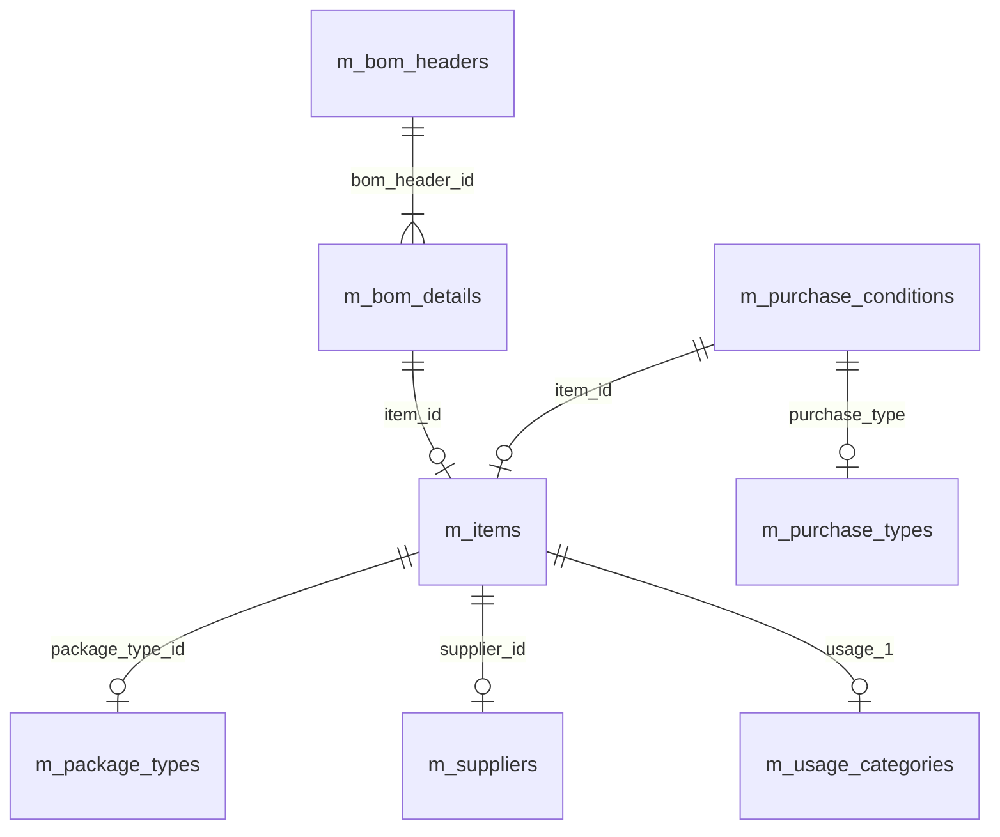
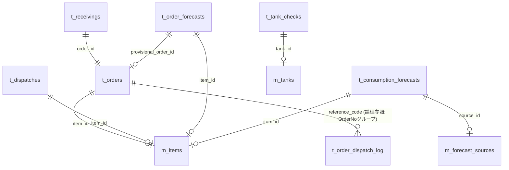
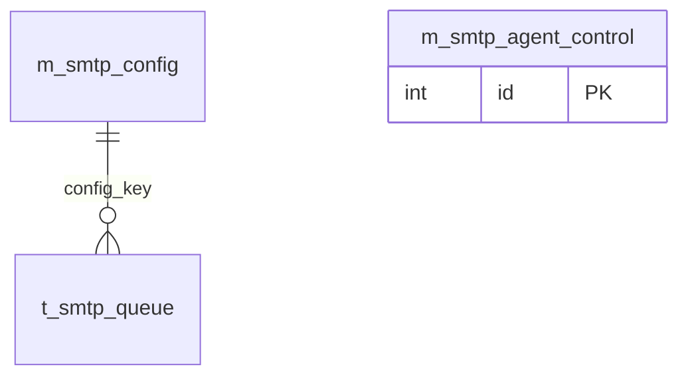

# ER図（MaterialModule）

DB: `db_material_dev` / Server: `OJIADM23120073\DEVELOPMENT`

> Mermaid プレビューでエラーになる場合は `ER図.mmd` を直接開いてください。
> VS Code 拡張「Markdown Preview Mermaid Support」または「Mermaid Editor」で描画できます。

---

## マスタ間リレーション

## トランザクション リレーション

> `t_order_dispatch_log` は発注承認契機のFAX送信投入履歴（二重送信防止）。`reference_code` は `t_orders.order_no` の発注番号グループ（先頭3セグメント）への論理参照（FK制約なし）。`queue_job_id` は共通DB `db_common_dev` の `t_smtp_queue.id` への論理参照（別DBのためFK制約なし・参照のみ）。配置DBは `db_material_dev`（資材固有）。

---

## 共通DB（db_common_dev）— SMTP送信汎用基盤（smtp-sender）

DB: `db_common_dev` / Server: `OJIADM23120073\DEVELOPMENT`

全社共通のSMTP送信汎用基盤(smtp-sender)が使用する3テーブル。資材固有DBではなく共通DB(`db_common_dev`)に配置する。送信ジョブ(`t_smtp_queue`)は `config_key` で接続プロファイルマスタ(`m_smtp_config`)を参照する。死活監視(`m_smtp_agent_control`)は他テーブルと直接のリレーションを持たない独立テーブル。

### リレーション一覧（論理FK制約なし・コード参照）

| 親テーブル | 子テーブル | 参照列 | 関係 | 備考 |
|-----------|-----------|--------|------|------|
| m_smtp_config | t_smtp_queue | config_key | 1:N | 送信ジョブが使用する接続プロファイルを選択（FK制約なし、Worker側で解決） |

> `m_smtp_agent_control` は SmtpAgent(Worker) の死活監視（heartbeat）専用の1行運用テーブルで、他テーブルとリレーションを持たない（独立）。

---

## リレーション一覧

### マスタ間

| 親テーブル | 子テーブル | FK列 | 関係 |
|-----------|-----------|------|------|
| m_package_types | m_items | package_type_id | 1:N |
| m_suppliers | m_items | supplier_id | 1:N |
| m_usage_categories | m_items | usage_1 | 1:N |
| m_items | m_purchase_conditions | item_id | 1:N |
| m_purchase_types | m_purchase_conditions | purchase_type | 1:N |
| m_bom_headers | m_bom_details | bom_header_id | 1:N |
| m_items | m_bom_details | item_id | 1:N |

### トランザクション → マスタ

| 親テーブル | 子テーブル | FK列 | 関係 | 備考 |
|-----------|-----------|------|------|------|
| m_items | t_orders | item_id | 1:N | 論理FK（FK制約なし、スナップショット保持） |
| t_orders | t_receivings | order_id | 1:N | |
| m_items | t_dispatches | item_id | 1:N | |
| m_items | t_order_forecasts | item_id | 1:N | |
| t_orders | t_order_forecasts | provisional_order_id | 1:N | 仮発注紐付け |
| m_items | t_consumption_forecasts | item_id | 1:N | |
| m_forecast_sources | t_consumption_forecasts | source_id | 1:N | |
| m_tanks | t_tank_checks | tank_id | 1:N | |

### 論理リレーション（FK制約なし・コード参照）

| テーブル | 参照先 | 参照列 | 備考 |
|---------|--------|--------|------|
| t_orders | m_suppliers | supplier_code | スナップショット保持 |
| t_orders | m_warehouses | warehouse_code | スナップショット保持 |
| t_stocks | m_items | item_id | |
| t_stocks | m_warehouses | warehouse_code | |
| t_stock_ledgers | m_items | item_id | |
| t_stock_ledgers | m_warehouses | warehouse_code | |
| m_tanks | m_items | item_code | コード参照 |
| m_purchase_conditions | m_suppliers | supplier_code | コード参照 |
| t_order_dispatch_log | t_orders | reference_code | 発注番号グループ（OrderNo先頭3セグメント）への論理参照 |
| t_order_dispatch_log | t_smtp_queue | queue_job_id | 共通DB db_common_dev の送信キュージョブID。別DBのためFK制約なし・参照のみ |

---

## テーブル分類

### マスタ（22テーブル）

| テーブル名 | 日本語名 | 主用途 |
|-----------|----------|--------|
| m_items | 品目マスタ | 全画面の中核 |
| m_suppliers | 仕入先マスタ | 発注・購買条件 |
| m_purchase_conditions | 購買条件マスタ | SAP連携。1品目に複数行を許容（重複可）。**参照時はitem_code単位でeffective_date最新を採用** |
| m_warehouses | 倉庫マスタ | 在庫管理 |
| m_tanks | タンクマスタ | タンク残量チェック |
| m_delivery_locations | 搬入先マスタ | 出庫先指定 |
| m_calendar | カレンダーマスタ | 営業日計算 |
| m_bom_headers | BOMヘッダ | 所要計算（将来） |
| m_bom_details | BOM明細 | 所要計算（将来） |
| m_package_types | 荷姿マスタ | 品目属性 |
| m_purchase_types | 購買区分マスタ | 発注分類 |
| m_order_statuses | 発注ステータスマスタ | ステータス管理 |
| m_forecast_sources | 予測ソースマスタ | 消費予測の出処 |
| m_usage_categories | 用途区分マスタ | 品目分類 |
| m_usage2_categories | 用途2区分マスタ | 品目分類 |
| m_usage3_categories | 用途3区分マスタ | 品目分類 |
| m_company_info | 自社情報マスタ | 帳票ヘッダ |
| m_report_notes | 帳票備考マスタ | 帳票フッター |
| m_user_preferences | ユーザー設定 | 画面設定保存 |
| m_print_agent_control | PrintAgent死活監視 | Worker生存状態(heartbeat)表示（独立・リレーションなし） |
| m_smtp_config | SMTP/FAX送信設定 | メールtoFAX送信の接続設定（独立・リレーションなし） |
| m_smtp_agent_control | SmtpAgent死活監視 | FAX送信Worker生存状態(heartbeat)表示（独立・リレーションなし） |

### トランザクション（10テーブル）

| テーブル名 | 日本語名 | 主用途 |
|-----------|----------|--------|
| t_orders | 発注 | 発注ワークフロー |
| t_receivings | 入庫 | 入庫実績 |
| t_dispatches | 出庫 | 出庫依頼・実績 |
| t_stocks | 在庫 | 現在庫サマリ |
| t_stock_ledgers | 受払台帳 | 日次在庫推移 |
| t_order_forecasts | 発注予測 | MRP計算結果 |
| t_consumption_forecasts | 消費予測 | 使用量予測 |
| t_tank_checks | タンクチェック | 日次残量記録 |
| t_order_reports | 帳票管理 | 印刷/FAX状況 |
| t_order_dispatch_log | 送信投入履歴 | 発注承認FAX送信の投入実績（二重送信防止） |

---

## 共通DB（db_common_dev）テーブル分類 — SMTP送信汎用基盤

| テーブル名 | 日本語名 | 区分 | 主用途 |
|-----------|----------|------|--------|
| t_smtp_queue | 共通送信キュー | トランザクション | 全モジュール横断のSMTP送信ジョブ。1レコード=1送信ジョブ |
| m_smtp_config | 接続プロファイルマスタ（複数行） | マスタ | SMTP接続先設定。config_key で t_smtp_queue から参照 |
| m_smtp_agent_control | SmtpAgent死活監視 | マスタ | 送信Worker生存状態(heartbeat)表示（独立・リレーションなし） |
