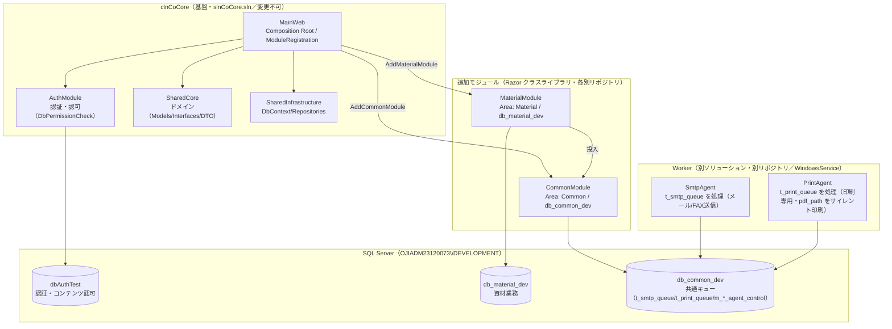

# システム全体構成（アーキテクチャ概要）

CoCore は「**基盤ソリューション `clnCoCore` をベースに、機能モジュール／Worker を追加する**」構成。MainWeb を Composition Root（ホスト）とし、各モジュールは `ModuleRegistration` 経由で DI 登録されてランタイムにホストされる。

> 本書は横断ドキュメント（`.kiro/docs/`）。個別の詳細は各モジュールの `docs/` および各 spec（`.kiro/specs/{Module}/{feature}/`）を参照。

## 変更可否（最重要）

- **変更不可**: `MainWeb` / `SharedCore` / `AuthModule`（＝ `clnCoCore` 基盤。読み取り参照のみ）。
- 機能開発は担当モジュール（MaterialModule / CommonModule 等）内で完結させる。
- `ModuleRegistration`（MainWeb）へのホスト登録が必要な場合は、当該プラットフォームモジュール側 spec が所有し、**事前にユーザー確認**を要する。

## 構成図

## コンポーネント

| 区分 | 名称 | 役割 | DB / Area | 変更 | リポジトリ |
|---|---|---|---|---|---|
| 基盤 | MainWeb | ホスト（Composition Root）・`ModuleRegistration` でモジュール登録・レイアウト/CSS/JS 提供 | dbAuthTest | **不可** | clnCoCore |
| 基盤 | AuthModule | 認証・コンテンツ認可（`[Authorize(Policy="DbPermissionCheck")]`） | dbAuthTest / Auth | **不可** | clnCoCore |
| 基盤 | SharedCore | ドメイン層（Models/Interfaces/DTO・`SharedCore.Models`） | — | **不可** | clnCoCore |
| 基盤 | SharedInfrastructure | インフラ層（DbContext/Repositories） | dbAuthTest | 参照のみ | clnCoCore |
| 機能 | MaterialModule | 資材業務（発注〜入出庫・MRP・マスタ等） | db_material_dev / Material | 可（担当） | MaterialModule |
| 機能/基盤 | CommonModule | 共通キュー基盤（SMTP/印刷）・共通監視画面・投入サービス | db_common_dev / Common | 可（担当） | CommonModule |
| Worker | SmtpAgent | `t_smtp_queue` をポーリングしメール/FAX送信 | db_common_dev | 可（担当） | SmtpAgent |
| Worker | PrintAgent | `t_print_queue` をポーリングし **印刷専用**（投入側が生成した `pdf_path` の PDF をサイレント印刷。PDF生成は行わない） | db_common_dev | 可（担当） | PrintAgent |

## 組込（ホスト登録）

- `MainWeb/Configuration/ModuleRegistration.cs` の `AddModules(configuration)` で各モジュールを一括登録（`Program.cs` から呼び出し）。
  - `AddAuthModule` / `AddSharedInfrastructure` / `AddMaterialModule` / `AddCommonModule`。
- 各モジュールは自身の `Extensions/*Extensions.cs`（`Add{Module}`）で DI・Area・DbContext・接続文字列注入を完結。
- 接続文字列キー: Auth=`DefaultAccountConnection`、資材=`MaterialDb`、共通=`CommonDb`。
- PathBase: `/AuthTest`（IIS 配置用）。
- **ソリューション構成**: `slnCoCore.sln` には Web ホスト対象（MainWeb / AuthModule / SharedCore / SharedInfrastructure / MaterialModule / **CommonModule** 等）を含める。**PrintAgent・SmtpAgent は Web認証基盤を持たない Worker のため slnCoCore からは除外**し、各自の `.sln`（`PrintAgent.sln` / `SmtpAgent.sln`）でビルド・デプロイする。CommonModule は MainWeb にホストされる Web モジュールのため `MainWeb.csproj` から ProjectReference され、slnCoCore に含める。

## DB 構成

| DB | 用途 | 主なテーブル |
|---|---|---|
| dbAuthTest | 認証・コンテンツ認可 | m_content, r_content_auth, Identity 系 |
| db_material_dev | 資材業務 | t_orders, t_dispatches, t_receivings, m_items, m_order_statuses 等 |
| db_common_dev | 共通キュー基盤 | t_smtp_queue, t_print_queue, m_smtp_config, m_smtp_agent_control, m_print_agent_control |

## リポジトリ境界

- 各プロジェクトは独立 git リポジトリ（`clnCoCore` / `MaterialModule` / `CommonModule` / `PrintAgent` / `SmtpAgent`）。
- ワークスペースルート `Nonaka` はこれらを内包（横断メタは `.kiro/`）。
- 越境（他リポジトリの文書移動等）は各リポジトリでのコミットが必要。

## ドキュメント / spec 配置

- 横断: `.kiro/`（`session-memo/`＝進捗ログ、`specs/`＝spec 正本、`docs/`＝横断ドキュメント）。
- spec 正本: `.kiro/specs/{Module}/{feature}/`（モジュール名フォルダ入れ子・単一正本）。
- モジュール固有: 各 `<module>/docs/`。
- steering スコープ: `project-rules`/`coding-standards`＝常時、`material-module`＝fileMatch `**/MaterialModule/**`、`structure`/`tech`/`product`/`module-development-guide`＝fileMatch `**/clnCoCore/**`。

## 関連ドキュメント

- 基盤詳細: `.kiro/steering/structure.md`・`module-development-guide.md`（clnCoCore スコープ）
- 資材アーキ: `.kiro/specs/MaterialModule/material-module/design.md`
- 共通DB設計: `.kiro/docs/db/common-db-design.md`
- テーブル定義/ER: `.kiro/docs/db/テーブル定義書.md`・`ER図.md`
