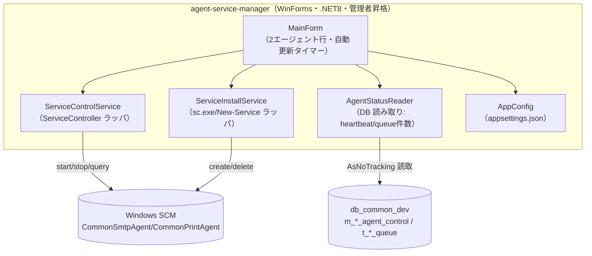

# Design Document

## Overview

`agent-service-manager` は、CommonModule プラットフォームの2常駐サービス（`CommonSmtpAgent`・`CommonPrintAgent`）をローカルマシン上で管理する **WinForms（.NET 8）** デスクトップアプリである。1画面で以下を提供する。

- サービスの起動/停止（`System.ServiceProcess.ServiceController`）
- サービスの登録/解除（install/uninstall。既存 `install-service.ps1`/`uninstall-service.ps1` と同等）
- サービス状態・DB ハートビート・キュー滞留件数の統合表示（定期自動更新）

対象は**ローカルのみ**。Agent 本体（SmtpAgent/PrintAgent）のコード・DB スキーマは変更しない。共通DB `db_common_dev` へは**読み取り専用**でアクセスする。

## Architecture



- UI（MainForm）が定期タイマーで3つの情報源（SCM 状態・DB ハートビート・DB 滞留件数）を集約し、2行（Smtp/Print）のグリッド/カードに表示する。
- サービス制御・登録は昇格前提。DB アクセスは読み取り専用（`AsNoTracking`）。

## 対象サービス定義（固定・ローカル）

| 論理名 | サービス名 | 既定 exe パス | heartbeat テーブル | queue テーブル / 状態列 |
|---|---|---|---|---|
| SmtpAgent | `CommonSmtpAgent` | `C:\SmtpAgent\App\SmtpAgent.exe` | `m_smtp_agent_control` | `t_smtp_queue` / `status` |
| PrintAgent | `CommonPrintAgent` | `C:\PrintAgent\App\PrintAgent.exe` | `m_print_agent_control` | `t_print_queue` / `print_status` |

- 状態値は共通: 1=待機 / 2=処理中 / 3=完了 / 9=エラー（print は 0=対象外 も存在）。
- 上記は `AgentDescriptor`（後述）として定数/設定で保持する。

## Components and Interfaces

### AgentDescriptor（対象定義・不変値）
```csharp
public sealed record AgentDescriptor(
    string DisplayName,        // "SMTP Agent" / "Print Agent"
    string ServiceName,        // CommonSmtpAgent / CommonPrintAgent
    string DefaultBinPath,     // 既定 exe パス
    string HeartbeatTable,     // m_smtp_agent_control / m_print_agent_control
    string QueueTable,         // t_smtp_queue / t_print_queue
    string QueueStatusColumn); // status / print_status
```

### IServiceControlService（サービス起動/停止/状態）
```csharp
public enum AgentServiceState { NotInstalled, Running, Stopped, StartPending, StopPending, Other }

public interface IServiceControlService
{
    AgentServiceState GetState(string serviceName);
    void Start(string serviceName, TimeSpan timeout);   // 停止中のみ。完了待ち
    void Stop(string serviceName, TimeSpan timeout);    // 実行中のみ。完了待ち
}
```
- 実装は `ServiceController`。未登録は `NotInstalled`（`ServiceController` 列挙に無い/例外を吸収）。
- `Start/Stop` は `WaitForStatus` でタイムアウト付き待機（R2.3/R2.5）。

### IServiceInstallService（登録/解除）
```csharp
public interface IServiceInstallService
{
    void Install(string serviceName, string binPath, string displayName, string description); // 自動起動＋障害時再起動
    void Uninstall(string serviceName); // stop→delete
}
```
- 実装方針: `sc.exe`（create/failure/delete）または `New-Service`＋`sc.exe failure` を子プロセス実行。内容は既存 `install-service.ps1`/`uninstall-service.ps1` と同等（自動起動・5秒×3回の再起動）。
- Install 前チェック: exe 存在（R4.4）・既存サービス無し（R4.5）。

### IAgentStatusReader（DB ハートビート/滞留件数・読み取り専用）
```csharp
public sealed record HeartbeatInfo(DateTime? LastHeartbeatUtc, string? MachineName, bool IsResponsive);
public sealed record QueueCounts(int Waiting, int Processing, int Done, int Error);
public sealed record AgentDbStatus(HeartbeatInfo Heartbeat, QueueCounts Queue, bool DbReachable);

public interface IAgentStatusReader
{
    Task<AgentDbStatus> ReadAsync(AgentDescriptor agent, int responsiveThresholdSeconds, CancellationToken ct);
}
```
- 実装は軽量 ADO.NET または EF Core 読み取り（`AsNoTracking`）。ハートビート/件数の SQL は最小限。
- DB 接続不可時は `DbReachable=false`（Heartbeat/Queue は不明扱い）で返し、例外を UI に伝播させない（R8.3）。

### AppConfig（設定）
- `appsettings.json`: `ConnectionStrings:CommonDb`（`db_common_dev`）／`Manager:RefreshIntervalSeconds`(既定5)／`Manager:ResponsiveThresholdSeconds`(既定30)／各 Agent の既定 binPath。

### MainForm（UI）
- 2つの Agent 行（`DataGridView` かカード×2）。列: 論理名／サービス状態／ハートビート（ポーリング中|応答なし＋最終時刻ローカル）／滞留（待機・エラーを強調、詳細ツールチップ）／操作（開始/停止/登録/解除）。
- `System.Windows.Forms.Timer` で `RefreshIntervalSeconds` ごとに全行更新。手動更新ボタンあり（R3.2/R3.3）。
- ボタン押下は UI をブロックしないよう `async`（DB 読取・サービス待機は待ち時間があるため）。操作中は当該ボタンを無効化し、完了後に再取得。

## 状態表示ロジック

### サービス状態（R3.1）
`ServiceController.Status` を `AgentServiceState` にマップ。列挙に無ければ `NotInstalled`。

### ハートビート（R5）
```
lastUtc = SELECT TOP 1 last_heartbeat_at FROM {HeartbeatTable} ORDER BY id  -- 1行運用
isResponsive = lastUtc.HasValue && (UtcNow - lastUtc) <= threshold
表示 = isResponsive ? "ポーリング中" : "応答なし"、併記に lastUtc.ToLocalTime()
```

### 滞留件数（R6）
```
SELECT {statusCol} AS s, COUNT(*) FROM {QueueTable} GROUP BY {statusCol}
→ Waiting=Σ(s=1), Processing=Σ(s=2), Done=Σ(s=3), Error=Σ(s=9)
```
- 少なくとも待機・エラーを明示（R6.3）。

## Data Models

本アプリはスキーマを新設・変更しない。既存の共通DB（`db_common_dev`）テーブルを**読み取り専用**で参照する。

### 参照する既存テーブル（読み取りのみ）
- `m_smtp_agent_control` / `m_print_agent_control`（1行運用）: `id`・`last_heartbeat_at`(UTC, nullable)・`machine_name`・`updated_at`。→ ハートビート判定に使用。
- `t_smtp_queue`（状態列 `status`） / `t_print_queue`（状態列 `print_status`）: 状態別件数の集計にのみ使用（行内容は参照しない）。状態値 1=待機/2=処理中/3=完了/9=エラー（print は 0=対象外 も存在）。

### アプリ内モデル（メモリ上・DTO）
- `AgentDescriptor`（対象定義・不変値。サービス名/既定binPath/テーブル名/状態列）。
- `AgentServiceState`（列挙: NotInstalled/Running/Stopped/StartPending/StopPending/Other）。
- `HeartbeatInfo`（LastHeartbeatUtc, MachineName, IsResponsive）。
- `QueueCounts`（Waiting, Processing, Done, Error）。
- `AgentDbStatus`（Heartbeat, Queue, DbReachable）。
- `AgentRowViewModel`（1行表示用に上記を集約: 表示名・サービス状態・ハートビート表示・件数・操作可否）。

いずれも永続化しない（設定値を除き状態は都度取得）。書き込みは行わない。

## Correctness Properties

### Property 1: ハートビート応答判定の単調性・しきい値境界
`IsResponsive(now, last, threshold)` は純粋関数として、`last==null → false`／`(now-last) <= threshold → true`／`> threshold → false`。now を固定し経過時間を増やすと true→false へ一方向に遷移し、境界（=threshold）は true。
**Validates: Requirements 5.2, 5.3**

### Property 2: 滞留件数集計の保存則
任意のキュー行集合について、集計結果 `Waiting+Processing+Done+Error + Other == 総行数`（既知状態の合計が二重計上なく、既知4状態は該当行数と一致）。既知状態(1/2/3/9)の各件数はその状態の行数に等しい。
**Validates: Requirements 6.1, 6.2, 6.3**

### Property 3: サービス状態マッピングの全域性
任意の `ServiceControllerStatus`（および列挙不能=未登録）に対し `AgentServiceState` が一意に定まり、未登録入力は必ず `NotInstalled` に写る（例外を投げない）。
**Validates: Requirements 1.3, 3.1**

### Property 4: 操作ガードの整合
`Start` は状態が `Stopped` のときのみ SCM を呼ぶ／`Stop` は `Running` のときのみ呼ぶ／`NotInstalled` ではいずれも呼ばずメッセージ。決定は現在状態のみに依存する純粋な判定関数で表す。
**Validates: Requirements 2.1, 2.2, 2.4**

## Error Handling

- サービス制御失敗（権限不足・タイムアウト・SCM 例外）: 例外を捕捉し、行にエラー表示＋メッセージ。状態は再取得して最新化（R2.5/R7.3）。
- 登録/解除失敗（exe 不在・既存・権限）: 実行前チェックで弾くかメッセージ表示（R4.4/R4.5）。
- DB 接続不可: `DbReachable=false` として「取得不可」表示。サービス制御機能は継続（R8.3）。
- 非管理者起動: マニフェスト `requireAdministrator` で昇格要求。昇格不可時はその旨表示（R7.1/R7.2）。

## Testing Strategy

- 純粋ロジック（Property 1〜4）は xUnit + FsCheck でプロパティテスト（`IsResponsive`・件数集計・状態マッピング・操作ガード）。UI と SCM/DB I/O から分離した関数として実装しテスト可能にする。
- `ServiceController`・`sc.exe`・実DB を伴う部分は手動/統合確認（ユーザー・実サーバ）。CI 自動化は対象外。
- テストプロジェクトは管理アプリ用に新設（`AgentServiceManager.Tests`・規約準拠: FsCheck 2.16.6）。

## プロジェクト構成・制約

- 新規独立プロジェクト（例: `\\...\WindowsService\AgentServiceManager`・WinForms・net8.0-windows）。Agent 本体（SmtpAgent/PrintAgent）・CommonModule・MainWeb 等は参照/変更しない（DB は同一 `db_common_dev` を読み取りのみ）。
- サービス名・既定 binPath・状態列は Agent 側の実装（`CommonSmtpAgent`/`CommonPrintAgent`・`status`/`print_status`）と一致させる。
- リモート制御・キュー行単位の再送/削除・ログビューアは対象外（監視画面 `/Common/*Monitor` の役割）。
- Spec 正本は `.kiro/specs/CommonModule/agent-service-manager/`（単一正本）。
