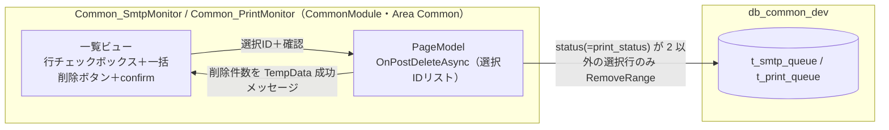

# 設計書（Design Document）

## Overview

本設計は、共通監視画面 **Common_SmtpMonitor（`/Common/SmtpMonitor`）** と **Common_PrintMonitor（`/Common/PrintMonitor`）** に、**チェックボックス複数選択による一括削除**機能を追加するものである。UI・操作フローは既存の **Material/Dispatches 一覧の削除**（各行チェックボックス＋一覧外の削除ボタン＋確認ダイアログ＋`RemoveRange`）を踏襲する。

削除は対象行の**物理削除**とし、**削除可能なのは 処理中(2) 以外**（待機1／完了3／エラー9）。削除可否はサーバ側の削除クエリ条件でも担保し、一覧表示後に Worker が取得して処理中へ遷移した行の誤削除を防ぐ。成果物は CommonModule 内で完結する（MainWeb・AuthModule 不変更・スキーマ変更なし）。

対応要件：R1（Smtp 削除）・R2（Print 削除）・R3（処理中除外・件数通知）・R4（確認ダイアログ・複数選択UI）・R5（認可・変更範囲）。

## Architecture

既存の各監視 PageModel（`CommonModule/Areas/Common/Pages/SmtpMonitor/Index.cshtml.cs`・`PrintMonitor/Index.cshtml.cs`）に **一括削除ハンドラ `OnPostDeleteAsync`** を追加し、ビューに**行チェックボックス**と**一括削除ボタン**を追加する。データアクセスは既存どおり `CommonDbContext` を直接注入。新規サービス・新規テーブル・スキーマ変更は無い。



### 参照実装（Material/Dispatches・踏襲元）

`MaterialModule/Areas/Material/Pages/Dispatches/Index.cshtml.cs` の `OnPostRemoveAsync` が範例：
- `[BindProperty] List<int> SelectedEntryIds` に選択行 Id をバインド。
- `context.Dispatches.Where(d => SelectedEntryIds.Contains(d.Id) && d.Status == 0)` の**クエリ条件で削除可否を担保**。
- `RemoveRange(entries)` → `SaveChangesAsync` → 削除件数を `TempData["SuccessMessage"]`。
- ビューは行チェックボックス＋一覧外ボタン、`confirm` で確認。

本機能はこの構造を Common 監視画面へ移植し、削除可否条件を **「処理中(2) 以外」**（`status != 2` / `print_status != 2`）とする。

## Components and Interfaces

### Common_SmtpMonitor（`SmtpMonitor/Index.cshtml.cs`）

- **追加バインド**：`[BindProperty] public List<int> SelectedJobIds { get; set; } = [];`
- **追加ハンドラ**：
  ```csharp
  public async Task<IActionResult> OnPostDeleteAsync()
  {
      if (SelectedJobIds.Count == 0)
      {
          TempData["ErrorMessage"] = "削除するジョブを選択してください。";
          return RedirectToPage("Index");
      }

      // 削除可否はクエリ条件で担保：選択かつ「処理中(2)以外」＝ status ∈ {1,3,9}
      var targets = await context.SmtpQueue
          .Where(r => SelectedJobIds.Contains(r.Id) && r.Status != 2)
          .ToListAsync();

      if (targets.Count > 0)
      {
          context.SmtpQueue.RemoveRange(targets);
          await context.SaveChangesAsync();
      }

      TempData["SuccessMessage"] = $"{targets.Count} 件削除しました。"
          + (targets.Count < SelectedJobIds.Count ? "（処理中または既に削除済みの行は除外しました）" : "");
      return RedirectToPage("Index");
  }
  ```
- **対応**：R1.1〜R1.5・R3.1〜R3.3・R4.2

### Common_PrintMonitor（`PrintMonitor/Index.cshtml.cs`）

- `SmtpMonitor` と同型。差異は DbSet と状態列名：
  - `context.PrintQueue.Where(r => SelectedJobIds.Contains(r.Id) && r.PrintStatus != 2)`
- **対応**：R2.1〜R2.5・R3.1〜R3.3・R4.2

### ビュー（両 `Index.cshtml`）

- 一覧を `<form method="post">` で囲み、各行に `<input type="checkbox" name="SelectedJobIds" value="@row.Id" />`。
- 一覧外（ヘッダ操作領域）に「選択削除」ボタン：`asp-page-handler="Delete"`。
- 全選択チェックボックス（ヘッダ）＋ `confirm()` による確認（Material/Dispatches の vanilla JS を踏襲）。
- Bootstrap 5 + vanilla JS。既存 Common スタイルに準拠（site.css は変更しない）。
- 再送/再出力（`OnPostResend`/`OnPostReprint`）の既存ボタンは維持し、削除操作と併存させる。

> 注：削除フォームと既存の再送/再出力フォームが同一ページに併存するため、チェックボックス選択は削除フォーム側にひも付ける（フォーム入れ子回避のためフォーム境界に注意。行チェックボックスは削除用フォーム内に配置）。

## Data Models

- スキーマ変更なし。既存 `t_smtp_queue`（`status`）・`t_print_queue`（`print_status`）を物理削除するのみ。
- 論理削除列は新設しない（R5.3）。

## Correctness Properties

*A property is a characteristic that should hold across all valid executions.*

本機能で PBT が有効なのは**削除対象選別ロジック**（選択集合×各ステータスから、削除される集合が決まる規則）である。実 DB 削除・UI・確認ダイアログは example/integration で扱う。

### Property 1: 削除対象選別は「選択かつ 処理中(2) 以外」と一致する

*任意の* ジョブ集合（`Id` と ステータス `1/2/3/9` を持つ）と 選択 `Id` 集合に対して、削除される行の集合は「選択された `Id` かつ ステータス ≠ 2」の行集合に**厳密に一致**し、処理中(2) の行および非選択行は削除されない。

**Validates: Requirements 1.2, 1.3, 2.2, 2.3, 3.1, 3.2**

## Error Handling

- **未選択**：`SelectedJobIds` が空 → 削除せず「削除するジョブを選択してください。」（R4.2）。
- **処理中/消失の除外**：クエリ条件（`!= 2` かつ `Contains(Id)`）で自動除外。削除件数 < 選択件数のとき、その旨を成功メッセージに付記（R3.3）。
- **例外方針**：適切に処理できる例外のみ捕捉（coding-standards 準拠）。一括削除は単純 DELETE のため、想定外例外は握り潰さない。

## Testing Strategy

- テストは `CommonModule.Tests`（xUnit + FsCheck 2.16.6・InMemory）。
- **Property 1**（削除対象選別の一致）：ジョブ集合＋選択集合を生成し、`OnPostDeleteAsync` 後に「選択かつ status≠2」のみが削除され、他が残ることを検証（`// Feature: monitor-job-delete, Property 1`・100反復以上）。SmtpMonitor / PrintMonitor それぞれ、または共通規則として1本。
- 例示：未選択→エラーメッセージ・0件、処理中のみ選択→0件削除、混在→可能分のみ削除＋件数メッセージ。
- 確認ダイアログ（JS）・実 DB 削除・画面描画は手動/スモークで確認（ユーザー側ビルド・実行）。

## 変更範囲制約

- 成果物は CommonModule 内（両監視 PageModel/ビュー）で完結。MainWeb・AuthModule・SharedCore は変更しない（R5.2）。
- スキーマ変更なし・物理削除（R5.3）。認可は既存 `DbPermissionCheck`（R5.1）。
- ビルド・テスト実行はユーザー側。
