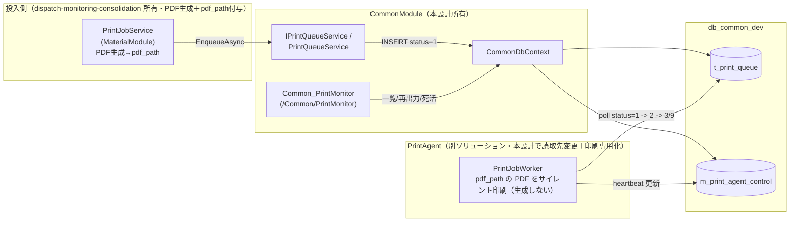
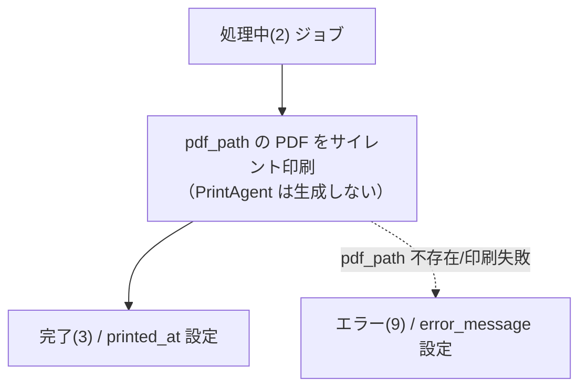
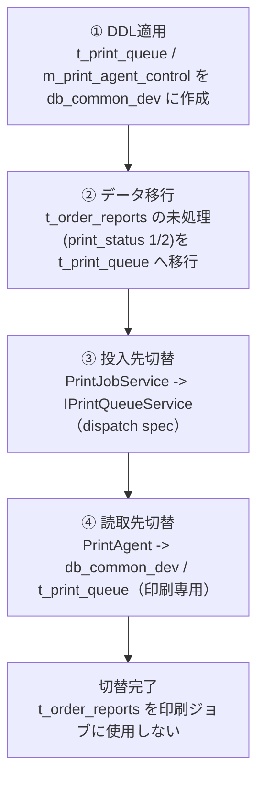

# Design Document

## Overview

本設計は **共通プリント基盤（Common Print Platform）** を定義する。SMTP送信基盤（`t_smtp_queue` ＋ SmtpAgent ＋ `Common_SmtpMonitor` ＋ `ISmtpQueueService`）と **対の思想** で、印刷ジョブの共通キュー・ワーカー処理・監視WEB・投入サービスを所有する、他モジュールから独立した共通プラットフォームを構築する。

本設計が所有する成果物は次のとおり（requirements R1〜R13、承認済み決定 D1〜D6 に基づく）。

1. **`t_print_queue`（db_common_dev 新設）のスキーマ契約**（列定義表／制約／インデックス。実 DDL はユーザー適用）。`t_smtp_queue` と対の命名・思想で、`module`（投入元アプリ名）・`pdf_path`（**生成済み PDF フルパス・必須／NOT NULL**）・`printer_name` を含み、**fax_status 列も print_payload 列も持たない**。`row_version`（`[Timestamp]`）で楽観ロックを行う。（D1 / R1・R2・R3）
2. **CommonModule 側資産**: `TPrintQueue` / `MPrintAgentControl` エンティティ、`CommonDbContext` への DbSet 追加、`IPrintQueueService` / `PrintQueueService`（`ISmtpQueueService` / `SmtpQueueService` と対）、`AddCommonModule` への登録。（D2・D3 / R4・R6）
3. **Common_PrintMonitor**（Area "Common" `/Common/PrintMonitor`）: 一覧・フィルタ・サマリ・再出力・PrintAgent 死活・認可・スタイル整合を `Common_SmtpMonitor` と同等に提供。（R8・R9・R10）
4. **PrintAgent（別ソリューション）** の読取先を `t_order_reports`（db_material_dev）から `t_print_queue`（db_common_dev）へ変更する設計。エンティティ差し替え・DbContext マッピング更新・接続変更。PrintAgent は **印刷専用（PRINT-ONLY）** であり、投入側が用意した `pdf_path` の PDF をサイレント印刷するのみで、PDF 生成は行わない（従来 PrintAgent 内の QuestPDF 生成・`PdfGeneratorService`/`Documents/` は PrintAgent から退役し、投入側＝MaterialModule に移管。実装は別 spec 所有）。（D4・D6 / R5・R7）
5. **カットオーバー手順（切替順序・移行・ロールバック観点）**。（D5 / R11）

### 承認済み設計決定（Decisions）

- **D1（スキーマ）**: `t_print_queue` は `t_smtp_queue` と対。列は「Data Models」章の列定義（`print_payload` を持たない）。`printed_at` は現 `completed_at`／`print_at` を 1 本化した完了日時。`error_message` は `t_smtp_queue` と同名（requirements 表記 `print_error_message` の物理名）。`fax_status` 無し。`pdf_path` は必須（NOT NULL）。`row_version` 必須。
- **D2（投入サービス）**: `IPrintQueueService`/`PrintQueueService` を CommonModule に新設（`ISmtpQueueService`/`SmtpQueueService` と同作法・Scoped）。`t_print_queue` への直接書込は本サービス経由に限定する。
- **D3（死活監視の集約）**: `m_print_agent_control` を db_common_dev へ集約し、`CommonDbContext` に `TPrintQueue`／`MPrintAgentControl` を追加（`m_smtp_agent_control`／`MSmtpAgentControl` と対）。
- **D4（PrintAgent 読取先変更・印刷専用化）**: 接続を db_material_dev → db_common_dev、エンティティを `t_order_reports` → `t_print_queue` に差し替え。PrintAgent は **印刷専用**とし、`pdf_path` の PDF を `SilentPrintService`（SumatraPDF）でサイレント印刷するのみ。**PDF 生成（`PdfGeneratorService`/`IPdfGeneratorService`・`Documents/`）は PrintAgent から退役**し、投入側（MaterialModule）へ移管する（実装は `dispatch-monitoring-consolidation` 所有）。別ソリューション・別デプロイ単位。
- **D5（カットオーバー）**: DDL → 未処理印刷（print_status 1/2）移行 → 投入先切替（PrintJobService）→ 読取先切替（PrintAgent）。無停止・取り残しなし・可逆。
- **D6（印刷専用・単一パス）**: 印刷イメージ（PDF）は **投入側（MaterialModule）が生成・保存**し、`pdf_path` で受け渡す。PrintAgent は `pdf_path` の PDF を直接サイレント印刷する（**単一パス**。payload からの生成分岐は持たない）。`print_payload` 列は廃止し、`pdf_path` を必須とする。PDF 生成の実装責務は投入側（MaterialModule／`dispatch-monitoring-consolidation`）が所有し、本 spec は「`t_print_queue` の契約（`pdf_path` が印刷対象 PDF を保持）」と「PrintAgent が印刷専用であること」のみを所有する。
- **D7（output_type 廃止・投入側ゲート）**: `t_print_queue` から `output_type` 列を廃止する。印刷対象か否かの判定は **投入側（MaterialModule／`dispatch-monitoring-consolidation`）が行い**、キューには印刷対象ジョブのみが投入される。PrintAgent は `output_type` による印刷可否判定を行わず、取得したジョブを **全て印刷する**。（R1.9・R4.7・R5.6 / D6 と整合）
- **D8（プリンタ解決・存在チェック・プリンタマスタ）**: `printer_name` 未指定（NULL）→ 既定プリンタへ出力する。`printer_name` 指定で稼働機に未インストール → `print_status=9` エラー（`error_message`「指定プリンタが存在しません」、**印刷を試行しない**）。PrintAgent は起動時にインストール済みプリンタを列挙し、`m_printer`（db_common_dev）へ upsert（存在すれば `last_seen_at` 更新、無ければ追加。既定プリンタは `is_default=1`）する。この `m_printer`（稼働機分）が printer_name 存在チェックの基礎となる。（R5.8・R5.9・R14）

### スコープ外（Non-Goals）

- PrintJobService（MaterialModule）の投入側呼び出し実装の改修は別 spec `dispatch-monitoring-consolidation` が所有する。本設計は投入契約（投入先・print_status 初期値・`pdf_path` 付与）＋ CommonModule 側の投入サービス（`IPrintQueueService`/`PrintQueueService`）の実装のみを所有する。（R4・R13）
- **印刷イメージ（PDF）の生成実装は投入側（MaterialModule）の所有**とし、本設計のスコープ外とする（`dispatch-monitoring-consolidation` が所有）。従来 PrintAgent 内にあった QuestPDF 生成（`Documents/*.cs`・`PdfGeneratorService`/`IPdfGeneratorService`）は PrintAgent から退役し、投入側へ移管する。本設計は「`t_print_queue` の `pdf_path` が印刷対象 PDF を保持する契約」と「PrintAgent が印刷専用であること」のみを所有する。（D6 / R13）
- MainWeb・AuthModule のソース・設定変更（参照のみ）。CommonModule のホスト登録（ModuleRegistration）が必要な場合は CommonModule 側プラットフォームの所有とし、MainWeb への変更は最小限かつ別途ユーザー確認とする。（R12）
- DDL の実適用・既存データの実移行・ビルド・テスト・実印刷（いずれもユーザー側）。（R3・R11 / Assumptions A1・A6）
- 帳票レイアウト・PDF 生成ロジック（投入側が所有）。PrintAgent の印刷（SumatraPDF サイレント印刷）は不変。（D4・D6）

### 準拠基準

- 基幹システム構築基準（`\\OJIADM23120073\Labs\sdoc\基幹システム構築基準.md`）に準拠する。
- DB 命名規則（`\\OJIADM23120073\Labs\sdoc\命名規則(db).xlsx`）に準拠する。
- 新規エンティティには `row_version`（`[Timestamp]`）を含める（プロジェクトルール「排他制御・同時接続対応」）。
- 成果物は `.kiro/specs/CommonModule/print-platform/` に単一正本として配置する（モジュール別コピーは持たない）。（R12.3）

## Architecture

### 位置づけ（SMTP送信基盤との対比）

共通プリント基盤は、既存の SMTP送信基盤とレイヤ・責務が一対一で対応する。

| 観点 | SMTP送信基盤（既存） | 共通プリント基盤（本設計） |
|---|---|---|
| 共通キュー | `t_smtp_queue`（db_common_dev） | `t_print_queue`（db_common_dev, 新設） |
| 死活監視テーブル | `m_smtp_agent_control` | `m_print_agent_control`（db_common_dev へ集約） |
| 投入サービス | `ISmtpQueueService` / `SmtpQueueService` | `IPrintQueueService` / `PrintQueueService`（新設） |
| DbContext | `CommonDbContext` | `CommonDbContext`（DbSet 追加） |
| ワーカー | SmtpAgent（別ソリューション） | PrintAgent（別ソリューション, 読取先変更＋印刷専用化） |
| 監視WEB | `Common_SmtpMonitor`（`/Common/SmtpMonitor`） | `Common_PrintMonitor`（`/Common/PrintMonitor`, 新設） |
| ステータス | 1待機/2処理中/3完了/9エラー | 1待機/2処理中/3完了/9エラー |

### コンポーネント関係図



### 印刷パス（単一・印刷専用）（D6）

投入側（MaterialModule）が PDF を生成し `pdf_path` に格納して投入する。PrintAgent はその PDF をサイレント印刷するのみ（生成分岐は持たない）。



### レイヤ責務と境界

- **投入（Producer）**: PrintJobService は印刷イメージ（PDF）を生成・保存し、`IPrintQueueService.EnqueueAsync` を経由して `pdf_path` 付きで `t_print_queue` に `print_status=1` で投入する。投入側の呼び出し実装および PDF 生成実装は `dispatch-monitoring-consolidation`（MaterialModule）が所有。本設計は投入契約と CommonModule 側サービス実装を所有する（D2 / R4・R13）。`t_print_queue` への直接書込は本サービス経由に限定する。
- **キュー（db_common_dev）**: `t_print_queue`（ジョブ本体）・`m_print_agent_control`（死活）。本設計がスキーマ契約の発生元（R1・R6・R13.1）。
- **処理（PrintAgent）**: `t_print_queue` をポーリングし `1→2→3/9` の状態遷移で処理。**印刷専用**であり、`pdf_path` の PDF をサイレント印刷するのみ（PDF 生成は行わない）。印刷（SumatraPDF）ロジック自体は不変（D4・D6 / R5）。
- **監視（Common_PrintMonitor）**: `CommonDbContext` 経由で `t_print_queue`・`m_print_agent_control` を参照。資材固有 `t_order_reports` は参照しない（R8）。

### デプロイ単位（R7）

PrintAgent は別ソリューション・別 git リポジトリ（`\\ojiadm23120073\Labs\WindowsService\PrintAgent`）・独自 Doc 体系。ビルド／デプロイ単位が CommonModule・MainWeb とは別である。本設計は「読取先変更＋印刷専用化」を設計として記述するが、当該ソリューションのビルド・デプロイはユーザー側で実施する。

## Components and Interfaces

### CommonModule（本設計所有）

#### 1. エンティティ `TPrintQueue`（`CommonModule/Data/Entities/TPrintQueue.cs`）

- `TSmtpQueue` と同じ DataAnnotations 作法（`[Table]`/`[Column]`/`[Key]`/`[DatabaseGenerated(Identity)]`/`[Timestamp]`）。
- テーブル名 `t_print_queue`。列は「Data Models」章の列定義に一致させる（`module`・`pdf_path`・`printer_name` を含み、`print_payload` は持たない）。
- `RowVersion`（`[Timestamp]`, `row_version`）で楽観ロック。

#### 2. エンティティ `MPrintAgentControl`（`CommonModule/Data/Entities/MPrintAgentControl.cs`）

- `MSmtpAgentControl` と対の 1行運用。`last_heartbeat_at`(UTC)・`machine_name`・`updated_at`。
- db_common_dev へ集約（従来 PrintAgent 側 db_material_dev 相当を共通DBに集約）（D3 / R6）。

#### 3. `CommonDbContext` への DbSet 追加

```
public DbSet<TPrintQueue> PrintQueue => Set<TPrintQueue>();
public DbSet<MPrintAgentControl> PrintAgentControls => Set<MPrintAgentControl>();
```

既存作法どおり OnModelCreating は実装せず、マッピングはエンティティ側 DataAnnotations に委ねる。

#### 4. 投入サービス `IPrintQueueService` / `PrintQueueService`（D2 / R4）

`ISmtpQueueService` / `SmtpQueueService` と対の設計。`PrintQueueService` は `internal`（他モジュールから new させない）とし、DI 経由でのみ利用させる。`t_print_queue` への直接書込は本サービス経由に限定する。

インターフェース契約（メソッドシグネチャ）:

```
Task<int> EnqueueAsync(
    string module,          // 投入元モジュール識別子（例: "material"）＝必須
    string reportType,      // 帳票種別＝必須
    string referenceCode,   // 参照コード（発注番号等）＝必須
    string pdfPath,         // 生成済みPDFフルパス（印刷対象）＝必須（非空）
    string? printerName,    // プリンタ名（NULL可＝既定プリンタ）
    int copies,             // 部数
    CancellationToken ct = default);   // → 投入されたジョブの id を返す
```

> 投入契約に `output_type` は含めない。印刷対象か否かの判定は投入側（`dispatch-monitoring-consolidation`）が行い、`t_print_queue` には印刷対象ジョブのみが投入される（R4.7・R1.9 / D7）。

投入時の振る舞い（契約）:

- `print_status = 1`（待機）で 1 件 INSERT する（R4.3）。
- `pdf_path` に引数を保持する（R4.2 / R1.5 / D6）。印刷対象 PDF は投入側（MaterialModule）が生成・保存済みである前提。
- `created_at == updated_at = DateTime.UtcNow`（`SmtpQueueService` と同じ UTC 保存方針）。
- `t_print_queue` のみを操作し、`t_order_reports` 等の資材固有テーブルには一切アクセスしない。
- 必須項目（`module` / `reportType` / `referenceCode` / `pdfPath`）が null・空・空白のみの場合は `ArgumentException`（`SmtpQueueService.RequireNonBlank` と同方針）。
- 出力ソース制約: `pdfPath` は **必須（非空）**。空（null/空白のみ）の場合は投入できない（`ArgumentException`）（D6）。
- `copies` は 1 未満なら 1 に正規化する（Worker 側の既定と整合）。

> 補足（R4.5・R13.4）: PrintJobService からの実際の呼び出し実装（投入経路の配線）と PDF 生成実装は `dispatch-monitoring-consolidation`（MaterialModule）が所有する。本設計は CommonModule 側の受け口（インターフェース契約＋実装）を提供する。

> 実装同期に関する注記（本改訂による訂正・**tasks 11 で是正済み**）: 本改訂（印刷専用・`print_payload` 廃止・`pdf_path` 必須）に伴い、既に実装済みだった CommonModule 資産—`TPrintQueue` エンティティ（旧 `print_payload` プロパティ）、`PrintQueueService.EnqueueAsync`（旧 payload/pdf_path のいずれか必須の検証・`printPayload` 引数）、DDL（`create_t_print_queue.sql` の `print_payload` 列）、`Common_PrintMonitor` の再出力条件（旧 payload/pdf_path のいずれか）—は本設計に合わせて訂正済み（tasks 11.1〜11.5 完了）。現行実装は `print_payload` を持たず `pdf_path` 必須で本設計と一致する。

> 実装同期に関する注記（本改訂＝`output_type` 廃止・**未是正／tasks フェーズで対応**）: 本改訂（`output_type` 列廃止・投入側ゲート化, D7）に伴い、以下の是正がまだ必要である（**未実施・pending**。本改訂で新たに発生した変更のため tasks フェーズで是正する）:
> - `TPrintQueue`（CommonModule／PrintAgent 双方）: `output_type` プロパティを削除。
> - `PrintQueueService.EnqueueAsync`: `outputType` 引数を削除（本節のシグネチャに合わせる）。
> - DDL（`create_t_print_queue.sql`）: `output_type` 列を削除。
> - `Common_PrintMonitor`: `output_type` を参照する列／フィルタがあれば撤去（現行一覧には非掲載だが要確認）。
> - PrintAgent `PrintJobWorker`: `output_type` による印刷可否判定（`shouldPrint`）を撤去し、取得ジョブを全て印刷する（D7 / R5.6）。

#### 5. DI 登録（`AddCommonModule`）

`ISmtpQueueService` 登録と対で、`CommonDbContext`（Scoped）に合わせ `IPrintQueueService` を Scoped 登録する。

```
services.AddScoped<IPrintQueueService, PrintQueueService>();
```

`CommonDbContext` の登録は既存のまま（接続文字列 "CommonDb"）。DbSet 追加のみで両テーブルが同一 DbContext から利用可能になる。

#### 6. Common_PrintMonitor（`CommonModule/Areas/Common/Pages/PrintMonitor`）（R8・R9・R10）

`Common_SmtpMonitor`（`Areas/Common/Pages/SmtpMonitor`）と同等の Razor Pages。`CommonDbContext` を直接注入し、`[Authorize(Policy = "DbPermissionCheck")]` を適用する。

- **設置**: `/Common/PrintMonitor`（R8.1）。
- **データソース**: `CommonDbContext.PrintQueue` / `PrintAgentControls`。`t_order_reports` は参照しない（R8.2・R8.3）。
- **認可**: `[Authorize(Policy = "DbPermissionCheck")]`（R8.4）。
- **一覧**（R9.1）: module / report_type / reference_code / print_status / copies / picked_at / printed_at / error_message / created_at / updated_at を表示（pdf_path 有無はアイコン表示）。`Id` 降順・ページング（既定 30 件、`Common_SmtpMonitor` と同じ選択肢 10/20/30/50/100）。
- **フィルタ**（R9.2）: print_status・report_type・キーワード（reference_code の部分一致を基本）・作成日付範囲（`created_at` は UTC 保存のため画面入力 JST を UTC 境界へ変換して比較。`Common_SmtpMonitor` と同一方式）。
- **サマリ**（R9.3）: print_status 別件数（待機1／処理中2／完了3／エラー9）を全件ベースで集計。
- **再出力**（R9.4・R9.5・D6）: `OnPostReprintAsync(int id)`。完了(3)・エラー(9) のジョブのみ `print_status=1` に戻し、`picked_at`/`printed_at`/`error_message` をクリア、`updated_at=UtcNow`。待機(1)・処理中(2) は不正遷移として拒否。対象ジョブが `pdf_path` を保持しない場合は再出力せず「再出力できない」旨を通知（`SmtpMonitor` の `OnPostResendAsync` と対）。
- **死活表示**（R9.6）: `m_print_agent_control` の最終 heartbeat が **30 秒以内**なら「ポーリング中」、超過なら「応答なし」。`Common_SmtpMonitor` の `HeartbeatAliveSeconds = 30` と同値・同ロジック。
- **スタイル**（R10）: Area "Common" 共通スタイルおよび `Common_SmtpMonitor` と一貫（Bootstrap 5 + vanilla JS）。機能範囲（一覧・フィルタ・サマリ・死活・再出力）を `Common_SmtpMonitor` と同等とする（R9.7）。

### PrintAgent（別ソリューション・本設計で読取先変更＋印刷専用化）（D4・D6 / R5・R7）

#### 1. エンティティ差し替え: `TOrderReport` → `TPrintQueue`（PrintAgent 側）

`\\ojiadm23120073\Labs\WindowsService\PrintAgent\Models\` に `t_print_queue` へマッピングする新エンティティを定義（PrintAgent 名前空間）。従来 `TOrderReport` との差分:

- テーブル名を `t_print_queue` に変更。
- `module` 列を **追加**（投入元識別）。
- `pdf_path` 列を **追加**（印刷対象 PDF フルパス・必須。PrintAgent の唯一の印刷ソース）（D6）。
- `print_payload` 列は **持たない**（廃止。PrintAgent は payload を扱わない）（D6）。
- `fax_status` 列を **削除**（R1.3）。
- `row_version`（`[Timestamp]`）を **追加**（楽観ロックの実効化。後述「排他制御」）。
- 完了日時列を `printed_at` に **一本化**（従来 `completed_at`／`print_at` の 2 列を廃し `printed_at` に統合）（D1 / R1.6）。
- `printer_name`・`error_message`（nvarchar(500)）は継続。

#### 2. `PrintAgentDbContext` マッピング更新

- `DbSet<TOrderReport> OrderReports` を廃し `DbSet<TPrintQueue> PrintQueue` に差し替え、`ToTable("t_print_queue")` に更新。
- `MPrintAgentControl` → `ToTable("m_print_agent_control")` は継続（読取先 DB が db_common_dev に変わる）。

#### 3. 接続文字列変更（`appsettings.json`）

- 現在 `Database=db_material_dev` を指す接続（`ConnectionStrings:CloudDb`）を **`db_common_dev`** に変更する。
- Worker は `t_print_queue`・`m_print_agent_control` を共通DBから読み書きするようになる。heartbeat 先も db_common_dev。

#### 4. Worker 本体ロジック（印刷専用・読取先差替えのみ、他は不変）

`PrintJobWorker` のポーリング処理（未処理ジョブ取得 → `print_status 1→2` → サイレント印刷 → `3`／`9` 遷移 → heartbeat 更新）はロジック不変。差分は次の 4 点:

1. 読取先エンティティ／テーブル（`t_print_queue`）。
2. **印刷ソースの単一化（印刷専用, D6）**: `pdf_path` の PDF を直接サイレント印刷する（PDF 生成は行わない）。従来の `print_payload` からの生成分岐（`PdfGeneratorService`/`Documents/`）は PrintAgent から退役する。
3. 完了時に `printed_at` へ設定（旧 `completed_at`/`print_at` の二重設定を廃止）。
4. **印刷可否ゲートの撤去（D7）**: 従来の `output_type` による印刷可否判定（`shouldPrint = output_type ∈ {1,3}` 相当の分岐）を **撤去**する。Worker は取得した **全てのジョブ**の `pdf_path` を無条件にサイレント印刷する（印刷対象判定は投入側が実施済み・キューには印刷対象のみが存在する）。（R5.6 / D7）

- 待機取得: 未処理条件を「`print_status=1` かつ `pdf_path IS NOT NULL`」とする。
- 取得時: `print_status=2`、`picked_at` 設定。
- **プリンタ解決（D8 / R5.8・R5.9）**: 出力先プリンタを `printer_name ?? 既定プリンタ` で解決する。`printer_name` が指定されており、かつ稼働機に当該プリンタが **未インストール**の場合は、印刷を **試行せず** `print_status=9`、`error_message`「指定プリンタが存在しません」を設定する（存在チェックは後述「起動時プリンタ列挙とマスタ登録」で得た稼働機分の `m_printer`／実列挙に基づく）。
- 完了時: `print_status=3`、`printed_at=UtcNow`。
- 失敗時（印刷失敗・`pdf_path` 不存在等）: `print_status=9`、`error_message` 設定（不変・500 文字切詰）。
- サイレント印刷（`ISilentPrintService`・SumatraPDF）自体は不変（D4）。PDF 生成（`PdfGeneratorService`/`IPdfGeneratorService`・`Documents/`）は PrintAgent から退役し、投入側（MaterialModule）が所有する。

#### 6. 起動時プリンタ列挙とマスタ登録（D8 / R14）

PrintAgent は **起動時**に稼働機のインストール済みプリンタを列挙し、`m_printer`（db_common_dev）へ upsert する。プリンタ名は機ごとに異なりうるため `machine_name` で稼働機を区別する（R14.6）。

- 列挙元: `System.Drawing.Printing.PrinterSettings.InstalledPrinters`（**Windows 専用**）。既定プリンタは `new PrinterSettings().PrinterName` で判定し `is_default=1` を記録する（R14.4）。
- upsert 規則: (`machine_name`, `printer_name`) をキーに、存在すれば `last_seen_at`（UTC）・`is_active`・`is_default`・`updated_at` を更新、無ければ追加する（R14.3）。
- 用途: 記録された稼働機分の `m_printer` が、Worker の printer_name 存在チェック（R5.9）の基礎となる（R14.5）。
- 実装形態: 起動時サービス（`IHostedService`／Worker 起動処理内の初期化）として `CommonDbContext` 相当（db_common_dev 接続）で upsert する。マスタ upsert 自体は副作用を伴う統合対象（「Testing Strategy」参照）。

#### 5. `row_version` 追加による楽観ロックの実効化

現行 `TOrderReport` には rowversion がなく、Worker の「取得直後に `SaveChangesAsync` で `2` へ更新し、`DbUpdateConcurrencyException` を握って他インスタンス取得済みをスキップする」排他が **実効していない**（例外が発生し得ない）。`t_print_queue` に `row_version` を持たせることで、複数 Worker／画面同時更新時に楽観ロックが実際に機能し、既存の `catch (DbUpdateConcurrencyException)` スキップ処理が意味を持つようになる。

## Data Models

DDL の実適用はユーザーが db_common_dev に対して実施する（R3.1・A1）。本章は DDL を作成できる粒度の列定義表を提示する（実 SQL はタスクで別ファイル化）。（R3.3）

### `t_print_queue`（db_common_dev・新設）

印刷ジョブの共通キュー。1 レコード = 1 印刷ジョブ。`t_smtp_queue` と対の命名・思想で、印刷関連列のみを持ち **FAX 関連列（fax_status 等）を持たない**（R1.3・R1.7）。印刷イメージは投入側が生成し `pdf_path`（必須／NOT NULL）で受け渡すため、**`print_payload` 列は持たない**（D6）。

| 論理名 | 列名 | 型 | NULL | 既定 | 備考 |
|---|---|---|---|---|---|
| ID | `id` | int IDENTITY(1,1) | NOT NULL | — | 主キー（PK） |
| 投入元モジュール | `module` | nvarchar(40) | NOT NULL | — | 投入元アプリ名（例: material）。`t_smtp_queue.module` と対 |
| 帳票種別 | `report_type` | nvarchar(20) | NOT NULL | — | 帳票種別コード |
| 参照コード | `reference_code` | nvarchar(50) | NOT NULL | — | 発注番号等の参照キー |
| 印刷ステータス | `print_status` | int | NOT NULL | 1 | 1=待機 / 2=処理中 / 3=完了 / 9=エラー（R1.4） |
| PDFパス | `pdf_path` | nvarchar(500) | NOT NULL | — | 印刷対象 PDF フルパス（投入側が生成・保存）。PrintAgent の唯一の印刷ソース（D6） |
| プリンタ名 | `printer_name` | nvarchar(200) | NULL | — | NULL=既定プリンタ |
| 部数 | `copies` | int | NOT NULL | 1 | 1 未満は 1 に正規化 |
| 取得日時 | `picked_at` | datetime2 | NULL | — | 処理中(2)へ遷移した取得日時(UTC) |
| 印刷完了日時 | `printed_at` | datetime2 | NULL | — | 完了(3)日時(UTC)。旧 completed_at/print_at を一本化（R1.6・D1） |
| エラー内容 | `error_message` | nvarchar(500) | NULL | — | エラー(9)時の内容 |
| 作成日時 | `created_at` | datetime2 | NOT NULL | — | 投入日時(UTC) |
| 更新日時 | `updated_at` | datetime2 | NOT NULL | — | 更新日時(UTC) |
| 行バージョン | `row_version` | rowversion | NOT NULL | — | 楽観ロック（`[Timestamp]`、自動採番）（R2.1） |

**制約・インデックス**:

- PK: `id`。
- `print_status` は上記 4 値（1/2/3/9）のいずれか（アプリ層で保証。必要なら CHECK 制約可）。
- インデックス（承認済み決定）:
  - `IX_t_print_queue_status_created`（`print_status`, `created_at`）— Worker の「待機ジョブを作成順に取得」（`WHERE print_status=1 ... ORDER BY created_at`）およびサマリ集計を支援。
  - `IX_t_print_queue_reference_code`（`reference_code`）— Common_PrintMonitor のキーワード検索／参照コード照会を支援。
  - `IX_t_print_queue_module`（`module`）— 投入元モジュール別の照会を支援。

> 命名に関する注記（要確認）: requirements.md（R1.2・R9.1）ではエラー列を `print_error_message` と表記しているが、承認済み決定 D1 および `t_smtp_queue`（`error_message`）・現行 PrintAgent（`error_message`）との**パリティ**を優先し、物理列名は `error_message` とする。requirements 側の表記を `error_message` に合わせて追随更新することを推奨する（意味は「印刷エラー内容」で同一）。

### `m_print_agent_control`（db_common_dev・集約）

PrintAgent(Worker) の死活監視（1 行運用）。`m_smtp_agent_control` と対の命名・思想（R6.1・R6.4）。

| 論理名 | 列名 | 型 | NULL | 備考 |
|---|---|---|---|---|
| ID | `id` | int IDENTITY(1,1) | NOT NULL | 主キー（PK） |
| 最終応答時刻 | `last_heartbeat_at` | datetime2 | NULL | Worker がポーリング毎に更新(UTC)（R6.2・R6.3） |
| 稼働マシン名 | `machine_name` | nvarchar(100) | NULL | 稼働マシン名（R6.2） |
| 更新日時 | `updated_at` | datetime2 | NOT NULL | 更新日時(UTC) |

**制約**: PK `id`。1 行運用（レコードが無ければ Worker が作成）。

> `m_print_agent_control` は 1 行運用・単一 Writer（PrintAgent のみ更新）であり、既存の対テーブル `m_smtp_agent_control`／`MSmtpAgentControl` も `row_version` を持たない。**パリティ維持のため本テーブルは `row_version` を付与しない**（プロジェクトルールの「新規エンティティは row_version 必須」に対する明示的例外）。監視画面は本テーブルを更新しない（読み取りのみ）ため競合検出は不要。

### `m_printer`（db_common_dev・新設）

プリンタマスタ。PrintAgent が **起動時**に稼働機のインストール済みプリンタを列挙して upsert する（R14）。プリンタ名は機ごとに異なりうるため `machine_name` で稼働機を区別する。printer_name 存在チェック（R5.9）の基礎。

| 論理名 | 列名 | 型 | NULL | 既定 | 備考 |
|---|---|---|---|---|---|
| ID | `id` | int IDENTITY(1,1) | NOT NULL | — | 主キー（PK） |
| 稼働マシン名 | `machine_name` | nvarchar(100) | NOT NULL | — | 稼働機識別。プリンタは機ごとに異なる（R14.6） |
| プリンタ名 | `printer_name` | nvarchar(200) | NOT NULL | — | インストール済みプリンタ名 |
| 既定プリンタ | `is_default` | bit | NOT NULL | 0 | 稼働機の既定プリンタなら 1（R14.4） |
| 有効フラグ | `is_active` | bit | NOT NULL | 1 | 現在も列挙されるか（退役検知に利用可） |
| 最終確認日時 | `last_seen_at` | datetime2 | NULL | — | 起動時列挙で最後に確認した日時(UTC)（R14.3） |
| 作成日時 | `created_at` | datetime2 | NOT NULL | — | 追加日時(UTC) |
| 更新日時 | `updated_at` | datetime2 | NOT NULL | — | 更新日時(UTC) |
| 行バージョン | `row_version` | rowversion | NOT NULL | — | 楽観ロック（`[Timestamp]`、自動採番） |

**制約・インデックス**:

- PK: `id`。
- 一意キー: `UQ_m_printer_machine_printer`（`machine_name`, `printer_name`）— 同一機・同一プリンタの重複を防ぎ upsert のキーとする（R14.2）。
- インデックス: `IX_m_printer_machine_name`（`machine_name`）— 稼働機単位でのプリンタ照会（存在チェック・将来のプリンタ選択）を支援。

### エンティティ ↔ 物理列 対応

| 用途 | CommonModule エンティティ | PrintAgent エンティティ | 物理テーブル |
|---|---|---|---|
| 印刷キュー | `TPrintQueue` | `TPrintQueue`（PrintAgent 名前空間・別定義） | `t_print_queue` |
| 死活監視 | `MPrintAgentControl` | `MPrintAgentControl`（既存・接続先のみ変更） | `m_print_agent_control` |
| プリンタマスタ | `MPrinter` | `MPrinter`（PrintAgent 名前空間・起動時 upsert 用にマッピング） | `m_printer` |

> DB スキーマ変更のためプロジェクトルールに従い、`.kiro/docs/db/テーブル定義書.md` と `.kiro/docs/db/ER図.md` の更新をタスクに含める。

## Correctness Properties

*プロパティとは、システムのすべての妥当な実行にわたって成り立つべき特性・振る舞いであり、システムが何をすべきかについての形式的な言明である。プロパティは人間可読な仕様と機械検証可能な正しさ保証の橋渡しとなる。*

本設計では、UI スタイル・実印刷・EF Core 実挙動などの副作用／外部依存部分は Property-Based Testing に不適とし、**純粋ロジック中心**の以下を対象とする。対象は CommonModule の投入サービス（`PrintQueueService`）、Common_PrintMonitor の非 UI ロジック（フィルタ述語・サマリ集計・再出力遷移・死活判定）、および状態遷移規則であり、いずれも InMemory / モックで 100 回以上反復検証できる。

Worker の実挙動（実印刷・`pdf_path` 不存在ハンドリング・実 heartbeat, R5.4〜5.6・R6.3）と楽観ロックの実競合（R2.2）は INTEGRATION テスト（1〜3 例）で扱う（「Testing Strategy」参照）。Property 9 は不変の言明として掲げ、検証は並行統合テストで行う。

### Property 1: 投入は t_print_queue に待機ジョブを1件追加し入力を保持する

*任意の* 有効な投入入力（空白でない module / reportType / referenceCode / pdfPath、任意の printerName・copies）に対して、`EnqueueAsync` は `t_print_queue` に **ちょうど 1 件** を追加し、その行は `print_status == 1`、`module`/`report_type`/`reference_code`/`pdf_path`/`printer_name` が入力に一致（`copies` は 1 未満なら 1）、かつ `created_at == updated_at` を満たし、**他テーブルを操作しない**。

**Validates: Requirements 1.5, 4.1, 4.2, 4.3**

### Property 2: 必須項目欠落（pdf_path 含む）の投入は拒否される

*任意の* 入力に対して、必須項目（module / reportType / referenceCode / **pdfPath**）のいずれかが空白のみ（空文字・スペース・タブ・改行等）である場合、`EnqueueAsync` は `ArgumentException` を送出し、`t_print_queue` は変更されない。

**Validates: Requirements 4.2, 4.3**

### Property 3: 再出力は完了・エラーかつ pdf_path 有りのみを待機へ戻し、それ以外は不変

*任意の* 印刷ジョブ（`print_status ∈ {1,2,3,9}`、pdf_path の有無を含む）に対して再出力を適用したとき、`print_status ∈ {3,9}` **かつ** `pdf_path` が非空である場合に限り `print_status` を `1` にし `picked_at`・`printed_at`・`error_message` をクリアする。それ以外（status が 3・9 以外、または pdf_path が空）の場合はレコードを変更せず、再出力できない旨を通知する。

**Validates: Requirements 9.4, 9.5**

### Property 4: フィルタ結果は全条件を満たす

*任意の* 印刷ジョブ集合と *任意の* フィルタ条件（print_status・report_type・キーワード・作成日付範囲の任意組み合わせ）に対して、フィルタ適用後に返る **すべての行** は、指定された各条件を満たす（status 一致・report_type 一致・キーワードが reference_code に部分一致・created_at が範囲内）。未指定の条件は結果を絞り込まない。

**Validates: Requirements 9.2**

### Property 5: サマリ件数は母集合と整合する

*任意の* 印刷ジョブ集合に対して、サマリの各件数（待機1・処理中2・完了3・エラー9）は当該集合内で該当 status を持つ行数と一致し、対象 4 ステータスの合計は母集合のうち status ∈ {1,2,3,9} の行数と一致する。

**Validates: Requirements 9.3**

### Property 6: 死活判定は heartbeat 閾値と同値

*任意の* 最終 heartbeat 時刻と現在時刻に対して、PrintAgent の死活判定が「ポーリング中（alive）」となることは、`(現在時刻 − 最終heartbeat) <= 閾値(30秒)` が成り立つことと同値である（境界 = 30 秒を含む）。最終 heartbeat が未記録（null）の場合は「応答なし」とする。

**Validates: Requirements 9.6**

### Property 7: 印刷ステータス遷移の単調性

*任意の* 印刷ジョブと *任意の* 操作列に対して、許容される print_status 遷移は Worker 処理では `1→2`（取得）・`2→3`（正常完了）・`2→9`（失敗）のみ、監視画面の再出力では `3→1`・`9→1` のみである。完了(3)・エラー(9) から処理系が `2` へ戻ることはなく、完了(3)・エラー(9)・処理中(2) から `1` へ戻せるのは再出力（3/9 のみ、Property 3）に限る。すなわち処理の進行は後退しない（3/9 は Worker により再取得されない）。

**Validates: Requirements 1.4, 5.3, 5.4, 5.5**

### Property 8: プリンタ解決の決定性

*任意の* `printer_name`（NULL または指定）と稼働機のインストール済みプリンタ集合に対して、プリンタ解決は決定的に次のいずれかを返す: `printer_name` が NULL なら **既定プリンタ** が選択され、非 NULL かつ集合に含まれれば **当該プリンタ**、非 NULL かつ集合に含まれなければ **「印刷不可（status 9 エラー）」** と判定される。この解決は純粋関数として PBT 可能である（プリンタマスタ `m_printer` への upsert 自体は副作用のため統合テストで検証する）。

**Validates: Requirements 5.8, 5.9, 14.5**

### Property 9: row_version による二重取得防止

*任意の* 待機(1)ジョブに対して、2 つの処理主体（複数 Worker インスタンス、または Worker と監視画面）が同時に取得・更新を試みたとき、`print_status` を `2` に遷移させる更新に成功するのは **高々 1 主体**であり、他方は `row_version` 競合（`DbUpdateConcurrencyException`）により取得に失敗して当該ジョブをスキップする。結果として 1 ジョブが二重に処理中化・印刷されることはない。

**Validates: Requirements 2.1, 2.2**

> 検証方針の注記: Property 1〜8 は純粋ロジックとして PBT（100 回以上反復）で検証する（Property 8 のプリンタマスタ upsert 自体は統合テスト）。Property 9 は EF Core／DB の実挙動に依存するため、並行統合テスト（同一行を 2 コンテキストで更新し一方のみ成功・他方例外）で検証する（PBT ではなく INTEGRATION）。なお番号 8 は、かつて「出力ソース選択・pdf_path 優先／デュアルモード」を表していたが、印刷パスの単一化（印刷専用）により当該プロパティは廃止済みであり、本改訂で「プリンタ解決の決定性」として番号を再利用している。

## Error Handling

| 事象 | 検出箇所 | ハンドリング |
|---|---|---|
| 投入時の必須項目空白（module/reportType/referenceCode/pdf_path） | `PrintQueueService.EnqueueAsync` | `ArgumentException`（`SmtpQueueService.RequireNonBlank` と同方針）。投入しない。`pdf_path` は必須。（Property 2 / D6） |
| 楽観ロック競合（監視画面の再出力・状態更新時） | `CommonDbContext.SaveChangesAsync` | `DbUpdateConcurrencyException` を捕捉し「他のユーザーが先に更新しました。画面を再読み込みしてください。」を TempData で通知（R2.2・R2.3・プロジェクトルール）。 |
| 楽観ロック競合（Worker のジョブ取得時） | `PrintJobWorker` | 既存の `catch (DbUpdateConcurrencyException)` で当該ジョブをスキップ（他インスタンス取得済み）。`row_version` 追加により実効化。（R2.2 / D4 / Property 9） |
| 再出力対象が不正状態（0/1/2） | Common_PrintMonitor `OnPostReprintAsync` | 遷移せず「再出力できる状態ではありません（現在: 〜）」を通知。（Property 3 / R9.4） |
| 再出力対象が pdf_path 無し | Common_PrintMonitor `OnPostReprintAsync` | 遷移せず「印刷ソース（PDF）が無いため再出力できません」を通知。（Property 3 / R9.5・D6） |
| printer_name 指定だが稼働機に未インストール | `PrintJobWorker`（プリンタ解決） | `print_status=9`、`error_message`「指定プリンタが存在しません」を設定。**印刷を試行しない**。（R5.9 / D8 / Property 8） |
| 印刷失敗（Worker） | `PrintJobWorker` | `print_status=9`、`error_message` に内容（500 文字で切詰）を設定。印刷ロジック不変。（R5.5 / D4） |
| pdf_path 指定ファイルが不存在（Worker） | `PrintJobWorker`（サイレント印刷） | 印刷失敗として `print_status=9`、`error_message` にパス不存在を設定。（D6 / R5.5） |
| heartbeat 更新失敗（Worker） | `PrintJobWorker.UpdateHeartbeatAsync` | ログのみ。ジョブ処理は継続（不変）。（D4） |
| 未認可アクセス | `[Authorize(Policy="DbPermissionCheck")]` | 認可ポリシーで拒否。（R8.4） |
| 接続文字列 "CommonDb" 未設定 | `AddCommonModule` | 起動時 `InvalidOperationException`（既存作法の早期検出）。 |

## Testing Strategy

### 方針（二層テスト）

- **プロパティテスト**: 上記 Correctness Properties（Property 1〜8）を、CommonModule の純粋ロジック（投入サービス・監視画面の非UIロジック・状態遷移規則・プリンタ解決）に対し実施。
- **ユニット／例示テスト**: 特定シナリオ・境界・エラー条件（値域定義 R1.4、認可拒否 R8.4、競合メッセージ R2.3、一覧列表示 R9.1 等）。
- **統合テスト**: Worker の実挙動・EF Core 楽観ロック競合（R2.2・R5.4〜5.6・R6.3・Property 9）を 1〜3 例で確認。
- **スモークテスト**: スキーマ／構成／ルーティング（R1.1〜1.3・R6.1・R8.1〜8.3 等）。

### プロパティテスト構成

- 対象プロジェクト: `CommonModule.Tests`（既存）。EF Core は InMemory Provider、投入サービス・監視ロジックは実クラスを直接呼ぶ。外部（DB 実体・実印刷・PrintAgent）はモック／不要。
- ライブラリ: .NET 向け PBT ライブラリ（例: FsCheck / CsCheck）を採用し、**自前実装しない**。
- **各プロパティテストは最低 100 回反復**。
- 各テストに設計プロパティ参照コメントを付す。
  - タグ形式: `Feature: print-platform, Property {番号}: {プロパティ本文}`
- 対応: Property 1〜8 をそれぞれ **単一のプロパティテスト**で実装する（Property 8 のマスタ upsert 副作用と Property 9 は統合テストで実装）。
  - ジェネレータ: 有効投入入力（空白でない module/reportType/referenceCode/pdfPath・任意 int）、必須欠落（pdf_path 含む）の不正入力、print_status ∈ {1,2,3,9}・pdf_path 有無、ジョブ集合＋フィルタ条件、時刻差（負・0〜数分・境界 30 秒ちょうど）、printer_name（NULL/指定）＋インストール済みプリンタ集合。

### 統合・スモークテスト（PBT 非対象）

- **Worker（PrintAgent 側、ユーザー実行）**: `SkipPrint=true` で pdf_path 付きジョブ＝サイレント印刷経路の `1→2→3`・`printed_at` 設定、失敗時（印刷失敗・pdf_path 不存在）`9`・`error_message` 設定、heartbeat 更新を確認。実印刷はユーザー側。
- **二重取得防止（Property 9）**: 同一 `t_print_queue` 待機行を 2 コンテキストで取得・更新し、一方成功・他方 `DbUpdateConcurrencyException`（スキップ）を確認（1〜2 例）。
- **楽観ロック（画面）**: 同一行を 2 コンテキストで更新し通知文言を確認（1 例）。
- **監視画面**: `/Common/PrintMonitor` の GET 200、未認可アクセス拒否、サンプル行の列表示（module 含む）。
- **スキーマ**: DDL 適用後に `t_print_queue`（module・pdf_path(NOT NULL) 存在・print_payload 不在・fax_status 不在・row_version 存在）、`m_print_agent_control` の存在をユーザー側で確認。

> ビルド・テスト実行・DDL 適用・実印刷はユーザー側で実施する（プロジェクトルール / A6）。

## カットオーバー（移行手順・切替順序）（D5 / R11）

投入先（PrintJobService、`dispatch-monitoring-consolidation` 所有）と読取先（PrintAgent、本設計所有）を **未処理ジョブを取り残さず** 切り替える。切替順序は次のとおり。



### 手順詳細

1. **① DDL 適用（ユーザー・db_common_dev）**（R11.4・R3.1）
   - `t_print_queue`・`m_print_agent_control` を作成（本書「Data Models」の列定義に従う。実 SQL はタスクで別ファイル化）。
2. **② 未処理印刷データの移行（ユーザー・db_common_dev）**（R11.2・R11.5・R3.2）
   - `t_order_reports` の `print_status ∈ {1,2}`（未処理・処理中）を `t_print_queue` へ移行。列対応の方針:
     - `module`: 移行元は資材のため既定値 `material` を設定。
     - `pdf_path`: **必須（NOT NULL）**。PrintAgent は印刷専用のため、移行対象の未処理ジョブには印刷対象 PDF が必要である。投入側（MaterialModule）が残ジョブ分の PDF を生成・保存し、その保存先パスを `pdf_path` に設定する（PDF 生成の実装・運用は `dispatch-monitoring-consolidation`／ユーザー運用の所有）。PDF を用意できない残ジョブは移行対象外とし、旧経路で消化するか運用判断で除外する。
     - `completed_at`/`print_at` → `printed_at`（完了データを併せて移す場合）。
     - `fax_status`・`print_payload` は移行しない（`t_print_queue` に該当列は無い）。
     - `row_version` は新規採番（移行 INSERT 時に自動）。
   - 移行時に `print_status=2`（処理中）だったジョブは、二重印刷回避のため運用判断で `1`（待機）に戻すか、当該印刷の完了を確認のうえ移行対象から除外する（ユーザー確認）。
   - **取り残しゼロの照合**: 移行前の `t_order_reports` 未処理件数 = 移行後の `t_print_queue` 追加件数 を突合。
3. **③ 投入先切替（`dispatch-monitoring-consolidation`）**（R11.1）
   - PrintJobService の投入先を `t_print_queue`（`IPrintQueueService` 経由）へ変更。以降 `t_order_reports` へ投入しない。
4. **④ 読取先切替（PrintAgent・本設計 / ユーザーデプロイ）**（R11.1・R5.1・R5.2）
   - PrintAgent のエンティティ／DbContext／接続文字列を `db_common_dev`・`t_print_queue` へ変更し、印刷専用版（`pdf_path` の PDF をサイレント印刷・PDF 生成なし）をデプロイ。
5. **切替完了**（R11.3）
   - `t_order_reports` を印刷ジョブの投入先・読取先として使用しない。

### 切替タイミングと二重処理回避

- ③投入先切替 と ④読取先切替 は近接して実施する。投入は新キュー、読取は旧キューという不整合期間を最小化する。
- 切替の谷間で新規投入を短時間停止（または投入を新キューに寄せてから旧キュー残件を移行）することで、ジョブ欠落・二重印刷を防ぐ。

### ロールバック観点

- 各ステップは可逆な小ステップに分割し、各段でユーザー確認する（プロジェクトルール「最小単位・確実実行」）。
- **① DDL**: 新テーブル作成のみで既存に非破壊。ロールバックは新テーブル DROP（データ未投入の段階）。
- **② 移行**: `t_order_reports` は削除せず残す（読み取り専用化）。移行先で問題があれば `t_print_queue` の移行分を削除して再実行可能。移行は追記のみで元データを破壊しない。
- **③/④ 切替**: 問題発生時は PrintJobService の投入先と PrintAgent の接続先を旧構成（`t_order_reports`/db_material_dev）へ戻す。②で `t_order_reports` を保全しているため復帰可能。
- 切替後の安定確認が取れるまで `t_order_reports` は削除しない（保全期間はユーザー運用判断）。

## 排他制御（楽観ロック）

- `t_print_queue` は `row_version`（`[Timestamp]` / rowversion）を持ち、CommonModule・PrintAgent 双方のエンティティに `[Timestamp]` 列として定義する（R2.1）。
- **監視画面（Common_PrintMonitor）**: 再出力・状態更新時に `DbUpdateConcurrencyException` を捕捉し、「他のユーザーが先に更新しました。画面を再読み込みしてください。」を通知（R2.2・R2.3）。
- **Worker（PrintAgent）**: 待機ジョブを `2`（処理中）へ更新する際の `SaveChangesAsync` で楽観ロックが働き、他インスタンスが先取りした場合は `DbUpdateConcurrencyException` で当該ジョブをスキップ（Property 9）。`row_version` の追加により、従来実効していなかったこの排他が実際に機能する（D4）。
- `m_print_agent_control` は 1 行運用・単一 Writer のため `row_version` を持たない（`m_smtp_agent_control` とのパリティ。前掲「Data Models」注記参照）。
- 新規エンティティ追加時の `row_version` 付与はプロジェクトルール「排他制御・同時接続対応」に準拠。

## モジュール改変・配置に関する明記（R12）

- 本設計由来の変更は **MainWeb・AuthModule のソース・設定を変更しない**（参照のみ）。（R12.1）
- CommonModule のホスト登録（`ModuleRegistration`）が必要な場合は **CommonModule 側プラットフォームの所有**とし、MainWeb への変更は最小限かつ **別途ユーザー確認**を要する。本設計の主たる成果物（エンティティ・DbSet・投入サービス・監視画面・DI 登録）は CommonModule 内で完結する。（R12.2 / A5）
- 成果物は `.kiro/specs/CommonModule/print-platform/` に単一正本として配置する（モジュール別コピーは持たない）。（R12.3）
- 設計・実装は基幹システム構築基準に準拠する。（R12.4）
- 新規エンティティ（`t_print_queue`・`m_print_agent_control`）は命名規則・排他制御方針に準拠する。（R12.5）

## 責務分界（dispatch-monitoring-consolidation との関係）（R13）

> **責務分界の要点（印刷イメージ生成）**: 投入側（**MaterialModule**）が印刷イメージ（PDF）を生成・保存し、`pdf_path` を付与して `t_print_queue` に投入する。**PrintAgent は印刷専用**であり、`pdf_path` の PDF をサイレント印刷するのみで PDF を生成しない。PDF 生成の実装は **MaterialModule／`dispatch-monitoring-consolidation` が所有**する（本 spec のスコープ外）。本 spec は「`t_print_queue` の `pdf_path` が印刷対象 PDF を保持する契約」と「PrintAgent の印刷専用化」のみを所有する。

| 項目 | 所有 spec |
|---|---|
| `t_print_queue` スキーマ契約 | **本 spec**（R13.1） |
| カットオーバー（手順・順序） | **本 spec**（R13.2） |
| PrintAgent 読取先変更・印刷専用化・Common_PrintMonitor 設置 | **本 spec**（R13.3 / D4・D6） |
| PrintAgent 用 `pdf_path` PDF の生成実装（投入側） | dispatch-monitoring-consolidation（MaterialModule）（D6 / R13.4） |
| `IPrintQueueService`/`PrintQueueService`（CommonModule 側受け口） | **本 spec**（D2） |
| PrintJobService の投入側呼び出し実装 | dispatch-monitoring-consolidation（R13.4 / R4.5） |
| FAX 一本化・Material_SmtpMonitor 廃止・Common_SmtpMonitor 集約 | dispatch-monitoring-consolidation（R13.5） |

## 実装の最小単位（tasks 分割の指針）

プロジェクトルール「作業は最小単位で進める」に従い、実装は次の独立した最小単位に分割する（各単位＝1 つの検証可能な成果物）。tasks フェーズで細分化する際の指針。

1. CommonModule: `TPrintQueue` エンティティ追加（1 ファイル）。※本改訂で `output_type` プロパティを持たせない（既実装があれば削除）。
2. CommonModule: `MPrintAgentControl` エンティティ追加（1 ファイル）。
3. CommonModule: `CommonDbContext` に DbSet 追加（`PrintQueue`／`PrintAgentControls`／`Printers`）（1 ファイル・小改修）。
4. CommonModule: `IPrintQueueService` 定義（1 ファイル）。
5. CommonModule: `PrintQueueService` 実装＋DI 登録（実装 1 ファイル＋`AddCommonModule` 小改修）。※`EnqueueAsync` の `outputType` 引数を削除（シグネチャ変更, D7）。
5a. CommonModule: `MPrinter` エンティティ追加（1 ファイル・`m_printer` マッピング, R14）。
6. CommonModule: Common_PrintMonitor PageModel（一覧・フィルタ・サマリ・死活・再出力）（1 ファイル）。
7. CommonModule: Common_PrintMonitor ビュー（`Common_SmtpMonitor` スタイル準拠）（1 ファイル）。
8. Doc: `t_print_queue`（`output_type` 列なし）・`m_print_agent_control`・`m_printer` の DDL（別 SQL ファイル）＋`テーブル定義書.md`／`ER図.md` 更新。
8b. CommonModule/DDL: `t_print_queue` の `output_type` 列撤去（既存 DDL `create_t_print_queue.sql` の修正）と、参照箇所（`TPrintQueue`／`PrintQueueService`／`Common_PrintMonitor`）からの `output_type` 撤去（D7・実装同期）。
9. PrintAgent（別ソリューション）: エンティティ差替え（`TPrintQueue`。`output_type` を持たせない）。
9b. PrintAgent: `MPrinter` エンティティ（`m_printer` upsert 用マッピング）追加。
10. PrintAgent: `PrintAgentDbContext` マッピング更新（`TPrintQueue`／`MPrinter` を含む）。
11. PrintAgent: `appsettings.json` 接続先変更（db_common_dev）。
12. PrintAgent: `PrintJobWorker` 印刷専用化（`pdf_path` サイレント印刷・payload 生成分岐と `PdfGeneratorService`/`Documents/` の退役）＋`printed_at` 一本化＋**`output_type` 印刷可否ゲート撤去（全ジョブ印刷, D7）**＋**プリンタ解決（`printer_name ?? 既定`）と存在チェック（未インストールは status 9, D8）**（最小改修）。
12b. PrintAgent: 起動時プリンタ列挙 → `m_printer` upsert サービス（`IHostedService` 等・`InstalledPrinters` 列挙, R14）。
13. テスト: Property 1〜8（`CommonModule.Tests`）＋統合（Property 8 マスタ upsert・Property 9・Worker）。
14. カットオーバー: 残 JOB 移行 SQL 方針＋切替 Runbook（Doc）。

> 各単位は完了ごとに提示し、ユーザーのビルド／テスト確認を挟んでから次へ進む。DB 移行・切替は特に小刻みに、各ステップで停止確認する。
