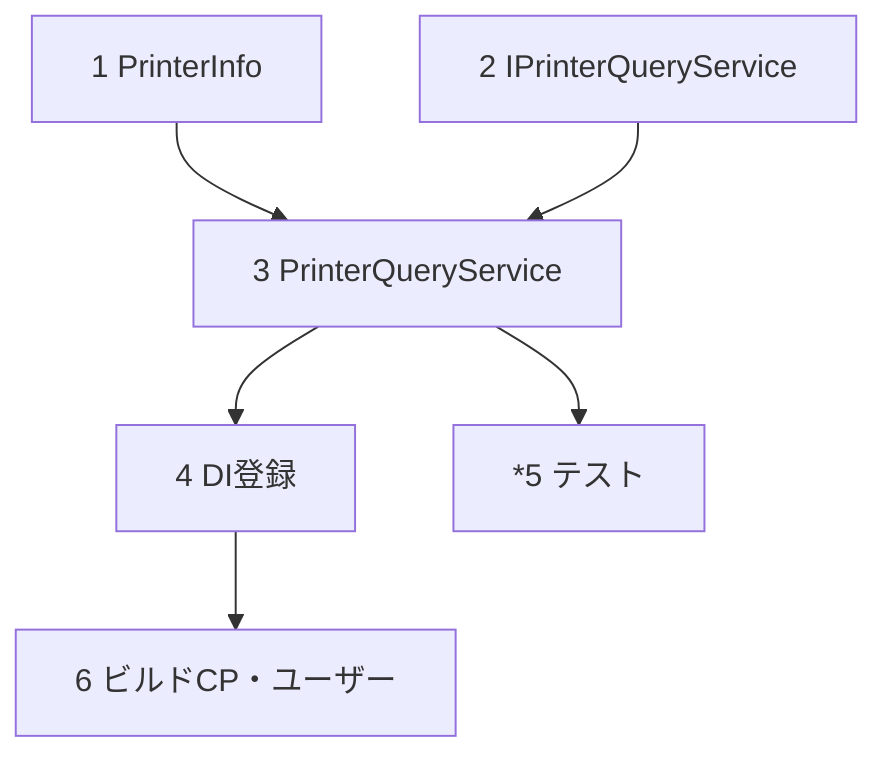

# 実装計画

- [x] 1. PrinterInfo DTO の追加
  - `CommonModule/Services/PrinterInfo.cs`（公開 record：MachineName/PrinterName/IsDefault/IsActive/LastSeenAt）
  - _要件: 2.1, 2.2_

- [x] 2. IPrinterQueryService の追加
  - `CommonModule/Services/IPrinterQueryService.cs`（`GetAvailablePrintersAsync(string? machineName = null, CancellationToken ct = default)`）
  - _要件: 1.1, 1.2_

- [x] 3. PrinterQueryService 実装の追加
  - `CommonModule/Services/PrinterQueryService.cs`（internal・`CommonDbContext` 注入）
  - `AsNoTracking`＋`is_active` フィルタ＋任意 `machine_name` 絞り込み＋(machine, printer) 昇順＋`PrinterInfo` 射影
  - _要件: 1.3, 1.4, 1.5, 1.6, 2.3, 3.1, 3.2_

- [x] 4. DI 登録
  - `CommonModule/Extensions/CommonModuleExtensions.cs` に `AddScoped<IPrinterQueryService, PrinterQueryService>()` を追加
  - _要件: 4.1, 4.2_

- [ ]* 5. 単体/プロパティテスト（任意）
  - `CommonModule.Tests` に InMemory `CommonDbContext` で検証を追加
  - Property 1（is_active フィルタ）／Property 2（machine 絞り込み・null時全件）／Property 3（(machine, printer) 昇順）
  - _要件: 1.3, 1.4, 1.5, 3.1_

- [x] 6. ビルド確認（チェックポイント・ユーザー）
  - slnCoCore（CommonModule 含む）ビルドで追加が通り、既存 I/F に影響が無いことを確認（2026/07/15 ビルドOK）
  - _要件: 5.1, 5.3_

## タスク依存グラフ

- 実装順：1・2 → 3 → 4 →（*5）→ 6（ユーザー）
- 破壊的変更なし（読み取り専用I/F追加・スキーマ不変）。
