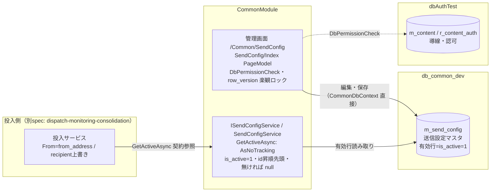

# 設計書（Design Document）

## Overview

本設計書は、CommonModule（全社共通送信基盤）に実装済みの「送信設定マスタ（send-config-master）」を、**実装を権威として文書化**するものである。新設計の提案ではなく、既にコミット済みの現状（Unit1〜Unit4）を「設計」として記述する。対応する要件は requirements.md の R1〜R8 である。

送信設定マスタは、次の2種類の値を **DB マスタ `m_send_config`（対象DB `db_common_dev`）で1行（有効行）に一元管理**する。

- **送信元 From（`from_address`）**: 本番・テスト共通のシステム／組織アドレス。個人アドレス依存やハードコードによる属人化を避ける。
- **テスト送信先（`test_fax_number` / `test_email`）**: テスト送信時に宛先（recipient）を差し替えるための固定のテスト宛先。

テスト送信は **recipient 上書き方式** を採る。すなわち、`config_key` は本番と同じ `fax`（FAX）／`mail`（メール）のまま変更せず、**宛先だけをマスタのテスト宛先へ差し替える**。これにより本番と同一経路での疎通確認ができる。

> **旧方式の取り下げ**: かつて検討していた「test-fax 固定アドレス方式（テスト専用の config_key／固定アドレスで別経路にする方式）」は**取り下げ済み**である。現行は上記の recipient 上書き方式に統一されている。また、常駐テストレコード（`t_smtp_queue` / `t_orders` への常駐）も廃案であり、テストは都度・使い捨てとする。

### スコープと責務境界

- 所有モジュール: **CommonModule**。対象DB: `db_common_dev`（マスタ）／`dbAuthTest`（導線登録）。
- 本 spec が所有するのは、**マスタ定義・読み取りサービス・管理画面・投入側へ提供する契約**である。
- **投入の実処理**（承認画面からのテスト送信、FAX/Mail の enqueue 実装等）は別 spec **dispatch-monitoring-consolidation** が所有する。本書では「送信設定マスタが投入側へ提供する契約」としてのみ記述する。
- Mail は**テスト疎通のみ**を対象とし、発注書メール等の業務メール送信は対象外。
- MainWeb・AuthModule・SharedCore は変更不可（参照のみ）。成果物は CommonModule 内で完結する。
- DDL 適用・導線 SQL 実行・ビルド・テスト実行・実送信は**ユーザー側の作業**とする。

### 実装状態のサマリ

| 要件 | 内容 | 実装状態 |
|------|------|----------|
| R1 | マスタ `m_send_config` 定義・DDL・初期シード | 実装済み（Unit1） |
| R2 | `ISendConfigService` / `SendConfigService`（有効行読み取り） | 実装済み（Unit2） |
| R3 | 管理画面 `/Common/SendConfig` | 実装済み（Unit4） |
| R4 | 投入側へ提供する送信設定の契約 | 実装済み（本マスタ提供分） |
| R5 | 承認画面からの FAX テスト送信 | 実装済み（投入側連携） |
| R6 | 管理画面の単発テスト送信ボタン | **未実装（今後 tasks で実装）** |
| R7 | Mail テスト経路（config_key=mail） | **未実装（今後 tasks で実装）** |
| R8 | 変更範囲・排他制御の遵守 | 実装済み（全 Unit 共通の前提） |

## Architecture

送信設定マスタは「1つのマスタ・1つの読み取りサービス・2つの利用者」で構成される。マスタを **`ISendConfigService`** が有効行のみ読み取り専用で取得し、(a) 管理画面が編集し、(b) 投入側（別 spec 所有）が From／テスト宛先を参照する。



### レイヤと責務

- **マスタ（`m_send_config`）**: 送信元・テスト宛先の唯一の正本。1行運用（複数有効行が生じた場合は `id` 昇順先頭を採用）。
- **読み取りサービス（`ISendConfigService`）**: 有効行を `AsNoTracking` で1件取得する読み取り専用ヘルパー。投入側に公開する唯一の取得口。実装 `SendConfigService` は `internal` で秘匿し、DI（`AddCommonModule`）に **Scoped** で登録する。
- **管理画面（`/Common/SendConfig`）**: 有効行の閲覧・編集。`CommonDbContext` を直接注入し、`row_version` による楽観的ロックで保存する。認可は `DbPermissionCheck`。
- **投入側（契約のみ）**: 有効行の `from_address` を From に用い、テスト送信時は recipient をテスト宛先に上書きする。実処理は dispatch spec 所有。

## Components and Interfaces

### ISendConfigService（読み取りインターフェース・public）

投入側（Producer）が送信元・テスト宛先を取得するための唯一の口。

```csharp
public interface ISendConfigService
{
    // 有効行（is_active=1）を1件、読み取り専用（AsNoTracking）で取得。無ければ null。
    Task<MSendConfig?> GetActiveAsync(CancellationToken ct = default);
}
```

- 公開範囲: インターフェースのみ `public`。実装は他モジュールから `new` されないよう `internal`。
- 戻り値: 有効行のエンティティ、または `null`（有効行なし）。

### SendConfigService（実装・internal）

`CommonDbContext` を用いて有効行を決定的に選択する。

- クエリ: `SendConfigs.AsNoTracking().Where(c => c.IsActive).OrderBy(c => c.Id).FirstOrDefaultAsync(ct)`
- 選択規則: `is_active = 1` の行を `id` 昇順で並べ、**先頭1件**を返す。該当なしは `null`。
- 読み取り専用（`AsNoTracking`）のため追跡オーバーヘッドなし。
- **対応**: R2.1〜R2.6

### DI 登録（AddCommonModule）

`CommonModuleExtensions.AddCommonModule` にて Scoped 登録する。`CommonDbContext`（Scoped）と整合させる。

```csharp
services.AddScoped<ISendConfigService, SendConfigService>();
```

- **対応**: R2.5

### 管理画面 PageModel（SendConfig/Index）

Area `Common` の Razor Pages。`CommonDbContext` を Primary Constructor で直接注入する。

- **認可**: `[Authorize(Policy = "DbPermissionCheck")]`（R3.2）。
- **表示（OnGetAsync）**:
  - 有効行を `AsNoTracking` で取得（`is_active=1`・`id` 昇順先頭）。
  - 有効行あり → `HasExisting=true`、`Id`/`FromAddress`/`TestFaxNumber`/`TestEmail`/`RowVersion` をフォームに反映（R3.3）。
  - 有効行なし → `HasExisting=false`、空フォーム（新規作成用）を表示（R3.4）。
  - `TempData` の成功／エラーメッセージを引き継ぎ表示。
- **保存（OnPostSaveAsync）**:
  - `ModelState` 検証失敗時は `HasExisting = Input.Id > 0` を再判定して再表示。
  - `Input.Id <= 0`（新規）→ `is_active=1`・`created_at`/`updated_at` = `DateTime.UtcNow` の行を追加（R3.7）。成功メッセージ「送信設定を新規登録しました。」。
  - `Input.Id > 0`（更新）→ 対象行を取得。取得できなければメッセージ「対象の送信設定が見つかりません。画面を再読み込みしてください。」（R3.10）。
  - 更新時は取得時の `row_version` を `OriginalValue` に設定して楽観的ロックを行い、`updated_at = DateTime.UtcNow` を設定（R3.8）。
  - `DbUpdateConcurrencyException` 発生時はメッセージ「他のユーザーが先に更新しました。画面を再読み込みしてください。」（R3.9）。
  - 成功時は結果に応じた成功メッセージ（新規登録／更新）を表示（R3.11）。
- **入力検証（InputModel）**:
  - `FromAddress`: `[Required]` + `[EmailAddress]` + `[MaxLength(256)]`（R3.5）。
  - `TestEmail`: `[EmailAddress]` + `[MaxLength(256)]`（入力時のみ検証）（R3.6）。
  - `TestFaxNumber`: `[MaxLength(40)]`。
  - 保存時、`TestFaxNumber`/`TestEmail` は空白のみなら `null` に正規化、`FromAddress` は `Trim()`。

### 導線登録（register_send_config_content.sql）

対象DB `dbAuthTest` の `m_content` に Area `Common`・page `SendConfig/Index` を登録する（未登録時のみ）。`r_content_auth` へのロール×セクション権限付与は運用方針に合わせて設定（`Common/SmtpMonitor` に合わせるのが自然）。
- **対応**: R3.12・R8.3

## Data Models

### テーブル `m_send_config`（対象DB `db_common_dev`）／エンティティ `MSendConfig`

| 列（DB） | 型（DB） | エンティティ | .NET 型 | 制約・既定 | 説明 |
|----------|----------|--------------|---------|-----------|------|
| `id` | `INT IDENTITY(1,1)` | `Id` | `int` | PK・IDENTITY | 主キー |
| `from_address` | `NVARCHAR(256)` | `FromAddress` | `string` | NOT NULL | 送信元（本番・テスト共通のシステムアドレス） |
| `test_fax_number` | `NVARCHAR(40)` | `TestFaxNumber` | `string?` | NULL 許容 | テストFAX宛先（recipient 上書き用） |
| `test_email` | `NVARCHAR(256)` | `TestEmail` | `string?` | NULL 許容 | テストメール宛先（recipient 上書き用） |
| `is_active` | `BIT` | `IsActive` | `bool` | NOT NULL・DEFAULT 1 | 有効行フラグ |
| `created_at` | `DATETIME2` | `CreatedAt` | `DateTime` | NOT NULL・DEFAULT `SYSUTCDATETIME()` | 作成日時(UTC) |
| `updated_at` | `DATETIME2` | `UpdatedAt` | `DateTime` | NOT NULL・DEFAULT `SYSUTCDATETIME()` | 更新日時(UTC) |
| `row_version` | `ROWVERSION` | `RowVersion` | `byte[]` | NOT NULL・`[Timestamp]` | 楽観的ロック用 |

- **監査列**: 本マスタは `created_at` / `updated_at` のみを持ち、`created_by` / `updated_by` は**保持しない**（MaterialModule と同じ方針。R1.3）。
- **マッピング**: 各列を `[Column("snake_case")]` でマッピング、`row_version` は `[Timestamp]` で楽観的ロック列として定義（R1.5）。
- **1行運用**: 有効行（`is_active=1`）を1件採用する運用。将来の複数行拡張余地を残し、複数存在時は `id` 昇順先頭を採用する（R1.4）。

### DDL・初期シード（create_m_send_config.sql）

- `OBJECT_ID('dbo.m_send_config','U') IS NULL` のときのみ `CREATE TABLE`（既存時は再作成しない。R1.7）。
- 有効行が1件も無いときのみ初期シード行を1件 INSERT（R1.6）。既定シード値は運用に合わせて画面／SQL で編集する。

## 投入側へ提供する契約（R4 / R5）

本 spec は**契約のみ**を定義する。以下の振る舞いの実処理は dispatch-monitoring-consolidation spec が所有する。

- **送信元 From**: 有効行の `from_address` を From に用いる。取得できない場合は `FaxDispatchOptions.FromAddress` にフォールバックする（R4.1〜R4.3）。
- **config_key**: FAX 投入では常に `fax`（NormalConfigKey）を用いる（R4.4）。
- **recipient 上書き（テスト送信時）**: recipient を有効行の `test_fax_number` に上書きする。`test_fax_number` が未設定なら当該投入をスキップし、ログを記録する（R4.5・R4.6）。
- **本番送信時**: recipient は実際の宛先FAX番号とする（R4.7）。
- **承認画面からの FAX テスト送信（R5）**: 上記 recipient 上書き方式に従う。常駐テストレコードを作らず、都度・使い捨ての投入として扱う（R5.1・R5.2）。

## 未実装項目（設計方針・実装は tasks で行う）

以下2点は要件として合意済みだが**未実装**である。ここでは設計方針のみを記し、実装は今後 tasks で行う。

### R6: 管理画面「単発テスト送信」ボタン（未実装）

- 管理画面 `/Common/SendConfig` に単発テスト送信ボタンを追加する（R6.1）。
- 実行時、常駐レコードを作らず**使い捨てジョブ1件**を `ISmtpQueueService` 経由で enqueue する（R6.4）。
- FAX テスト: `config_key=fax`・宛先 = 有効行 `test_fax_number`（R6.2）。
- Mail テスト: `config_key=mail`・宛先 = 有効行 `test_email`（R6.3）。
- 対象のテスト宛先（`test_fax_number` / `test_email`）が未設定の場合は enqueue せず、宛先未設定である旨のメッセージを表示する（R6.5）。
- 常駐ワーカーは持たない（都度実行のみ）。

### R7: Mail テスト経路（config_key=mail・テスト疎通限定）（未実装）

- Mail テスト送信は `config_key=mail`・宛先 = 有効行 `test_email` の使い捨てジョブ1件を enqueue し、SmtpAgent 経路を疎通確認する（R7.1）。
- `test_email` 未設定時は enqueue せずログに記録する（R7.2）。
- **テスト疎通のみ**を対象とし、発注書メール等の業務メール送信機能は含まない（R7.3）。

## Correctness Properties

*A property is a characteristic or behavior that should hold true across all valid executions of a system—essentially, a formal statement about what the system should do. Properties serve as the bridge between human-readable specifications and machine-verifiable correctness guarantees.*

本機能で property-based testing が有効なのは、**有効行選択ロジックの決定性**（`SendConfigService.GetActiveAsync` の選択規則）に限られる。管理画面の保存・楽観ロック・導線登録は外部依存（DB／認可）や UI 挙動が中心のため、example / integration テストで扱う（Testing Strategy 参照）。以下は最小限の property のみを定義する。

### Property 1: 有効行選択の決定性

*For any* `m_send_config` の行集合（`is_active` と `id` が任意に分布する）について、`GetActiveAsync` は「`is_active=1` の行のうち `id` が最小の行」を返し、`is_active=1` の行が1件も存在しない場合は `null` を返す。

**Validates: Requirements 2.2, 2.3, 2.4**

## Error Handling

- **有効行なし（読み取り）**: `GetActiveAsync` は例外を投げず `null` を返す。投入側は `null` を「マスタ未設定」として扱い、From はフォールバック、テスト宛先未設定はスキップ＋ログとする（契約）。
- **保存時の競合（楽観ロック）**: 更新時に他ユーザーが先行更新して `DbUpdateConcurrencyException` が発生した場合、画面上にメッセージ「他のユーザーが先に更新しました。画面を再読み込みしてください。」を表示し、再入力を促す（R3.9）。
- **更新対象の消失**: 更新対象行が取得できない場合、メッセージ「対象の送信設定が見つかりません。画面を再読み込みしてください。」を表示する（R3.10）。
- **入力検証エラー**: `FromAddress` 必須・メール形式、`TestEmail` メール形式に反する場合は `ModelState` により再表示し、`DataAnnotations` のエラーメッセージを表示する。
- **例外ハンドリングの方針**: 適切に処理できる例外（`DbUpdateConcurrencyException`）のみをキャッチする。汎用例外はキャッチしない（coding-standards 準拠）。

## 排他制御（row_version）

- マスタ更新は**楽観的ロック（`row_version` / `[Timestamp]`）**で行う（R8.4）。
- 手順: 取得時の `row_version` を `context.Entry(target).Property(t => t.RowVersion).OriginalValue` に設定 → `SaveChangesAsync` → 競合時は `DbUpdateConcurrencyException` をキャッチしてメッセージ表示。
- 新規作成時は `is_active=1`・`created_at`/`updated_at` を UTC 現在時刻で設定する。

## Testing Strategy

テスト資産は **MaterialModule.Tests ではなく `CommonModule.Tests`** に配置する。フレームワークは **xUnit + FsCheck 2.16.6**（プロパティテスト）＋ Moq（必要時）。InMemory DB 使用時は `Guid.NewGuid().ToString()` で DB 名を一意化し `IDisposable` で破棄する（coding-standards 準拠）。

### Property Tests（プロパティテスト）

- **Property 1: 有効行選択の決定性** を単一のプロパティテストで実装する。
  - 生成: `is_active`（bool）と `id`（連番）を持つ行集合をランダム生成し、InMemory DB へ投入。
  - 検証: `GetActiveAsync` の戻り値が「`is_active=1` の最小 `id` 行」または（該当なしのとき）`null` であること。
  - 反復回数: **最低 100 回**。
  - タグ: `// Feature: send-config-master, Property 1: 有効行選択の決定性（is_active=1 かつ id 昇順先頭・無ければ null）`

### Unit / Example Tests（例示・エッジケース）

- 管理画面 PageModel:
  - 有効行ありのとき `OnGetAsync` が `HasExisting=true` と各値をフォームへ反映する。
  - 有効行なしのとき `HasExisting=false`・空フォームを表示する。
  - 新規保存で `is_active=1`・`created_at`/`updated_at`(UTC) の行が作成され、成功メッセージが設定される。
  - 既存更新で `updated_at` が更新され、成功メッセージが設定される。
  - 更新対象が存在しないとき「対象の送信設定が見つかりません。…」メッセージ。
  - `ModelState` 不正（`FromAddress` 空・非メール形式）で再表示される。
- 楽観ロック競合（`DbUpdateConcurrencyException`）時のメッセージ表示は、EF Core の並行更新シナリオ（integration 相当）または例外注入で 1〜2 例を検証する。

### 対象外（PBT 非適用）

- 導線登録 SQL（`dbAuthTest` への `m_content` 登録）と DDL 適用は、ユーザー側実行の設定作業であり、単体プロパティテストの対象外。
- 実送信（FAX/Mail の実疎通）はユーザー側作業であり自動テスト対象外。

## 変更範囲制約

- 成果物は **CommonModule 内で完結**し、MainWeb・AuthModule・SharedCore は変更しない（R8.1）。
- マスタは `db_common_dev`、導線登録は `dbAuthTest` に対して行う（R8.2・R8.3）。
- DDL 適用・導線 SQL 実行・ビルド・テスト実行・実送信は**ユーザー側の作業**とする（R8.5）。
