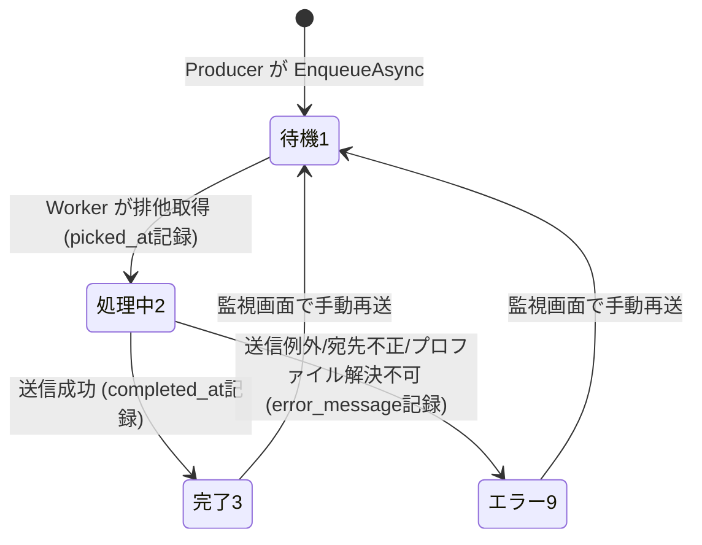

# Design Document

smtp-sender（SMTP送信汎用基盤）

## Overview

本設計は、資材調達システム(MaterialModule)で動作実証済みの「メールtoFAX送信(SmtpAgent)」を、全社共通の**SMTP送信汎用基盤**へ発展させるための技術設計を定義する。

中核となる構成は次の疎結合パイプラインである。

```
[各業務モジュール(Producer)] --INSERT--> [共通送信キュー t_smtp_queue (db_common_dev)]
                                                  |
                                            (ポーリング・排他取得)
                                                  v
                                        [SmtpAgent (.NET8 Worker)]
                                                  |
                            (config_keyで接続プロファイル解決・宛先正規化・PDF添付)
                                                  v
                                      [SMTPサーバ 172.16.128.81:25]
                                                  |
                                  (メール直送 / メールtoFAXゲートウェイ)

[全モジュール横断 監視画面 SmtpMonitor] <--参照/再送-- [t_smtp_queue]
[死活監視 m_smtp_agent_control] <--heartbeat-- [SmtpAgent]
```

本設計のキーとなる変更点は以下のとおり。

1. **共通DBへの移行**: 送信キュー(`t_smtp_queue`)・接続プロファイルマスタ(`m_smtp_config`)・死活監視(`m_smtp_agent_control`)を `db_common_dev` に新設し、SmtpAgent の接続先を `db_material_dev` から `db_common_dev` へ変更する。
2. **TOrderReport依存の廃止**: SmtpAgent が参照する対象を資材固有の `t_order_reports.fax_status` から、汎用の `t_smtp_queue` へ置き換える。これにより SmtpAgent は資材固有DB・資材固有スキーマに一切依存しなくなる。
3. **接続プロファイルマスタの複数行化**: `m_smtp_config` を 1行運用から、`config_key`(PK)・`host`・`port`・`fax_domain` のみを持つ**複数行の接続プロファイルマスタ**へ変更する。送信元アドレス・送信元名・テスト送信先・PDF保管先ディレクトリは本マスタから**削除**する。
4. **汎用ジョブモデル（接続プロファイルキー・差出人をジョブ保持）**: 件名・本文・宛先・添付PDFパスに加え、使用する接続プロファイルキー(`config_key`)・送信元アドレス(`from_address`)・送信元名(`from_name`)をジョブ自身が直接保持する（payload JSON の中から `Destination.Fax` を取り出す現行方式を廃止）。PDF生成・宛先決定は各Producerの責務とし、SmtpAgent は「ジョブの `config_key` で接続先を解決し、ジョブの差出人で送る」役割に純化する。
5. **監視画面の共通化**: 資材専用Area配下の現行 SmtpMonitor を廃し、全モジュール横断の共通配置とする（配置先は Architecture で確定）。
6. **接続プロファイルによる送信モード3分岐＋テスト送信方式の変更**: 接続プロファイルの `fax_domain` の**値の形**で送信モードを決定する（空=メール直送／`@`始まりのドメインのみ=FAX送信／`@`前に局所部を持つ完全アドレス=固定宛先）。宛先解決は送信モードに整合しない宛先形式（メール直送モードで `@` なし、FAX送信モードで `@` あり）をエラー化する。テスト送信は接続プロファイルマスタによる全件宛先上書き(`test_fax_no`)を廃止し、送信元モジュールが投入ジョブごとに `config_key=test-fax`（固定宛先モードのプロファイル）を指定することで実現する。SmtpAgent は固定宛先モードのジョブの宛先を無視し、`fax_domain` に保持された固定のテスト宛先へ送信する。テスト指定は永続的・全体共有の状態としては持たず（多人数同時運用での取り違え回避）、発注承認FAXでは承認画面のチェックボックスで承認操作ごとに指定する。旧 `config_key=Material`/`test` は廃止し、運用キーは `mail`/`fax`/`test-fax` とする。
7. **並行運用**: 既存の `t_order_reports.fax_status` 経路と既存 Print/Smtp ページは削除せず残し、新基盤は別系統として追加する。
8. **複数宛先・CC/BCC対応**: 宛先(`recipient`)を複数宛先区切り(`;`)で複数トークン保持できるよう `recipient` を `nvarchar(1000)` に拡張し、CC(`cc`)・BCC(`bcc`)列(`nvarchar(1000)`)を追加する。To は各トークンを宛先解決ロジック（@直送/FAX正規化）にかけて複数設定し、CC/BCC は各トークンをメールアドレスとしてそのまま付与する（FAX正規化しない）。`t_smtp_queue` は既に `db_common_dev` に作成済みのため、本変更は新規CREATEではなく **ALTER TABLE（`cc`/`bcc` 追加・`recipient` 桁拡張）** で適用する。

スコープは **SMTP送信のみ**。印刷共通化・帳票テンプレート化・各モジュールの実移行は対象外。PDF生成は各Producerの責務とする。

### 設計の前提

- 既存 SmtpAgent 実装（`\\OJIADM23120073\Labs\WindowsService\SmtpAgent`）は別ソリューションの .NET8 Worker Service として動作実証済み（メール着信OK）。本基盤はこれを改修して発展させる。
- Web側（`clnCoCore`）には既に `db_common_dev` への接続文字列(`CommonDb`)と読み取り用 `CommonDbContext`（カレンダーマスタ参照）が存在する。
- SMTPは `System.Net.Mail.SmtpClient`、暗号化なし・認証なし・固定IP許可を前提とする。

## Architecture

### システム構成要素

| 構成要素 | 種別 | 配置 | 役割 |
|---|---|---|---|
| `t_smtp_queue` | テーブル | `db_common_dev` | 共通送信キュー。1レコード=1送信ジョブ。`config_key`・差出人をジョブが保持 |
| `m_smtp_config` | テーブル | `db_common_dev` | 接続プロファイルマスタ（複数行）。`config_key`(PK)/`host`/`port`/`fax_domain` |
| `m_smtp_agent_control` | テーブル | `db_common_dev` | Worker死活監視（1行運用） |
| SmtpAgent | Worker Service(.NET8) | オンプレ常駐（別ソリューション） | キューのポーリング・排他取得・宛先正規化・PDF添付・SMTP送信・heartbeat |
| SmtpMonitor | Razor Pages 画面 | 共通配置（後述） | 全ジョブの状況表示・手動再送・死活表示 |
| ISmtpQueueService | 共通サービス | 共通モジュール | 各Producerがジョブを投入するためのヘルパー |

### 監視画面とキューエンティティの共通配置（設計判断）

要件10は監視画面を「全モジュール横断の共通画面」「資材専用に配置しない」と定める。既存プロジェクト構成を調査した結果は次のとおり。

- `MainWeb`: 全モジュールをホストする起動プロジェクト。Razor Pages（Areaなし、`Pages/`直下）。各モジュールDbContextは未参照。
- `MaterialModule` 等: 業務モジュール。各自 Area（例 `Material`）配下にページを持ち、`MainWeb` から `AddXxxModule()` で登録される。
- `SharedCore`: DB非依存の共有モデル・インターフェース。
- `SharedInfrastructure`: 認証DB(`ApplicationDbContext`)とリポジトリ。
- `MaterialModule/Doc/common-db-design.md`: 共通DBアクセスを将来 **CommonModule** プロジェクトへ集約する計画が既に文書化されている。

**設計判断: 新規 `CommonModule` プロジェクト（Area `Common`）を作成し、ここに監視画面・キューエンティティ・共通DbContext・投入サービスを集約する。**

採用理由:
- 要件10（資材非依存・全モジュール横断）を構造的に満たす。資材専用Areaに置く現行方式から脱却できる。
- `common-db-design.md` に記載済みの CommonModule 構想と整合し、将来カレンダーマスタ等もここへ集約できる。
- `MainWeb/Pages` 直下に置く案は「ホストにビジネス画面を持たせる」ことになり、既存のモジュール=Area方式と不整合。よって退ける。
- 各Producerモジュールは CommonModule をプロジェクト参照することで、キューエンティティと投入サービスを共有できる（重複定義を回避）。

```
CommonModule/                         ← 新規プロジェクト（Microsoft.NET.Sdk.Razor）
├── Areas/Common/Pages/SmtpMonitor/
│   ├── Index.cshtml                  ← 監視画面（全モジュール横断）
│   └── Index.cshtml.cs
├── Data/
│   └── CommonDbContext.cs            ← t_smtp_queue/m_smtp_config/m_smtp_agent_control を追加
├── Data/Entities/
│   ├── TSmtpQueue.cs
│   ├── MSmtpConfig.cs
│   └── MSmtpAgentControl.cs
├── Services/
│   ├── ISmtpQueueService.cs          ← Producer向けジョブ投入ヘルパー
│   └── SmtpQueueService.cs
└── Extensions/
    └── CommonModuleExtensions.cs     ← AddCommonModule(): DbContext/サービス/Area登録
```

注: 既存 `MaterialModule/Data/CommonDbContext.cs`（カレンダー読み取り用）は当面そのまま残す（並行運用方針）。本基盤の `CommonModule.Data.CommonDbContext` は別物として新設し、SMTP系3テーブルを担当する。将来的なカレンダー統合は別タスクとする。

### SmtpAgent（Worker）側の構成

SmtpAgent は `clnCoCore` ソリューション外の独立 Worker Service であり、CommonModule をプロジェクト参照しない運用が現実的（配置・配布が別系統のため）。したがって SmtpAgent は **同一テーブルを指す独自のエンティティ定義**を保持する（現行と同様）。スキーマ（列名・型）は本設計で一意に定め、Web側エンティティと Worker側エンティティが同一テーブルにマップされることを保証する。

SmtpAgent 改修後の構成:

```
SmtpAgent/
├── Data/SmtpAgentDbContext.cs        ← 接続先を db_common_dev に変更、DbSet を TSmtpQueue に差し替え
├── Models/
│   ├── TSmtpQueue.cs                 ← 新規（TOrderReport を置換）。config_key/from_address/from_name を含む
│   ├── MSmtpConfig.cs                ← 複数行の接続プロファイル（config_key/host/port/fax_domain のみ）
│   └── MSmtpAgentControl.cs          ← 変更なし
├── Services/
│   ├── ISmtpSendService.cs
│   └── SmtpSendService.cs            ← 接続プロファイル・差出人・件名・本文・宛先・添付パスを引数化（payload依存を除去）
└── Workers/SmtpJobWorker.cs          ← t_smtp_queue をポーリング、config_keyでプロファイル解決・宛先正規化・添付判定・status遷移
```

### 処理フロー（ポーリング1サイクル）

```mermaid
sequenceDiagram
    participant W as SmtpJobWorker
    participant DB as db_common_dev
    participant S as SMTPサーバ

    W->>DB: heartbeat更新 (m_smtp_agent_control)
    W->>DB: status=1 を created_at 昇順で1件取得
    alt 待機ジョブなし
        W->>W: 次ポーリングまで待機
    else 待機ジョブあり
        W->>DB: status=2, picked_at=now で SaveChanges
        alt 楽観ロック競合 (DbUpdateConcurrencyException)
            W->>W: スキップして次サイクルへ
        else 取得成功
            W->>DB: m_smtp_config を config_key で取得
            alt プロファイル該当なし
                W->>DB: status=9, error_message 記録
            else プロファイル解決
                W->>W: host/port/fax_domain を解決
                W->>W: 送信モード判定（fax_domain空=メール直送 / @始まりドメイン=FAX送信 / 完全アドレス=固定宛先）→To解決（固定宛先: recipient無視しfax_domain / メール直送: @必須(無→エラー) / FAX送信: @混入→エラー・数字正規化0→81・domain付与）
                W->>W: CC/BCC解決（cc/bccを;分割・trim・空除外→FAX正規化せずそのまま）
                W->>W: pdf_path 実在チェック→添付判定
                alt 宛先不正（モード形式不一致/有効To0件/数字なし）
                    W->>DB: status=9, error_message 記録
                else 正常
                    W->>S: SMTP送信（差出人=ジョブの from_address/from_name）
                    W->>DB: status=3, completed_at=now
                end
            end
        end
    end
```

### 接続文字列・DI

- Web(`MainWeb`)側: 既存 `CommonDb` 接続文字列（`db_common_dev`）を `CommonModule` の `CommonDbContext` に注入。`AddCommonModule(configuration)` を `ModuleRegistration.AddModules` に追加する。
- Worker(`SmtpAgent`)側: `appsettings.json` の接続文字列を `db_material_dev` から `db_common_dev` へ変更。PDF保管先ディレクトリの共通設定は廃止し（ジョブの `pdf_path` がフルパスを保持）、接続情報はジョブの `config_key` で `m_smtp_config` を引いて解決する。

## Components and Interfaces

### ISmtpQueueService（Producer向け投入ヘルパー）

各Producerモジュールが `t_smtp_queue` へジョブを投入するための共通サービス。直接INSERTも技術的には可能だが、列名・初期status・タイムスタンプの取り扱いを一元化し、Producer間の実装差異を防ぐため**ヘルパー方式を採用する**。

```csharp
namespace CommonModule.Services;

public interface ISmtpQueueService
{
    /// <summary>
    /// 送信ジョブを共通送信キューに1件投入する。status=1(待機)で登録される。
    /// </summary>
    /// <param name="module">投入元モジュール識別子（例: "material"）。</param>
    /// <param name="configKey">使用する接続プロファイルキー（m_smtp_config.config_key、"mail"/"fax"/"test-fax"）。</param>
    /// <param name="fromAddress">送信元アドレス。</param>
    /// <param name="fromName">送信元表示名（空可）。</param>
    /// <param name="recipient">宛先。@を含めばメールアドレス、含まなければFAX番号。複数宛先区切り(;)で複数指定可。固定宛先モード(test-fax)では無視される。</param>
    /// <param name="subject">件名。</param>
    /// <param name="body">本文（空可）。</param>
    /// <param name="cc">CC宛先。複数宛先区切り(;)で複数指定可。未指定(null)はCC列をNULL登録。</param>
    /// <param name="bcc">BCC宛先。複数宛先区切り(;)で複数指定可。未指定(null)はBCC列をNULL登録。</param>
    /// <param name="pdfPath">添付PDFのフルパス。添付なしは null。</param>
    /// <returns>投入されたジョブの id。</returns>
    Task<int> EnqueueAsync(
        string module,
        string configKey,
        string fromAddress,
        string? fromName,
        string recipient,
        string subject,
        string? body = null,
        string? cc = null,
        string? bcc = null,
        string? pdfPath = null,
        CancellationToken ct = default);
}
```

`SmtpQueueService` 実装は `CommonDbContext` を用い、`status=1`・`created_at=updated_at=現在時刻` を設定して INSERT する。`module`/`configKey`/`fromAddress`/`recipient`/`subject` の空文字バリデーションを行い、不正時は `ArgumentException` を投げる（投入時点で弾く）。`cc`/`bcc` は任意項目であり、`recipient`/`cc`/`bcc` に渡された複数宛先区切り(`;`)を含む値は分割・整形せずそのまま該当列へ登録する（分割・整形は送信時に Worker が行う）。`cc`/`bcc` が未指定(`null`)の場合は当該列を NULL として登録する（要件3.10/3.11/3.12）。`config_key` の実在性チェックは Worker 側（送信時の解決失敗→エラー化、要件5.2）に委ねる方針とし、投入時は形式チェックのみ行う。

注: 資材の `PrintJobService` 等から本サービスを呼ぶ実移行は本スコープ外。本Specでは IF の定義と CommonModule への実装提供までを行う。

### ISmtpSendService（Worker：SMTP送信）

現行は `SendMail(MSmtpConfig, recipientRaw, pdfPath, subject)` のシグネチャだが、本文(body)・差出人(from)を引数化し、接続情報は接続プロファイル(`MSmtpConfig`)を渡す形にして payload非依存にする。宛先解決は接続プロファイルの `fax_domain` が空かどうかを判定に含める。

**設計判断（複数宛先・CC/BCCの責務分割）**: `ResolveToAddress` は **1トークン（単一宛先）を解決する純粋関数のまま維持**する。複数宛先区切り(`;`)の分割・trim・空トークン除外は **呼び出し側(Worker)** が行い、各トークンを `ResolveToAddress` に通して To のリストを構築する。CC/BCC は FAX正規化の対象外であり、Worker が `;` 分割・trim・空除外のみを行ってメールアドレスのリストを構築する。SMTPメッセージの組み立て（To/CC/BCC の複数設定・添付）は解決済みリストを受け取る `BuildMessage`/`SendMail` が担う。この分割により、宛先トークン単体の解決ロジック（テスト容易・純粋）と、複数化・ヘッダ付与（メッセージ組立）の関心を分離する。

```csharp
public interface ISmtpSendService
{
    /// <summary>
    /// 単一の宛先トークンを、接続プロファイルの fax_domain の形で決まる送信モードに従って解決する純粋関数。
    /// 送信モード判別: FaxDomain 空=メール直送 / FaxDomain が '@' 始まりのドメインのみ=FAX送信 /
    /// FaxDomain が完全アドレス('@' の前に局所部あり、例 0064871033@faxmail.com)=固定宛先。
    /// ① メール直送モード: 宛先が '@' を含む → そのまま送信先。'@' を含まない → 例外（メール形式でない）。
    /// ② FAX送信モード: 宛先が '@' を含まない → FAX番号正規化（数字抽出＋先頭0→81）＋ fax_domain 付与。
    ///    宛先が '@' を含む → 例外（FAX番号形式でない）。正規化結果が数字を1文字も含まない → 例外。
    /// ③ 固定宛先モード: 宛先トークンを無視し、FaxDomain の値そのものを送信先とする。
    /// 宛先が空（メール直送/FAX送信モード時）は例外を送出する。
    /// 複数宛先(;区切り)の分割・trim・空除外は呼び出し側(Worker)の責務であり、本メソッドは1トークンのみを扱う
    /// （固定宛先モードでは分割結果に関わらず単一の固定宛先を返す）。
    /// </summary>
    string ResolveToAddress(MSmtpConfig profile, string recipientToken);

    /// <summary>
    /// 解決済みの送信先・差出人・件名・本文・添付パスから MailMessage を組み立てる。
    /// toAddresses は ResolveToAddress で解決済みの To アドレス群（1件以上必須）。
    /// ccAddresses / bccAddresses は trim・空除外済みのメールアドレス群（FAX正規化はしない）。
    /// 空のコレクションのとき CC/BCC ヘッダは付与しない。pdfPath が実在する時のみ添付する。
    /// </summary>
    MailMessage BuildMessage(
        MSmtpConfig profile,
        string fromAddress,
        string? fromName,
        IReadOnlyList<string> toAddresses,
        IReadOnlyList<string> ccAddresses,
        IReadOnlyList<string> bccAddresses,
        string subject,
        string? body,
        string? pdfPath);

    /// <summary>
    /// 接続プロファイル・差出人・件名・本文・宛先(複数)・CC(複数)・BCC(複数)・添付パスを指定してSMTP送信する。
    /// 内部で BuildMessage を呼び、接続先は profile.Host / profile.Port を使用する。
    /// </summary>
    void SendMail(
        MSmtpConfig profile,
        string fromAddress,
        string? fromName,
        IReadOnlyList<string> toAddresses,
        IReadOnlyList<string> ccAddresses,
        IReadOnlyList<string> bccAddresses,
        string subject,
        string? body,
        string? pdfPath);
}
```

`ResolveToAddress` は、宛先トークンと接続プロファイルの `fax_domain` の**形**で決まる送信モード（メール直送／FAX送信／固定宛先）に従って送信先を決定する純粋関数。メール直送モード（`fax_domain` 空、例: `mail`）は宛先に `@` を必須とし、無ければ例外。FAX送信モード（`fax_domain` が `@` 始まりのドメインのみ、例: `fax`）は宛先に `@` があれば例外（FAX番号形式でない）、無ければ数字正規化（数字抽出＋先頭0→81）＋ `fax_domain` 付与し、数字なしは例外。固定宛先モード（`fax_domain` が完全アドレス、例: `test-fax` の `0064871033@faxmail.com`）は宛先を無視し `fax_domain` を送信先とする。Worker は例外を捕捉して当該ジョブを status=9 にする。

`BuildMessage`/`SendMail` は解決済みの `toAddresses`（1件以上）を `MailMessage.To` に、`ccAddresses` を `MailMessage.CC` に、`bccAddresses` を `MailMessage.Bcc` に追加する。CC/BCC は FAX正規化を行わずトークンをそのままメールアドレスとして使用し、空コレクションのとき該当ヘッダは付与しない（要件13.1/13.2/13.6/13.7/13.8）。

### SmtpJobWorker（Worker：ポーリング・状態遷移）

現行 `SmtpJobWorker` を次のとおり改修する。

- ポーリング対象を `db.OrderReports.Where(FaxStatus==1 && PrintPayload!=null)` から `db.SmtpQueue.Where(Status==1)` に変更。
- `OrderBy(created_at)` 昇順で1件取得（現行踏襲）。
- 取得時 `Status=2`, `PickedAt=now`, `UpdatedAt=now` で `SaveChangesAsync`。`DbUpdateConcurrencyException` はスキップ（現行踏襲、`row_version` による楽観ロック）。
- 接続プロファイル解決: ジョブの `config_key` で `m_smtp_config` を引き、`host`/`port`/`fax_domain` を解決。該当プロファイルが存在しなければ送信せず `Status=9`（エラー）、`ErrorMessage` に記録（要件5.2）。
- 差出人: ジョブの `from_address`/`from_name` を `MailMessage.From` に設定（要件5.5）。
- 宛先(To)決定: まず `profile.FaxDomain` の形から送信モードを判定する。**固定宛先モード**（`fax_domain` が完全アドレス、例 `test-fax`）の場合は、ジョブの `recipient` を無視し `fax_domain` の値のみを唯一の To とする（要件6.8）。**メール直送/FAX送信モード**の場合は、ジョブの `recipient` を複数宛先区切り(`;`)で分割し、各トークンを trim、trim後に空となるトークンを除外し、残った各トークンを `ResolveToAddress(profile, token)` で解決して To リストを構築する。各トークンの解決は、メール直送（`fax_domain` 空）＝`@` 必須（無ければ例外）、FAX送信（`fax_domain` が `@` 始まりドメイン）＝`@` 混入は例外・`@` なしは数字正規化（数字抽出＋先頭0→81）＋ `fax_domain` 付与・数字なしは例外（要件6.2〜6.7/6.9〜6.11）。有効な To トークンが1件も無い場合、または解決時に例外となった場合は送信せず `Status=9`（要件6.4/6.6/6.7/6.9/6.10）。`test_fax_no` による全件上書きロジックは廃止。
- CC/BCC決定: ジョブの `cc`/`bcc` をそれぞれ複数宛先区切り(`;`)で分割し、各トークンを trim、trim後に空となるトークンを除外する。CC/BCC は **FAX正規化を行わず**、トークンをそのままメールアドレスとして使用する（要件13.3〜13.6）。`cc`/`bcc` が NULL/空、または有効トークンが0件の場合は当該ヘッダを付与しない（要件13.1/13.2）。解決済みの To/CC/BCC リストを `SendMail`（内部で `BuildMessage`）に渡す。
- 添付PDF: ジョブの `pdf_path`（フルパス）が指定され、かつ実在する場合のみ添付。実在しなければ添付なしで送信しログ記録（PDF保管先の共通設定は廃止）。
- 送信成功時 `Status=3`, `CompletedAt=now`。例外時 `Status=9`, `ErrorMessage`（500字truncate）。
- heartbeat 更新は現行どおりポーリング毎に実施。失敗はログのみで処理継続。

### SmtpMonitor（共通監視画面）

`CommonModule/Areas/Common/Pages/SmtpMonitor/Index`。`[Authorize(Policy = "DbPermissionCheck")]`。

表示・操作:
- `t_smtp_queue` の全ジョブを投入元モジュールを問わず一覧（ページング、`id` 降順）。
- 列: id / module（投入元識別）/ config_key / from_address / recipient / subject / status（待機/処理中/完了/エラー）/ created_at / picked_at / completed_at / error_message。
- フィルタ: status / module / キーワード（subject・recipient）/ 日付範囲。
- サマリ: 待機(1)・処理中(2)・完了(3)・エラー(9) の件数。
- 手動再送: status=9 または status=3 のジョブを status=1 に戻す（`picked_at`/`completed_at`/`error_message` をクリア）。自動リトライは行わない。
- 死活表示: `m_smtp_agent_control.last_heartbeat_at` が現在(UTC)から30秒以内なら「ポーリング中」、超過なら「応答なし」。マシン名・最終応答時刻(JST)を表示。

スタイルは新規ページ規約（`_MaterialStyles` 相当の共通スタイル）に準拠。CommonModule 用の共通スタイルパーシャルを用意するか、Bootstrap5標準で構成する（site.cssは変更しない）。

## Data Models

### t_smtp_queue（共通送信キュー）

`db_common_dev` に新設。1レコード=1送信ジョブ。

> **マイグレーション方針**: `t_smtp_queue` は既に `db_common_dev` に作成済みである。本設計で追加する `cc`・`bcc` 列、および `recipient` の桁拡張(`nvarchar(256)`→`nvarchar(1000)`)は、**新規 CREATE ではなく `ALTER TABLE` で適用する**。
> ```sql
> ALTER TABLE t_smtp_queue ADD cc nvarchar(1000) NULL;
> ALTER TABLE t_smtp_queue ADD bcc nvarchar(1000) NULL;
> ALTER TABLE t_smtp_queue ALTER COLUMN recipient nvarchar(1000) NOT NULL;
> ```
> Web側(`CommonModule`)・Worker側(`SmtpAgent`)双方のエンティティに `Cc`/`Bcc` プロパティを追加し、`Recipient` の `MaxLength` を 1000 に変更する。

| カラム名 | 型 | 必須 | 説明 |
|---|---|---|---|
| id | int (IDENTITY) | PK | 主キー |
| module | nvarchar(40) | YES | 投入元モジュール識別（例: `material`） |
| config_key | nvarchar(40) | YES | 使用する接続プロファイルキー（`m_smtp_config.config_key`、`mail`/`fax`/`test-fax`） |
| from_address | nvarchar(256) | YES | 送信元アドレス |
| from_name | nvarchar(100) | NO | 送信元表示名（NULL/空可） |
| recipient | nvarchar(1000) | YES | 宛先(To)。@含む=メールアドレス、含まない=FAX番号。複数宛先区切り(`;`)で複数トークン保持可 |
| cc | nvarchar(1000) | NO | CC宛先。複数宛先区切り(`;`)で複数メールアドレス保持可。NULL/空=CCなし |
| bcc | nvarchar(1000) | NO | BCC宛先。複数宛先区切り(`;`)で複数メールアドレス保持可。NULL/空=BCCなし |
| subject | nvarchar(256) | YES | 件名 |
| body | nvarchar(max) | NO | 本文（NULL/空可） |
| pdf_path | nvarchar(500) | NO | 添付PDFフルパス。NULL=添付なし |
| status | int | YES | 送信ステータス: 1=待機 / 2=処理中 / 3=完了 / 9=エラー |
| picked_at | datetime2 | NO | 処理中(2)へ遷移した取得日時(UTC) |
| completed_at | datetime2 | NO | 完了(3)へ遷移した日時(UTC) |
| error_message | nvarchar(500) | NO | エラー(9)時のエラー内容 |
| created_at | datetime2 | YES | 作成日時 |
| updated_at | datetime2 | YES | 更新日時 |
| row_version | rowversion (Timestamp) | YES | 楽観的ロック用 |

インデックス: `ix_t_smtp_queue_status_created (status, created_at)`（ポーリング取得用）、`ix_t_smtp_queue_module (module)`。

```csharp
[Table("t_smtp_queue")]
public class TSmtpQueue
{
    [Key, Column("id")]
    [DatabaseGenerated(DatabaseGeneratedOption.Identity)]
    public int Id { get; set; }

    [Required, Column("module"), MaxLength(40)]
    public string Module { get; set; } = string.Empty;

    [Required, Column("config_key"), MaxLength(40)]
    public string ConfigKey { get; set; } = string.Empty;

    [Required, Column("from_address"), MaxLength(256)]
    public string FromAddress { get; set; } = string.Empty;

    [Column("from_name"), MaxLength(100)]
    public string? FromName { get; set; }

    [Required, Column("recipient"), MaxLength(1000)]
    public string Recipient { get; set; } = string.Empty;

    [Column("cc"), MaxLength(1000)]
    public string? Cc { get; set; }

    [Column("bcc"), MaxLength(1000)]
    public string? Bcc { get; set; }

    [Required, Column("subject"), MaxLength(256)]
    public string Subject { get; set; } = string.Empty;

    [Column("body", TypeName = "nvarchar(max)")]
    public string? Body { get; set; }

    [Column("pdf_path"), MaxLength(500)]
    public string? PdfPath { get; set; }

    [Required, Column("status")]
    public int Status { get; set; } = 1;

    [Column("picked_at")]
    public DateTime? PickedAt { get; set; }

    [Column("completed_at")]
    public DateTime? CompletedAt { get; set; }

    [Column("error_message"), MaxLength(500)]
    public string? ErrorMessage { get; set; }

    [Required, Column("created_at")]
    public DateTime CreatedAt { get; set; }

    [Required, Column("updated_at")]
    public DateTime UpdatedAt { get; set; }

    [Timestamp, Column("row_version")]
    public byte[] RowVersion { get; set; } = [];
}
```

### m_smtp_config（接続プロファイルマスタ・複数行運用）

`db_common_dev` に新設。**複数行の接続プロファイル**を保持する。各行が1つのSMTP接続先設定を表す。`config_key` を主キーとする。送信元アドレス・送信元名・テスト送信先・PDF保管先ディレクトリは**保持しない**（差出人はジョブが保持、PDFはジョブの `pdf_path` がフルパス保持）。

| カラム名 | 型 | 必須 | 説明 |
|---|---|---|---|
| config_key | nvarchar(40) | PK | 接続プロファイルキー（`mail`/`fax`/`test-fax`） |
| host | nvarchar(100) | YES | SMTPサーバホスト（既定 `172.16.128.81`） |
| port | int | YES | SMTPポート（既定 `25`） |
| fax_domain | nvarchar(100) | NO | FAXゲートウェイドメイン。値の形で送信モードを決定（空=メール直送 / `@`始まりドメイン=FAX送信 / 完全アドレス=固定宛先） |

例データ（現行運用）:

| config_key | host | port | fax_domain | 送信モード |
|---|---|---|---|---|
| mail | 172.16.128.81 | 25 | （空） | メール直送 |
| fax | 172.16.128.81 | 25 | `@faxmail.com` | FAX送信 |
| test-fax | 172.16.128.81 | 25 | `0064871033@faxmail.com` | 固定宛先（テスト） |

`fax_domain` の形により送信モードが決まる（要件2.4/2.5/2.6）。旧 `Material`・`test` は廃止（要件2.7・m_smtp_config から DELETE）。

```csharp
[Table("m_smtp_config")]
public class MSmtpConfig
{
    [Key, Column("config_key"), MaxLength(40)]
    public string ConfigKey { get; set; } = string.Empty;

    [Required, Column("host"), MaxLength(100)]
    public string Host { get; set; } = string.Empty;

    [Required, Column("port")]
    public int Port { get; set; } = 25;

    [Column("fax_domain"), MaxLength(100)]
    public string? FaxDomain { get; set; }
}
```

注: 接続プロファイルは画面からの編集を当面想定しないため `row_version`/`updated_by`/`updated_at` は持たせない。将来、設定編集画面を追加する場合は楽観ロック規約に従い `row_version (Timestamp)` を追加する。

### m_smtp_agent_control（死活監視・1行運用）

`db_common_dev` に新設。現行スキーマを踏襲。

| カラム名 | 型 | 必須 | 説明 |
|---|---|---|---|
| id | int (IDENTITY) | PK | 主キー |
| last_heartbeat_at | datetime2 | NO | 最終応答時刻(UTC) |
| machine_name | nvarchar(100) | NO | 稼働マシン名 |
| updated_at | datetime2 | YES | 更新日時 |

### ステータス遷移



許可される遷移はこの図のものに限る。`9→1`・`3→1` は監視画面の手動操作のみ。Worker による自動リトライ（`9→1`）は行わない。

## Correctness Properties

*A property is a characteristic or behavior that should hold true across all valid executions of a system—essentially, a formal statement about what the system should do. Properties serve as the bridge between human-readable specifications and machine-verifiable correctness guarantees.*

本基盤は、宛先正規化（純粋関数）・状態遷移（待機→処理中→完了/エラー）・排他取得という、入力で振る舞いが大きく変わるロジックを多く含むため、プロパティベーステスト(PBT)が有効である。一方で実SMTP送信・テーブル物理配置・並行運用といった外部/構成要件は統合テスト・スモークテストで扱う（Testing Strategy 参照）。

以下のプロパティは prework のテスタビリティ分析と冗長性排除（Property Reflection）を経て確定したものである。旧 Property 8（`test_fax_no` 設定時かつそのときに限り宛先上書き）は、テスト送信先の全件上書き方式の廃止に伴い**削除**し、代わりに接続プロファイル解決失敗のエラー化（新 Property 4）を追加した。複数宛先(To)・CC/BCC 対応に伴い、単一トークン解決の Property 5 を維持しつつ、複数宛先解決（Property 14）・CC/BCC付与の同値（Property 15）を追加し、不正宛先のエラー化（Property 6）に「`;` 分割後に有効トークン0件」のケースを統合した。**さらに config_key 3モード化（`fax_domain` の形＝空/`@`始まりドメイン/完全アドレス で メール直送/FAX送信/固定宛先 を判別）に伴い、Property 5 を送信モード別解決（固定宛先モードの宛先無視を含む）に、Property 6 を送信モード形式不一致（メール直送で `@` なし・FAX送信で `@` あり）を含むエラー化に更新した。テスト送信は固定宛先モード（`test-fax`）で表現し、Property 5(a) が固定宛先への送信を担保する。**

### Property 1: 投入されたジョブは待機状態で全項目が保持される

*For any* 有効な投入入力 (module, configKey, fromAddress, fromName?, recipient, subject, body?, pdfPath?) について、`ISmtpQueueService.EnqueueAsync` で投入されたジョブは、送信ステータスが待機(1)であり、`created_at == updated_at` であり、各入力値（module・config_key・from_address・from_name・recipient・subject・body・pdf_path）が対応するカラムにそのまま保持される。

**Validates: Requirements 3.1, 3.2, 3.3, 3.4, 3.5, 3.6, 7.1**

### Property 2: ポーリング取得は待機ジョブのうち最古を取得し処理中へ遷移させる

*For any* 任意の送信ジョブ集合について、ポーリング取得は、送信ステータスが待機(1)のジョブが存在すればその中で `created_at` が最小のジョブを1件だけ返し、当該ジョブを処理中(2)へ更新して `picked_at` を記録する。待機(1)のジョブが存在しなければ何も取得せず送信も行わない。待機(1)以外（処理中(2)・完了(3)・エラー(9)）のジョブは取得対象にならない。

**Validates: Requirements 4.2, 4.3, 4.5**

### Property 3: 同一ジョブは高々1インスタンスのみが取得に成功する（排他・at-most-once）

*For any* 単一の待機(1)ジョブに対して複数インスタンスが同時に取得（処理中(2)への更新）を試みた場合、`row_version` による楽観的ロックにより、高々1つのインスタンスのみが取得に成功し、残りは `DbUpdateConcurrencyException` によりスキップされる。結果として、1つのジョブが二重に処理中(2)・完了(3)へ遷移することはない。

**Validates: Requirements 4.4, 3.7**

### Property 4: 接続プロファイルが解決できないジョブは送信されずエラーになる

*For any* 送信ジョブについて、ジョブの接続プロファイルキー(`config_key`)が接続プロファイルマスタ(`m_smtp_config`)に存在しない場合、当該ジョブは送信されず送信ステータスがエラー(9)に更新される。`config_key` がマスタに存在する場合は当該行から `host`・`port`・`fax_domain` が解決され送信処理へ進む。

**Validates: Requirements 5.1, 5.2**

### Property 5: 宛先解決は送信モード別に送信先アドレスを生成する

*For any* 単一の宛先トークンと接続プロファイルの組について、接続プロファイルの `fax_domain` の形で決まる送信モードに応じて次のとおり送信先が生成される。(a) **固定宛先モード**（`fax_domain` が完全アドレス）では、宛先トークンの内容に関わらず `fax_domain` の値そのものが送信先となる。(b) **メール直送モード**（`fax_domain` 空）で宛先が `@` を含む場合は、前後空白を除去した宛先がそのまま送信先となり FAX番号正規化・ドメイン付与は行われない。(c) **FAX送信モード**（`fax_domain` が `@` 始まりのドメインのみ）で宛先が `@` を含まない場合は、数字以外の文字が除去され、正規化前が先頭 `0` を持つならば先頭 `0` が `81` に置換され、結果の数字列に `fax_domain` が付与された送信先メールアドレスが生成される。本プロパティは `ResolveToAddress` が扱う **1トークン**の解決を検証する（複数宛先の分割は Property 14 が扱う）。

**Validates: Requirements 2.4, 2.5, 2.6, 6.1, 6.3, 6.5, 6.8, 8.3**

### Property 6: 送信モードに整合しない/不正な宛先は送信されずエラー状態になる

*For any* 宛先と接続プロファイルの組について、次のいずれかに該当する場合、当該ジョブは送信されず送信ステータスがエラー(9)に更新される。(a) メール直送モード（`fax_domain` 空）で宛先トークンが `@` を含まない（メールアドレス形式でない）。(b) FAX送信モード（`fax_domain` が `@` 始まりのドメインのみ）で宛先トークンが `@` を含む（FAX番号形式でない）。(c) FAX送信モードで正規化結果が数字を1文字も含まない。(d) メール直送/FAX送信モードにおいて、宛先(`recipient`)を複数宛先区切り(`;`)で分割し trim・空トークン除外した結果、有効な宛先トークンが1件も存在しない（宛先が空・空白のみ・区切り文字のみ等）。なお固定宛先モードでは宛先トークンを無視するため本エラーは発生しない。

**Validates: Requirements 6.4, 6.6, 6.7, 6.9, 6.10**

### Property 7: 送信メッセージの差出人と件名はジョブの値が設定される

*For any* 送信されるジョブについて、`BuildMessage` が組み立てるSMTPメッセージの差出人(From)はジョブの `from_address`（表示名はジョブの `from_name`）に一致し、件名(Subject)はジョブの `subject` に一致する。

**Validates: Requirements 5.5, 5.6**

### Property 8: 送信成功時は完了状態へ遷移し完了日時が記録される

*For any* 取得済み(処理中)のジョブについて、SMTP送信が正常に完了した場合、当該ジョブの送信ステータスは完了(3)に更新され、`completed_at` が記録される。

**Validates: Requirements 5.7**

### Property 9: PDF添付は指定パスが実在する場合に限り行われ、いずれの場合も送信される

*For any* ジョブの添付PDFパスについて、`BuildMessage` が組み立てるSMTPメッセージに添付が含まれることは、添付PDFパスが非NULLでありかつ当該パスのファイルが実在することと同値である。添付PDFパスが未指定、または指定されているが実在しない場合は添付なしとなるが、いずれの場合も送信自体は実行される。

**Validates: Requirements 7.3, 7.4, 7.5**

### Property 10: 死活判定は最終応答からの経過時間が閾値以内かと同値である

*For any* 最終応答時刻について、監視画面が SmtpAgent を「ポーリング中(Alive)」と判定することは、現在時刻と最終応答時刻の差が死活閾値（既定30秒）以内であることと同値である。

**Validates: Requirements 9.3, 9.4**

### Property 11: 送信処理中の例外はエラー状態として記録される

*For any* 送信処理中に発生する例外について、当該ジョブの送信ステータスはエラー(9)に更新され、例外メッセージが `error_message` に記録される（記録される内容は500文字以下に切り詰められる）。

**Validates: Requirements 10.1**

### Property 12: 手動再送は完了/エラーのジョブのみを待機へ戻し再取得可能にする

*For any* ジョブについて、監視画面からの再送操作は、送信ステータスが完了(3)またはエラー(9)のジョブに対してのみ、送信ステータスを待機(1)に戻し `picked_at`・`completed_at`・`error_message` をクリアする。待機(1)・処理中(2)のジョブには適用されず状態は変化しない。Worker は自動再送を行わないため、エラー(9)が待機(1)へ戻るのはこの手動操作のみである。待機(1)に戻されたジョブは、後続のポーリング取得（Property 2）の対象に含まれる。

**Validates: Requirements 10.2, 10.3, 10.4, 10.5**

### Property 13: 監視一覧は投入元を問わず全ジョブを識別可能に表示する

*For any* 送信ジョブ集合（複数モジュール混在を含む）について、監視画面の一覧（フィルタ未指定時）は投入元モジュールを問わず全ジョブを含み、各行は投入元モジュール識別と送信ステータスを保持する。

**Validates: Requirements 11.3, 11.4, 11.5**

### Property 14: 複数宛先(To)解決は各有効トークンの解決結果集合と一致する

*For any* 接続プロファイルと、複数宛先区切り(`;`)を含み得る宛先(`recipient`)文字列について、生成される To 送信先の集合は、`recipient` を `;` で分割し各トークンを trim して空トークンを除外した「有効トークン」それぞれに `ResolveToAddress` を適用した結果の集合に一致する。空白のみ・空のトークンは To に含まれない。

**Validates: Requirements 6.9, 6.10, 6.11, 6.12**

### Property 15: CC/BCC は分割・trim・空除外され、FAX正規化せずに付与される

*For any* 接続プロファイル（`fax_domain` の空/非空を問わない）と CC(`cc`)・BCC(`bcc`) の値について、(a) `cc`/`bcc` が NULL または空（trim後に有効トークン0件を含む）の場合、組み立てられるSMTPメッセージに対応する CC/BCC 宛先は付与されない。(b) `cc`/`bcc` が有効トークンを含む場合、各トークンは `;` で分割・trim・空除外され、FAX番号正規化（数字抽出・先頭0→81・ドメイン付与）を一切行わずに trim 後のメールアドレスそのままが、それぞれ `MailMessage.CC`・`MailMessage.Bcc` に全件設定される。

**Validates: Requirements 13.1, 13.2, 13.3, 13.4, 13.5, 13.6, 13.7, 13.8**

## Error Handling

| 事象 | 検出箇所 | 扱い | ステータス影響 |
|---|---|---|---|
| 投入時の必須項目（module/config_key/from_address/recipient/subject）が空 | `SmtpQueueService.EnqueueAsync` | `ArgumentException` を投げ投入を拒否 | 登録されない |
| 楽観ロック競合（取得時） | `SmtpJobWorker` 取得SaveChanges | `DbUpdateConcurrencyException` を捕捉しスキップ、次サイクルへ | 当該インスタンスは何もしない |
| `config_key` に該当する接続プロファイルが `m_smtp_config` に存在しない | `SmtpJobWorker` プロファイル解決 | 送信せずエラー化、エラー内容記録 | 2 → 9 |
| 宛先が空 / 数字なしFAX番号 / `;`分割後に有効トークン0件 | `SmtpJobWorker`（宛先解決例外） | 送信せずエラー化、エラー内容記録 | 2 → 9 |
| 添付PDFパスが実在しない | `SmtpSendService` | 添付なしで送信を継続、警告ログ | 送信は実行（成功なら 3） |
| SMTP送信中の例外（接続失敗等） | `SmtpJobWorker` 送信ブロック | 捕捉してエラー化、メッセージを500字truncateで記録 | 2 → 9 |
| heartbeat 更新失敗 | `SmtpJobWorker.UpdateHeartbeatAsync` | 警告ログのみ、ポーリング処理は継続 | 影響なし |
| ポーリングループ内の予期しない例外 | `SmtpJobWorker.ExecuteAsync` | ログ記録し次ポーリングへ（ループ継続） | 影響なし |

方針:
- **自動リトライは行わない**（要件10.2）。エラー(9)は手動再送のみ。
- エラーは握りつぶさず必ず `error_message` か ログに残す。
- 1ジョブの失敗が他ジョブ・ループ全体を止めないこと（局所化）。

## Testing Strategy

### 二層アプローチ

- **ユニット/プロパティテスト**: 宛先正規化・状態遷移・排他・添付判定・死活判定など自コードのロジックを検証。
- **統合テスト**: 実SMTP送信・DB配置・並行運用など外部/構成要件を少数の代表例で検証。

### プロパティベーステスト（PBT）

対象言語は C#。PBTライブラリは **FsCheck**（`FsCheck.Xunit`）を採用し、自前実装はしない。既存テスト（AuthModule.Tests に `*PropertyTests.cs` が存在）と同様の xUnit ベースで CommonModule.Tests / SmtpAgent.Tests に配置する。

- 各プロパティテストは**最低100イテレーション**で実行する（FsCheck の既定は100。`MaxTest = 100` 以上を明示）。
- 各テストには設計プロパティへの参照コメントを付す。
  - タグ形式: `// Feature: smtp-sender, Property {number}: {property_text}`
- 各 Correctness Property は**単一のプロパティテスト**で実装する。
- DB依存のプロパティ（取得・遷移・再送）は EF Core InMemory もしくは SQLite in-memory プロバイダ上で検証し、SMTP送信は `ISmtpSendService` をモック化してロジックを分離する。
- 排他（Property 3）は、同一エンティティを2つの DbContext で読み出し、片方を先に更新→もう片方の更新で `DbUpdateConcurrencyException` が発生することを検証する（rowversion を有効にする SQLite/SQL Server 系での実行、または競合をシミュレートするモデルベース）。

プロパティと実装テストの対応:

| Property | テスト対象 | 生成対象 | 備考 |
|---|---|---|---|
| 1 投入不変条件 | `SmtpQueueService.EnqueueAsync` | module/config_key/from_address/from_name?/recipient/subject/body?/cc?/bcc?/pdfPath? | InMemory。cc/bcc未指定→NULL登録、`;`含む値はそのまま登録を含む |
| 2 取得順序・遷移 | Worker取得ロジック | ジョブ集合（status/created_at 各種） | InMemory |
| 3 排他 at-most-once | 取得SaveChanges | 単一ジョブ＋並行更新 | rowversion競合 |
| 4 プロファイル解決失敗→エラー | Worker解決ロジック | config_key（存在/不在）＋プロファイル集合 | InMemory |
| 5 宛先解決(単一トークン・3モード) | `ResolveToAddress` | 宛先トークン＋プロファイル（fax_domain: 空/`@`始まりドメイン/完全アドレス） | 純粋関数。固定宛先モードは宛先無視でfax_domain返却 |
| 6 モード不一致/宛先不正エラー | Worker送信処理 | メール直送で`@`なし/FAX送信で`@`あり/数字なし/`;`分割後有効0件＋プロファイル | 送信モック |
| 7 送信メッセージ組立 | `BuildMessage` メッセージ組立 | from_address/from_name/subject | From/Subject検証 |
| 8 送信成功遷移 | Worker送信後処理 | 取得済みジョブ | 送信モック成功 |
| 9 添付判定 | `BuildMessage` メッセージ組立 | pdf_path（null/実在/不在） | 一時ファイル or 実在判定注入 |
| 10 死活判定 | 監視画面 Alive 判定 | 経過秒（境界含む） | 純粋関数 |
| 11 送信例外遷移 | Worker例外ハンドリング | 任意例外メッセージ | 送信モックで例外 |
| 12 手動再送 | 監視画面 OnPostResend | 各 status のジョブ | InMemory |
| 13 一覧レンダリング | 監視画面一覧VM構築 | 複数module混在ジョブ集合 | InMemory |
| 14 複数宛先(To)解決 | Worker宛先解決＋`BuildMessage` | `;`区切りrecipient（空トークン混在）＋プロファイル | To集合＝各有効トークンのResolveToAddress結果集合 |
| 15 CC/BCC付与の同値 | Worker CC/BCC解決＋`BuildMessage` | cc/bcc（null/空/`;`区切り・空白混在）＋プロファイル(fax_domain空/非空) | NULL/空→ヘッダなし、値あり→trim・空除外・FAX正規化なしでCC/BCC設定 |

### ユニットテスト（例ベース）

- heartbeat 更新（9.1/9.2）: 1回更新→`last_heartbeat_at` が現在UTC近傍・`machine_name` 設定。
- heartbeat 更新失敗の握りつぶし（9.5）: 更新で例外→ポーリング処理が継続。
- エラー内容表示（10.6）: `error_message` を持つジョブが一覧で表示される。

### 統合テスト（1〜3例）

- 実SMTP送信（5.3/5.4）: `172.16.128.81:25` へ送信（添付なし疎通／PDF添付あり）。`config_key=mail`（`fax_domain` 空）＋宛先にテスト用メールアドレスを指定したジョブでメール直送を確認、`config_key=test-fax`（固定宛先モード）＋任意の宛先で固定テスト宛先(`0064871033@faxmail.com`)への着信を確認（既存 `test_smtp_send.sql` 相当のシナリオを `t_smtp_queue` 版＝`config_key`・差出人列ありに更新）。
- DB配置（1.1〜1.5）: `db_common_dev` に3テーブルが作成され、SmtpAgent が `db_common_dev` へ接続し1ジョブを処理できる。
- 並行運用（12.1〜12.3）: 既存 `t_order_reports.fax_status` 経路と新 `t_smtp_queue` 経路が同一環境で同時に稼働できる。

### スモークテスト（単発）

- スキーマ確認: `t_smtp_queue` に `config_key`/`from_address`/`from_name`/`cc`/`bcc`/`row_version`(rowversion) が存在し、`recipient`・`cc`・`bcc` が `nvarchar(1000)` である（`cc`/`bcc` 追加・`recipient` 桁拡張の ALTER 適用確認）。
- スキーマ確認: `m_smtp_config` が `config_key`(PK)/`host`/`port`/`fax_domain` のみを持ち、`from_address`/`from_name`/`test_fax_no`/`pdf_directory` を持たない（要件2.3/7.2/8.8）。例データ（`mail`/`fax`/`test-fax` 3行）が投入でき、旧 `Material`/`test` 行が存在しない（要件2.7）。
- 構成確認: SmtpAgent の `SmtpAgentDbContext` が SMTP系3テーブルのみを対象とし、資材固有テーブルを参照しない（要件1.4/4.1）。
- 配置確認: 監視画面が CommonModule(Area `Common`) に配置され、資材専用Areaに存在しない（要件11.1/11.2）。

## 設計上の決定事項と根拠

| 決定 | 根拠 |
|---|---|
| 監視画面・キュー資産を新規 `CommonModule` に集約 | 要件10（全モジュール横断・資材非依存）を構造的に満たす。`common-db-design.md` の既存構想と整合 |
| Producer投入を直接INSERTでなくヘルパー(`ISmtpQueueService`)経由 | 初期status・タイムスタンプ・必須バリデーションを一元化し、Producer間の実装差異を防止 |
| ジョブに config_key/from_address/from_name/subject/body/recipient/pdf_path を直接保持 | payload JSON から `Destination.Fax` を抽出する資材固有方式を廃し、SmtpAgent を汎用化（要件1.4・3.1）。差出人と接続先選択をジョブ単位で可変に |
| `m_smtp_config` を複数行の接続プロファイルマスタ化（`config_key`/`host`/`port`/`fax_domain` のみ） | 本番FAX用とテスト用など複数接続を切り替え可能に（要件2）。差出人・PDFパス・テスト送信先をマスタから分離 |
| SmtpAgent は CommonModule を参照せず独自エンティティを保持 | Worker は別ソリューション・別配布。同一スキーマへのマップを設計で担保し疎結合を維持 |
| PDF はジョブの `pdf_path` にフルパス保持（共通の保管先ディレクトリ設定を廃止） | PDF生成は各Producerの責務（要件7.1/7.2）。基盤に保管先を持たせない |
| テスト送信は `config_key=test-fax`（固定宛先モード＝`fax_domain` が完全アドレス）で実現し、Agent が宛先を無視して固定テスト宛先へ送信（`test_fax_no` 全件上書きを廃止） | マスタによる一律上書きをやめ、ジョブ単位でテスト経路を選択（要件8）。テスト宛先値は `test-fax` プロファイルが保持。永続共有状態を持たず多人数運用でも競合しない |
| 既存 `MaterialModule.Data.CommonDbContext`（カレンダー）はそのまま残す | 並行運用方針（要件11）。SMTP系は新DbContextで別管理し、将来統合は別タスク |
| 自動リトライなし・手動再送のみ | 要件10.2。多重送信防止のため、確認のうえ再送 |
| `recipient` を `;` 区切りで複数トークン保持し、To は各トークンを宛先解決ロジックにかけて複数設定 | 要件6.9〜6.13。`recipient` を `nvarchar(1000)` に拡張。`ResolveToAddress` は1トークン純粋関数を維持し、分割・空除外は Worker が担い関心を分離 |
| CC/BCC を `cc`/`bcc` 列(`nvarchar(1000)`)で保持し、FAX正規化せずメールアドレスとしてそのまま付与 | 要件13。CC/BCC はメール直送前提でありFAX変換対象外。NULL/空はヘッダ非付与 |
| スキーマ変更は新規CREATEでなく ALTER TABLE で適用 | `t_smtp_queue` は既に `db_common_dev` に作成済み。`cc`/`bcc` 追加・`recipient` 桁拡張を ALTER で適用し、Web/Worker 双方のエンティティを同期 |

## 次フェーズへの申し送り

- 本design.mdは正本（`.kiro/specs/smtp-sender/`）。プロジェクトルールに従い `MaterialModule/Doc/specs/smtp-sender/design.md` にもコピーを配置すること（tasksフェーズ完了時に合わせて同期）。
- DBスキーマ変更（`t_smtp_queue` 新設＝`config_key`/`from_address`/`from_name` 含む、`m_smtp_config` を複数行の接続プロファイルマスタ＝`config_key`(PK)/`host`/`port`/`fax_domain` のみへ変更）に伴い、`MaterialModule/Doc/テーブル定義書.md` および `ER図.md` の更新が必要（実装タスクに含める）。
- CC/BCC・複数宛先対応の DBスキーマ変更（`t_smtp_queue` への `cc`/`bcc`(`nvarchar(1000)`) 追加・`recipient` の `nvarchar(256)`→`nvarchar(1000)` 桁拡張）は、既存テーブルへの **ALTER TABLE** で適用する。Web側(`CommonModule.Data.Entities.TSmtpQueue`)・Worker側(`SmtpAgent/Models/TSmtpQueue`) 双方のエンティティに `Cc`/`Bcc` 追加・`Recipient` の `MaxLength` 変更が必要（実装タスクに含める）。`テーブル定義書.md`・`ER図.md` も同変更を反映すること。
- 要件に未確定の曖昧点があればこのフェーズで requirements へ戻ることを推奨（現時点では要件は実装可能な粒度で確定済みと判断）。
