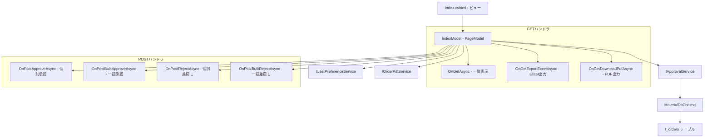
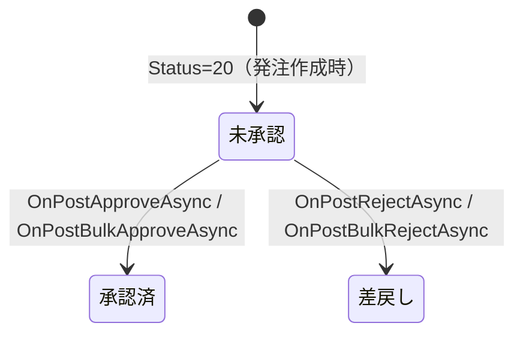

# 設計書: 発注承認ページ

## 概要

発注承認ページ（Approvals/Index）の技術設計。承認担当者がステータスフィルタで発注を絞り込み、個別・一括での承認/差戻し、Excelエクスポート、PDFダウンロードを行うRazor Pages画面。

対象ファイル:
- `MaterialModule/Areas/Material/Pages/Approvals/Index.cshtml` — ビュー（テーブル・フィルタ・一括操作UI）
- `MaterialModule/Areas/Material/Pages/Approvals/Index.cshtml.cs` — PageModel（ハンドラ・ソート・ページネーション）
- `MaterialModule/Services/IApprovalService.cs` — 承認サービスインターフェース
- `MaterialModule/Services/IOrderPdfService.cs` — PDF生成サービスインターフェース
- `MaterialModule/Models/Dtos/OrderListDto.cs` — 発注一覧DTO

設計方針:
- Razor Pages PageModelパターンに準拠（GET/POSTハンドラ分離）
- サービス層（IApprovalService）を介したビジネスロジック分離
- IUserPreferenceServiceによるユーザー別ページサイズ永続化
- ClosedXMLによるExcel生成
- 発注番号パース関数によるカスタムソート

## アーキテクチャ



### レイヤー構成

| レイヤー | 責務 |
|---------|------|
| ビュー (Index.cshtml) | UI表示、フォーム送信、JavaScript制御 |
| PageModel (IndexModel) | リクエスト処理、ソート、ページネーション、Excel生成 |
| サービス (IApprovalService) | 承認・差戻しビジネスロジック、データ取得 |
| サービス (IOrderPdfService) | PDF生成 |
| サービス (IUserPreferenceService) | ユーザー設定永続化 |

## コンポーネントとインターフェース

### 1. IndexModel（PageModel）

#### コンストラクタ依存性注入

```csharp
public class IndexModel(
    IApprovalService approvalService,
    IUserPreferenceService prefService,
    IOrderPdfService pdfService
) : PageModel
```

#### プロパティ

| プロパティ | 型 | 用途 |
|-----------|---|------|
| Orders | `List<OrderListDto>` | 現在ページの発注リスト |
| TotalOrderCount | `int` | フィルタ後の全件数 |
| PageSize | `int` | 1ページ表示件数（デフォルト10） |
| CurrentPage | `int` | 現在ページ番号（デフォルト1） |
| TotalPages | `int` (算出) | `Ceiling(TotalOrderCount / PageSize)` |
| Statuses | `List<SelectListItem>` | ステータスドロップダウン選択肢 |
| StatusFilter | `int?` | 選択中のステータス値（BindProperty, SupportsGet） |
| SelectedOrderIds | `List<int>` | 一括操作対象の発注ID（BindProperty） |
| SortBy | `string` | ソート列キー |
| SortDesc | `bool` | 降順フラグ（デフォルトtrue） |
| SuccessMessage | `string?` | 成功メッセージ |
| ErrorMessage | `string?` | エラーメッセージ |

#### GETハンドラ

##### OnGetAsync(sort, desc, pageNo, pageSize)

```csharp
public async Task OnGetAsync(string? sort, bool? desc, int? pageNo, int? pageSize)
```

処理フロー:
1. ソート・ページパラメータをプロパティに設定
2. ユーザーIDを`User.Identity.Name`から取得
3. pageSizeが有効値(10,20,30,50)の場合、`prefService.SetPageSizeAsync`で保存
4. それ以外は`prefService.GetPageSizeAsync`で既存設定を読み込み
5. `LoadStatuses()` でステータス選択肢を設定
6. `LoadOrdersAsync()` でデータ取得・ソート・ページング

##### OnGetExportExcelAsync()

```csharp
public async Task<IActionResult> OnGetExportExcelAsync()
```

処理フロー:
1. StatusFilterに応じて全件取得（ページネーション無視）
2. ClosedXMLでワークブック生成
3. ヘッダー行（太字、灰色背景）設定
4. データ行を順次書き込み
5. 列幅自動調整
6. MemoryStreamからbyte[]に変換してFileResult返却

##### OnGetDownloadPdfAsync(orderId)

```csharp
public async Task<IActionResult> OnGetDownloadPdfAsync(int orderId)
```

処理フロー:
1. `pdfService.GenerateOrderPdfAsync(orderId)` でPDFバイト配列取得
2. `pdfService.GetOrderNoAsync(orderId)` でファイル名用の発注番号取得
3. `File(pdf, "application/pdf", "{orderNo}.pdf")` で返却

#### POSTハンドラ

##### OnPostApproveAsync(orderId)

```csharp
public async Task<IActionResult> OnPostApproveAsync(int orderId)
```

- 成功時: `SuccessMessage = "承認しました。"`
- 失敗時: `ErrorMessage = ex.Message`（InvalidOperationException）
- 処理後: `LoadPageDataAsync()` で一覧再読み込み

##### OnPostBulkApproveAsync()

```csharp
public async Task<IActionResult> OnPostBulkApproveAsync()
```

- 未選択時: `ErrorMessage = "承認する発注を選択してください。"`
- 成功時: `SuccessMessage = "{count} 件の発注を承認しました。"`
- 失敗時: `ErrorMessage = ex.Message`

##### OnPostRejectAsync(orderId)

```csharp
public async Task<IActionResult> OnPostRejectAsync(int orderId)
```

- 成功時: `SuccessMessage = "差戻ししました。"`
- 失敗時: `ErrorMessage = ex.Message`

##### OnPostBulkRejectAsync()

```csharp
public async Task<IActionResult> OnPostBulkRejectAsync()
```

- 未選択時: `ErrorMessage = "差戻しする発注を選択してください。"`
- 各発注を個別に`RejectOrderAsync`で処理（ループ）
- 成功時: `SuccessMessage = "{count} 件を差戻ししました。"`
- 失敗時: `ErrorMessage = ex.Message`

#### プライベートメソッド

##### LoadOrdersAsync()

```csharp
private async Task LoadOrdersAsync()
```

処理フロー:
1. ユーザーのPageSize設定を取得
2. StatusFilterに応じてデータ取得:
   - 値あり(>0): `GetApprovalHistoryAsync(StatusFilter.Value)`
   - それ以外: `GetPendingApprovalsAsync()`
3. SortByに応じたソート適用（switch式）
4. デフォルトソート:
   - StatusFilter=30: OrderNo解析ソート（date降順→group昇順→seq昇順）
   - その他: OrderDate昇順→ItemName昇順
5. TotalOrderCount設定
6. CurrentPage境界チェック
7. Skip/Takeでページ分割

##### 発注番号パース関数

```csharp
private static string ExtractOrderNoDate(string? orderNo)
// "G201-260513-001-001" → "260513" (parts[1])

private static int ExtractOrderNoGroup(string? orderNo)
// "G201-260513-001-001" → 1 (int.Parse(parts[2]))

private static int ExtractOrderNoSeq(string? orderNo)
// "G201-260513-001-001" → 1 (int.Parse(parts[3]))
```

null/空文字の場合: date→""、group→0、seq→0

### 2. IApprovalService インターフェース

```csharp
public interface IApprovalService
{
    Task ApproveOrderAsync(int orderId, string approvedBy);
    Task ApproveOrdersAsync(List<int> orderIds, string approvedBy);
    Task RejectOrderAsync(int orderId, string approvedBy);
    Task<List<OrderListDto>> GetPendingApprovalsAsync();
    Task<List<OrderListDto>> GetApprovalHistoryAsync(int? status = null);
}
```

| メソッド | 責務 |
|---------|------|
| ApproveOrderAsync | 単一発注の承認（status 20→30） |
| ApproveOrdersAsync | 複数発注の一括承認 |
| RejectOrderAsync | 単一発注の差戻し（status 20→15） |
| GetPendingApprovalsAsync | 未承認(status=20)の発注一覧取得 |
| GetApprovalHistoryAsync | 指定ステータスの発注一覧取得 |

### 3. IOrderPdfService インターフェース

```csharp
public interface IOrderPdfService
{
    Task<byte[]> GenerateOrderPdfAsync(int orderId);
    Task<byte[]> GenerateGroupOrderPdfAsync(string orderNoGroup);
    Task<string> GetOrderNoAsync(int orderId);
}
```

### 4. IUserPreferenceService インターフェース

| メソッド | 用途 |
|---------|------|
| GetPageSizeAsync(userId, listKey) | 保存済みページサイズ取得 |
| SetPageSizeAsync(userId, listKey, pageSize) | ページサイズ保存 |

ListKey定数: `"Approvals_Index"`

### 5. ビュー構成 (Index.cshtml)

#### レイアウト構造

```
container-fluid
├── h2 "発注承認"
├── alert (success/error)
├── toolbar (status filter, bulk buttons, excel button)
├── card
│   ├── card-header (リスト名 + 件数 + pageSize selector)
│   └── card-body
│       ├── table (responsive, striped, hover)
│       │   ├── thead (column headers with sort links)
│       │   └── tbody (order rows)
│       └── pagination nav
└── scripts section
```

#### JavaScript制御

| 機能 | 実装 |
|------|------|
| 全選択チェックボックス | `#checkAll`のchange→全`.row-check`を同期 |
| 一括ボタン有効化 | チェック数>0で`#btnBulkApprove`/`#btnBulkReject`を有効化 |
| 差戻しフォームID転送 | `#bulkRejectForm`のsubmit時にチェック済みIDをhidden inputとして追加 |

## データモデル

### OrderListDto（レコード型）

```csharp
public record OrderListDto(
    int Id,
    string? OrderNo,
    string? OrderLineNo,
    DateOnly? OrderDate,
    string OrderType,          // "manual" | "provisional" | "auto"
    string ItemCode,
    string ItemName,
    decimal OrderQty,
    decimal? UnitContentQty,
    decimal? TotalQty,
    decimal? UnitPrice,
    decimal? Amount,
    string? SupplierName,
    string? DestinationName,
    DateOnly? DeliveryDate,
    int OrderStatus,           // 20=未承認, 30=承認済, 15=差戻し
    string? OrderStatusText,
    string? WarehouseName,
    int? OutputType,           // 0=エントリのみ, 1=印刷のみ, 2=FAXのみ, 3=印刷/FAX
    string? Remarks,
    string? UserName,
    string? UserLastName,
    DateTime? ApprovedAt,
    string? ApprovedBy,
    string? ApprovedByLastName,
    string? LotNo,
    DateOnly? ReceivedDate
)
{
    public decimal? AmountInThousands => Amount.HasValue
        ? Math.Round(Amount.Value / 1000, 1) : null;
}
```

### ステータス遷移



- **未承認→承認済**: Status=20→30、ApprovedAt=現在時刻、ApprovedBy=操作者
- **未承認→差戻し**: Status=20→15、ApprovedBy=操作者

### 発注番号フォーマット

```
{prefix}-{date}-{group}-{seq}
例: G201-260513-001-001

prefix: 発注区分コード（例: G201）
date:   和暦日付6桁（例: 260513 = 令和26年5月13日）
group:  グループ番号3桁（例: 001）
seq:    枝番3桁（例: 001）
```

### Excelエクスポート列定義

| 列番号 | ヘッダー | データソース | 書式 |
|--------|---------|-------------|------|
| 1 | No | 連番 | — |
| 2 | 発注番号 | OrderNo | — |
| 3 | 種別 | OrderType | 手動/仮発注/自動 |
| 4 | 品目コード | ItemCode | — |
| 5 | 品目名 | ItemName | — |
| 6 | 数量 | OrderQty | — |
| 7 | 単価 | UnitPrice | — |
| 8 | 金額(千円) | Amount | — |
| 9 | 起票日 | OrderDate | yyyy-MM-dd |
| 10 | 納期 | DeliveryDate | yyyy-MM-dd |
| 11 | 発注書送付先 | DestinationName | — |
| 12 | 倉庫名 | WarehouseName | — |
| 13 | 出力区分 | OutputType | 0/1/2/3→テキスト変換 |
| 14 | 発注者 | UserLastName | — |
| 15 | 承認日時 | ApprovedAt | yyyy-MM-dd HH:mm |
| 16 | 承認者 | ApprovedByLastName ?? ApprovedBy | — |

## エラーハンドリング

### 承認操作（Approve/BulkApprove）

| 条件 | 処理 |
|------|------|
| 正常完了（個別） | SuccessMessage = "承認しました。" |
| 正常完了（一括） | SuccessMessage = "{count} 件の発注を承認しました。" |
| 未選択（一括） | ErrorMessage = "承認する発注を選択してください。" |
| InvalidOperationException | ErrorMessage = ex.Message |

### 差戻し操作（Reject/BulkReject）

| 条件 | 処理 |
|------|------|
| 正常完了（個別） | SuccessMessage = "差戻ししました。" |
| 正常完了（一括） | SuccessMessage = "{count} 件を差戻ししました。" |
| 未選択（一括） | ErrorMessage = "差戻しする発注を選択してください。" |
| InvalidOperationException | ErrorMessage = ex.Message |

### ページネーション境界

| 条件 | 処理 |
|------|------|
| CurrentPage < 1 | CurrentPage = 1 に補正 |
| CurrentPage > TotalPages かつ TotalPages > 0 | CurrentPage = TotalPages に補正 |

### 発注番号パース

| 条件 | 処理 |
|------|------|
| OrderNoがnullまたは空 | date=""、group=0、seq=0を返却 |
| セグメント数不足 | 該当部分のデフォルト値を返却 |
| 数値変換失敗 | 0を返却 |

### UI表示

| 条件 | 処理 |
|------|------|
| 該当データなし | "該当する発注はありません。" をテーブル内に表示 |
| SuccessMessage設定あり | alert-success で表示（dismissible） |
| ErrorMessage設定あり | alert-danger で表示（dismissible） |

## テスト戦略

### PBT適用判断

発注番号パース関数（ExtractOrderNoDate/Group/Seq）はProperty-Based Testingの候補となりうるが、入力形式が固定的（ハイフン区切り4セグメント）であるため、通常の単体テストで十分にカバー可能。PBT対象外とする。

### 単体テスト

| テスト対象 | テスト内容 |
|-----------|-----------|
| OnPostApproveAsync - 正常系 | 承認成功→SuccessMessage設定 |
| OnPostApproveAsync - 異常系 | InvalidOperationException→ErrorMessage設定 |
| OnPostBulkApproveAsync - 正常系 | 複数件承認→件数付きSuccessMessage |
| OnPostBulkApproveAsync - 未選択 | 0件→ErrorMessage設定 |
| OnPostRejectAsync - 正常系 | 差戻し成功→SuccessMessage設定 |
| OnPostRejectAsync - 異常系 | InvalidOperationException→ErrorMessage設定 |
| OnPostBulkRejectAsync - 正常系 | 複数件差戻し→件数付きSuccessMessage |
| OnPostBulkRejectAsync - 未選択 | 0件→ErrorMessage設定 |
| LoadOrdersAsync - ソート | 各ソートキーで正しい順序 |
| LoadOrdersAsync - デフォルトソート(30) | OrderNoパースによる3段ソート |
| LoadOrdersAsync - デフォルトソート(20) | OrderDate→ItemName昇順 |
| LoadOrdersAsync - ページネーション | Skip/Takeが正しく適用される |
| ExtractOrderNoDate | 正常/null/セグメント不足 |
| ExtractOrderNoGroup | 正常/null/数値変換失敗 |
| ExtractOrderNoSeq | 正常/null/数値変換失敗 |
| OnGetExportExcelAsync | Excel生成・列数・ファイル名 |

### 結合テスト

| テスト対象 | テスト内容 |
|-----------|-----------|
| StatusFilter連携 | フィルタ変更→正しいサービスメソッド呼び出し |
| ソート+ページネーション | ソート後のページ分割が正しい |
| 一括操作+チェックボックス | 選択IDが正しくPOSTされる |
| Excel出力+StatusFilter | フィルタに応じた全件出力 |

### 手動テスト（UI確認）

| 確認項目 |
|---------|
| ステータスドロップダウンが正しく表示・動作する |
| 未承認時にチェックボックスと一括ボタンが表示される |
| 承認済/差戻し時にチェックボックスが非表示になる |
| 承認済時に発注番号列が表示される |
| ソートリンクのクリックで並び順が切り替わる |
| ページサイズ変更が保持される |
| Excelダウンロードが正しいファイル名で取得できる |
| 確認ダイアログが承認/差戻し時に表示される |
