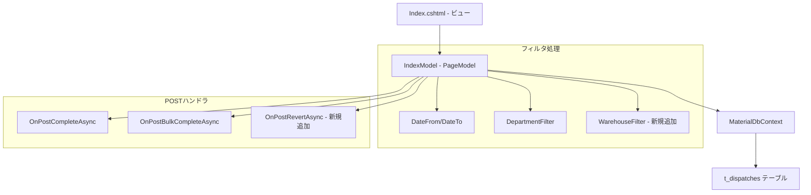
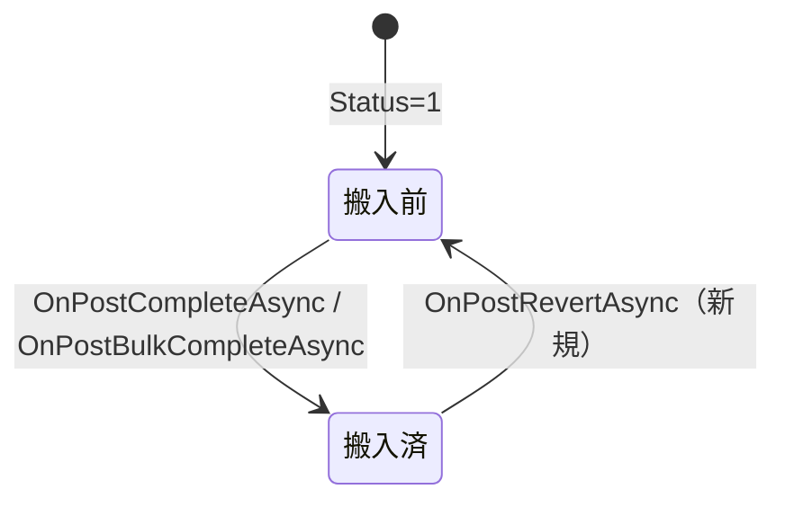

# 設計書: 出庫管理ページ改善

## 概要

出庫管理ページ（Delivery/Index）に対するUI/UX改善の技術設計。既存のRazor Pages構成を維持しつつ、文言変更・倉庫フィルタ追加・搬入済レコードの「戻す」機能を実装する。

変更対象ファイル:
- `MaterialModule/Areas/Material/Pages/Delivery/Index.cshtml` — ビュー（文言・フィルタUI・戻すボタン）
- `MaterialModule/Areas/Material/Pages/Delivery/Index.cshtml.cs` — PageModel（フィルタロジック・Revertハンドラ）

設計方針:
- 既存のDepartmentFilterパターンを踏襲し、WarehouseFilterを追加
- Receivingsページの`OnPostUnreceiveAsync`パターンを参考に「戻す」機能を実装
- 文言変更はビュー側のみの修正で、ロジック変更なし

## アーキテクチャ



変更は既存のPageModelアーキテクチャ内に収まり、新規サービスやミドルウェアの追加は不要。

## コンポーネントとインターフェース

### 1. IndexModel（PageModel）への追加

#### 新規プロパティ

```csharp
[BindProperty(SupportsGet = true)]
public string? WarehouseFilter { get; set; }

public List<string> Warehouses { get; set; } = [];
```

#### 新規メソッド

```csharp
// 搬入済→搬入前に戻す
public async Task<IActionResult> OnPostRevertAsync(int dispatchId)

// 倉庫リスト読み込み
private async Task LoadWarehousesAsync()
```

#### 既存メソッドの変更

| メソッド | 変更内容 |
|---------|---------|
| `OnGetAsync` | `LoadWarehousesAsync()`呼び出し追加 |
| `LoadItemsAsync` | WarehouseFilterによるWhere条件追加 |
| `OnPostCompleteAsync` | SuccessMessage文言変更 |
| `OnPostBulkCompleteAsync` | SuccessMessage文言変更 |

### 2. Index.cshtml（ビュー）への変更

| 箇所 | 現在 | 変更後 |
|------|------|--------|
| ViewData["Title"] | "運搬管理" | "出庫管理" |
| card-header | "運搬リスト" | "出庫リスト" |
| 列ヘッダー | "操作" | "搬入" |
| バッジ（Status=1） | "未完了" / bg-warning | "搬入前" / bg-warning |
| バッジ（Status=2） | "完了" / bg-success | "搬入済" / bg-success |
| 個別完了confirm | "運搬完了しますか？" | "搬入完了しますか？" |
| 一括完了confirm | "選択した項目を運搬完了しますか？" | "選択した項目を搬入完了しますか？" |
| 検索エリア | — | 倉庫ドロップダウン追加 |
| 操作列（Status=2） | 空欄 | 「戻す」ボタン追加 |

### 3. フィルタUI配置

検索フォーム内の「請求部門」ドロップダウンの後に「倉庫」ドロップダウンを配置:

```html
<div>
    <label class="form-label mb-0">倉庫</label>
    <select name="WarehouseFilter" class="form-select form-select-sm" style="width:auto;">
        <option value="">全倉庫</option>
        @foreach (var wh in Model.Warehouses)
        {
            <option value="@wh" selected="@(Model.WarehouseFilter == wh)">@wh</option>
        }
    </select>
</div>
```

### 4. 「戻す」ボタンUI

Status=2のレコードの操作列に表示:

```html
@if (isCompleted)
{
    <form method="post" asp-page-handler="Revert" style="display:inline;">
        <input type="hidden" name="dispatchId" value="@item.Id" />
        <input type="hidden" name="DateFrom" value="@Model.DateFrom?.ToString("yyyy-MM-dd")" />
        <input type="hidden" name="DateTo" value="@Model.DateTo?.ToString("yyyy-MM-dd")" />
        <input type="hidden" name="DepartmentFilter" value="@Model.DepartmentFilter" />
        <input type="hidden" name="WarehouseFilter" value="@Model.WarehouseFilter" />
        <button type="submit" class="btn btn-sm btn-outline-secondary"
                onclick="return confirm('搬入前に戻しますか？');">戻す</button>
    </form>
}
```

## データモデル

### TDispatch エンティティ（変更なし）

既存のTDispatchエンティティをそのまま使用。スキーマ変更は不要。

```
t_dispatches
├── id (PK, int, auto-increment)
├── dispatch_date (DateOnly, required)
├── item_id (FK → m_items.id)
├── dispatch_qty (decimal, required)
├── warehouse_code (string?, max 50)
├── warehouse_name (string?, max 50)
├── delivery_location (string?, max 50)
├── department_name (string?, max 80)
├── status (int, required) -- 1:搬入前, 2:搬入済
├── completed_at (DateTime?) -- 搬入完了日時
├── user_id (string, required)
├── created_at (DateTime, required)
└── updated_at (DateTime, required)
```

### ステータス遷移



- **搬入前→搬入済**: Status=1→2、CompletedAt=現在時刻、UpdatedAt=現在時刻
- **搬入済→搬入前**: Status=2→1、CompletedAt=null、UpdatedAt=現在時刻

## エラーハンドリング

### OnPostRevertAsync

| 条件 | 処理 |
|------|------|
| dispatchIdに該当するレコードが存在しない | ErrorMessage = "対象が見つからないか、戻せない状態です。" |
| 該当レコードのStatusが2以外 | ErrorMessage = "対象が見つからないか、戻せない状態です。" |
| DB例外発生 | ErrorMessage = ex.Message |
| 正常完了 | SuccessMessage = "搬入前に戻しました。" |

### OnPostCompleteAsync（文言変更のみ）

| 条件 | 変更後メッセージ |
|------|-----------------|
| 正常完了 | "搬入完了しました。" |

### OnPostBulkCompleteAsync（文言変更のみ）

| 条件 | 変更後メッセージ |
|------|-----------------|
| 正常完了 | "{count} 件を搬入完了しました。" |

### WarehouseFilter

- 値が空またはnullの場合: フィルタ条件を適用しない（全倉庫表示）
- 値がある場合: `d.WarehouseName == WarehouseFilter` で絞り込み

## テスト戦略

### PBT適用判断

本機能はProperty-Based Testingの対象外とする。理由:
- 要件1〜5はUI文言変更であり、テスト可能な入出力ロジックがない
- 要件3（倉庫フィルタ）は単純なクエリフィルタリングであり、CRUD操作に該当
- 要件6（戻す機能）は固定的なステータス遷移であり、入力の多様性がない

### 単体テスト

| テスト対象 | テスト内容 |
|-----------|-----------|
| `OnPostRevertAsync` - 正常系 | Status=2のレコードに対してRevert実行→Status=1、CompletedAt=null |
| `OnPostRevertAsync` - 異常系（存在しない） | 存在しないIDでRevert→ErrorMessage設定 |
| `OnPostRevertAsync` - 異常系（Status≠2） | Status=1のレコードでRevert→ErrorMessage設定 |
| `LoadItemsAsync` - WarehouseFilter適用 | WarehouseFilter設定時に該当倉庫のみ返却 |
| `LoadItemsAsync` - WarehouseFilter未設定 | WarehouseFilter空の場合に全レコード返却 |
| `LoadWarehousesAsync` | Status 1/2のレコードからdistinct WarehouseNameを取得 |
| `OnPostCompleteAsync` - メッセージ | 完了時に"搬入完了しました。"が設定される |
| `OnPostBulkCompleteAsync` - メッセージ | 一括完了時に"{count} 件を搬入完了しました。"が設定される |

### 結合テスト

| テスト対象 | テスト内容 |
|-----------|-----------|
| フィルタ連携 | WarehouseFilter + DepartmentFilter + 日付フィルタの組み合わせ |
| Revert後のフィルタ保持 | Revert実行後にDateFrom/DateTo/DepartmentFilter/WarehouseFilterが維持される |
| ページネーション連携 | WarehouseFilterがページ遷移時に保持される |

### 手動テスト（UI確認）

| 確認項目 |
|---------|
| ページタイトルが「出庫管理」と表示される |
| カードヘッダーが「出庫リスト（N件）」と表示される |
| 列ヘッダーが「搬入」と表示される |
| Status=1のバッジが「搬入前」（bg-warning）と表示される |
| Status=2のバッジが「搬入済」（bg-success）と表示される |
| 倉庫ドロップダウンが検索エリアに表示される |
| 倉庫選択時にリストが正しく絞り込まれる |
| Status=2のレコードに「戻す」ボタンが表示される |
| 「戻す」クリック時に確認ダイアログが表示される |
| 戻し成功後にステータスが「搬入前」に変わる |
