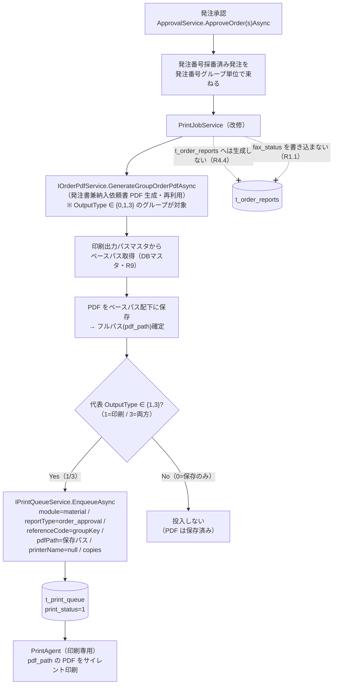

# Design Document

## Overview

本設計は **MaterialModule（資材モジュール）** における発注承認まわりの「送信（FAX）」と「印刷ジョブ投入」の整理、および資材固有の監視画面の廃止・導線更新を定義する。要件（requirements.md R1〜R9）に対応し、以下を **本 spec（投入側 = MaterialModule）が所有** する。

1. **二重FAX根絶（R1）**: 承認時に `t_order_reports.fax_status` へFAX用レコードを生成しない。FAXは新経路（`t_smtp_queue`／`DispatchEnqueueService`）に一本化する。
2. **印刷イメージ（PDF）生成の MaterialModule 所有（R8）**: 従来 PrintAgent が担っていた帳票レイアウト（QuestPDF）生成を投入側へ移管する。既存の `OrderPdfService` を **再利用** する。
3. **PrintJobService の投入先変更（R4）**: 承認済み発注の印刷ジョブについて、PDF を生成・保存し、そのフルパス（`pdf_path`、必須・非空）を付与して共通プリントキュー `t_print_queue`（db_common_dev）へ `IPrintQueueService.EnqueueAsync` 経由で投入する。`t_order_reports` へは生成しない。`print_payload` は用いない。
4. **PDF保存先パスのマスタ管理（R9）**: 印刷出力（PDF）の保存先ベースパスを db_material_dev の DB マスタで管理し、コード変更なしに変更可能とする。
5. **旧監視画面の廃止・導線更新（R2/R3/R5）**: Material_SmtpMonitor（旧FAX監視）と Material_PrintMonitor（旧印刷監視）を廃止し、導線を CommonModule の `/Common/SmtpMonitor`・`/Common/PrintMonitor` へ更新する。

### 依存関係（print-platform 契約）

本 spec は共通プリント基盤 spec `print-platform`（CommonModule 所有）に **依存** する。契約の発生元は `print-platform` であり、本 spec は重複する受入基準を持たず、以下を **契約として参照** する。

- **`t_print_queue` スキーマ契約（db_common_dev）**: `pdf_path` は **必須（NOT NULL）** であり PrintAgent の唯一の印刷ソース。`print_payload` 列は持たない。`fax_status` 列は持たない。`row_version`（`[Timestamp]`）で楽観ロック。（`print-platform` R1〜R3 / D1・D6 所有）
- **投入インターフェース契約 `IPrintQueueService.EnqueueAsync`**（CommonModule 所有・実装済み）:

  ```csharp
  Task<int> EnqueueAsync(
      string module,        // 投入元モジュール識別子（本 spec では "material"）＝必須
      string reportType,    // 帳票種別コード＝必須
      string referenceCode, // 参照コード（発注番号グループ等）＝必須
      string pdfPath,       // 生成済みPDFフルパス（投入側=MaterialModuleが生成・保存）＝必須（非空）
      string? printerName,  // プリンタ名（NULL可＝既定プリンタ）
      int copies,           // 部数（1未満は1に正規化）
      CancellationToken ct = default);   // → 投入されたジョブの id を返す
  ```

  `outputType`（出力区分）は投入側 = MaterialModule 固有のパラメータであり、**`EnqueueAsync` の引数ではない**。印刷キュー投入の要否は MaterialModule 側で `OutputType ∈ {1,3}` の判定により決定し（後述）、`t_print_queue` は出力区分を保持しない（`print-platform` 改定契約）。

  投入時、CommonModule 側で `print_status = 1`（待機）で 1 件 INSERT され、`created_at == updated_at = UtcNow`、必須項目（`module`/`reportType`/`referenceCode`/`pdfPath`）が空白なら `ArgumentException`。（`print-platform` R4 / D2 所有）
- **PrintAgent は印刷専用（PRINT-ONLY）**: `pdf_path` の PDF をサイレント印刷するのみで PDF を生成しない。（`print-platform` R5 / D4・D6 所有）
- **Common_PrintMonitor（`/Common/PrintMonitor`）・Common_SmtpMonitor（`/Common/SmtpMonitor`）** の設置・実装。（`print-platform` R8〜R10 所有／SMTP は order-approval-fax-mail・CommonModule 所有）
- **カットオーバー手順（切替順序・移行）**: 本 spec の投入先切替は `print-platform` R11 の「③投入先切替」ステップとして、当該手順に従って実施する。

### スコープ境界（本 spec が所有 / 所有しない）

| 項目 | 所有 |
|---|---|
| FAX一本化（承認時 fax_status 非書込）（R1） | **本 spec** |
| 印刷イメージ（PDF）生成の実装（R8） | **本 spec**（`OrderPdfService` 再利用） |
| PrintJobService の投入先変更（PDF生成→保存→pdf_path付与→`t_print_queue`投入）（R4） | **本 spec** |
| PDF保存先パスマスタ（db_material_dev）（R9） | **本 spec** |
| Material_SmtpMonitor 廃止・fax_status 参照除去（R2/R3） | **本 spec** |
| Material_PrintMonitor 廃止・導線を `/Common/PrintMonitor` へ更新（R5） | **本 spec** |
| `t_print_queue` スキーマ契約・DDL・既存データ移行 | print-platform |
| `IPrintQueueService`/`PrintQueueService`（CommonModule 側受け口） | print-platform |
| PrintAgent 読取先変更・印刷専用化 | print-platform |
| Common_PrintMonitor / Common_SmtpMonitor の設置・実装・スタイル | print-platform / order-approval-fax-mail |
| カットオーバー手順・切替順序の定義 | print-platform |
| MainWeb・AuthModule の変更（参照のみ） | 対象外（immutable） |

### 準拠基準

- 基幹システム構築基準（`\\ojiadm23120073\Labs\sdoc\基幹システム構築基準.md`）に準拠する。
- DB命名規則（`\\ojiadm23120073\Labs\sdoc\命名規則(db).xlsx`）に準拠する。MaterialModule 命名規則（`m_`/`t_`、snake_case、`row_version`＋`created_at`/`updated_at`、監査列 `created_by`/`updated_by` は持たない）に従う。
- 新規マスタには `row_version`（`[Timestamp]`）を付与（プロジェクトルール「排他制御・同時接続対応」）。
- 時刻は JST（Tokyo Standard Time）で扱う（MaterialModule 規約）。既存 `PrintJobService`/`ApprovalService` の JST 保存方針を踏襲する。
- ページのフォントサイズ規約（`_MaterialStyles`・`material-page`・`0.8rem` 等）に準拠（Material 側に残るページのみ）。
- 成果物は `.kiro/specs/MaterialModule/dispatch-monitoring-consolidation/` に単一正本として配置する（モジュール別コピーは持たない）。

## Architecture

### 位置づけ（SMTP送信基盤とのパリティ）

印刷ジョブ投入は、既に実装済みの FAX 送信投入（`DispatchEnqueueService` → `ISmtpQueueService` → `t_smtp_queue`）と **一対一で対応** する設計とする。両者はいずれも「発注番号グループ単位で束ね、PDF を生成・保存し、そのフルパスを付与して CommonModule の投入サービス経由で共通キューへ投入する」という同一パターンをとる。

| 観点 | FAX 送信（既存・order-approval-fax-mail） | 印刷投入（本 spec） |
|---|---|---|
| 投入サービス | `DispatchEnqueueService`（MaterialModule） | `PrintJobService`（MaterialModule・改修） |
| CommonModule 受け口 | `ISmtpQueueService.EnqueueAsync` | `IPrintQueueService.EnqueueAsync` |
| 共通キュー | `t_smtp_queue`（db_common_dev） | `t_print_queue`（db_common_dev） |
| PDF 生成 | `IOrderPdfService.GenerateGroupOrderPdfAsync` | 同左（**再利用**） |
| PDF 保存先 | `FaxDispatchOptions.PdfShareRoot`（設定値） | **印刷出力パスマスタ**（DBマスタ・R9） |
| ワーカー | SmtpAgent | PrintAgent（印刷専用） |
| `module` 値 | `"material"` | `"material"` |

### 承認 → 印刷 フロー（本 spec の主フロー）



FAX 経路（既存・`DispatchEnqueueService`）は本フローと独立して並走し、`t_smtp_queue` へ投入する。承認時に印刷投入・FAX投入の双方が呼ばれるが、**旧 `t_order_reports`（fax_status/print_status/print_payload）は一切使用しない**。

### レイヤ責務と境界

- **投入トリガ**: `ApprovalService.ApproveOrderAsync` / `ApproveOrdersAsync`。承認・採番後に `PrintJobService` と `DispatchEnqueueService` を呼び出す（既存の呼び出し構造を踏襲。シグネチャは不変）。
- **印刷投入（本 spec）**: `PrintJobService`（改修）が PDF 生成・保存・`pdf_path` 付き投入を担う。`t_print_queue` への書込は必ず `IPrintQueueService` 経由（直接アクセスしない。SMTP パターンと同一）。
- **PDF 生成（本 spec）**: `IOrderPdfService`（既存・再利用）。帳票レイアウト（QuestPDF）を MaterialModule が所有する（R8.4）。
- **保存先解決（本 spec）**: 印刷出力パスマスタ（db_material_dev・`MaterialDbContext`）から実行時にベースパスを取得（R9）。
- **共通キュー（db_common_dev）**: `t_print_queue`。スキーマ契約は `print-platform` 所有。
- **印刷処理（PrintAgent）**: 印刷専用。`print-platform` 所有。本 spec は対象外。

### モジュール参照・DI（確認事項）

- `MaterialModule.csproj` は既に `CommonModule.csproj` を `ProjectReference` 済み（FAX 一本化 = order-approval-fax-mail で追加済み）。**追加のプロジェクト参照は不要**。
- `IPrintQueueService`/`PrintQueueService` は `CommonModuleExtensions.AddCommonModule` で **Scoped 登録済み**（`ISmtpQueueService` と対）。ホスト（MainWeb ModuleRegistration）が `AddCommonModule` を呼ぶことで、既存の `ISmtpQueueService` と同様に `PrintJobService` へ DI 注入できる。**MainWeb への変更は不要**（R4.8・R7.1）。
- 本 spec の DI 変更は `MaterialModuleExtensions.AddMaterialModule` 内で完結する（印刷出力パスマスタ読取サービスの登録のみ）。

## Components and Interfaces

### 1. `PrintJobService`（改修・MaterialModule/Services/PrintJobService.cs）

現状（方式X）: 発注番号グループ単位で `PrintPayload`(JSON) を組み立て、`t_order_reports` に `PrintStatus=1`・`FaxStatus=anyFax?1:0` のレコードを INSERT している。

改修後（本 spec）: グループ単位で PDF を生成・保存し、`pdf_path` を付与して `t_print_queue` へ投入する。`t_order_reports` は生成せず、`fax_status`・`print_payload` を扱わない。

- **公開インターフェース `IPrintJobService`**: メソッド `Task<int> CreateOrderApprovalJobsAsync(List<TOrder> orders)` の **シグネチャは維持**（呼び出し元 `ApprovalService` を変更しないため）。戻り値の意味を「投入した `t_print_queue` ジョブ件数」に読み替える。XMLコメント・実装を刷新する。
- **依存注入（改修後）**: `MaterialDbContext`（採番済み判定・注記取得の既存利用）, `IOrderPdfService`（PDF 生成・再利用）, `IMasterService`（既存利用）, `IPrintQueueService`（CommonModule・新規注入）, `IPrintOutputPathService`（保存先ベースパス取得・新規）, `ILogger<PrintJobService>`（グループ単位の失敗局所化ログ）。
- **`OutputType` の意味（MaterialModule 側の出力区分・投入判定に使用）**: `0 = PDF保存のみ`（キュー投入なし）／`1 = 印刷キュー投入`／`2 = FAXキュー投入`／`3 = 両方（印刷＋FAX）`。**印刷キュー投入ゲート = `OutputType ∈ {1,3}`**。この判定は MaterialModule 側で行い、`EnqueueAsync` へ `outputType` を渡さない（`t_print_queue` は出力区分を保持しない）。
- **処理手順（グループ単位。`DispatchEnqueueService` と同型）**:
  1. `OrderNo` 採番済み（非null・非空）の発注のみ対象にする（既存 `ExtractGroupKey` 規則を踏襲）。
  2. 発注番号の先頭3セグメント（プラント-日付-グループ番号）でグループ化する。
  3. 各グループについて `try/catch` で局所化（1グループの失敗が他へ波及しない・承認処理へ例外を伝播させない。既存 FAX 投入と同方針）。
  4. 印刷経路が担う出力区分（`OutputType ∈ {0,1,3}`）のグループについて、`IOrderPdfService.GenerateGroupOrderPdfAsync(groupKey)` で発注書兼納入依頼書 PDF（byte[]）を生成する（**再利用**）。`OutputType = 2`（FAXのみ）は FAX 経路が PDF 生成・保存を担うため、PrintJobService は PDF 生成も投入も行わない（二重生成回避。「二重生成の回避」参照）。
  5. `IPrintOutputPathService.GetBasePathAsync()` で保存先ベースパスを取得し、`Directory.CreateDirectory` 後に `Path.Combine(basePath, fileName)` へ保存（`File.WriteAllBytesAsync`）。`fileName` は後述の命名規則（reference_code 埋め込み）。
  6. **印刷キュー投入ゲート**: グループ代表（先頭）の `OutputType ?? 0` が `∈ {1,3}` の場合のみ `IPrintQueueService.EnqueueAsync("material", "order_approval", groupKey, fullPath, printerName: null, copies: 1)` を呼び出す（`outputType` 引数は渡さない）。`OutputType = 0`（保存のみ）のグループは PDF 保存済みだが **印刷キューへは投入しない**。
  7. 投入件数をカウントして返す。
- **禁止事項（本 spec の中核）**: `context.OrderReports.Add(...)` を行わない（R4.4）。`FaxStatus` を設定しない（R1.1）。`PrintPayload`（JSON）を組み立てない・投入しない（R4.5・D6）。
- **`ExtractGroupKey`**: 既存の private 実装を維持（`DispatchEnqueueService.ExtractGroupKey` と同一規則）。テスト容易性のため純粋メソッドとして切り出す（`internal static`）。

> 投入経路の決定（R4.6）: **`IPrintQueueService` 経由**を採用する（直接 `t_print_queue` アクセスは採らない）。理由: (a) 既存 FAX 投入（`ISmtpQueueService`）と作法が一致し保守性が高い、(b) 投入時の必須検証・`print_status=1` 初期化・UTC タイムスタンプ・列マッピングが CommonModule に一元化され Producer 間差異を防げる、(c) `print-platform` が `t_print_queue` 直接書込を投入サービス経由に限定する契約（D2）に整合する。

#### 二重生成の回避（PDF生成責務の分担・重要な設計判断）

印刷経路（`PrintJobService`）と FAX 経路（`DispatchEnqueueService`）はいずれも同一グループの発注書兼納入依頼書 PDF を生成しうるため、`OutputType` に基づいて **PDF 生成・保存の責務を排他分担** し、同一グループの PDF を二重生成・二重保存しないことを不変条件とする（R8.2）。

- **PrintJobService（印刷経路）は `OutputType ∈ {0,1,3}` のグループについて PDF を生成・保存する**:
  - `OutputType = 0`（保存のみ）: PDF 生成・保存のみ行い、印刷キューへは投入しない。
  - `OutputType = 1`（印刷）／`OutputType = 3`（両方）: PDF 生成・保存に加え、`t_print_queue` へ投入する。
- **`OutputType = 2`（FAXのみ）は FAX 経路（`DispatchEnqueueService`）が PDF 生成・保存・`t_smtp_queue` 投入を担う**。したがって PrintJobService は `OutputType = 2` について **PDF 生成も印刷投入も行わない**（二重生成回避）。
- 両経路とも **同一の印刷出力パスマスタ（`m_print_output_path`）由来ベースパス**に保存する（保存先の一貫性）。FAX 経路の既存保存先（`FaxDispatchOptions.PdfShareRoot`）とマスタ値は現行一致（R9.3 既定値）だが、保存先の単一真実源はマスタとする。
- **不変条件**: いかなるグループの PDF も二重生成されず、印刷キュー投入は `OutputType ∈ {1,3}` のグループに限り発生する。`OutputType = 3`（両方）のグループは、印刷経路（保存＋印刷投入）と FAX 経路（FAX投入）がそれぞれの関心事を担うが、PDF 保存自体は印刷経路が担い FAX 経路は保存済み PDF を参照する運用に揃える（保存の一元化。実装時に FAX 経路の生成条件と突き合わせて重複保存を排除する）。

### 2. `IOrderPdfService` / `OrderPdfService`（再利用・変更なし想定）

- 既存 `GenerateGroupOrderPdfAsync(string orderNoGroup)` を **そのまま再利用** する（発注書兼納入依頼書・グループ単位1ページ・最大20明細・QRコード・承認印・左余白40mm・明細9pt）。この帳票レイアウトは MaterialModule が所有し、退役する PrintAgent の `Documents`（order_approval 相当）を重複実装しない（R8.1〜R8.4）。
- 3帳票（発注書兼納入依頼書 / 工場入れ請求 / 入庫伝票）のレイアウト所有は MaterialModule に帰属する（R8.2）。現状の生成実装状況は「Data Models / 帳票の所有と再利用」を参照。

### 3. `IPrintOutputPathService` / `PrintOutputPathService`（新規・MaterialModule/Services）

印刷出力パスマスタ（R9）を読み取り、有効なベースパスを返す public interface + internal 実装（DemoModule パターン）。

```csharp
public interface IPrintOutputPathService
{
    /// <summary>印刷出力(PDF)の保存先ベースパスを取得する。有効行が無い場合は既定値へフォールバック。</summary>
    Task<string> GetBasePathAsync(CancellationToken ct = default);
}
```

- `MaterialDbContext` を注入し、`m_print_output_path` の有効行（`is_active = true`）を1件取得してベースパスを返す。
- 実行時（PDF 保存直前）に毎回取得する（キャッシュしない）ことで、マスタ値の変更がコード変更・再起動なしに反映される（R9.2）。
- 有効行が存在しない場合のフォールバック既定値は `\\ojiadm23120073\app_share\PrintAgent`（R9.3。運用上は必ずシードする前提だが、堅牢性のため既定値を持つ）。
- 参照のみ（本サービスはマスタを更新しない）。マスタ編集 UI は本 spec のスコープ外（必要なら別途 MasterMaintenance で対応）。
- `Path.Combine(basePath, fileName)` によるフルパス構築は純粋メソッド `BuildFullPath(basePath, fileName)`（`internal static`）として切り出し、テスト容易性を確保する。

### 4. `ApprovalService`（呼び出し元・変更なし）

`ApproveOrderAsync` / `ApproveOrdersAsync` は既存のまま `_printJobService.CreateOrderApprovalJobsAsync(...)` を呼ぶ。`IPrintJobService` のシグネチャを維持するため **呼び出し側の改修は不要**。FAX 投入（`_dispatchEnqueueService.EnqueueOrderApprovalFaxAsync`）も既存のまま並走する。

### 5. 廃止対象ページ

- **Material_SmtpMonitor**（`Areas/Material/Pages/SmtpMonitor/Index.cshtml(.cs)`）: 削除（R3.1）。当該ページは `t_order_reports.fax_status`・`fax_error_message`・`fax_at` を参照しており、廃止に伴い MaterialModule から不要になった `fax_status` 系参照コードを除去する（R3.3）。旧名残の `FaxMonitor/` フォルダが存在する場合は併せて整理する。
- **Material_PrintMonitor**（`Areas/Material/Pages/PrintMonitor/Index.cshtml(.cs)`）: 削除（R5.1）。当該ページは `t_order_reports.print_status`・`PrintAgentControls`・`PrintPayload` を参照しており、廃止に伴い不要になった `print_status` 系参照コードを除去する（R5.3）。

### 6. 導線（ナビゲーション）の更新

- ナビゲーションは MainWeb（immutable）が `DbPermissionCheck` 認可のもと **Auth DB（`dbAuthTest`）の `m_content` / `r_content_auth`** に登録されたコンテンツから動的生成する（`register_smtp_monitor_content.sql` で確認済み。`area`/`page`/`label`/`group`/`sort_order`/`is_visible` を保持）。MaterialModule のコードにハードコードされたメニューリンクは存在しない。
- したがって導線の除去・更新は **`m_content` マスタのデータ操作**（Auth DB・ユーザー実施）で行う（R3.2・R5.2）:
  - `area='Material' AND page='SmtpMonitor/Index'` の `m_content` 行と関連 `r_content_auth` を除去。FAX 監視の導線は Common_SmtpMonitor（`/Common/SmtpMonitor`）へ集約（R2.2）。
  - `area='Material' AND page='PrintMonitor/Index'` の `m_content` 行と関連 `r_content_auth` を除去し、印刷監視の導線を Common_PrintMonitor（`/Common/PrintMonitor`）へ更新（R5.2）。
- 本 spec は当該解除 SQL を `MaterialModule/docs/sql/`（`register_smtp_monitor_content.sql` と対の「解除 SQL」）に用意し、実行はユーザー側とする。MainWeb・AuthModule のソースは変更しない（R7.1）。`/Common/*` ページの `m_content` 登録は CommonModule 側 spec（print-platform / order-approval-fax-mail）が所有する。

## Data Models

### 帳票の所有と再利用（R8）

| 帳票 | report_type | 現状の生成実装 | 本 spec での扱い |
|---|---|---|---|
| 発注書兼納入依頼書 | `order_approval` | `OrderPdfService.GenerateGroupOrderPdfAsync`（グループ単位・QR・承認印・注記。JobQueue で稼働中の印刷用「正」レイアウト） | **再利用**。承認時の印刷投入 PDF ソースとして使用（R8.1〜R8.4） |
| 入庫伝票 | `receiving_slip` | `Receivings/Index.cshtml.cs` インライン QuestPDF（ダウンロード方式・日付+倉庫グループ・印枠） | 生成実装は既存（ダウンロード）。レイアウト所有は MaterialModule。**現状キュー投入対象ではない**（下記注記） |
| 工場入れ請求（出庫伝票） | `factory_invoice` | `Dispatches/Index.cshtml.cs` の `GenerateDispatchPdf`（ダウンロード方式） | 生成実装は既存（ダウンロード）。レイアウト所有は MaterialModule。**現状キュー投入対象ではない**（下記注記） |

> **調査結果（帳票レイアウトの所在）**: 退役した PrintAgent の `Documents/`（`OrderApprovalDocument`/`ReceivingSlipDocument`/`FactoryInvoiceDocument`）は印刷専用化に伴い削除済みで、現行 PrintAgent には存在しない。一方 MaterialModule 側には 3 帳票いずれも QuestPDF 生成ロジックが **既に存在** する（order_approval は `OrderPdfService`、receiving_slip は Receivings ページ、factory_invoice は Dispatches ページ）。よって R8 の「PDF生成移管」は新規レイアウト作成ではなく、**既存資産の再利用**で満たせる。PrintAgent の旧 `ReceivingSlipDocument`/`FactoryInvoiceDocument` は本番レイアウト未完成のまま退役しており、移植すべき完成レイアウトは無い。

> **キュー投入対象の範囲（重要・要確認）**: 現行 `PrintJobService` が `t_print_queue`（旧 `t_order_reports`）へ投入するのは **`order_approval`（発注書兼納入依頼書）のみ** である。`receiving_slip` はユーザー操作によるオンデマンドPDFダウンロード（キュー非経由）、`factory_invoice` も同様にページからのダウンロード出力である。PrintAgent は印刷専用化されるため、「キューに `print_status=1` で積まれる帳票」だけが投入側PDF生成を必要とする。したがって本 spec のキュー印刷のために新規生成が必須なのは **`order_approval` のみ**（既存 `OrderPdfService` を再利用）であり、追加の QuestPDF レイアウト実装は不要と判断する。`receiving_slip`/`factory_invoice` を将来キュー印刷対象にするかは運用判断（→「Open Decisions」）。

### `m_print_output_path`（新規・db_material_dev・R9）

印刷出力（PDF）の保存先ベースパスを保持するマスタ。Web 側（書込）と PrintAgent（読取）の双方から到達可能な UNC/共有パスを保持する（R9.4）。1行運用を基本とするが、履歴・切替のため複数行＋`is_active` フラグで有効行を選択する構成とする。

| 論理名 | 列名 | 型 | NULL | 既定 | 備考 |
|---|---|---|---|---|---|
| ID | `id` | int IDENTITY(1,1) | NOT NULL | — | 主キー（PK） |
| 保存先ベースパス | `base_path` | nvarchar(500) | NOT NULL | — | 印刷出力PDFの保存先ベースパス（UNC等）。現行値 `\\ojiadm23120073\app_share\PrintAgent`（R9.3） |
| 説明 | `description` | nvarchar(200) | NULL | — | 用途・移行メモ等 |
| 有効フラグ | `is_active` | bit | NOT NULL | 1 | 有効な保存先を1件選択（複数行運用時は最新有効行を使用） |
| 行バージョン | `row_version` | rowversion | NOT NULL | — | 楽観ロック（`[Timestamp]`、自動採番）（プロジェクトルール） |
| 作成日時 | `created_at` | datetime2 | NOT NULL | — | 作成日時 |
| 更新日時 | `updated_at` | datetime2 | NOT NULL | — | 更新日時 |

**制約・シード**:
- PK: `id`。
- 有効行選択: `is_active = 1` の行のうち `id` 最大（または `updated_at` 最新）を採用（アプリ層で保証）。
- シード（初期データ・ユーザー適用）: `base_path = '\\ojiadm23120073\app_share\PrintAgent'`, `is_active = 1`（R9.3。既存 `FaxDispatchOptions.PdfShareRoot` の既定値と一致）。
- 監査列は MaterialModule 規約に従い `created_at`/`updated_at` のみ（`created_by`/`updated_by` は持たない）。

> **保存先の到達性（R9.4）**: PrintAgent は `m_print_output_path` を参照せず、`t_print_queue.pdf_path`（解決済みフルパス）を直接読む。マスタ参照は MaterialModule（書込側）でのみ完結し、`base_path` が指す共有フォルダは MaterialModule（PDF書込）と PrintAgent（PDF読取・印刷）双方から到達可能である必要がある。

> DDL の実適用はユーザーが db_material_dev に対して実施する（実 SQL は tasks フェーズで別ファイル化）。DB スキーマ変更のためプロジェクトルールに従い `.kiro/docs/db/テーブル定義書.md`・`.kiro/docs/db/ER図.md` の更新を tasks に含める。

### エンティティ `MPrintOutputPath`（新規・MaterialModule/Data/Entities）

`m_print_output_path` へマッピングする EF Core エンティティ。既存 MaterialModule エンティティ作法（`[Table]`/`[Column("snake_case", TypeName=...)]`/`[Key]`/`[DatabaseGenerated(Identity)]`/`[Timestamp]`）に従う。`MaterialDbContext` に `DbSet<MPrintOutputPath> PrintOutputPaths` を追加する。

| プロパティ | 列 | 型 | 備考 |
|---|---|---|---|
| `Id` | `id` | int | `[Key]` `[DatabaseGenerated(Identity)]` |
| `BasePath` | `base_path` | string | `[Required]` `[MaxLength(500)]` |
| `Description` | `description` | string? | `[MaxLength(200)]` |
| `IsActive` | `is_active` | bool | 既定 true |
| `RowVersion` | `row_version` | byte[] | `[Timestamp]` |
| `CreatedAt` | `created_at` | DateTime | `[Required]` |
| `UpdatedAt` | `updated_at` | DateTime | `[Required]` |

### PDFファイル名の命名規則（reference_code ベース）

保存ファイル名は参照コード（発注番号グループ）を埋め込み、衝突回避のため生成時刻を付与する。既存 `DispatchEnqueueService.BuildPdfFileName`（`order_{groupKey}_{yyyyMMddHHmmssfff}.pdf`）と同型の純粋メソッドとして実装する。

- 形式: `{reportType}_{referenceCode}_{yyyyMMddHHmmssfff}.pdf`（例: `order_approval_G201-260515-001_20260515101530123.pdf`）。
- フルパス: `Path.Combine(basePath, fileName)`。`basePath` は印刷出力パスマスタから取得（R9）。
- `referenceCode`（発注番号グループ）はファイル名に必ず含める（追跡性・監視画面のキーワード検索と整合）。

### `t_order_reports` の扱い（本 spec）

- 本 spec 以降、`t_order_reports` は **印刷ジョブの投入先・読取先として使用しない**（R4.4）。承認時に新規レコードを生成しない。
- 既存データ（旧 print_status / fax_status / print_payload）は削除しない（`print-platform` カットオーバーの移行・保全対象。ユーザー運用判断）。
- Material_SmtpMonitor / Material_PrintMonitor の廃止（R3/R5）に伴い、`t_order_reports` を参照していた資材側の監視コードを除去する。エンティティ `TOrderReport` 自体の削除可否は移行・保全期間に依存するため本 spec では削除しない（参照コードの除去に留める。→「Open Decisions」）。

### `t_print_queue` への投入列対応（db_common_dev・print-platform 所有・参照）

`PrintJobService` → `IPrintQueueService.EnqueueAsync` の引数と `t_print_queue` 列の対応（契約の再掲・参照のみ）。

| EnqueueAsync 引数 | `t_print_queue` 列 | 本 spec が設定する値 |
|---|---|---|
| `module` | `module` | `"material"` |
| `reportType` | `report_type` | `"order_approval"` |
| `referenceCode` | `reference_code` | 発注番号グループキー（`ExtractGroupKey`） |
| `pdfPath` | `pdf_path` | ベースパス + ファイル名（必須・非空） |
| `printerName` | `printer_name` | `null`（既定プリンタ） |
| `copies` | `copies` | `1` |
| （サービス内部） | `print_status` | `1`（待機・CommonModule が設定） |

> `output_type` 列は `t_print_queue` に存在しない（`print-platform` 改定契約）。印刷投入の要否は投入前に MaterialModule 側で `OutputType ∈ {1,3}` により判定するため、キューへ出力区分を持ち込まない。`EnqueueAsync` の引数にも `outputType` は含めない。

## Correctness Properties

*プロパティとは、システムのすべての妥当な実行にわたって成り立つべき特性・振る舞いであり、システムが何をすべきかについての形式的な言明である。プロパティは人間可読な仕様と機械検証可能な正しさ保証の橋渡しとなる。*

本 spec の Property-Based Testing 対象は **MaterialModule 投入側の純粋ロジック**に限定する。具体的には `PrintJobService` の投入オーケストレーション（`IPrintQueueService` をスパイ／フェイクに差し替え、`IOrderPdfService` をフェイク、`IPrintOutputPathService` をフェイク、`MaterialDbContext` を InMemory とした状態）と、発注番号グループ化（`ExtractGroupKey`）・ファイル名構築（`BuildPdfFileName`）・フルパス構築（`BuildFullPath`）の純粋メソッドである。いずれもモック／InMemory で 100 回以上反復検証できる。

一方、UI スタイル（R6）・画面削除（R3.1/R5.1）・導線（`m_content` データ操作, R3.2/R5.2）・不要コード撤去（R3.3/R5.3）・PrintAgent の実印刷（R8.5）・共有フォルダ到達性（R9.4）・カットオーバー（R4.7）・モジュール境界遵守（R7）は、スモーク／例示／手動・レビューで扱う（「Testing Strategy」参照）。`IPrintQueueService` の投入時挙動（`print_status=1` 初期化・必須空白 `ArgumentException`）自体は `print-platform` が所有・検証済みであり、本 spec は「契約を満たす引数で必ず経由する」ことを検証する。

### Property 1: 投入経路は t_order_reports を一切変更しない（FAX非書込・印刷レコード非生成）

*任意の* 承認済み発注集合（採番済み／未採番の混在、任意の `OutputType`・任意のグループ構成）に対して、`PrintJobService.CreateOrderApprovalJobsAsync` を実行したとき、`t_order_reports`（`fax_status`・`print_status`・`print_payload` を含む）への行の追加・更新は **一切発生しない**。副作用は PDF 生成・保存と `IPrintQueueService.EnqueueAsync` 呼び出しに限られる。

**Validates: Requirements 1.1, 4.4**

### Property 2: 印刷対象グループのみ契約準拠の投入が1回行われる（OutputType ゲート）

*任意の* 承認済み発注集合（採番済み／未採番の混在、任意の `OutputType`・任意のグループ構成）に対して、`PrintJobService` は `OrderNo` 採番済み（非空）の発注のみを対象とし、発注番号グループ（`ExtractGroupKey` による先頭3セグメント）のうち **代表 `OutputType ∈ {1,3}` のグループ 1つにつき `IPrintQueueService.EnqueueAsync` をちょうど1回** 呼び出す。代表 `OutputType ∈ {0,2}` のグループは印刷キューへの投入を **0回**（発生させない）。各投入呼び出しの引数は投入契約を満たす（`module == "material"`、`reportType == "order_approval"`、`referenceCode == ExtractGroupKey(該当OrderNo)` かつ非空、`pdfPath` が非空、`copies >= 1`）。呼び出し引数に `outputType` は含まれない。未採番（`OrderNo` が空）の発注はいずれのグループにも寄与せず、投入を発生させない。

**Validates: Requirements 4.1, 4.5, 8.1**

### Property 3: pdf_path はマスタ由来ベースパスと参照コード埋め込みファイル名から解決され非空である

*任意の* 保存先ベースパス値（`m_print_output_path` の有効行 `base_path` に格納された任意の非空パス）と *任意の* 発注番号グループ（参照コード）・生成時刻に対して、投入時に付与される `pdfPath` は `BuildFullPath(base_path, fileName)`（= `Path.Combine(base_path, fileName)`）と一致して非空であり、`fileName` は参照コードを含み `.pdf` で終わる。解決結果はハードコード値ではなく **マスタに格納された `base_path` を用いて**構築される（マスタ値を変更すれば解決パスも追随する）。

**Validates: Requirements 4.2, 8.3, 9.1, 9.2**

> **検証方針の注記**: Property 1〜3 は純粋ロジック／フェイク差し替えで PBT（100 回以上反復）検証する。実 QuestPDF レンダリング結果（PDF の中身）・実ファイル I/O・実 DB・実印刷は INTEGRATION／EXAMPLE テストで扱う（「Testing Strategy」参照）。R8.2 の3帳票レイアウト所有は例示／構造テストで担保する（キュー投入対象は `order_approval` のみのため、Property 2 の `reportType` 固定で表現）。

## Error Handling

| 事象 | 検出箇所 | ハンドリング |
|---|---|---|
| 投入必須項目の空白（module/reportType/referenceCode/pdfPath） | `IPrintQueueService.EnqueueAsync`（CommonModule） | `ArgumentException`（print-platform 契約）。投入側は契約を満たす引数を渡す責務を負う（Property 2）。 |
| 印刷出力パスマスタに有効行が無い | `PrintOutputPathService.GetBasePathAsync` | 既定値 `\\ojiadm23120073\app_share\PrintAgent` へフォールバックし `LogWarning`（R9.3）。 |
| PDF 生成失敗（`GenerateGroupOrderPdfAsync` 例外） | `PrintJobService`（グループ単位 try/catch） | 当該グループをスキップし `LogError`。他グループの投入を継続し、承認処理へ例外を伝播させない（既存 FAX 投入と同方針）。 |
| PDF ファイル保存失敗（共有フォルダ到達不可・権限） | `PrintJobService`（ファイル書込） | 当該グループをスキップし `LogError`。`pdf_path` 未確定のため投入しない（PrintAgent が印刷ソースを得られない状態を作らない）。 |
| 印刷出力パスマスタ更新時の楽観ロック競合（マスタ編集時） | `MaterialDbContext.SaveChangesAsync` | `DbUpdateConcurrencyException` を捕捉し「他のユーザーが先に更新しました。画面を再読み込みしてください。」を通知（プロジェクトルール）。 |
| CommonModule 投入サービス未登録（DI 構成不備） | `AddMaterialModule`／起動時 | 既存作法どおり早期に検出（`IPrintQueueService` は `AddCommonModule` で登録済み前提）。 |

## Testing Strategy

### 方針（多層テスト）

- **プロパティテスト**: 上記 Correctness Properties（Property 1〜3）を、MaterialModule の投入側純粋ロジックに対し実施。`IPrintQueueService` はスパイ／フェイク、`IOrderPdfService`／`IPrintOutputPathService` はフェイク、`MaterialDbContext` は InMemory Provider。
- **ユニット／例示テスト**: 特定シナリオ・境界（`ExtractGroupKey` の枝番／セグメント3未満、`BuildPdfFileName` 形式、初期データ `base_path` 値＝R9.3、`GenerateGroupOrderPdfAsync` が非空 byte[] を返す例＝R8.1）。3帳票レイアウトが MaterialModule に所在すること（R8.2）は構造・例示テストで担保。
- **統合テスト**: 実ファイル保存＋実 `t_print_queue` 投入（InMemory ではなく実 DB / ローカル共有）を1〜3例。印刷出力パスマスタ更新の楽観ロック競合（`DbUpdateConcurrencyException`）を1例。
- **スモーク／手動・レビュー（PBT 非対象）**:
  - 画面削除: `/Material/SmtpMonitor`・`/Material/PrintMonitor` がルート解決しないこと（R3.1/R5.1）。
  - 導線: `dbAuthTest.m_content` から該当行が除去され、`/Common/*` へ集約されていること（R3.2/R5.2。ユーザーが SQL 実行後に確認）。
  - コード撤去: `fax_status`/`print_status`/`print_payload` 参照がビルド上残っていないこと（R3.3/R5.3）。
  - モジュール境界: MainWeb・AuthModule・SharedCore・PrintAgent に差分が無いこと（R7.1/R4.8）。
  - PrintAgent 実印刷・共有到達性・カットオーバー（R8.5/R9.4/R4.7）は運用・`print-platform` 側で確認。

### プロパティテスト構成

- 対象プロジェクト: `MaterialModule.Tests`（既存）。ライブラリは既存規約どおり **xUnit + FsCheck.Xunit**（`Prop.ForAll` は最大3 `Arbitrary`）。自前実装しない。
- **各プロパティテストは最低 100 回反復**。
- 各テストに設計プロパティ参照コメントを付す。
  - タグ形式: `Feature: dispatch-monitoring-consolidation, Property {番号}: {プロパティ本文}`
- 対応: Property 1〜3 をそれぞれ **単一のプロパティテスト**で実装する。
  - ジェネレータ: 発注（`OrderNo` 採番済み／未採番、任意 `OutputType`、任意グループ構成）の集合、任意の非空 `base_path`、任意の発注番号グループ・時刻。
  - スパイ: `IPrintQueueService` のフェイク実装で呼び出し回数・引数を捕捉。`MaterialDbContext`（InMemory・DB名を `Guid.NewGuid()` で一意化・`IDisposable` 破棄）で `t_order_reports` 無変更を検証。

> ビルド・テスト実行・DDL 適用・実送信・実印刷はユーザー側で実施する（プロジェクトルール）。

## カットオーバー協調（R4.7・print-platform Requirement 11 参照）

本 spec はカットオーバー手順を **再定義しない**。`print-platform` design の「カットオーバー」章（① DDL → ② 未処理印刷データ移行 → ③ 投入先切替 → ④ 読取先切替）に従う。本 spec が所有・実施するのは **③ 投入先切替**（`PrintJobService` の投入先を `t_print_queue`／`IPrintQueueService` へ変更）である。

- **順序・協調**: ③（投入先切替・本 spec）は ④（PrintAgent 読取先切替・`print-platform`）と近接して実施し、「投入は新キュー・読取は旧キュー」という不整合期間を最小化する（`print-platform` 記載どおり）。
- **② データ移行との関係**: 移行対象の未処理ジョブ（旧 `t_order_reports.print_status ∈ {1,2}`）は、PrintAgent が印刷専用のため `pdf_path`（生成済み PDF）を必要とする。残ジョブ分の PDF 生成・保存（`IOrderPdfService`＋`IPrintOutputPathService`）は本 spec の資産で実施可能であり、移行運用の一部として `pdf_path` を用意する（実行はユーザー、詳細手順は `print-platform` 所有）。
- **可逆性**: 問題発生時は `PrintJobService` の投入先を旧構成（`t_order_reports`）へ戻せる（`print-platform` が `t_order_reports` を保全）。切替は可逆な小ステップで、各段でユーザー確認する（プロジェクトルール）。

## 排他制御（楽観ロック）

- 新規マスタ `m_print_output_path` は `row_version`（`[Timestamp]` / rowversion）を持ち、更新時に楽観ロックを行う。競合時は `DbUpdateConcurrencyException` を捕捉し「他のユーザーが先に更新しました。画面を再読み込みしてください。」を通知する（プロジェクトルール。ただし本 spec ではマスタ編集 UI をスコープ外とするため、実効するのは将来の編集導線追加時）。
- `t_print_queue` 側の楽観ロック（`row_version`）は `print-platform` が所有（本 spec の投入は INSERT のみで競合対象外）。
- 新規エンティティへの `row_version` 付与はプロジェクトルール「排他制御・同時接続対応」に準拠。

## モジュール改変・配置の明記（R7）

- 本設計由来の変更は **MaterialModule 配下のみ**（＋既存 CommonModule ProjectReference の利用）。MainWeb・AuthModule・SharedCore のソース・設定を変更しない（R7.1）。
- CommonModule のホスト登録（`ModuleRegistration`）変更は不要（`IPrintQueueService` は `AddCommonModule` で登録済み）。仮に必要となる場合は CommonModule 側 spec の所有とし、本 spec から MainWeb へ変更を加えない（R7.2）。
- 本機能固有の設定を MainWeb `appsettings.json` に追加しない。保存先は DBマスタ（`m_print_output_path`）で完結させ、DI 登録は `AddMaterialModule` 内で完結させる（プロジェクトルール）。
- 成果物は `.kiro/specs/MaterialModule/dispatch-monitoring-consolidation/` に単一正本として配置する（R7.3）。
- 設計・実装は基幹システム構築基準に準拠する（R7.4）。
- `print-platform` と重複する受入基準（`t_print_queue` スキーマ・PrintAgent 読取先・Common_PrintMonitor 実装・カットオーバー手順）を保持せず、依存として参照する（R7.5）。

## Open Decisions（要確認・tasks 前に解消）

1. **`receiving_slip` / `factory_invoice` のキュー印刷化要否**: 現状これらはページからのオンデマンドPDFダウンロードであり、キュー（`t_print_queue`）投入は行っていない。本 spec ではキュー投入対象を `order_approval` のみとする（追加レイアウト実装不要）。将来キュー印刷対象にする場合は、投入呼び出しと（必要なら）サービス化した PDF 生成メソッドの追加で拡張する。
2. **`TOrderReport` エンティティ／`t_order_reports` テーブルの最終処遇**: 本 spec では参照コード除去に留め、エンティティ・テーブルは削除しない（`print-platform` の移行・保全期間に依存）。保全期間終了後の DROP はユーザー運用判断。
3. **印刷出力パスマスタの編集 UI**: 本 spec ではスコープ外（DB 直更新／シードで運用）。運用要望があれば MasterMaintenance に編集画面を追加する別タスクとする。
4. **`OutputType` による出力区分の分担（確定）**: `OutputType = 0`（保存のみ・投入なし）と `OutputType = 2`（FAXのみ・印刷経路は PDF 生成も投入も行わない）は「二重生成の回避」の責務分担どおりに扱う。印刷キュー投入は `OutputType ∈ {1,3}` のグループに限定する（R8.2 準拠。不変条件: どのグループの PDF も二重生成されない）。

## 実装の最小単位（tasks 分割の指針）

プロジェクトルール「作業は最小単位で進める」に従い、次の独立した最小単位に分割する（各単位＝1つの検証可能な成果物）。tasks フェーズで細分化する。

1. `MPrintOutputPath` エンティティ追加＋`MaterialDbContext` に `DbSet` 追加（1ファイル＋小改修）。
2. `m_print_output_path` DDL＋シード SQL（別 SQL ファイル）＋`テーブル定義書.md`／`ER図.md` 更新。
3. `IPrintOutputPathService`/`PrintOutputPathService` 実装＋DI 登録（純関数 `BuildFullPath` 切り出し）。
4. `PrintJobService` 改修（PDF生成＝`OrderPdfService` 再利用＝`OutputType ∈ {0,1,3}` 対象・二重生成回避＋パス解決＋**`OutputType ∈ {1,3}` ゲート**による `IPrintQueueService` 投入＋`EnqueueAsync` からの `outputType` 引数削除・`t_order_reports` 非書込・FAX 非生成・`PrintPayload` 廃止）。`IPrintJobService` シグネチャは維持。
5. 旧 `Material_SmtpMonitor` ページ削除＋`fax_status`/`fax_at`/`fax_error_message` 参照コード撤去。
6. 旧 `Material_PrintMonitor` ページ削除＋`print_status`/`PrintPayload`/`PrintAgentControls` 参照コード撤去。
7. 導線解除 SQL（`dbAuthTest.m_content`／`r_content_auth` から Material 側旧2ページ登録の除去）を `MaterialModule/docs/sql/` に用意（実行はユーザー）。
8. テスト: Property 1〜3（`MaterialModule.Tests`）＋例示（`ExtractGroupKey`・`BuildPdfFileName`・初期 base_path 値・`GenerateGroupOrderPdfAsync` 非空）＋統合（実ファイル保存＋投入・楽観ロック競合）。
9. カットオーバー協調: 残ジョブ移行用 `pdf_path` 生成手順の反映（`print-platform` 手順への追随・Doc）。

> 各単位は完了ごとに提示し、ユーザーのビルド／テスト確認を挟んでから次へ進む。カットオーバー・DBマスタ追加は特に小刻みに、各ステップで停止確認する。
