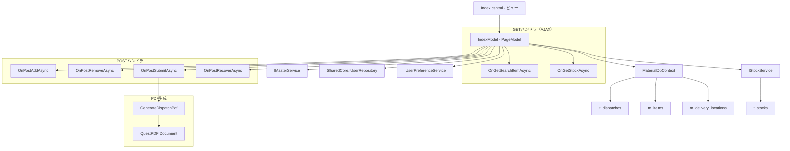
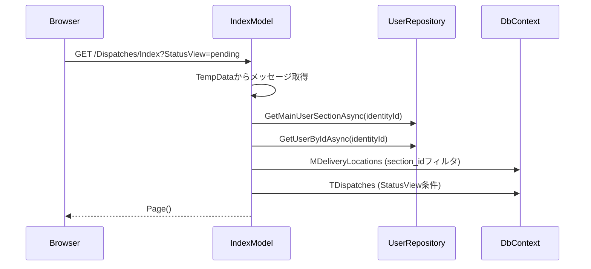
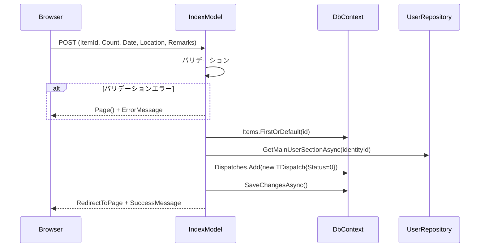
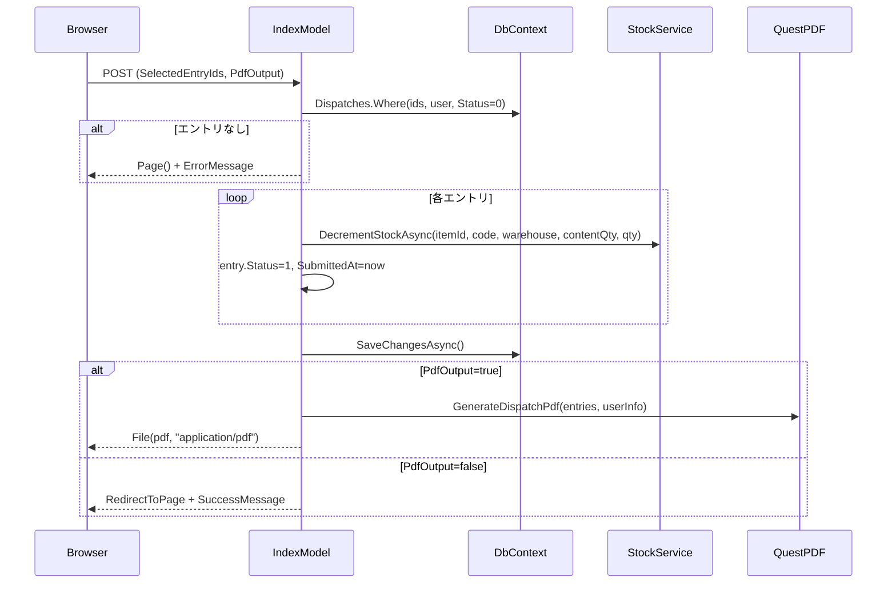
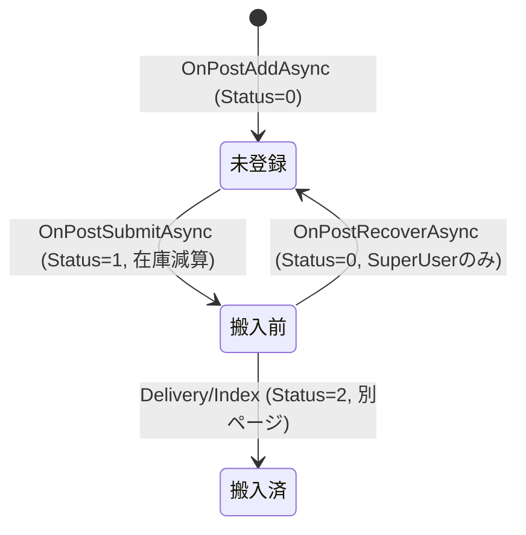

# 設計書: 原材料工場入請求登録ページ

## 概要

原材料工場入請求登録ページ（Dispatches/Index）の技術設計。ユーザーが出庫請求エントリを作成し、一括登録（ステータス遷移＋在庫減算＋PDF伝票生成）を行うRazor Pages画面。

対象ファイル:
- `MaterialModule/Areas/Material/Pages/Dispatches/Index.cshtml` — ビュー（入力フォーム・エントリリスト・AJAX処理）
- `MaterialModule/Areas/Material/Pages/Dispatches/Index.cshtml.cs` — PageModel（ハンドラ・ビジネスロジック・PDF生成）

設計方針:
- Razor Pages（PageModel）パターンを採用し、各操作をPOSTハンドラとして実装
- 品目検索・在庫照会はAJAX（GETハンドラ）で非同期処理
- PDF生成はQuestPDF（Community License）を使用し、PageModel内にインライン実装
- ユーザー所属情報はSharedCore.IUserRepositoryから取得
- 搬入場所はユーザーのsection_idでフィルタリング

## アーキテクチャ



### 依存関係

| サービス | 用途 |
|---------|------|
| `IStockService` | 在庫照会（GetStocksByItemAsync）、在庫減算（DecrementStockAsync） |
| `IMasterService` | 品目検索（SearchItemsAsync） |
| `MaterialDbContext` | TDispatch CRUD、MDeliveryLocation取得、MItem取得 |
| `IUserPreferenceService` | ユーザー設定（将来拡張用） |
| `SharedCore.IUserRepository` | ユーザー所属情報・セクション情報取得 |

## コンポーネントとインターフェース

### 1. IndexModel（PageModel）

#### コンストラクタ依存性注入

```csharp
public class IndexModel(
    IStockService stockService,
    IMasterService masterService,
    MaterialDbContext context,
    IUserPreferenceService prefService,
    SharedCore.Interfaces.IUserRepository userRepository) : PageModel
```

#### バインドプロパティ

| プロパティ | 型 | 用途 |
|-----------|---|------|
| `DispatchItemId` | int | 選択された品目ID |
| `DispatchCount` | decimal | 出庫個数 |
| `DispatchDate` | DateOnly? | 搬入日（デフォルト: 当日） |
| `DispatchLocation` | string? | 搬入場所 |
| `DispatchRemarks` | string? | 備考 |
| `StatusView` | string | ビュー切り替え（"pending" / "pre-delivery"）、SupportsGet=true |
| `SelectedEntryIds` | List\<int\> | 選択されたエントリIDリスト |
| `PdfOutput` | bool | PDF出力フラグ（デフォルト: true） |

#### 表示用プロパティ

| プロパティ | 型 | 用途 |
|-----------|---|------|
| `Locations` | List\<SelectListItem\> | 搬入場所ドロップダウン |
| `Entries` | List\<TDispatch\> | エントリリスト |
| `SuccessMessage` | string? | 成功メッセージ |
| `ErrorMessage` | string? | エラーメッセージ |
| `UserDepartmentName` | string | ユーザー部署名 |
| `UserFullName` | string | ユーザー氏名 |
| `UserExtensionNumber` | string | ユーザー内線番号 |

#### ハンドラ一覧

| ハンドラ | HTTP | 用途 |
|---------|------|------|
| `OnGetAsync` | GET | ページ初期表示（ユーザー情報・搬入場所・エントリ読み込み） |
| `OnGetSearchItemAsync(keyword)` | GET | 品目検索AJAX（最大20件） |
| `OnGetStockAsync(itemId)` | GET | 在庫照会AJAX |
| `OnPostAddAsync` | POST | エントリ追加（Status=0で新規作成） |
| `OnPostRemoveAsync` | POST | エントリ削除（Status=0、自ユーザーのみ） |
| `OnPostSubmitAsync` | POST | 一括登録（Status 0→1、在庫減算、PDF生成） |
| `OnPostRecoverAsync` | POST | 戻し（Status 1→0、SuperUserのみ） |

### 2. OnGetAsync フロー



### 3. OnPostAddAsync フロー



### 4. OnPostSubmitAsync フロー



### 5. クライアントサイド（JavaScript）

| 機能 | 実装方式 |
|------|---------|
| 品目サジェスト | debounce(300ms) + fetch → JSON → DOM操作 |
| キーボードナビゲーション | ArrowUp/Down/Enter/Escape イベントハンドラ |
| 在庫表示 | 品目選択時にfetch → 合計表示 |
| 全選択/解除 | selectAll checkbox → 全entry-check連動 |
| 行クリック選択 | entry-row click → checkbox toggle + table-active |
| 削除ボタン制御 | チェック状態に応じてdisabled切り替え + hidden fields更新 |
| 登録処理 | fetch POST → PDF blob download or reload |
| 搬入日ソート | クライアントサイドDOM並び替え |
| フォームバリデーション | btnAdd click時にクライアント側チェック |

## データモデル

### TDispatch エンティティ（t_dispatches）

```
t_dispatches
├── id (PK, int, auto-increment)
├── dispatch_date (DateOnly, required) -- 搬入日
├── dispatch_no (string?, max 20) -- 出庫番号
├── item_id (FK → m_items.id, required)
├── dispatch_qty (decimal, required) -- 出庫個数
├── warehouse_code (string?, max 50) -- 倉庫コード（品目から自動設定）
├── warehouse_name (string?, max 50) -- 倉庫名（品目から自動設定）
├── destination (string?, max 50) -- 搬入先
├── delivery_location (string?, max 50) -- 搬入場所
├── department_id (int?) -- 部門ID
├── department_name (string?, max 80) -- 部署名（ユーザー所属から自動設定）
├── cost_center (string?, max 50) -- 原価センター（ユーザー所属から自動設定）
├── remarks (string?, max 256) -- 備考
├── status (int, required, default=0) -- 0:未登録, 1:搬入前, 2:搬入済
├── submitted_at (DateTime?) -- 登録日時（Status 0→1 時に設定）
├── completed_at (DateTime?) -- 搬入完了日時（Status 1→2 時に設定）
├── user_id (string, required, max 40) -- 操作ユーザーID
├── created_at (DateTime, required) -- 作成日時
└── updated_at (DateTime, required) -- 更新日時
```

### MDeliveryLocation エンティティ（m_delivery_locations）

```
m_delivery_locations
├── id (PK, int)
├── section_id (string?, max 50) -- セクションID（NULLは全員共通）
├── location_name (string, required, max 50) -- 搬入場所名
├── cost_center (string?, max 50) -- 原価センター
├── sort_id (int?) -- 表示順
├── remarks (string?, max 50) -- 備考
├── created_at (DateTime, required)
└── updated_at (DateTime, required)
```

### ステータス遷移



- **未登録（Status=0）**: エントリ作成直後。編集・削除可能。
- **搬入前（Status=1）**: 登録済み。在庫減算済み。PDF発行済み。SuperUserのみ戻し可能。
- **搬入済（Status=2）**: 搬入完了。Deliveryページで管理。

### 搬入場所フィルタロジック

```csharp
// ユーザーのsection_idを取得
string userSectionId = await GetUserSectionIdAsync();

// フィルタ条件: section_idがNULL/空 OR ユーザーのsection_idと一致
query = query.Where(l => l.SectionId == null || l.SectionId == "" || l.SectionId == userSectionId);

// SortId昇順 → distinct LocationName
```

## エラーハンドリング

### OnPostAddAsync

| 条件 | 処理 |
|------|------|
| DispatchItemId ≤ 0 | ErrorMessage = "品目を選択してください。" |
| DispatchCount == 0 | ErrorMessage = "個数を入力してください。" |
| DispatchLocation が空 | ErrorMessage = "搬入場所を選択してください。" |
| 品目が見つからない | ErrorMessage = "品目が見つかりません。"（ArgumentException） |
| DB例外 | ErrorMessage = ex.Message |

### OnPostSubmitAsync

| 条件 | 処理 |
|------|------|
| 対象エントリが0件 | ErrorMessage = "登録するエントリがありません。" |
| 在庫不足（DecrementStockAsync例外） | 例外伝播（現状ハンドリングなし） |

### OnPostRecoverAsync

| 条件 | 処理 |
|------|------|
| SuperUserロールなし | return Forbid() (HTTP 403) |
| 対象エントリが0件 | 何もせずリダイレクト |

### クライアントサイドバリデーション

| 条件 | 処理 |
|------|------|
| 品目未選択（itemIdHidden空） | alert("品目を選択してください。") + submit阻止 |
| 搬入場所未選択 | alert("搬入場所を選択してください。") + submit阻止 |
| 個数が0またはNaN | alert("個数は0以外を指定してください。") + submit阻止 |

## PDF生成詳細

### 生成条件

- `OnPostSubmitAsync` 内で `PdfOutput == true` の場合のみ生成
- QuestPDF Community License を使用
- フォント: "Yu Gothic"（日本語対応）

### ページ構成

- 用紙サイズ: A4
- マージン: 上25, 下20, 左40, 右25
- エントリをDispatchDateでグループ化し、日付ごとに1ページ

### ヘッダーレイアウト

```
┌─────────────────────────────────────────────────────────────┐
│              原材料工場入請求伝票（16pt, Bold, Underline）        │
│                （工場入作業依頼書）（10pt）                       │
├──────────────────────────────┬───────────────────────────────┤
│ 部署名    │ {departmentName} │ 請求者 │ {fullName} │ 材料課  │
│ 原価ｾﾝﾀｰ │ {costCenter}     │ 内線   │ {ext}      │         │
│ 搬入年月日│ {yyyy/MM/dd} │001│                               │
└──────────────────────────────┴───────────────────────────────┘
                                                        1 / 1
```

### 明細テーブル

| 列 | 幅 | 内容 |
|----|---|------|
| 品名 | RelativeColumn(3) | Item.ItemName |
| 品目コード | ConstantColumn(75) | Item.ItemCode |
| 入目 | ConstantColumn(40) | Item.ContentQty (右寄せ, N0) |
| 個数 | ConstantColumn(35) | DispatchQty (右寄せ, N0) |
| 倉庫 | ConstantColumn(55) | WarehouseName |
| 備考 | RelativeColumn(3) | Remarks |
| 搬入場所 | ConstantColumn(70) | DeliveryLocation |

### GenerateDispatchPdf メソッドシグネチャ

```csharp
private byte[] GenerateDispatchPdf(
    List<TDispatch> entries,
    string loginName,
    string departmentName,
    string fullName,
    string extensionNumber,
    string costCenter)
```

## テスト戦略

### PBT適用判断

本機能はProperty-Based Testingの対象外とする。理由:
- エントリ作成は固定的なCRUD操作であり、入力の多様性が限定的
- ステータス遷移は固定パターン（0→1、1→0）
- PDF生成はレイアウト検証が主であり、プロパティベースの検証が困難

### 単体テスト

| テスト対象 | テスト内容 |
|-----------|-----------|
| `OnPostAddAsync` - 正常系 | 有効な入力でTDispatch(Status=0)が作成される |
| `OnPostAddAsync` - 品目未選択 | ItemId=0でErrorMessage設定 |
| `OnPostAddAsync` - 個数0 | Count=0でErrorMessage設定 |
| `OnPostAddAsync` - 搬入場所未選択 | Location空でErrorMessage設定 |
| `OnPostRemoveAsync` - 正常系 | 選択エントリ(Status=0)が削除される |
| `OnPostRemoveAsync` - 他ユーザー | 他ユーザーのエントリは削除されない |
| `OnPostSubmitAsync` - 正常系 | Status 0→1、SubmittedAt設定、DecrementStockAsync呼出 |
| `OnPostSubmitAsync` - 全件対象 | SelectedEntryIds空の場合に全Status=0エントリが対象 |
| `OnPostSubmitAsync` - PDF生成 | PdfOutput=trueでbyte[]が返却される |
| `OnPostRecoverAsync` - SuperUser | Status 1→0、SubmittedAt=null |
| `OnPostRecoverAsync` - 非SuperUser | Forbid()が返却される |
| `LoadLocationsAsync` | section_idフィルタが正しく適用される |
| `OnGetSearchItemAsync` | キーワードに基づく品目検索結果が返却される |
| `OnGetStockAsync` | 品目IDに基づく在庫情報が返却される |

### 結合テスト

| テスト対象 | テスト内容 |
|-----------|-----------|
| エントリ作成→登録フロー | Add→Submit→Status遷移＋在庫減算の一連動作 |
| 登録→戻しフロー | Submit→Recover→Status復帰の一連動作 |
| 搬入場所フィルタ | 異なるsection_idのユーザーで表示場所が異なる |

### 手動テスト（UI確認）

| 確認項目 |
|---------|
| 品目入力時にサジェストが表示される |
| サジェスト選択後に入目・在庫が表示される |
| キーボード（↑↓Enter Esc）でサジェスト操作可能 |
| エントリ追加後にリストに反映される |
| 行クリックでチェックボックスが切り替わる |
| 全選択チェックボックスが正しく動作する |
| 削除ボタンが選択時のみ有効になる |
| 登録後にPDFがダウンロードされる |
| PDF内容が正しい（部署名・品目・個数等） |
| ビュー切り替え（未登録↔搬入前）が正しく動作する |
| 搬入場所ドロップダウンがセクションでフィルタされる |

---

## UI改修: 入請求登録（Dispatches/Index）モーダル化

原材料工場入請求登録をモーダル方式に変更し、一覧エリアを広く取る。

### レイアウト方針
- 常設の登録カードを撤去し、一覧ヘッダのボタン（`#btnOpenDispatchModal`）から `#dispatchModal`（`modal-lg`, `font-size:0.75rem`）を開く。
- ボタン名は **「工場入請求登録」**（2026/06/10 に「入請求登録」から修正）。
- 送信方式は従来どおりフォーム submit（`asp-page-handler="Add"`）。

### モーダル内フィールド並び順
- 1段目: 品目 / 入目 / 個数
- 2段目: **搬入場所（col-md-4, サジェスト付き） → 搬入日（col-md-3）** → 備考（2026/06/10 に「搬入日 → 搬入場所」から入替）

### 一覧
- スクロール枠 + ヘッダ固定: `<div class="table-responsive material-list-scroll">` + `<thead class="table-light sticky-top">`（共通UIルール参照）。
- 一覧高さは全ページ共通の `max-height: calc(100vh - 225px)`。
- デフォルトソートは「入力順（Id 昇順）」。

### 文字化け対策（搬入場所サジェスト）
- 搬入場所マスタの JS 埋め込みは `System.Text.Json.JsonSerializer.Serialize` を使用（`JavaScriptEncoder` 経由だと日本語が HTML エンティティ化され hidden→DB 保存で文字化けするため）。
