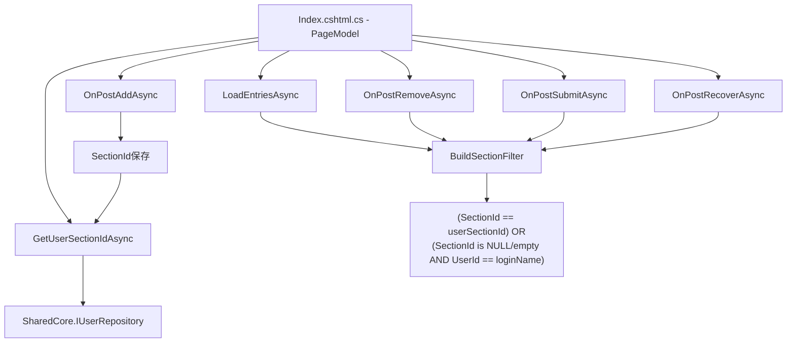

# 設計書: Dispatchesページ セクションフィルタ化

## 概要

原材料工場入請求登録ページ（Dispatches/Index）のエントリフィルタリングを、UserId単位からSectionId単位に変更する。これにより、同一セクション（課）に所属するユーザー全員が互いのエントリを閲覧・操作できるようになる。

**変更対象ファイル:**
- `MaterialModule/Data/Entities/TDispatch.cs` — SectionIdプロパティ追加
- `MaterialModule/Areas/Material/Pages/Dispatches/Index.cshtml.cs` — フィルタロジック変更
- `MaterialModule/Data/MaterialDbContext.cs` — マイグレーション（必要に応じて）
- SQLスクリプト — 既存データのバックフィル

**設計方針:**
- 既存のUserId列は削除せず、後方互換性のためフォールバックフィルタとして残す
- SectionIdがNULL/空のレコードは従来通りUserId一致で表示する
- フィルタロジックを共通メソッドに抽出し、全ハンドラで一貫性を保つ

## アーキテクチャ



### フィルタロジックの統一

全ハンドラで同一のフィルタ条件を使用する。条件式を共通化することで、一貫性を保証する。

```csharp
// 共通フィルタ条件（IQueryable<TDispatch>に適用）
private IQueryable<TDispatch> ApplySectionFilter(IQueryable<TDispatch> query, string userSectionId, string loginName)
{
    return query.Where(d =>
        d.SectionId == userSectionId ||
        ((d.SectionId == null || d.SectionId == "") && d.UserId == loginName));
}
```

## コンポーネントとインターフェース

### 1. TDispatch エンティティ変更

```csharp
// 追加プロパティ
[Column("section_id")]
[MaxLength(50)]
public string? SectionId { get; set; }
```

### 2. OnPostAddAsync 変更

エントリ作成時にSectionIdを保存する。既存パターン（DepartmentName, CostCenter保存）に倣う。

```csharp
// 変更箇所: TDispatch生成時
string userSectionId = await GetUserSectionIdAsync();

var dispatch = new TDispatch
{
    // ... 既存フィールド ...
    SectionId = userSectionId,  // 追加
    UserId = loginName,
    // ...
};
```

### 3. LoadEntriesAsync 変更

```csharp
private async Task LoadEntriesAsync()
{
    string loginName = User.Identity?.Name ?? "unknown";
    string userSectionId = await GetUserSectionIdAsync();

    IQueryable<TDispatch> baseQuery = context.Dispatches.Include(d => d.Item);
    baseQuery = ApplySectionFilter(baseQuery, userSectionId, loginName);

    if (StatusView == "pre-delivery")
    {
        Entries = await baseQuery
            .Where(d => d.Status == 1)
            .OrderByDescending(d => d.DispatchDate)
            .ThenBy(d => d.Item!.ItemName)
            .ToListAsync();
    }
    else
    {
        Entries = await baseQuery
            .Where(d => d.Status == 0)
            .OrderBy(d => d.CreatedAt)
            .ToListAsync();
    }
}
```

### 4. OnPostRemoveAsync 変更

```csharp
public async Task<IActionResult> OnPostRemoveAsync()
{
    string loginName = User.Identity?.Name ?? "unknown";
    string userSectionId = await GetUserSectionIdAsync();

    var query = context.Dispatches
        .Where(d => SelectedEntryIds.Contains(d.Id) && d.Status == 0);
    query = ApplySectionFilter(query, userSectionId, loginName);

    var entries = await query.ToListAsync();
    // ... 以降は既存ロジック ...
}
```

### 5. OnPostSubmitAsync 変更

```csharp
public async Task<IActionResult> OnPostSubmitAsync()
{
    string loginName = User.Identity?.Name ?? "unknown";
    string userSectionId = await GetUserSectionIdAsync();

    List<TDispatch> entries;
    if (SelectedEntryIds.Count == 0)
    {
        var query = context.Dispatches.Include(d => d.Item).Where(d => d.Status == 0);
        query = ApplySectionFilter(query, userSectionId, loginName);
        entries = await query
            .OrderBy(d => d.DispatchDate)
            .ThenBy(d => d.Item!.ItemName)
            .ToListAsync();
    }
    else
    {
        var query = context.Dispatches.Include(d => d.Item)
            .Where(d => SelectedEntryIds.Contains(d.Id) && d.Status == 0);
        query = ApplySectionFilter(query, userSectionId, loginName);
        entries = await query
            .OrderBy(d => d.DispatchDate)
            .ThenBy(d => d.Item!.ItemName)
            .ToListAsync();
    }
    // ... 以降は既存ロジック ...
}
```

### 6. OnPostRecoverAsync 変更

```csharp
public async Task<IActionResult> OnPostRecoverAsync()
{
    if (!User.IsInRole("SuperUser"))
        return Forbid();

    string loginName = User.Identity?.Name ?? "unknown";
    string userSectionId = await GetUserSectionIdAsync();

    var query = context.Dispatches
        .Where(d => SelectedEntryIds.Contains(d.Id) && d.Status == 1);
    query = ApplySectionFilter(query, userSectionId, loginName);

    var entries = await query.ToListAsync();
    // ... 以降は既存ロジック ...
}
```

### 7. ApplySectionFilter 共通メソッド

```csharp
/// <summary>
/// セクションフィルタを適用する共通メソッド。
/// SectionIdが一致するレコード、またはSectionIdがNULL/空でUserIdが一致するレコードを返す。
/// </summary>
private IQueryable<TDispatch> ApplySectionFilter(IQueryable<TDispatch> query, string userSectionId, string loginName)
{
    if (string.IsNullOrEmpty(userSectionId))
    {
        // ユーザーにSectionIdがない場合は従来通りUserIdフィルタ
        return query.Where(d => d.UserId == loginName);
    }

    return query.Where(d =>
        d.SectionId == userSectionId ||
        ((d.SectionId == null || d.SectionId == "") && d.UserId == loginName));
}
```

## データモデル

### TDispatch エンティティ変更（t_dispatches）

```
t_dispatches
├── ... (既存カラム) ...
├── section_id (string?, max 50, NEW) -- セクションID（エントリ作成時に保存）
├── user_id (string, required, max 40) -- 操作ユーザーID（既存、フォールバック用に維持）
└── ... (既存カラム) ...
```

### マイグレーションSQL

```sql
-- カラム追加
ALTER TABLE t_dispatches ADD COLUMN section_id VARCHAR(50) NULL;

-- インデックス追加（フィルタ性能向上）
CREATE INDEX idx_dispatches_section_id ON t_dispatches(section_id);
```

### バックフィルSQL

```sql
-- 既存レコードにsection_idを設定
-- user_sectionsテーブルからユーザーの所属セクションを参照
UPDATE t_dispatches d
SET d.section_id = (
    SELECT us.section_id
    FROM user_sections us
    INNER JOIN asp_net_users u ON u.id = us.user_id
    WHERE u.user_name = d.user_id
    AND us.is_main = 1
    LIMIT 1
)
WHERE d.section_id IS NULL;
```

※ 実際のテーブル名・カラム名はSharedCoreのスキーマに合わせて調整する。

## 正当性プロパティ

*プロパティとは、システムの全ての有効な実行において真であるべき特性や振る舞いのことである。要件から導出された形式的な仕様であり、プロパティベーステストによって機械的に検証可能である。*

### Property 1: エントリ作成時のSectionId保存

*任意の*ユーザーと有効な入力データに対して、OnPostAddAsyncで作成されたTDispatchのSectionIdは、そのユーザーのGetUserSectionIdAsync()の戻り値と一致すること。

**Validates: Requirements 2.1, 2.3**

### Property 2: セクションフィルタの可視性

*任意の*TDispatchレコード集合とユーザーに対して、LoadEntriesAsyncが返すレコードは以下の条件を満たすもののみであること: (SectionId == userSectionId) OR (SectionIdがNULL/空 AND UserId == loginName)

**Validates: Requirements 3.1, 3.2, 3.3, 3.4, 7.1, 7.2**

### Property 3: 削除のセクションフィルタ整合性

*任意の*選択エントリIDリストとユーザーに対して、OnPostRemoveAsyncが削除するレコードは以下の全条件を満たすもののみであること: IDが選択リストに含まれる AND Status==0 AND ((SectionId == userSectionId) OR (SectionIdがNULL/空 AND UserId == loginName))

**Validates: Requirements 4.1, 4.2, 4.3**

### Property 4: 登録のセクションフィルタ整合性

*任意の*選択エントリIDリスト（空を含む）とユーザーに対して、OnPostSubmitAsyncが対象とするレコードは以下の全条件を満たすもののみであること: Status==0 AND ((SectionId == userSectionId) OR (SectionIdがNULL/空 AND UserId == loginName))

**Validates: Requirements 5.1, 5.2, 5.3**

### Property 5: 戻し操作のセクションフィルタ整合性

*任意の*選択エントリIDリストとSuperUserに対して、OnPostRecoverAsyncが対象とするレコードは以下の全条件を満たすもののみであること: IDが選択リストに含まれる AND Status==1 AND ((SectionId == userSectionId) OR (SectionIdがNULL/空 AND UserId == loginName))

**Validates: Requirements 6.1, 6.2, 6.3**

## エラーハンドリング

### ユーザーにSectionIdがない場合

| 条件 | 処理 |
|------|------|
| GetUserSectionIdAsync()が空文字を返す | ApplySectionFilterがUserIdフィルタにフォールバック（従来動作と同一） |

### SectionIdがNULLの既存レコード

| 条件 | 処理 |
|------|------|
| TDispatch.SectionIdがNULL/空 | フォールバックフィルタ（UserId一致）で表示・操作可能 |

### バックフィル実行時

| 条件 | 処理 |
|------|------|
| user_sectionsにユーザーが存在しない | section_idはNULLのまま（フォールバックフィルタで対応） |
| 既にsection_idが設定済み | WHERE句で除外（上書きしない） |

## テスト戦略

### PBT適用判断

本機能はProperty-Based Testingの対象とする。理由:
- フィルタロジックは純粋な述語関数であり、入力（エントリ集合×ユーザー情報）の多様性が高い
- SectionId/UserIdの組み合わせパターンが多く、ランダム生成で網羅的にテスト可能
- ApplySectionFilterメソッドは副作用のない純粋なクエリ構築であり、インメモリDBでテスト可能

### プロパティベーステスト

- ライブラリ: **FsCheck** (NuGet: FsCheck.Xunit)
- 最小反復回数: 100回
- 各テストにプロパティ番号をタグ付け
- タグ形式: `Feature: dispatches-section-filter, Property {N}: {property_text}`

| テスト | 対象プロパティ |
|--------|--------------|
| エントリ作成でSectionIdが正しく保存される | Property 1 |
| LoadEntriesAsyncがセクションフィルタを正しく適用する | Property 2 |
| OnPostRemoveAsyncがセクションフィルタを正しく適用する | Property 3 |
| OnPostSubmitAsyncがセクションフィルタを正しく適用する | Property 4 |
| OnPostRecoverAsyncがセクションフィルタを正しく適用する | Property 5 |

### 単体テスト（例示ベース）

| テスト対象 | テスト内容 |
|-----------|-----------|
| ApplySectionFilter - 同一セクション | SectionId一致のレコードが返される |
| ApplySectionFilter - 異なるセクション | SectionId不一致のレコードが除外される |
| ApplySectionFilter - NULLフォールバック | SectionId=NULLでUserId一致のレコードが返される |
| ApplySectionFilter - NULLで他ユーザー | SectionId=NULLでUserId不一致のレコードが除外される |
| ApplySectionFilter - ユーザーSectionId空 | UserIdフィルタにフォールバックする |
| OnPostAddAsync - SectionId保存 | 作成されたエントリにSectionIdが設定される |
| OnPostAddAsync - SectionId空ユーザー | SectionIdが空文字で保存される |

### 結合テスト

| テスト対象 | テスト内容 |
|-----------|-----------|
| セクション内共有 | 同一セクションの2ユーザーが互いのエントリを閲覧できる |
| セクション間分離 | 異なるセクションのユーザーが互いのエントリを閲覧できない |
| バックフィル後の表示 | バックフィル実行後、既存レコードがセクションフィルタで正しく表示される |
| 混在データ | SectionId有りと無しのレコードが混在する場合の表示 |
