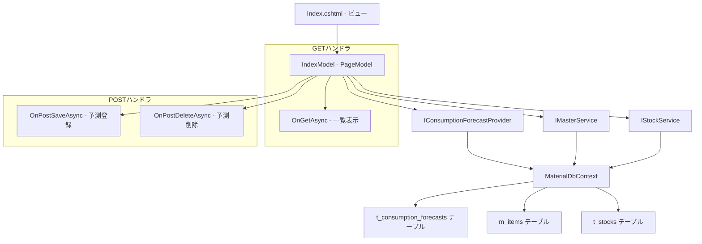

# 設計書: 需要予測ページ

## 概要

需要予測ページ（Forecasts/Index）の技術設計。品目ごとの消費予測を登録・表示・削除するRazor Pages画面。品目選択時に現在庫と±3ヶ月の予測一覧を表示し、新規予測の登録・削除操作を提供する。

対象ファイル:
- `MaterialModule/Areas/Material/Pages/Forecasts/Index.cshtml` — ビュー（品目選択・在庫表示・予測入力・一覧）
- `MaterialModule/Areas/Material/Pages/Forecasts/Index.cshtml.cs` — PageModel（GET/POSTハンドラ）
- `MaterialModule/Services/IConsumptionForecastProvider.cs` — 消費予測サービスインターフェース
- `MaterialModule/Services/IMasterService.cs` — マスタサービスインターフェース
- `MaterialModule/Services/IStockService.cs` — 在庫サービスインターフェース
- `MaterialModule/Data/Entities/TConsumptionForecast.cs` — 消費予測エンティティ

設計方針:
- Razor Pages PageModelパターンに準拠（GET/POSTハンドラ分離）
- 品目選択時にonchangeで自動サブミット（UX向上）
- PRG（Post-Redirect-Get）パターンによる二重送信防止
- サービス層を介したビジネスロジック分離

## アーキテクチャ



### レイヤー構成

| レイヤー | 責務 |
|---------|------|
| ビュー (Index.cshtml) | 品目選択UI、在庫表示、予測入力フォーム、一覧テーブル |
| PageModel (IndexModel) | リクエスト処理、バリデーション、サービス呼び出し |
| サービス (IConsumptionForecastProvider) | 予測データのCRUD操作 |
| サービス (IMasterService) | 品目マスタ取得 |
| サービス (IStockService) | 在庫データ取得 |

## コンポーネントとインターフェース

### 1. IndexModel（PageModel）

#### コンストラクタ依存性注入

```csharp
public class IndexModel(
    IConsumptionForecastProvider forecastProvider,
    IMasterService masterService,
    IStockService stockService
) : PageModel
```

#### プロパティ

| プロパティ | 型 | 用途 |
|-----------|---|------|
| Items | `List<SelectListItem>` | 品目ドロップダウン選択肢 |
| ItemId | `int?` | 選択中の品目ID（BindProperty, SupportsGet） |
| CurrentStockQty | `decimal` | 全倉庫の在庫合計 |
| Forecasts | `List<TConsumptionForecast>` | 登録済み予測一覧 |
| StockLedgerHistory | `List<StockLedgerDto>` | 在庫受払履歴 |
| ForecastDate | `DateOnly` | 予測日入力（BindProperty、デフォルト=今日） |
| ForecastQty | `decimal` | 予測数量入力（BindProperty） |
| Remarks | `string?` | 備考入力（BindProperty） |

#### GETハンドラ

##### OnGetAsync()

```csharp
public async Task OnGetAsync()
```

処理フロー:
1. `LoadItemsAsync()` で品目ドロップダウンを構築
2. ItemIdが有効値（> 0）の場合、`LoadItemDataAsync(ItemId.Value)` を呼び出し

#### POSTハンドラ

##### OnPostSaveAsync()

```csharp
public async Task<IActionResult> OnPostSaveAsync()
```

処理フロー:
1. ItemIdが未選択（null or 0）の場合 → ModelStateエラー "品目を選択してください。" → Page()返却
2. ForecastQtyが0以下の場合 → ModelStateエラー "予測数量は0より大きい値を入力してください。" → LoadItemsAsync + LoadItemDataAsync → Page()返却
3. `User.Identity.Name` からuserIdを取得
4. `forecastProvider.SaveForecastAsync(ItemId.Value, ForecastDate, ForecastQty, userId, Remarks)` で保存
5. `RedirectToPage(new { ItemId = ItemId.Value })` でPRGリダイレクト

##### OnPostDeleteAsync(forecastId)

```csharp
public async Task<IActionResult> OnPostDeleteAsync(int forecastId)
```

処理フロー:
1. `forecastProvider.DeleteForecastAsync(forecastId)` で削除
2. `RedirectToPage(new { ItemId = ItemId })` でPRGリダイレクト

#### プライベートメソッド

##### LoadItemsAsync()

```csharp
private async Task LoadItemsAsync()
```

- `masterService.GetActiveItemsAsync()` で全有効品目取得
- `"{ItemCode} - {ItemName}"` 形式でSelectListItem構築

##### LoadItemDataAsync(itemId)

```csharp
private async Task LoadItemDataAsync(int itemId)
```

処理フロー:
1. `stockService.GetStocksByItemAsync(itemId)` で全倉庫の在庫取得
2. `CurrentStockQty = stocks.Sum(s => s.StockQty)` で合計算出
3. fromDate = 今日 - 3ヶ月、toDate = 今日 + 3ヶ月
4. `forecastProvider.GetForecastRecordsAsync(itemId, fromDate, toDate)` で予測一覧取得
5. StockLedgerHistory = [] （TODO: 受払台帳画面で対応）

### 2. IConsumptionForecastProvider インターフェース

```csharp
public interface IConsumptionForecastProvider
{
    Task<List<TConsumptionForecast>> GetForecastRecordsAsync(int itemId, DateOnly fromDate, DateOnly toDate);
    Task SaveForecastAsync(int itemId, DateOnly forecastDate, decimal forecastQty, string userId, string? remarks);
    Task DeleteForecastAsync(int forecastId);
}
```

| メソッド | 責務 |
|---------|------|
| GetForecastRecordsAsync | 指定品目・期間の予測レコード取得 |
| SaveForecastAsync | 新規予測レコード保存 |
| DeleteForecastAsync | 予測レコード削除 |

### 3. IStockService インターフェース（関連メソッド）

```csharp
Task<List<StockDto>> GetStocksByItemAsync(int itemId);
```

- 指定品目の全倉庫在庫を取得
- 返却リストのStockQtyを合計して現在庫を算出

### 4. ビュー構成 (Index.cshtml)

#### レイアウト構造

```
container
├── h2 "消費予測入力"
├── card (品目選択)
│   └── form (method="get")
│       └── select (onchange="this.form.submit()")
│
├── [ItemId選択時のみ表示]
│   ├── card (現在庫)
│   │   └── badge (bg-info) CurrentStockQty
│   │
│   ├── card (消費予測の登録)
│   │   └── form (method="post", handler="Save")
│   │       ├── input[date] ForecastDate
│   │       ├── input[number] ForecastQty
│   │       ├── input[text] Remarks
│   │       └── button "登録"
│   │
│   ├── card (登録済み消費予測)
│   │   └── table (予測日, 予測数量, 備考, 登録者, 更新日時, 削除ボタン)
│   │
│   └── card (在庫受払履歴)
│       └── table (日付, 繰越数量, 入庫数量, 出庫数量, 在庫数量)
```

## データモデル

### TConsumptionForecast エンティティ

| フィールド | 型 | 説明 |
|-----------|---|------|
| Id | int | 主キー |
| ItemId | int | 品目ID（外部キー） |
| ForecastDate | DateOnly | 予測日 |
| ForecastQty | decimal | 予測数量 |
| UserId | string | 登録者ID |
| Remarks | string? | 備考 |
| UpdatedAt | DateTime | 更新日時 |

### StockLedgerDto

| フィールド | 型 | 説明 |
|-----------|---|------|
| RecordDate | DateOnly | 日付 |
| CarriedOverQty | decimal? | 繰越数量 |
| ReceivedQty | decimal? | 入庫数量 |
| DispatchedQty | decimal? | 出庫数量 |
| StockQty | decimal? | 在庫数量 |

### 予測期間

```
fromDate = DateOnly.FromDateTime(DateTime.Today.AddMonths(-3))
toDate   = DateOnly.FromDateTime(DateTime.Today.AddMonths(3))
```

## エラーハンドリング

### バリデーションエラー

| 条件 | メッセージ | 処理 |
|------|----------|------|
| ItemId未選択でSave | "品目を選択してください。" | ModelState.AddModelError → Page() |
| ForecastQty <= 0 | "予測数量は0より大きい値を入力してください。" | ModelState.AddModelError → Page() |

### データ表示

| 条件 | 処理 |
|------|------|
| 予測レコードなし | "登録済みの消費予測はありません。" を表示 |
| 在庫受払履歴なし | "在庫受払履歴はありません。" を表示 |
| 数値がnull | "-" を表示 |

### 削除確認

| 条件 | 処理 |
|------|------|
| 削除ボタンクリック | JavaScript confirm "この予測を削除しますか？" |
| 確認OK | POSTで削除実行 |
| 確認キャンセル | 操作中止 |

### 認可エラー

| 条件 | 処理 |
|------|------|
| 未認証ユーザー | ログインページへリダイレクト |
| 権限不足 | アクセス拒否（403） |

## テスト戦略

### 単体テスト

| テスト対象 | テスト内容 |
|-----------|-----------|
| OnGetAsync - 品目未選択 | Itemsのみロード、Forecasts空 |
| OnGetAsync - 品目選択 | CurrentStockQty・Forecastsがロードされる |
| OnPostSaveAsync - 正常系 | SaveForecastAsync呼び出し→リダイレクト |
| OnPostSaveAsync - ItemId未選択 | ModelStateエラー→Page() |
| OnPostSaveAsync - ForecastQty<=0 | ModelStateエラー→Page() |
| OnPostDeleteAsync - 正常系 | DeleteForecastAsync呼び出し→リダイレクト |
| LoadItemDataAsync - 在庫合計 | 複数倉庫のStockQty合計が正しい |
| LoadItemDataAsync - 期間 | ±3ヶ月の範囲で取得される |

### 結合テスト

| テスト対象 | テスト内容 |
|-----------|-----------|
| SaveForecastAsync | DBに正しくレコードが保存される |
| DeleteForecastAsync | DBからレコードが削除される |
| GetForecastRecordsAsync | 期間フィルタが正しく動作する |
| GetStocksByItemAsync | 全倉庫の在庫が取得される |

### 手動テスト（UI確認）

| 確認項目 |
|---------|
| 品目ドロップダウンが全有効品目を表示する |
| 品目選択時に自動でページがリロードされる |
| 現在庫がバッジで正しく表示される |
| 予測登録フォームのバリデーションが動作する |
| 登録後にリダイレクトされ一覧が更新される |
| 削除確認ダイアログが表示される |
| 削除後にリダイレクトされ一覧が更新される |
