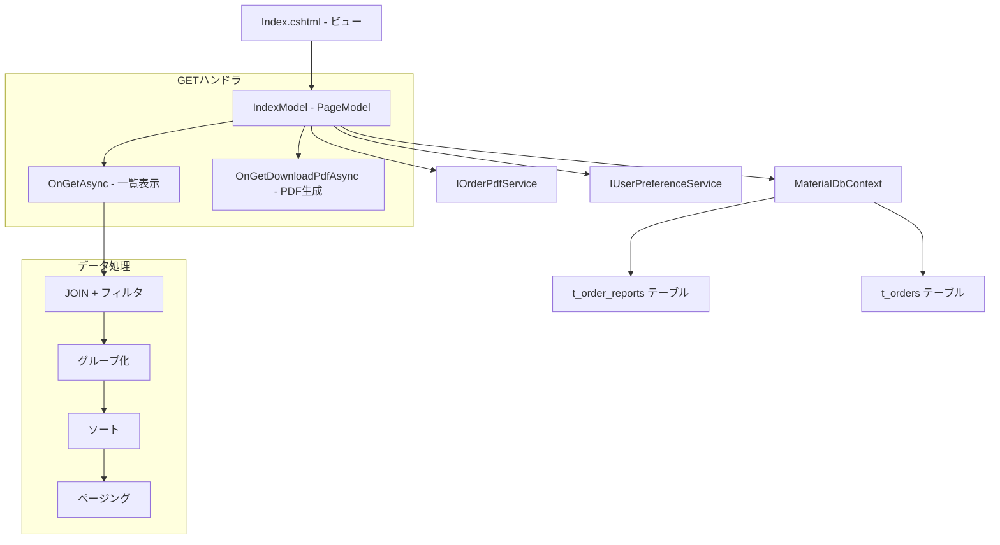
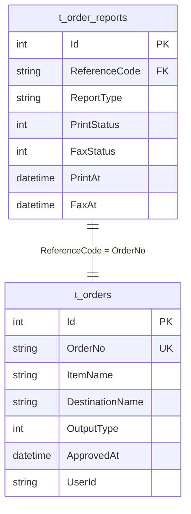

# 設計書: 印刷キューページ

## 概要

印刷キューページ（JobQueue/Index）の技術設計。承認済み発注の印刷・FAX送信状況を発注番号グループ単位で一覧表示し、グループ単位でのPDFダウンロードを提供するRazor Pages画面。

対象ファイル:
- `MaterialModule/Areas/Material/Pages/JobQueue/Index.cshtml` — ビュー（フィルタ・テーブル・ページネーション・PDF JS）
- `MaterialModule/Areas/Material/Pages/JobQueue/Index.cshtml.cs` — PageModel（GETハンドラ・グループ化・ソート・ページネーション）
- `MaterialModule/Services/IOrderPdfService.cs` — PDF生成サービスインターフェース
- `MaterialModule/Services/IUserPreferenceService.cs` — ユーザー設定サービスインターフェース

設計方針:
- Razor Pages PageModelパターンに準拠
- MaterialDbContextへの直接LINQクエリ（t_order_reports JOIN t_orders）
- メモリ上でのグループ化・ソート・ページング
- IUserPreferenceServiceによるユーザー別ページサイズ永続化
- JavaScript fetchによる非同期PDFダウンロード

## アーキテクチャ



### レイヤー構成

| レイヤー | 責務 |
|---------|------|
| ビュー (Index.cshtml) | フィルタUI、テーブル表示、ページネーション、PDF JS |
| PageModel (IndexModel) | クエリ実行、グループ化、ソート、ページング |
| サービス (IOrderPdfService) | グループ単位PDF生成 |
| サービス (IUserPreferenceService) | ユーザー設定永続化 |
| DbContext (MaterialDbContext) | t_order_reports / t_orders クエリ |

## コンポーネントとインターフェース

### 1. IndexModel（PageModel）

#### コンストラクタ依存性注入

```csharp
public class IndexModel(
    MaterialDbContext context,
    IOrderPdfService pdfService,
    IUserPreferenceService prefService
) : PageModel
```

#### 定数

```csharp
private const string ListKey = "JobQueue_Index";
```

#### プロパティ

| プロパティ | 型 | 用途 |
|-----------|---|------|
| Items | `List<JobQueueGroupItem>` | 現在ページのグループ一覧 |
| TotalCount | `int` | フィルタ後の全グループ数 |
| PageSize | `int` | 1ページ表示件数（デフォルト10） |
| CurrentPage | `int` | 現在ページ番号（デフォルト1） |
| TotalPages | `int` (算出) | `Ceiling(TotalCount / PageSize)` |
| StatusFilter | `int?` | 選択中のステータス値（BindProperty, SupportsGet） |
| SortBy | `string` | ソート列キー |
| SortDesc | `bool` | 降順フラグ |
| Statuses | `List<SelectListItem>` | ステータスドロップダウン選択肢 |

#### GETハンドラ

##### OnGetAsync(pageNo, pageSize, sort, desc)

```csharp
public async Task OnGetAsync(int? pageNo, int? pageSize, string? sort, bool? desc)
```

処理フロー:
1. CurrentPage = pageNo ?? 1
2. SortBy = sort ?? ""
3. SortDesc = desc ?? false
4. ユーザーIDを`User.Identity.Name`から取得
5. pageSizeが有効値(10,20,30,50)の場合、`prefService.SetPageSizeAsync`で保存
6. それ以外は`prefService.GetPageSizeAsync`で既存設定を読み込み
7. `LoadStatuses()` でステータス選択肢を設定
8. `LoadItemsAsync(userId)` でデータ取得・グループ化・ソート・ページング

##### OnGetDownloadPdfAsync(orderNoGroup)

```csharp
public async Task<IActionResult> OnGetDownloadPdfAsync(string orderNoGroup)
```

処理フロー:
1. `pdfService.GenerateGroupOrderPdfAsync(orderNoGroup)` でPDFバイト配列取得
2. `File(pdf, "application/pdf")` で返却

#### プライベートメソッド

##### LoadItemsAsync(userId)

```csharp
private async Task LoadItemsAsync(string userId)
```

処理フロー:
1. StatusFilter ?? 1 でデフォルトフィルタ値決定
2. LINQクエリ実行:
   - `context.OrderReports` JOIN `context.Orders` ON `ReferenceCode = OrderNo`
   - WHERE: ReportType == "order_approval" AND PrintStatus == filterStatus AND UserId == userId AND OrderNo != null
   - ORDER BY: OrderNo
3. `ToListAsync()` でメモリに取得
4. `GroupBy(o => ExtractGroupKey(o.OrderNo))` でグループ化
5. 各グループから先頭レコード（OrderNo昇順）の情報でJobQueueGroupItem構築
6. SortByに応じたソート適用（switch式）:
   - "orderno": OrderNoGroup
   - "dest": DestinationName
   - "item": RepresentItemName
   - "approved": ApprovedAt
   - デフォルト: ApprovedAt降順
7. TotalCount設定
8. CurrentPage境界チェック
9. Skip/Takeでページ分割

##### ExtractGroupKey(orderNo)

```csharp
private static string ExtractGroupKey(string orderNo)
```

- `orderNo.Split('-')` でセグメント分割
- セグメント数 >= 3 の場合: `string.Join("-", parts[0], parts[1], parts[2])`
- それ以外: orderNoをそのまま返却

##### LoadStatuses()

```csharp
private void LoadStatuses()
```

- 固定値でステータス選択肢を構築:
  - "待機" = 1
  - "完了" = 2
  - "エラー" = 9

### 2. JobQueueGroupItem（内部クラス）

```csharp
public class JobQueueGroupItem
{
    public string OrderNoGroup { get; set; } = "";
    public string RepresentItemName { get; set; } = "";
    public int ItemCount { get; set; }
    public string DestinationName { get; set; } = "";
    public int OutputType { get; set; }
    public DateTime? ApprovedAt { get; set; }
    public int PrintStatus { get; set; }
    public int FaxStatus { get; set; }
    public DateTime? PrintAt { get; set; }
    public DateTime? FaxAt { get; set; }
}
```

### 3. IOrderPdfService.GenerateGroupOrderPdfAsync

```csharp
Task<byte[]> GenerateGroupOrderPdfAsync(string orderNoGroup);
```

- 指定グループキーに属する全発注をまとめたPDFを生成
- byte[]としてPDFデータを返却

### 4. IUserPreferenceService インターフェース

| メソッド | 用途 |
|---------|------|
| GetPageSizeAsync(userId, listKey) | 保存済みページサイズ取得 |
| SetPageSizeAsync(userId, listKey, pageSize) | ページサイズ保存 |

ListKey定数: `"JobQueue_Index"`

### 5. ビュー構成 (Index.cshtml)

#### レイアウト構造

```
container-fluid
├── h2 "ジョブキュー"
├── toolbar (status filter dropdown, auto-submit)
├── card
│   ├── card-header ("ジョブリスト（{count} 件）" + pageSize selector)
│   └── card-body
│       └── table (responsive, striped, hover, font-size: 0.85rem)
│           ├── thead (No, 発注番号[sort], 送付先[sort], 代表品目[sort], 件数, 承認日時[sort], 印刷, FAX, PDF)
│           └── tbody (group rows)
│       └── pagination nav (first, prev, pages, next, last)
└── scripts section (downloadAndOpenPdf function)
```

#### ソートリンク構成

各ソート可能列のヘッダーは`<a>`タグで以下のパラメータを渡す:
- `asp-route-sort`: ソートキー
- `asp-route-desc`: 現在のソートキーと同じ場合にdescをトグル
- `asp-route-StatusFilter`: 現在のStatusFilter値を保持

#### JavaScript: downloadAndOpenPdf

```javascript
function downloadAndOpenPdf(orderNoGroup) {
    var url = pdfBaseUrl + '&orderNoGroup=' + encodeURIComponent(orderNoGroup);
    fetch(url)
        .then(response => {
            if (!response.ok) throw new Error('PDF生成に失敗しました');
            return response.blob();
        })
        .then(blob => {
            var fileName = orderNoGroup + '.pdf';
            var downloadLink = document.createElement('a');
            downloadLink.href = URL.createObjectURL(blob);
            downloadLink.download = fileName;
            document.body.appendChild(downloadLink);
            downloadLink.click();
            document.body.removeChild(downloadLink);
            URL.revokeObjectURL(downloadLink.href);
        })
        .catch(err => alert(err.message || 'PDF生成エラー'));
}
```

## データモデル

### クエリ結合構造



### JOIN条件

```sql
FROM t_order_reports r
JOIN t_orders o ON r.ReferenceCode = o.OrderNo
WHERE r.ReportType = 'order_approval'
  AND r.PrintStatus = @filterStatus
  AND o.UserId = @userId
  AND o.OrderNo IS NOT NULL
ORDER BY o.OrderNo
```

### 発注番号グループキー抽出例

| OrderNo | グループキー |
|---------|------------|
| G201-260513-001-001 | G201-260513-001 |
| G201-260513-001-002 | G201-260513-001 |
| G201-260513-002-001 | G201-260513-002 |
| G201-260514-001-001 | G201-260514-001 |

### ステータス値マッピング

| 値 | 名称 | バッジクラス | 用途 |
|----|------|------------|------|
| 0 | 対象外 | bg-secondary | 印刷/FAX対象外 |
| 1 | 待機 | bg-warning text-dark | 処理待ち |
| 2 | 完了 | bg-success | 処理完了 |
| 9 | エラー | bg-danger | 処理エラー |

## エラーハンドリング

### データ取得

| 条件 | 処理 |
|------|------|
| 該当データなし | "該当するデータはありません。" をテーブル内に表示（colspan=9） |
| ApprovedAtがnull | "-" を表示 |
| ItemNameがnull | "-" を表示（RepresentItemName） |
| DestinationNameがnull | "-" を表示 |

### PDF生成

| 条件 | 処理 |
|------|------|
| 正常完了 | blobをダウンロード（{orderNoGroup}.pdf） |
| HTTPエラー | alert("PDF生成に失敗しました") |
| その他エラー | alert(err.message || "PDF生成エラー") |

### ページネーション境界

| 条件 | 処理 |
|------|------|
| CurrentPage < 1 | CurrentPage = 1 に補正 |
| CurrentPage > TotalPages かつ TotalPages > 0 | CurrentPage = TotalPages に補正 |

### ページサイズ

| 条件 | 処理 |
|------|------|
| 有効値(10,20,30,50) | prefServiceに保存して適用 |
| 無効値 | prefServiceから既存設定を読み込み |

### 認可エラー

| 条件 | 処理 |
|------|------|
| 未認証ユーザー | ログインページへリダイレクト |
| 権限不足 | アクセス拒否（403） |

## テスト戦略

### 単体テスト

| テスト対象 | テスト内容 |
|-----------|-----------|
| ExtractGroupKey - 正常 | "G201-260513-001-001" → "G201-260513-001" |
| ExtractGroupKey - セグメント不足 | "G201-260513" → "G201-260513" |
| ExtractGroupKey - セグメント3つ | "G201-260513-001" → "G201-260513-001" |
| LoadItemsAsync - グループ化 | 同一グループキーの発注が1行に集約される |
| LoadItemsAsync - ItemCount | グループ内の発注件数が正しい |
| LoadItemsAsync - RepresentItemName | グループ内先頭のItemNameが使用される |
| LoadItemsAsync - ソート(orderno) | OrderNoGroupで昇順/降順 |
| LoadItemsAsync - ソート(dest) | DestinationNameで昇順/降順 |
| LoadItemsAsync - ソート(approved) | ApprovedAtで昇順/降順 |
| LoadItemsAsync - デフォルトソート | ApprovedAt降順 |
| LoadItemsAsync - ページネーション | Skip/Takeが正しく適用される |
| OnGetDownloadPdfAsync | GenerateGroupOrderPdfAsync呼び出し・FileResult返却 |

### 結合テスト

| テスト対象 | テスト内容 |
|-----------|-----------|
| JOIN + フィルタ | t_order_reports と t_orders の結合が正しい |
| StatusFilter連携 | PrintStatusフィルタが正しく適用される |
| UserId連携 | ログインユーザーの発注のみ表示される |
| GenerateGroupOrderPdfAsync | グループ内全発注のPDFが生成される |

### 手動テスト（UI確認）

| 確認項目 |
|---------|
| ステータスドロップダウンが自動サブミットする |
| 印刷・FAXバッジが正しい色で表示される |
| ソートリンクのクリックで並び順が切り替わる |
| ページサイズ変更が保持される |
| ページネーションが正しく動作する |
| PDFダウンロードボタンでファイルが保存される |
| PDF生成エラー時にアラートが表示される |
| 連番が正しく表示される（ページ跨ぎ対応） |
