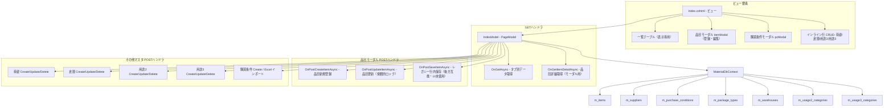

# 設計書: マスタメンテナンスページ

## 概要

マスタメンテナンスページ（MasterMaintenance/Index）の技術設計。複数マスタテーブルをタブ切り替えで一覧表示する Razor Pages 画面。

品目マスタ一覧は**表示専用（読み取り専用）**とし、品目の登録・編集は**品目モーダル（itemModal）に集約**する。一覧テーブルには入力欄・行内「保存」ボタンを一切配置せず、行操作は「編集」ボタン（モーダル起動）のみとする。一覧上部に「品目追加」ボタンを置き、空のモーダルで新規登録を行う。

荷姿・倉庫・用途2・用途3マスタは画面上でのインライン CRUD（追加・編集・削除）に対応する。仕入先・購買条件は表示専用（仕入先・購買条件は Excel インポート／購買条件追加モーダルあり）。

タブ表示順は **品目 / 購買条件 / 仕入先 / 荷姿 / 倉庫 / 用途2 / 用途3**（タブ名称から「マスタ」表記は除去）。

画面共通の処理中表示として、`_MaterialStyles.cshtml` に画面ロックユーティリティ `window.MaterialLock`（オーバーレイ＋スピナー、参照カウント方式、`lock/unlock/reset/run`）を用意。MasterMaintenance の AJAX 保存・Excel インポートおよび MaterialModule 全ページの POST フォーム送信（`data-no-lock` 除く）で自動的に画面ロックする。

対象ファイル:
- `MaterialModule/Areas/Material/Pages/MasterMaintenance/Index.cshtml` — ビュー（タブ・一覧テーブル・品目モーダル・購買条件モーダル・JavaScript）
- `MaterialModule/Areas/Material/Pages/MasterMaintenance/Index.cshtml.cs` — PageModel（タブ別データ取得・各種 AJAX ハンドラ）
- `MaterialModule/Data/Entities/MItem.cs` — 品目マスタエンティティ
- `MaterialModule/Data/Entities/MSupplier.cs` — 仕入先マスタエンティティ
- `MaterialModule/Data/Entities/MPurchaseCondition.cs` — 購買条件エンティティ
- `MaterialModule/Data/Entities/MPackageType.cs` — 荷姿マスタエンティティ
- `MaterialModule/Data/Entities/MWarehouse.cs` — 倉庫マスタエンティティ
- `MaterialModule/Data/Entities/MUsage2Category.cs` — 用途2マスタエンティティ
- `MaterialModule/Data/Entities/MUsage3Category.cs` — 用途3マスタエンティティ

設計方針:
- Razor Pages PageModel パターンに準拠（GET/POST ハンドラ分離）
- タブ切り替えはクエリパラメータ（?Tab=xxx）による画面遷移方式（タブ別の遅延データ取得・ソート・ページング）
- **品目マスタ一覧は表示専用。登録・編集は品目モーダルに集約**（インライン編集・行内保存は廃止）
- 品目モーダルからの保存は AJAX（JSON）。CSRF トークンヘッダ付与・楽観的ロック（RowVersion）対応
- 荷姿・倉庫・用途2・用途3はインライン行 CRUD（AJAX/JSON）
- DbContext を直接注入するシンプルな構成（サービス層なし）
- `lead_time_days` と `default_delivery_days` の同値保持を PageModel 側で保証

## アーキテクチャ



### レイヤー構成

| レイヤー | 責務 |
|---------|------|
| ビュー (Index.cshtml) | タブ UI 表示、品目一覧の表示専用レンダリング、品目モーダル・購買条件モーダル、荷姿/倉庫/用途2/用途3 のインライン CRUD、JavaScript AJAX 処理 |
| PageModel (IndexModel) | タブ別データ取得、品目詳細取得、品目モーダル登録・更新、各マスタ CRUD、Excel インポート |
| DbContext (MaterialDbContext) | データアクセス |

## コンポーネントとインターフェース

### 1. IndexModel（PageModel）

#### コンストラクタ依存性注入

```csharp
[Authorize(Policy = "DbPermissionCheck")]
[IgnoreAntiforgeryToken]
public class IndexModel(MaterialDbContext context) : PageModel
```

#### 主なプロパティ

| プロパティ | 型 | 用途 |
|-----------|---|------|
| Items | `List<MItem>` | 品目マスタ一覧 |
| Suppliers | `List<MSupplier>` | 仕入先マスタ一覧 |
| PurchaseConditions | `List<MPurchaseCondition>` | 購買条件一覧 |
| PackageTypes | `List<MPackageType>` | 荷姿マスタ一覧 |
| Warehouses | `List<MWarehouse>` | 倉庫マスタ一覧 |
| Usage2List | `List<MUsage2Category>` | 用途2マスタ一覧 |
| Usage3List | `List<MUsage3Category>` | 用途3マスタ一覧 |
| AllSuppliers / AllPackageTypes / AllWarehouses / AllUsageCategories / AllUsage2Categories / AllUsage3Categories / AllPurchaseTypes | 各 `List<...>` | 品目モーダル・購買条件モーダルのドロップダウン候補、品目一覧の用途名解決用 |
| Tab | `string` | 選択中のタブ（BindProperty, SupportsGet、デフォルト "items"） |
| SortBy / SortDesc | `string` / `bool` | 列ソート状態 |
| PageNo / PageSize / TotalCount / CurrentPage / TotalPages | — | ページング |

#### GETハンドラ

##### OnGetAsync()

```csharp
public async Task OnGetAsync()
```

処理フロー:
1. PageSize を検証（10/20/30/50 以外は 20 に補正）し、skip を算出
2. items/purchase タブの場合、品目モーダル・購買条件モーダル用のドロップダウン候補（仕入先・荷姿・倉庫・用途1/2/3・購買区分）をロード
3. Tab パラメータに応じて switch 分岐し、該当タブのデータのみを取得（遅延ロード）
4. フィルタ条件: items/suppliers/purchase は IsActive=true、packages/warehouses/usage2/usage3 は全件
5. ソート: items→ItemCode、suppliers→SupplierCode、purchase→ItemCode、packages→Id、warehouses→WarehouseCode、usage2/usage3→SortOrder（SortBy 指定時はその列）
6. ページング（Skip/Take）を適用

##### OnGetItemDetailAsync(int id)

```csharp
public async Task<IActionResult> OnGetItemDetailAsync(int id)   // handler=ItemDetail
```

処理フロー:
1. `context.Items.FindAsync(id)` で品目を検索
2. 未検出の場合: `{ success = false }` を返却
3. 品目の全編集対象フィールド（基本情報・関連マスタ FK・在庫/発注設定）と `RowVersion`（Base64 文字列）を JSON で返却
4. ビュー側 `openItemModal(id)` がこの結果でモーダルの各フィールドを初期化する

#### 品目モーダル POSTハンドラ

##### OnPostCreateItemAsync([FromBody] ItemCreateRequest request)

```csharp
public async Task<IActionResult> OnPostCreateItemAsync([FromBody] ItemCreateRequest request)  // handler=CreateItem
```

処理フロー:
1. ItemCode / ItemName 必須チェック（未入力は `{ success=false, message=... }`）
2. ItemCode 重複チェック（重複時はエラー返却）
3. `DefaultDeliveryDays` と `LeadTimeDays` を同値でセット（>0 のとき採用、未指定時は 14）
4. `OrderUnitQty` は >0 のとき採用、未指定時は 1
5. `LotSizeType` は null 時 "lot_for_lot"
6. PackageTypeId / WarehouseCode から名称（PackageTypeName / WarehouseName）を解決して保存
7. CreatedAt / UpdatedAt = DateTime.UtcNow
8. 追加・SaveChangesAsync 後 `{ success=true, id, message="品目を追加しました。" }` を返却

##### OnPostUpdateItemAsync([FromBody] ItemCreateRequest request)

```csharp
public async Task<IActionResult> OnPostUpdateItemAsync([FromBody] ItemCreateRequest request)  // handler=UpdateItem
```

処理フロー:
1. `request.Id` 未指定の場合: `{ success=false, message="IDが指定されていません。" }`
2. `context.Items.FindAsync(request.Id)` で検索。未検出時: `{ success=false, message="品目が見つかりません。" }`
3. **楽観的ロック**: `request.RowVersion`（Base64）を現在の `item.RowVersion` と比較。不一致なら競合メッセージを返却
4. 各フィールドを反映。`DefaultDeliveryDays` と `LeadTimeDays` は同値でセット
5. UpdatedAt = DateTime.UtcNow
6. SaveChangesAsync。`DbUpdateConcurrencyException` 発生時は競合メッセージを返却
7. 正常時 `{ success=true, rowVersion=<新Base64>, message="更新しました。" }` を返却

##### OnPostSaveItemAsync([FromBody] ItemSaveRequest request)（レガシー・後方互換）

```csharp
public async Task<IActionResult> OnPostSaveItemAsync([FromBody] ItemSaveRequest request)  // handler=SaveItem
```

- 旧仕様の行内インライン保存ハンドラ。後方互換のためコード上は残置するが、**UI（一覧テーブル）からは呼び出さない**。
- 品目の登録・編集はすべて品目モーダル（CreateItem / UpdateItem）経由とする。

#### その他マスタ POSTハンドラ（インライン CRUD）

| ハンドラ | handler 名 | 用途 |
|---------|-----------|------|
| OnPostCreatePackageTypeAsync / OnPostUpdatePackageTypeAsync / OnPostDeletePackageTypeAsync | CreatePackageType / UpdatePackageType / DeletePackageType | 荷姿マスタ CRUD（使用中は削除拒否） |
| OnPostCreateWarehouseAsync / OnPostUpdateWarehouseAsync / OnPostDeleteWarehouseAsync | CreateWarehouse / UpdateWarehouse / DeleteWarehouse | 倉庫マスタ CRUD（削除は IsActive=false のソフトデリート） |
| OnPostCreateUsage2Async / OnPostUpdateUsage2Async / OnPostDeleteUsage2Async | CreateUsage2 / UpdateUsage2 / DeleteUsage2 | 用途2マスタ CRUD（品目で使用中は削除拒否） |
| OnPostCreateUsage3Async / OnPostUpdateUsage3Async / OnPostDeleteUsage3Async | CreateUsage3 / UpdateUsage3 / DeleteUsage3 | 用途3マスタ CRUD（品目で使用中は削除拒否） |
| OnPostCreatePurchaseConditionAsync | CreatePurchaseCondition | 購買条件追加（pcModal 経由） |
| OnPostImportSuppliersAsync / OnPostImportPurchaseConditionsAsync | ImportSuppliers / ImportPurchaseConditions | Excel インポート（1段階・全列・完全置換） |

### Excel インポート仕様（仕入先 / 購買条件）

UI フロー: 「Excelインポート」ボタン押下 → 確認ダイアログ（「新規行は常に登録されます。既存（同一コード）の行は上書きします。」）→ OK でファイル選択ダイアログ → 即インポート実行（プレビュー画面なし）。処理中は共通 `MaterialLock` で画面ロック。完了時はファイル名＋件数（新規/更新、仕入先は除外件数）を表示。

- **更新方式**: 完全置換。新規（キー未存在）は登録、既存（同一キー）は全列上書き。
- **重複時はエラーで取込中止**: 取込ファイル内に同一キーが複数あれば DB 保存せずエラー返却（件数＋重複値先頭10件表示）。
- **既存マスタ/品目側の重複耐性**: 既存照合用の辞書は `TryAdd`（先頭採用）で構築し、DB 側に重複があっても例外にしない。

仕入先（Sheet1, 17列, 1行目ヘッダー）:
- 既存判定キー = C列「コード」（supplier_code）
- **A列「種類」が「仕入先」の行のみ取込**（得意先等は除外、件数表示）
- 列対応: A=種類, B=会社, C=コード, D=正式名称, E=支店部課名, F=略称(→supplier_name), G=口座名義, H=郵便番号, I=住所1, J=住所2, K=TEL, L=FAX, M=登録番号, N=自動FAX区分, O=登録日(date), P=削除(会社), Q=削除(共通)

購買条件（シート「購買条件(YYMM)」, 40列）:
- **1行目=日本語ヘッダー, 2行目=SAP項目名(スキップ), 3行目以降=データ**
- 各セル先頭の「'」は除去（CleanCell）
- 既存判定キー = F列「購買条件No」（condition_no）
- M列「品目コード」から item_id を解決
- V列「預残高通知書送付区分」は現状未使用だが将来利用に備え、暫定で `balance_notify_name` 列に取り込み保持する
- 日付列（effective_date / expiry_date / registered_date / modified_date）は date 化して保存。payment_due_date は非日付値のため文字列維持

### 購買条件マスタの参照ルール

m_purchase_conditions は重複（履歴）を許容する。**参照時は item_code 単位で effective_date が最新のレコードを参照値とする**（OrderPlanning / StockLedger / Mrp / OrderService / MasterService 全箇所で統一）。effective_date は date 型のため SQL での降順ソートで正しく最新が得られる。

### 2. リクエスト DTO

#### ItemCreateRequest（品目モーダル 登録・更新）

```csharp
public class ItemCreateRequest
{
    public int? Id { get; set; }                 // 更新時のみ
    public string? ItemCode { get; set; }
    public string? ItemName { get; set; }
    public string? ShortName { get; set; }
    public decimal OrderUnitQty { get; set; } = 1;
    public decimal? ContentQty { get; set; }
    public string? ContentUnit { get; set; }
    public decimal? Concentration { get; set; }
    public decimal? SpecificGravity { get; set; }
    public int? PackageTypeId { get; set; }
    public int DefaultDeliveryDays { get; set; } = 14;   // 「納期(日)」。LeadTimeDays と同値保持
    public decimal? SafetyStockQty { get; set; }
    public decimal? StockMinimumQty { get; set; }
    public decimal? DefaultOrderQty { get; set; }
    public string? LotSizeType { get; set; }
    public decimal? FixedLotQty { get; set; }
    public string? WarehouseCode { get; set; }
    public int? SupplierId { get; set; }
    public int? Usage1 { get; set; }
    public int? Usage2 { get; set; }
    public int? Usage3 { get; set; }
    public string? RowVersion { get; set; }      // 更新時の楽観的ロック用 Base64
}
```

#### ItemSaveRequest（レガシー行内保存・後方互換）

```csharp
public class ItemSaveRequest
{
    public int Id { get; set; }
    public decimal? SafetyStockQty { get; set; }
    public decimal? StockMinimumQty { get; set; }
    public decimal? DefaultOrderQty { get; set; }
    public int LeadTimeDays { get; set; }
    public int DefaultDeliveryDays { get; set; }
    public decimal OrderUnitQty { get; set; }
    public string? LotSizeType { get; set; }
    public decimal? FixedLotQty { get; set; }
    public string? RowVersion { get; set; }
}
```

#### その他 DTO

- `PurchaseConditionCreateRequest` — 購買条件追加（ItemId / SupplierCode / PurchaseType / DestinationName / MakerCode / MakerName）
- `PackageTypeSaveRequest` — 荷姿（Id? / PackageTypeName）
- `WarehouseSaveRequest` — 倉庫（Id? / WarehouseCode / WarehouseName / ConvCode / Remarks / Capacity）
- `UsageCategorySaveRequest` — 用途2/用途3（Id? / CategoryName / SortOrder）
- `DeleteRequest` — 削除（Id）

### 3. ビュー構成 (Index.cshtml)

#### レイアウト構造

```
scroll-wrapper > container-fluid mt-3 px-4 material-page
├── <partial name="_MaterialStyles" />
├── h5.mb-2 "マスタメンテナンス"
├── @Html.AntiForgeryToken()
├── #actionMessage（成功/失敗メッセージ表示領域）
├── nav-tabs (7タブ。表示順: 品目→購買条件→仕入先→荷姿→倉庫→用途2→用途3、名称から「マスタ」除去)
│   ├── 品目 (?Tab=items)
│   ├── 購買条件 (?Tab=purchase)
│   ├── 仕入先 (?Tab=suppliers)
│   ├── 荷姿 (?Tab=packages)
│   ├── 倉庫 (?Tab=warehouses)
│   ├── 用途2 (?Tab=usage2)
│   └── 用途3 (?Tab=usage3)
├── card (border-top-0, rounded-bottom)
│   └── card-body
│       ├── ツールバー（件数 / 「品目追加」ボタン / 更新 / 件数セレクト）
│       ├── _Pager (top)
│       └── table-responsive
│           └── table (bordered, sm, hover, font-size: 0.75rem)
├── 品目モーダル #itemModal（登録・編集フォーム）
└── 購買条件モーダル #pcModal
```

#### 品目マスタタブ（表示専用）

- 一覧上部ツールバーに「**＋ 品目追加**」ボタンを配置。`data-bs-toggle="modal" data-bs-target="#itemModal" onclick="MasterMaint.openItemModal()"`（引数なし＝新規）で空のモーダルを開く。
- 一覧テーブルの各セルは**読み取り専用テキスト表示**。`<input>` / `<select>` などの編集コントロールは行内に一切描画しない。
- 行内「保存」ボタン（`.btn-save-item`）は**配置しない**。行操作は「**編集**」ボタンのみ（`onclick="MasterMaint.openItemModal(@item.Id)"`）。
- 用途1/2/3 は FK（Usage1/Usage2/Usage3）から名称を解決した値（Usage1Name / Usage2Name / Usage3Name）を表示。FK が null の場合は "-" を表示。

##### 品目マスタテーブル列

| 列 | 表示名 | 入力タイプ | 値・備考 |
|----|--------|-----------|---------|
| 品目コード | item_code | 読み取り専用テキスト表示 | `@item.ItemCode` |
| 品目名 | item_name | 読み取り専用テキスト表示 | `@item.ItemName` |
| 安全在庫 | safety_stock_qty | 読み取り専用テキスト表示 | `@item.SafetyStockQty` |
| 発注点 | stock_minimum_qty | 読み取り専用テキスト表示 | `@item.StockMinimumQty` |
| 発注個数 | order_unit_qty | 読み取り専用テキスト表示 | `@((int)item.OrderUnitQty)` |
| 標準発注数量 | default_order_qty | 読み取り専用テキスト表示 | `@item.DefaultOrderQty` |
| 納期(日) | lead_time_days | 読み取り専用テキスト表示 | `@item.LeadTimeDays`（= default_delivery_days と同値） |
| ロットタイプ | lot_size_type | 読み取り専用テキスト表示 | `@item.LotSizeType`（lot_for_lot/fixed/eoq） |
| 固定ロット数 | fixed_lot_qty | 読み取り専用テキスト表示 | `@item.FixedLotQty` |
| 用途1 | Usage1 | 読み取り専用テキスト表示 | `Usage1Name(item.Usage1)`（null は "-"） |
| 用途2 | Usage2 | 読み取り専用テキスト表示 | `Usage2Name(item.Usage2)`（null は "-"） |
| 用途3 | Usage3 | 読み取り専用テキスト表示 | `Usage3Name(item.Usage3)`（null は "-"） |
| 操作 | — | ボタン | 「編集」（btn-outline-secondary、`openItemModal(id)`）のみ。行内「保存」ボタンは無し |

> 用途名解決ヘルパ（ビュー内 Func）:
> `Usage1Name(id) = id==null ? "-" : AllUsageCategories.FirstOrDefault(u=>u.Id==id)?.CategoryName ?? "-"`
> 用途2/3 も `AllUsage2Categories` / `AllUsage3Categories` で同様。

#### 品目モーダル (itemModal)

| セクション | フィールド | コントロール |
|-----------|-----------|-------------|
| 基本情報 | 品目コード* / 品目名* / 略称 / 内容量 / 内容量単位 / 濃度 / 比重 / 発注単位数量 / 納期(日) | text / number。新規時は品目コード編集可、編集時は readOnly |
| 関連マスタ | 荷姿 / 倉庫 / 仕入先 / 用途1 / **用途2** / **用途3** | select（候補は PageModel の各 All... リスト） |
| 在庫・発注設定 | 安全在庫 / 発注点 / 標準発注数 / **ロットタイプ** / 固定ロット数 | number / select |

- 用途2（`#modal-item-usage2`）・用途3（`#modal-item-usage3`）はアクティブな用途2/3マスタ（AllUsage2Categories / AllUsage3Categories）を候補とするドロップダウン。
- ロットタイプ（`#modal-item-lotsizetype`）は `lot_for_lot` / `fixed` / `eoq` の 3 択ドロップダウン。
- 「納期(日)」（`#modal-item-deliverydays`）は単一入力。保存時に lead_time_days / default_delivery_days の両方へ同値が設定される。
- フッターの「保存」ボタン（`#btn-save-item-modal`）は `MasterMaint.saveItemModal()` を呼ぶ。

#### JavaScript制御

| 機能 | 実装 |
|------|------|
| 共通 POST | `MasterMaint.post(handler, data)`：`?handler=...` へ `Content-Type: application/json` で fetch。CSRF トークンヘッダを付与 |
| 品目モーダル起動（新規） | `openItemModal()`（引数なし）：全フィールドをリセット、品目コード編集可、空モーダル表示 |
| 品目モーダル起動（編集） | `openItemModal(id)`：`handler=ItemDetail&id=` を GET し、返却値で各フィールドと RowVersion を設定、品目コードは readOnly |
| 品目保存 | `saveItemModal()`：id 有無で `handler=UpdateItem` / `CreateItem` を選択し JSON 送信。RowVersion も送信 |
| 成功フィードバック | モーダルを閉じ、ページ上部 `#actionMessage` に成功メッセージを表示後、画面リロード |
| 失敗フィードバック | 返却 message を表示（未検出時「品目が見つかりません」、競合時「他のユーザーが先に更新しました。画面を再読み込みしてください。」） |
| 荷姿/倉庫/用途2/用途3 | 行追加（addXxxRow）→ 行内 input から値収集 → Create/Update。削除は Delete ハンドラ |

> 注: 旧仕様の `.btn-save-item` に対する click イベント（行内インライン保存 AJAX）は**廃止**する。一覧テーブルに当該ボタンを描画しないため、対応する JavaScript ハンドラも持たない。

## データモデル

### 品目マスタ（MItem）— 品目モーダルの編集対象フィールド

| フィールド | 型 | 説明 |
|-----------|---|------|
| ItemCode | string | 品目コード（新規時必須・一意。編集時は変更不可） |
| ItemName | string | 品目名（必須） |
| ShortName | string? | 略称 |
| OrderUnitQty | decimal | 発注個数（発注単位数量、整数運用） |
| ContentQty / ContentUnit | decimal? / string? | 内容量 / 単位 |
| Concentration / SpecificGravity | decimal? | 濃度 / 比重 |
| PackageTypeId / PackageTypeName | int? / string? | 荷姿 FK / 名称（FK から解決して保存） |
| SafetyStockQty | decimal? | 安全在庫数量 |
| StockMinimumQty | decimal? | 発注点（在庫最小数量） |
| DefaultOrderQty | decimal? | 標準発注数量 |
| LeadTimeDays | int | 納期日数 |
| DefaultDeliveryDays | int | デフォルト納品日数（= LeadTimeDays と同値） |
| LotSizeType | string | ロットサイズ区分（lot_for_lot/fixed/eoq） |
| FixedLotQty | decimal? | 固定ロット数量 |
| WarehouseCode / WarehouseName | string? | 倉庫コード / 名称（コードから解決して保存） |
| SupplierId | int? | 仕入先 FK |
| Usage1 / Usage2 / Usage3 | int? | 用途1/2/3 FK |
| RowVersion | byte[] | 楽観的ロック用（`[Timestamp]`）。クライアントには Base64 文字列で授受 |
| UpdatedAt | DateTime | 更新日時（保存時に UtcNow を設定） |

### ロットサイズ区分

| 値 | 説明 |
|----|------|
| lot_for_lot | 必要量をそのまま発注 |
| fixed | 固定ロット数の倍数で発注 |
| eoq | 経済的発注量で発注 |

### 仕入先マスタ（MSupplier）表示フィールド

| フィールド | 表示名 |
|-----------|--------|
| SupplierCode | 仕入先コード |
| SupplierName | 仕入先名 |
| FormalName | 正式名称 |
| Tel | TEL |
| Fax | FAX |
| Address | 住所 |
| GrType | GR区分 |

### 購買条件（MPurchaseCondition）表示フィールド

| フィールド | 表示名 | 変換 |
|-----------|--------|------|
| ItemCode | 品目コード | — |
| SupplierCode | 仕入先コード | — |
| DestinationName | 搬入先 | — |
| MakerName | メーカー | — |
| PurchaseType | 購買区分 | 1="在庫", 2="預託", other="-" |
| IsActive | 有効 | true="○", false="×" |

### 荷姿マスタ（MPackageType）

| フィールド | 表示名 | 操作 |
|-----------|--------|------|
| Id | ID | — |
| PackageTypeName | 荷姿名 | インライン編集 |
| — | — | 保存 / 削除（使用中は削除拒否） |

### 倉庫マスタ（MWarehouse）

| フィールド | 表示名 | 操作 |
|-----------|--------|------|
| WarehouseCode | 倉庫コード | 編集不可（readonly） |
| WarehouseName | 倉庫名 | インライン編集 |
| ConvCode | 変換コード | インライン編集 |
| Remarks | 備考 | インライン編集 |
| Capacity | 容量 | インライン編集 |
| — | — | 保存 / 削除（ソフトデリート IsActive=false） |

### 用途2マスタ（MUsage2Category）／用途3マスタ（MUsage3Category）

| フィールド | 表示名 | 操作 |
|-----------|--------|------|
| Id | ID | — |
| CategoryName | 用途2名 / 用途3名 | インライン編集（maxlength=100） |
| SortOrder | 並び順 | インライン編集 |
| — | 操作 | 保存 / 削除（品目で使用中は削除拒否） |

## 正当性プロパティ

*プロパティとは、システムのすべての正当な実行において成り立つべき特性や振る舞いであり、システムが何をすべきかを形式的に述べたものである。プロパティは、人間が読める仕様と機械的に検証可能な正当性保証との橋渡しとなる。*

本機能の中核ロジックのうち、入力に応じて意味のある変化があり、ユニットレベルで検証価値が高いのは「品目モーダル保存時の納期同値保持」と「用途マスタ削除時の使用中拒否」である。これらをプロパティとして定義する。一覧の表示専用化や「保存ボタンが存在しないこと」「編集ボタンでモーダルが開くこと」は具体的な UI 状態の確認であり、プロパティではなく例示ベースのユニット／UI テストで検証する（テスト戦略を参照）。

### Property 1: 納期(日) の同値保持

*任意の* 品目モーダル保存リクエスト（CreateItem / UpdateItem）について、保存後の品目の `lead_time_days` と `default_delivery_days` は、入力された「納期(日)」から導出される同一の値となる。

**Validates: Requirements 3.2**

### Property 2: 用途2/用途3 の使用中削除拒否

*任意の* 用途2（または用途3）カテゴリについて、いずれかの品目がその FK（Usage2 / Usage3）を参照している場合、削除リクエスト（DeleteUsage2 / DeleteUsage3）は拒否され、該当カテゴリは削除されずに残る。

**Validates: Requirements 14.7, 14.8**

### Property 3: 更新時の楽観的ロック整合性

*任意の* 品目更新リクエスト（UpdateItem）について、送信された RowVersion が現在の保存値と一致する場合のみ更新が成功し、不一致の場合は更新を行わず競合メッセージを返す。

**Validates: Requirements 10.1, 10.3**

## エラーハンドリング

### 品目モーダル保存（CreateItem / UpdateItem）

| 条件 | 処理 |
|------|------|
| 品目コード未入力（Create） | `{ success=false, message="品目コードは必須です。" }` |
| 品目名未入力（Create） | `{ success=false, message="品目名は必須です。" }` |
| 品目コード重複（Create） | `{ success=false, message="品目コード '...' は既に存在します。" }` |
| Id 未指定（Update） | `{ success=false, message="IDが指定されていません。" }` |
| 品目未検出（Update） | `{ success=false, message="品目が見つかりません。" }` |
| 楽観的ロック競合（Update） | `{ success=false, message="他のユーザーが先に更新しました。画面を再読み込みしてください。" }` |
| 正常完了 | `{ success=true, ... }`。モーダルを閉じ、上部に成功メッセージ表示後リロード |

> 注: 競合検出メッセージはプロジェクトルールに準拠して「他のユーザーが先に更新しました。画面を再読み込みしてください。」を採用する。

### 用途2/用途3 削除

| 条件 | 処理 |
|------|------|
| 品目で使用中（Usage2） | `{ success=false, message="この用途2は品目で使用中のため削除できません。" }` |
| 品目で使用中（Usage3） | `{ success=false, message="この用途3は品目で使用中のため削除できません。" }` |

### UI表示

| 条件 | 処理 |
|------|------|
| null 値フィールド（仕入先・購買条件・用途名 等） | "-" を表示 |
| AJAX 保存成功 | `#actionMessage` に成功メッセージ（success）。一定時間後に自動非表示・画面リロード |
| AJAX 保存失敗 | 返却 message を表示（danger / alert） |

## テスト戦略

### 単体テスト（PageModel ロジック）

| テスト対象 | テスト内容 |
|-----------|-----------|
| OnGetAsync - items | IsActive=true の品目が ItemCode 昇順で取得される |
| OnGetAsync - suppliers | IsActive=true の仕入先が SupplierCode 昇順で取得される |
| OnGetAsync - purchase | IsActive=true の購買条件が ItemCode 昇順で取得される |
| OnGetAsync - packages | 全荷姿が Id 昇順で取得される |
| OnGetAsync - warehouses | 全倉庫が WarehouseCode 昇順で取得される |
| OnGetAsync - usage2/usage3 | SortOrder 昇順で取得される |
| OnGetItemDetailAsync - 正常系 | 指定 ID の品目詳細と RowVersion(Base64) が返る |
| OnGetItemDetailAsync - 未検出 | `success=false` が返る |
| OnPostCreateItemAsync - 正常系 | 全フィールドが正しく登録される／納期(日)が lead_time_days・default_delivery_days に同値設定される（Property 1） |
| OnPostCreateItemAsync - バリデーション | コード/名称未入力・コード重複でエラー返却 |
| OnPostUpdateItemAsync - 正常系 | 全フィールド更新・UpdatedAt=UtcNow・納期同値（Property 1） |
| OnPostUpdateItemAsync - 品目未検出 | `success=false, message="品目が見つかりません。"` |
| OnPostUpdateItemAsync - 楽観的ロック | RowVersion 不一致で更新せず競合メッセージ返却（Property 3） |
| OnPostDeleteUsage2/3Async - 使用中拒否 | 参照品目があると削除拒否メッセージ（Property 2） |

### プロパティベーステスト

- 上記 Property 1〜3 を、対応するプロパティベーステストとして実装する（各テストは最低 100 反復）。
- 各テストには対象プロパティを示すコメントを付与する。タグ形式: **Feature: master-maintenance, Property {番号}: {プロパティ文}**
- 使用ライブラリは対象言語（C#）の標準的な PBT ライブラリ（例: FsCheck / CsCheck）を採用し、自前実装はしない。
- 入力生成では、納期(日) の任意整数、用途 FK の参照有無、RowVersion の一致/不一致などを変化させる。

### 手動テスト（UI 確認）

| 確認項目 |
|---------|
| 7 つのタブ（品目/仕入先/購買条件/荷姿/倉庫/用途2/用途3）が正しく表示・切り替えできる |
| **品目マスタ一覧が入力欄（input/select）を一切含まない（表示専用である）** |
| **品目マスタ一覧に行内「保存」ボタンが存在しない** |
| **行の「編集」ボタンクリックで品目モーダルが開き、現在値が初期表示される** |
| 一覧上部の「品目追加」ボタンで空の品目モーダルが開く |
| 品目モーダルからの新規作成が成功し、一覧に反映される |
| 品目モーダルからの更新が成功し、変更が反映される |
| 用途2/用途3 ドロップダウンがモーダルに表示され、選択が保存される |
| ロットタイプドロップダウンが 3 択（lot_for_lot/fixed/eoq）である |
| 用途1/2/3 が一覧で名称表示され、未設定は "-" で表示される |
| 用途2/用途3 タブで追加・編集・削除ができ、使用中の削除が拒否される |
| 荷姿・倉庫タブのインライン CRUD が動作する |
| 仕入先・購買条件タブが表示専用で表示される（購買条件はモーダル追加あり） |
| null 値が "-" で表示される |
| 認可なしユーザーがアクセス拒否される |
