# Material モジュール 設計書

## 概要

Material モジュールは、CoCore ソリューションにおける原材料管理モジュールである。手動発注、MRP（資材所要量計画）ベースの自動発注、発注承認ワークフロー、入庫処理、払出処理、納期監視の機能を提供する。

本モジュールは DemoModule のプロジェクト構造パターンに準拠し、ASP.NET Core RazorPages + Razor Class Library (RCL) として実装する。モジュラーモノリスアーキテクチャに従い、他モジュールとはインターフェース経由でのみ通信する。

### 主要機能

| REQ | 機能 | 概要 |
|-----|------|------|
| REQ-1 | プロジェクト構造 | DemoModule パターン準拠 |
| REQ-2 | 手動発注 | 品目選択→数量入力→発注登録 |
| REQ-3 | MRP自動発注 | 消費予測→MRP計算→最低在庫アラート→仮発注 |
| REQ-4 | 発注承認 | 承認ワークフロー（申請→承認/却下） |
| REQ-5 | 入庫処理 | 発注に対する入庫登録・検収 |
| REQ-6 | 払出処理 | 倉庫から製造現場への払出 |
| REQ-7 | 納期監視 | 納期遅延アラート・ダッシュボード |

---

## アーキテクチャ

### システム構成図

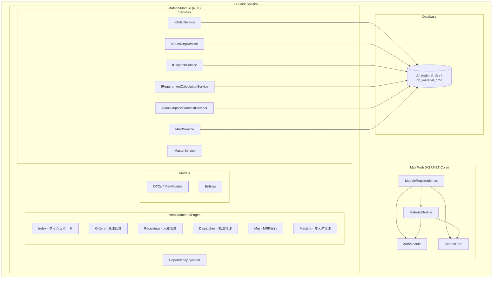

### モジュール間通信

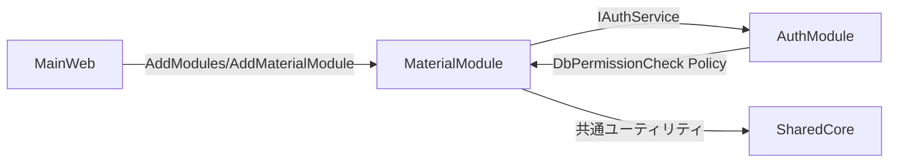

- MaterialModule は AuthModule の `[Authorize(Policy = "DbPermissionCheck")]` ポリシーを使用
- SharedCore の共通ユーティリティ（ページング、日付処理等）を利用
- MainWeb の `Configuration/ModuleRegistration.cs` で `services.AddMaterialModule(configuration)` により DI 登録（Program.cs は `builder.Services.AddModules(builder.Configuration)` で一括呼び出し）

### プロジェクト構造

```
MaterialModule/
├── Areas/Material/Pages/
│   ├── _ViewImports.cshtml
│   ├── _ViewStart.cshtml
│   ├── Index.cshtml / Index.cshtml.cs          (ダッシュボード)
│   ├── Orders/
│   │   ├── Index.cshtml / Index.cshtml.cs      (発注一覧)
│   │   ├── Create.cshtml / Create.cshtml.cs    (手動発注登録)
│   │   ├── Detail.cshtml / Detail.cshtml.cs    (発注詳細)
│   │   └── Approve.cshtml / Approve.cshtml.cs  (承認画面)
│   ├── Receivings/
│   │   ├── Index.cshtml / Index.cshtml.cs      (入庫一覧)
│   │   └── Create.cshtml / Create.cshtml.cs    (入庫登録)
│   ├── Dispatches/
│   │   ├── Index.cshtml / Index.cshtml.cs      (払出一覧)
│   │   └── Create.cshtml / Create.cshtml.cs    (払出登録)
│   ├── Mrp/
│   │   ├── Index.cshtml / Index.cshtml.cs      (MRP実行・結果)
│   │   └── Forecasts.cshtml / Forecasts.cshtml.cs (消費予測管理)
│   └── Masters/
│       ├── Items/                               (品目マスタ CRUD)
│       ├── Suppliers/                           (仕入先マスタ CRUD)
│       └── Warehouses/                          (倉庫マスタ CRUD)
├── DependencyInjection/
│   └── MaterialModuleExtensions.cs
├── Models/
│   ├── Entities/                                (DB エンティティ)
│   ├── Dtos/                                    (データ転送オブジェクト)
│   └── ViewModels/                              (画面用モデル)
├── Services/
│   ├── Interfaces/                              (public インターフェース)
│   └── Implementations/                         (internal 実装)
├── Data/
│   └── MaterialDbContext.cs
└── MaterialModule.csproj
```


---

## コンポーネントとインターフェース

### サービス層設計

全サービスインターフェースは `public`、実装クラスは `internal` とする。全 I/O 操作は `async/await` を使用する。

```mermaid
classDiagram
    class IOrderService {
        <<interface>>
        +CreateManualOrderAsync(OrderCreateDto) Task~OrderDto~
        +CreateProvisionalOrderAsync(OrderForecastDto) Task~OrderDto~
        +GetOrdersAsync(OrderFilterDto) Task~PagedResult~OrderDto~~
        +GetOrderByIdAsync(int) Task~OrderDto~
        +UpdateOrderAsync(int, OrderUpdateDto) Task~OrderDto~
        +CancelOrderAsync(int) Task~bool~
    }

    class IApprovalService {
        <<interface>>
        +SubmitForApprovalAsync(int orderId) Task~bool~
        +ApproveOrderAsync(int orderId, string approverNote) Task~bool~
        +RejectOrderAsync(int orderId, string reason) Task~bool~
        +GetPendingApprovalsAsync() Task~List~OrderDto~~
    }

    class IReceivingService {
        <<interface>>
        +CreateReceivingAsync(ReceivingCreateDto) Task~ReceivingDto~
        +GetReceivingsAsync(ReceivingFilterDto) Task~PagedResult~ReceivingDto~~
        +GetReceivingByIdAsync(int) Task~ReceivingDto~
    }

    class IDispatchService {
        <<interface>>
        +CreateDispatchAsync(DispatchCreateDto) Task~DispatchDto~
        +GetDispatchesAsync(DispatchFilterDto) Task~PagedResult~DispatchDto~~
        +GetDispatchByIdAsync(int) Task~DispatchDto~
    }

    class IRequirementCalculationService {
        <<interface>>
        +CalculateNetRequirementsAsync(int itemId, DateRange) Task~List~RequirementDto~~
        +ApplyLotSizingAsync(List~RequirementDto~) Task~List~LotSizedRequirementDto~~
        +OffsetLeadTimeAsync(List~LotSizedRequirementDto~) Task~List~PlannedOrderDto~~
        +RunMrpAsync(MrpRunParameterDto) Task~MrpResultDto~
    }

    class IConsumptionForecastProvider {
        <<interface>>
        +GetForecastsAsync(int itemId, DateRange) Task~List~ConsumptionForecastDto~~
    }

    class ManualForecastProvider {
        <<internal>>
    }
    class ProductionPlanProvider {
        <<internal, future>>
    }
    class BomExplosionProvider {
        <<internal, future>>
    }

    class IStockService {
        <<interface>>
        +GetCurrentStockAsync(int itemId, int warehouseId) Task~StockDto~
        +GetStockLedgerAsync(StockLedgerFilterDto) Task~PagedResult~StockLedgerDto~~
    }

    class IAlertService {
        <<interface>>
        +GetAlertsAsync() Task~List~AlertDto~~
        +GetAlertsByItemAsync(int itemId) Task~List~AlertDto~~
        +EvaluateAlertLevelAsync(int itemId) Task~AlertLevel~
    }

    class IMasterService {
        <<interface>>
        +GetItemsAsync(ItemFilterDto) Task~PagedResult~ItemDto~~
        +GetItemByIdAsync(int) Task~ItemDto~
        +CreateItemAsync(ItemCreateDto) Task~ItemDto~
        +UpdateItemAsync(int, ItemUpdateDto) Task~ItemDto~
        +GetSuppliersAsync() Task~List~SupplierDto~~
        +GetWarehousesAsync() Task~List~WarehouseDto~~
    }

    IConsumptionForecastProvider <|.. ManualForecastProvider
    IConsumptionForecastProvider <|.. ProductionPlanProvider
    IConsumptionForecastProvider <|.. BomExplosionProvider
    IRequirementCalculationService --> IConsumptionForecastProvider
    IRequirementCalculationService --> IStockService
```

### DI 登録

```csharp
// MaterialModuleExtensions.cs
public static class MaterialModuleExtensions
{
    public static IServiceCollection AddMaterialModule(
        this IServiceCollection services,
        IConfiguration configuration)
    {
        // DbContext
        services.AddDbContext<MaterialDbContext>(options =>
            options.UseSqlServer(configuration.GetConnectionString("MaterialDb")));

        // Services
        services.AddScoped<IOrderService, OrderService>();
        services.AddScoped<IApprovalService, ApprovalService>();
        services.AddScoped<IReceivingService, ReceivingService>();
        services.AddScoped<IDispatchService, DispatchService>();
        services.AddScoped<IRequirementCalculationService, RequirementCalculationService>();
        services.AddScoped<IStockService, StockService>();
        services.AddScoped<IAlertService, AlertService>();
        services.AddScoped<IMasterService, MasterService>();

        // Forecast Providers (Strategy Pattern)
        services.AddScoped<IConsumptionForecastProvider, ManualForecastProvider>();

        return services;
    }
}
```

### ページ認可

全ページに `[Authorize(Policy = "DbPermissionCheck")]` を適用する。`_ViewImports.cshtml` でモジュール共通の名前空間をインポートする。

```csharp
// Areas/Material/Pages/_ViewImports.cshtml
@using MaterialModule
@using MaterialModule.Models.ViewModels
@addTagHelper *, Microsoft.AspNetCore.Mvc.TagHelpers
```


---

## データモデル

### ER図

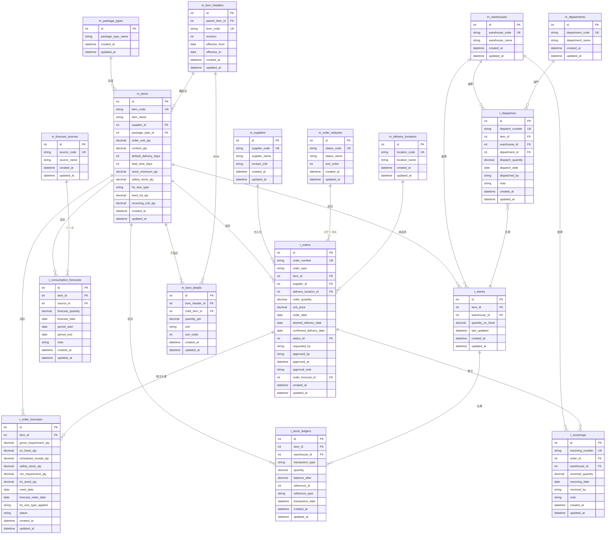

### ステータス遷移図

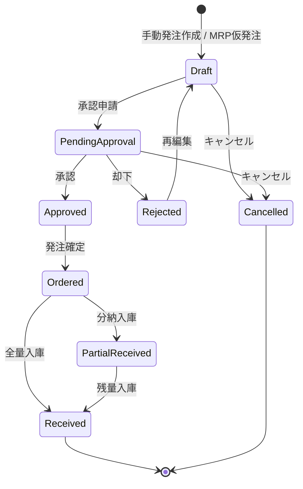

### 在庫台帳 transaction_type

| transaction_type | 説明 | quantity 符号 |
|-----------------|------|--------------|
| receiving | 入庫 | + |
| dispatch | 払出 | - |
| adjustment_plus | 棚卸増 | + |
| adjustment_minus | 棚卸減 | - |


---

## 画面設計

### 共通UIルール（全ページ共通）

MaterialModule の全ページで適用する共通のスタイル・挙動。MainWeb 側 CSS（site.css）は変更せず、`MaterialModule/wwwroot/css/material-fixed.css`（`_MaterialStyles.cshtml` 経由で読み込み）内で完結させる。

#### フォントサイズ統一
- ページ先頭に `<partial name="_MaterialStyles" />` を配置。
- コンテナに `class="container-fluid mt-3 px-4 material-page"` を設定（基準 0.7rem）。
- 一覧テーブルは 0.7〜0.75rem。StockLedger のみ 0.7rem（例外）。

#### 画面ロック（MaterialLock）
- `_MaterialStyles.cshtml` に共通の処理中オーバーレイ（`MaterialLock.lock/unlock/run`）を定義。
- POST フォーム送信時は自動で画面ロック（`data-no-lock` 属性付きは対象外、GET フィルタ・confirm キャンセルは対象外）。
- AJAX 保存系（Mrp の予測保存、StockLedger の受払セル保存・発注変換、TankCheck の一括保存、Dispatches の出庫登録 等）は明示的に `MaterialLock` を適用。

#### 一覧テーブルのヘッダ固定（縦スクロール時もヘッダを残す）
全ページの一覧テーブルで、縦スクロール時にヘッダ行を固定する。共通CSSクラスで実現する。

- `.material-list-scroll` … スクロール枠。`max-height: calc(100vh - 225px)` + 縦スクロール。一覧の高さは全ページこの値で統一。
- 単一行ヘッダ: `<div class="table-responsive material-list-scroll">` + `<thead class="table-light sticky-top">`。
  - CSS `.material-page .table thead.sticky-top th` で `position: sticky; top:0; z-index:5;` + 不透明背景 `#e9ecef`（行が透けないように）。
- 複合ヘッダ（rowspan/colspan の多段ヘッダ）: `<div class="table-responsive material-list-scroll material-grid-sticky">`。
  - CSS `.material-page .material-grid-sticky thead th` で各 th を sticky 化し、ヘッダ行ごとに top をずらす（`tr:nth-child(1)=top:0 / (2)=1.15rem / (3)=2.30rem`、行高 1.15rem 想定）。
  - 適用: StockLedger（受払台帳 3段ヘッダ）、OrderPlanning/_LedgerPartial（日別受払 2段ヘッダ）。

適用ページ:
- 単一行ヘッダ: Orders/Create・Confirm・Search, Approvals, Delivery, Receivings, Dispatches, JobQueue, Mrp（発注候補一覧）, TankCheck, Forecasts（消費予測・受払履歴）, MasterMaintenance 全タブ
- 複合ヘッダ: StockLedger, OrderPlanning
- 対象外: スクロール枠を持たない小サマリ（例: Mrp 在庫アラート Take(10)）、一覧テーブルを持たないページ（DeliveryMonitor / OrderRecommendation / PrintQueue）

### REQ-2: 手動発注

#### 発注一覧画面 (Orders/Index)

- フィルタ: 発注番号、品目、仕入先、ステータス、発注日範囲
- 一覧表示: 発注番号、品目名、仕入先名、数量、希望納期、ステータス
- アクション: 新規作成、詳細表示、承認申請

#### 発注登録画面 (Orders/Create)

```
┌─────────────────────────────────────────────┐
│ 手動発注登録                                  │
├─────────────────────────────────────────────┤
│ 品目:       [ドロップダウン + 検索]           │
│ 仕入先:     [自動表示 (品目マスタから)]        │
│ 発注数量:   [数値入力]                        │
│ 単価:       [数値入力]                        │
│ 希望納期:   [日付ピッカー]                    │
│ 納品先:     [ドロップダウン]                  │
│ 備考:       [テキストエリア]                  │
├─────────────────────────────────────────────┤
│ [下書き保存]  [承認申請]  [キャンセル]         │
└─────────────────────────────────────────────┘
```

- 品目選択時に仕入先・デフォルト納期を自動設定
- 希望納期のデフォルト = 発注日 + default_delivery_days

### REQ-3: MRP自動発注

#### MRP実行画面 (Mrp/Index)

```
┌─────────────────────────────────────────────┐
│ MRP実行                                      │
├─────────────────────────────────────────────┤
│ 対象品目:   [全品目 / 個別選択]               │
│ 計算期間:   [開始日] ～ [終了日]              │
│ [MRP実行]                                    │
├─────────────────────────────────────────────┤
│ 実行結果                                     │
│ ┌─────────────────────────────────────────┐ │
│ │品目│総所要量│手持在庫│入庫予定│安全在庫│  │ │
│ │    │正味所要│ロット数│発注予定日│アラート│ │ │
│ └─────────────────────────────────────────┘ │
│ [仮発注一括作成]  [CSV出力]                   │
└─────────────────────────────────────────────┘
```

#### 消費予測管理画面 (Mrp/Forecasts)

- 手動予測の登録・編集・削除
- 予測ソース別の一覧表示
- 品目・期間でのフィルタリング

### REQ-4: 発注承認

#### 承認画面 (Orders/Approve)

```
┌─────────────────────────────────────────────┐
│ 発注承認                                     │
├─────────────────────────────────────────────┤
│ 承認待ち一覧                                 │
│ ┌─────────────────────────────────────────┐ │
│ │発注番号│品目│仕入先│数量│金額│申請者│日付│ │
│ │ [承認] [却下] [詳細]                     │ │
│ └─────────────────────────────────────────┘ │
│ 承認/却下コメント: [テキストエリア]           │
└─────────────────────────────────────────────┘
```

- 承認権限は DbPermissionCheck ポリシーで制御
- 承認時に approved_by, approved_at を記録

### REQ-5: 入庫処理

#### 入庫登録画面 (Receivings/Create)

```
┌─────────────────────────────────────────────┐
│ 入庫登録                                     │
├─────────────────────────────────────────────┤
│ 発注番号:   [検索・選択]                      │
│ ─── 発注情報（自動表示）───                   │
│ 品目:       XXXXX                            │
│ 発注数量:   100  入庫済数量: 50               │
│ ─── 入庫情報 ───                             │
│ 入庫数量:   [数値入力] (残: 50)              │
│ 入庫倉庫:   [ドロップダウン]                  │
│ 入庫日:     [日付ピッカー]                    │
│ 備考:       [テキストエリア]                  │
├─────────────────────────────────────────────┤
│ [入庫登録]  [キャンセル]                      │
└─────────────────────────────────────────────┘
```

- 入庫数量 ≤ 発注残数量のバリデーション
- 入庫登録時に t_stocks, t_stock_ledgers を同時更新

### REQ-6: 払出処理

#### 払出登録画面 (Dispatches/Create)

```
┌─────────────────────────────────────────────┐
│ 払出登録                                     │
├─────────────────────────────────────────────┤
│ 品目:       [ドロップダウン + 検索]           │
│ 倉庫:       [ドロップダウン]                  │
│ 現在庫:     XXX (自動表示)                   │
│ 払出数量:   [数値入力]                        │
│ 払出先部門: [ドロップダウン]                  │
│ 払出日:     [日付ピッカー]                    │
│ 備考:       [テキストエリア]                  │
├─────────────────────────────────────────────┤
│ [払出登録]  [キャンセル]                      │
└─────────────────────────────────────────────┘
```

- 払出数量 ≤ 現在庫のバリデーション
- 払出登録時に t_stocks, t_stock_ledgers を同時更新

### REQ-7: 納期監視

#### ダッシュボード (Index)

```
┌─────────────────────────────────────────────┐
│ Material ダッシュボード                       │
├─────────────────────────────────────────────┤
│ アラートサマリ                                │
│ 🔴 即時対応: 3件  🟠 納期超過: 2件           │
│ 🟡 3日以内: 5件   🟢 正常: 42件              │
├─────────────────────────────────────────────┤
│ アラート詳細一覧                              │
│ ┌─────────────────────────────────────────┐ │
│ │レベル│品目│現在庫│最低在庫│発注予定日│状態│ │
│ └─────────────────────────────────────────┘ │
├─────────────────────────────────────────────┤
│ 最近の入庫・払出                              │
│ ┌─────────────────────────────────────────┐ │
│ │日付│種別│品目│数量│倉庫│担当者│          │ │
│ └─────────────────────────────────────────┘ │
└─────────────────────────────────────────────┘
```


---

## MRP計算エンジン設計

### MRP標準フロー

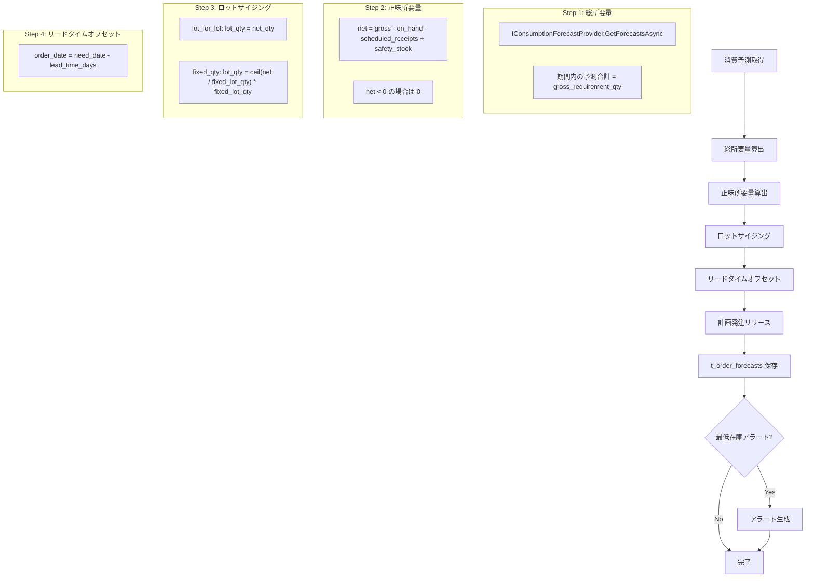

### MRP計算の詳細ロジック

```csharp
// IRequirementCalculationService.RunMrpAsync の疑似コード
public async Task<MrpResultDto> RunMrpAsync(MrpRunParameterDto param)
{
    var results = new List<OrderForecastDto>();

    foreach (int itemId in param.TargetItemIds)
    {
        // Step 1: 総所要量
        List<ConsumptionForecastDto> forecasts =
            await _forecastProvider.GetForecastsAsync(itemId, param.DateRange);
        decimal grossRequirement = forecasts.Sum(f => f.ForecastQuantity);

        // Step 2: 正味所要量
        StockDto stock = await _stockService.GetCurrentStockAsync(itemId, param.WarehouseId);
        decimal scheduledReceipts = await GetScheduledReceiptsAsync(itemId, param.DateRange);
        ItemDto item = await _masterService.GetItemByIdAsync(itemId);

        decimal netRequirement = grossRequirement
            - stock.QuantityOnHand
            - scheduledReceipts
            + item.SafetyStockQty;
        netRequirement = Math.Max(0, netRequirement);

        // Step 3: ロットサイジング
        decimal lotSizedQty = item.LotSizeType switch
        {
            "lot_for_lot" => netRequirement,
            "fixed_qty" => Math.Ceiling(netRequirement / item.FixedLotQty) * item.FixedLotQty,
            _ => netRequirement
        };

        // Step 4: リードタイムオフセット
        DateOnly needDate = /* 最も早い予測日 */;
        DateOnly orderDate = needDate.AddDays(-item.LeadTimeDays);

        // Step 5: 計画発注リリース
        results.Add(new OrderForecastDto
        {
            ItemId = itemId,
            GrossRequirementQty = grossRequirement,
            OnHandQty = stock.QuantityOnHand,
            ScheduledReceiptQty = scheduledReceipts,
            SafetyStockQty = item.SafetyStockQty,
            NetRequirementQty = netRequirement,
            LotSizedQty = lotSizedQty,
            NeedDate = needDate,
            ForecastOrderDate = orderDate,
            LotSizeTypeApplied = item.LotSizeType
        });
    }

    // t_order_forecasts に保存
    await SaveOrderForecastsAsync(results);

    // アラート評価
    await _alertService.EvaluateAlertsAsync(param.TargetItemIds);

    return new MrpResultDto { Forecasts = results };
}
```

### 消費予測プロバイダ抽象化

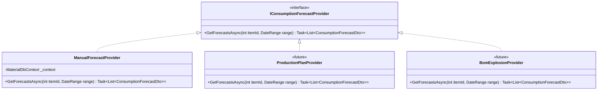

- 現フェーズでは ManualForecastProvider のみ実装
- DI で差し替え可能な設計により、将来の ProductionPlanProvider / BomExplosionProvider 追加が容易

---

## アラートシステム設計

### アラートレベル定義

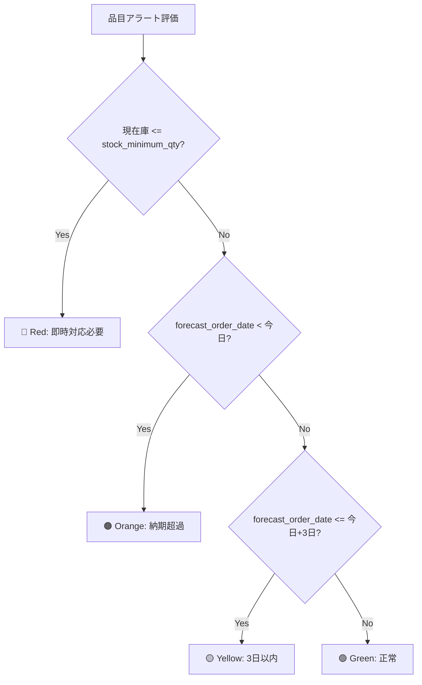

| レベル | 条件 | アクション |
|--------|------|-----------|
| 🔴 Red | `current_stock <= stock_minimum_qty` | 即時発注が必要 |
| 🟠 Orange | `forecast_order_date < today` | リードタイム超過、至急対応 |
| 🟡 Yellow | `forecast_order_date <= today + 3 days` | 近日中に発注が必要 |
| 🟢 Green | 上記いずれにも該当しない | 正常 |

### アラート評価ロジック

```csharp
public async Task<AlertLevel> EvaluateAlertLevelAsync(int itemId)
{
    StockDto stock = await _stockService.GetCurrentStockAsync(itemId, defaultWarehouseId);
    ItemDto item = await _masterService.GetItemByIdAsync(itemId);
    OrderForecastDto? latestForecast = await GetLatestForecastAsync(itemId);

    // Red: 在庫が最低在庫以下
    if (stock.QuantityOnHand <= item.StockMinimumQty)
        return AlertLevel.Red;

    if (latestForecast != null)
    {
        DateOnly today = DateOnly.FromDateTime(DateTime.Today);

        // Orange: 発注予定日が過去
        if (latestForecast.ForecastOrderDate < today)
            return AlertLevel.Orange;

        // Yellow: 発注予定日が3日以内
        if (latestForecast.ForecastOrderDate <= today.AddDays(3))
            return AlertLevel.Yellow;
    }

    // Green: 正常
    return AlertLevel.Green;
}
```

### アラート一貫性

- アラートレベルは相互排他的（1品目に対して1レベルのみ）
- Red > Orange > Yellow > Green の優先順位で評価
- 在庫変動（入庫・払出）時にアラートを再評価


---

## データフロー

### 手動発注フロー

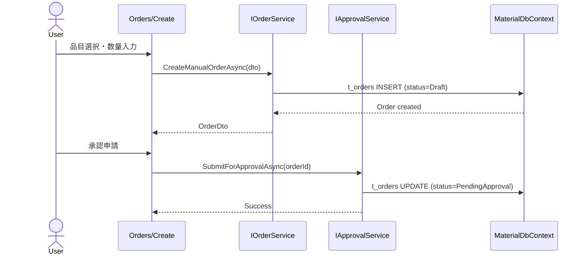

### MRP自動発注フロー

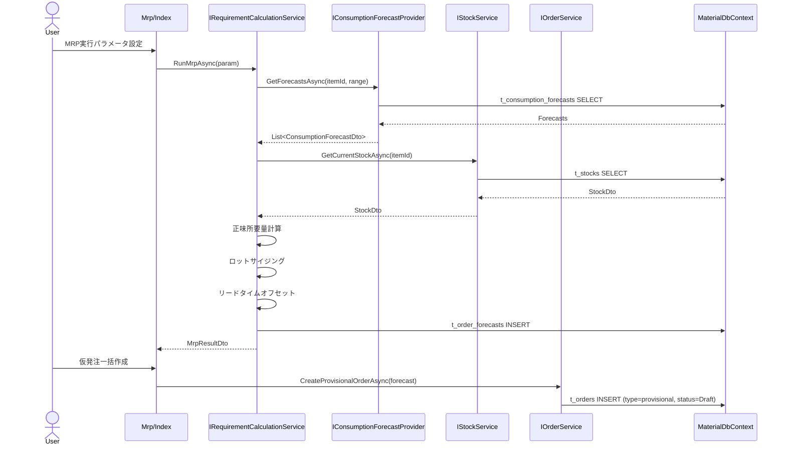

### 入庫フロー

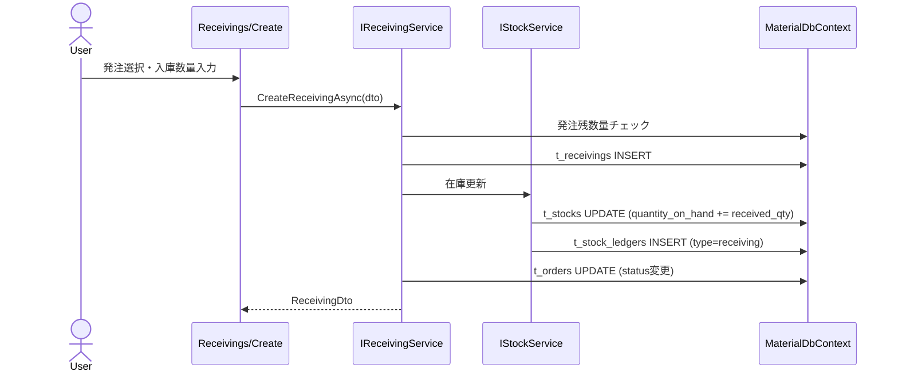

### 払出フロー

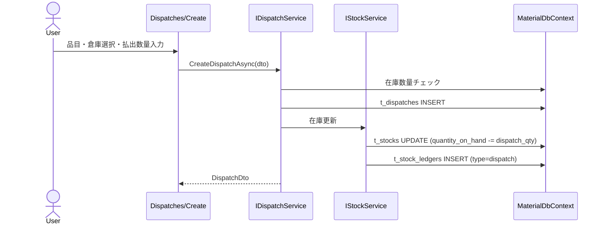

---

## 統合ポイント

### CoCore モジュール間連携

| 連携先 | インターフェース | 用途 |
|--------|----------------|------|
| AuthModule | `[Authorize(Policy = "DbPermissionCheck")]` | 全ページの認可制御 |
| AuthModule | `DbPermissionHandler` | DB ベースの権限チェック |
| SharedCore | 共通ユーティリティ | ページング、日付処理、共通 UI コンポーネント |
| MainWeb | `AddMaterialModule()` | DI 登録・モジュール初期化 |

### MainWeb での登録

```csharp
// MainWeb/Program.cs
builder.Services.AddMaterialModule(builder.Configuration);
```

### 接続文字列設定

```json
// appsettings.json
{
  "ConnectionStrings": {
    "MaterialDb": "Server=OJIADM23120073;Database=db_material_dev;User Id=sa;Password=***;TrustServerCertificate=True;"
  }
}
```

### レガシーシステムとの対応

| Material モジュール | レガシー Web (NsASPWF) | レガシー Desktop (NsAsap) |
|---------------------|----------------------|--------------------------|
| Orders/Create | kojyoire_seikyu | frmKobaiHachuToroku |
| MRP/Index | - | frmPreOrder |
| Receivings/Create | - | frmNyukaRenraku |
| Dispatches/Create | jisseki_haraidasi | frmDaicho |
| Orders/Approve | - | frmKobaiHachuToroku (承認) |


---

## 正当性プロパティ (Correctness Properties)

*プロパティとは、システムの全ての有効な実行において真であるべき特性や振る舞いのことである。プロパティは、人間が読める仕様と機械が検証可能な正当性保証の橋渡しとなる。*

### Property 1: 在庫整合性 — 入庫による在庫増加と台帳記録

*For any* 入庫登録において、入庫数量が発注残数量以下である場合、入庫後の `t_stocks.quantity_on_hand` は入庫前の値 + 入庫数量と等しく、かつ `t_stock_ledgers` に `transaction_type='receiving'` のレコードが1件作成され、その `balance_after` が更新後の在庫数量と一致すること。

**Validates: Requirements 5.1, 5.2**

### Property 2: 在庫整合性 — 払出による在庫減少と台帳記録

*For any* 払出登録において、払出数量が現在庫以下である場合、払出後の `t_stocks.quantity_on_hand` は払出前の値 - 払出数量と等しく、かつ `t_stock_ledgers` に `transaction_type='dispatch'` のレコードが1件作成され、その `balance_after` が更新後の在庫数量と一致すること。

**Validates: Requirements 6.1, 6.2**

### Property 3: 入庫上限ガード

*For any* 発注と入庫の組み合わせにおいて、累計入庫数量が発注数量を超える入庫は拒否されること。すなわち、`sum(received_quantity) + new_received_quantity > order_quantity` の場合、入庫登録は失敗すること。

**Validates: Requirements 5.3**

### Property 4: 払出上限ガード

*For any* 品目・倉庫の組み合わせにおいて、払出数量が現在庫を超える払出は拒否されること。すなわち、`dispatch_quantity > quantity_on_hand` の場合、払出登録は失敗すること。

**Validates: Requirements 6.3**

### Property 5: ステータス遷移の正当性

*For any* 発注レコードにおいて、ステータス遷移は以下のパスのみ許可されること: Draft→PendingApproval、PendingApproval→Approved、PendingApproval→Rejected、Rejected→Draft、Approved→Ordered、Ordered→PartialReceived、Ordered→Received、PartialReceived→Received、Draft→Cancelled、PendingApproval→Cancelled。これ以外の遷移は拒否されること。

**Validates: Requirements 4.1, 4.2, 4.3, 4.4**

### Property 6: 承認メタデータの記録

*For any* 発注承認において、承認後の発注レコードには `approved_by` が非空、`approved_at` が承認時刻、`approval_note` が記録されていること。未承認の発注（Draft, PendingApproval）では `approved_by` と `approved_at` が null であること。

**Validates: Requirements 4.2**

### Property 7: デフォルト納期の自動設定

*For any* 品目を選択した手動発注において、希望納期のデフォルト値は `発注日 + default_delivery_days` と等しいこと。

**Validates: Requirements 2.2**

### Property 8: MRP正味所要量計算

*For any* 品目の MRP 計算において、正味所要量 = max(0, 総所要量 - 手持在庫 - 入庫予定 + 安全在庫) であること。正味所要量は常に 0 以上であること。

**Validates: Requirements 3.2**

### Property 9: MRPロットサイジング

*For any* 品目と正味所要量において:
- `lot_size_type = 'lot_for_lot'` の場合、`lot_sized_qty = net_requirement_qty`
- `lot_size_type = 'fixed_qty'` の場合、`lot_sized_qty = ceil(net / fixed_lot_qty) * fixed_lot_qty`
- いずれの場合も `lot_sized_qty >= net_requirement_qty` であること
- `fixed_qty` の場合、`lot_sized_qty` は `fixed_lot_qty` の倍数であること

**Validates: Requirements 3.3, 3.4**

### Property 10: MRPリードタイムオフセット

*For any* 品目の計画発注において、`forecast_order_date = need_date - lead_time_days` であること。

**Validates: Requirements 3.5**

### Property 11: アラートレベルの一貫性

*For any* 品目において、アラートレベルは以下の優先順位で排他的に1つだけ割り当てられること:
1. Red: `current_stock <= stock_minimum_qty`
2. Orange: Red でなく `forecast_order_date < today`
3. Yellow: Red/Orange でなく `forecast_order_date <= today + 3 days`
4. Green: 上記いずれにも該当しない

**Validates: Requirements 3.6, 3.7, 3.8, 3.9**

### Property 12: 手動発注の初期状態

*For any* 手動発注作成において、作成された発注レコードは `order_type='manual'`、`status='Draft'` であり、`approved_by` と `approved_at` が null であること。

**Validates: Requirements 2.1**

### Property 13: 入庫完了によるステータス自動遷移

*For any* 発注において、累計入庫数量が発注数量と等しくなった場合、発注ステータスは自動的に Received に遷移すること。累計入庫数量が 0 より大きく発注数量未満の場合は PartialReceived であること。

**Validates: Requirements 5.4**

### Property 14: アラート集計の正確性

*For any* アラート一覧において、各レベルの件数合計は全品目数と等しいこと（全品目が必ずいずれか1つのレベルに分類される）。

**Validates: Requirements 7.1**


---

## エラーハンドリング

### バリデーションエラー

| 操作 | バリデーション | エラーメッセージ |
|------|--------------|----------------|
| 発注作成 | 品目未選択 | 品目を選択してください |
| 発注作成 | 数量 ≤ 0 | 発注数量は1以上を入力してください |
| 発注作成 | 希望納期が過去 | 希望納期は本日以降を指定してください |
| 入庫登録 | 入庫数量 > 発注残数量 | 入庫数量が発注残数量を超えています |
| 入庫登録 | 発注ステータスが Ordered/PartialReceived 以外 | この発注は入庫登録できません |
| 払出登録 | 払出数量 > 現在庫 | 在庫が不足しています |
| 払出登録 | 数量 ≤ 0 | 払出数量は1以上を入力してください |
| 承認操作 | ステータスが PendingApproval 以外 | この発注は承認/却下できません |
| MRP実行 | 対象品目なし | 対象品目を選択してください |

### ビジネスロジックエラー

- ステータス不正遷移: 許可されていないステータス遷移は `InvalidOperationException` をスロー
- 同時実行制御: `DbUpdateConcurrencyException` をキャッチし、楽観的排他制御で対応
- 在庫不整合: トランザクション内で在庫更新と台帳記録を一括実行（部分更新を防止）

### データベースエラー

- 接続エラー: リトライポリシー（Polly 等）で自動リトライ
- タイムアウト: 適切なタイムアウト設定とユーザーへのフィードバック
- 一意制約違反: 発注番号等の重複時にユーザーフレンドリーなメッセージ表示

### トランザクション管理

```csharp
// 入庫登録の例: 在庫更新と台帳記録を1トランザクションで実行
using var transaction = await _context.Database.BeginTransactionAsync();
try
{
    // 1. t_receivings INSERT
    // 2. t_stocks UPDATE
    // 3. t_stock_ledgers INSERT
    // 4. t_orders UPDATE (ステータス変更)
    await _context.SaveChangesAsync();
    await transaction.CommitAsync();
}
catch
{
    await transaction.RollbackAsync();
    throw;
}
```

---

## テスト戦略

### テストアプローチ

本モジュールでは、ユニットテストとプロパティベーステストの二重アプローチを採用する。

- **ユニットテスト**: 具体的な例、エッジケース、エラー条件の検証
- **プロパティベーステスト**: 全入力に対する普遍的プロパティの検証
- 両者は補完的であり、包括的なカバレッジに必要

### テストフレームワーク

| 種別 | フレームワーク |
|------|--------------|
| ユニットテスト | xUnit |
| プロパティベーステスト | FsCheck.Xunit (C# 向け FsCheck) |
| モック | Moq |
| DB テスト | EF Core InMemory / SQLite InMemory |

### プロパティベーステスト設定

- 各プロパティテストは最低 100 回のイテレーションを実行
- 各テストにはデザインドキュメントのプロパティ番号を参照するコメントを付与
- タグフォーマット: **Feature: material-module, Property {number}: {property_text}**
- 各正当性プロパティは1つのプロパティベーステストで実装

### テスト対象と優先度

#### プロパティベーステスト（高優先度）

| Property | テスト内容 | 対象サービス |
|----------|----------|-------------|
| Property 1 | 入庫→在庫増加+台帳記録 | ReceivingService, StockService |
| Property 2 | 払出→在庫減少+台帳記録 | DispatchService, StockService |
| Property 3 | 入庫上限ガード | ReceivingService |
| Property 4 | 払出上限ガード | DispatchService |
| Property 5 | ステータス遷移の正当性 | OrderService, ApprovalService |
| Property 8 | MRP正味所要量計算 | RequirementCalculationService |
| Property 9 | MRPロットサイジング | RequirementCalculationService |
| Property 10 | MRPリードタイムオフセット | RequirementCalculationService |
| Property 11 | アラートレベル一貫性 | AlertService |
| Property 13 | 入庫完了ステータス遷移 | ReceivingService |
| Property 14 | アラート集計正確性 | AlertService |

#### ユニットテスト

| テスト内容 | 対象 |
|----------|------|
| 手動発注作成（正常系） | OrderService |
| 手動発注作成（バリデーションエラー） | OrderService |
| デフォルト納期自動設定 | OrderService (Property 7) |
| 手動発注初期状態 | OrderService (Property 12) |
| 承認メタデータ記録 | ApprovalService (Property 6) |
| MRP実行（エンドツーエンド） | RequirementCalculationService |
| 消費予測プロバイダ切替 | ManualForecastProvider |
| マスタ CRUD 操作 | MasterService |

#### エッジケーステスト

| テスト内容 | 対象 |
|----------|------|
| 数量0/負数での発注作成 | OrderService |
| 在庫0での払出試行 | DispatchService |
| 全量入庫済み発注への追加入庫 | ReceivingService |
| MRP計算で予測データなし | RequirementCalculationService |
| fixed_lot_qty=0 でのロットサイジング | RequirementCalculationService |

### プロパティベーステストの実装例

```csharp
// Feature: material-module, Property 8: MRP正味所要量計算
[Property(MaxTest = 100)]
public Property NetRequirement_IsNonNegative_AndFollowsFormula(
    PositiveInt gross,
    NonNegativeInt onHand,
    NonNegativeInt scheduledReceipts,
    NonNegativeInt safetyStock)
{
    decimal expected = Math.Max(0,
        gross.Get - onHand.Get - scheduledReceipts.Get + safetyStock.Get);

    decimal actual = RequirementCalculationService.CalculateNetRequirement(
        gross.Get, onHand.Get, scheduledReceipts.Get, safetyStock.Get);

    return (actual == expected && actual >= 0).ToProperty();
}

// Feature: material-module, Property 9: MRPロットサイジング
[Property(MaxTest = 100)]
public Property LotSizing_FixedQty_IsMultipleAndSufficient(
    PositiveInt netRequirement,
    PositiveInt fixedLotQty)
{
    decimal lotSized = RequirementCalculationService.ApplyLotSizing(
        netRequirement.Get, "fixed_qty", fixedLotQty.Get);

    return (lotSized >= netRequirement.Get
        && lotSized % fixedLotQty.Get == 0).ToProperty();
}

// Feature: material-module, Property 11: アラートレベル一貫性
[Property(MaxTest = 100)]
public Property AlertLevel_IsExclusiveAndDeterministic(
    NonNegativeInt currentStock,
    NonNegativeInt minimumStock,
    Gen<DateOnly> forecastDate)
{
    AlertLevel level = AlertService.EvaluateAlertLevel(
        currentStock.Get, minimumStock.Get, forecastDate);

    // 排他性: 1つのレベルのみ
    bool isExclusive = new[] {
        level == AlertLevel.Red,
        level == AlertLevel.Orange,
        level == AlertLevel.Yellow,
        level == AlertLevel.Green
    }.Count(x => x) == 1;

    // 優先順位: Red条件が真ならRedであること
    bool priorityCorrect = currentStock.Get <= minimumStock.Get
        ? level == AlertLevel.Red
        : true;

    return (isExclusive && priorityCorrect).ToProperty();
}
```
