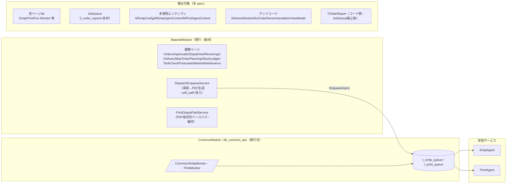

# Design Document

## Overview

CommonModule/PrintAgent/SmtpAgent への移行で不要化した MaterialModule の残骸を、**機能不変・ビルド維持・可逆**を原則に段階撤去する。撤去は依存の浅い順（空dir → legacy ページ → 未使用エンティティ → デッドコード → 保全テーブルのコード側退役）で行い、各段階でビルド可能を保つ。DB の物理 DROP はユーザー実行。

## Architecture

本 spec は新規アーキテクチャを導入しない。既存 MaterialModule から**移行済みの残骸を除去**するのみ。現行の稼働構成は次のとおりで、撤去はこの構成に影響しない。

- 撤去対象（Legacy）は現行フロー（Material→CommonModule→Agents）に一切関与しない。
- `t_order_reports`／旧3テーブルの**物理 DROP はユーザー**（保全・破壊的）。

## 調査で判明した現状（証拠）

### 空ページディレクトリ（ソース0）
`Areas/Material/Pages/` 配下: `SmtpMonitor`・`PrintMonitor`・`FaxMonitor`・`PrintQueue`・`DeliveryMonitor`・`OrderRecommendation`（いずれもファイル0）。過去に存在した画面の消し残り。

### legacy ページ（旧テーブル依存）
`Areas/Material/Pages/JobQueue/Index.cshtml(.cs)`：`context.OrderReports`（`t_order_reports`）の `PrintStatus`/`FaxStatus`/`OutputType` をグループ集計する旧印刷/FAXジョブ一覧。現行は `/Common/PrintMonitor`・`/Common/SmtpMonitor` に置換。新パイプラインは `t_order_reports` に書かないため表示は陳腐化。PDF ダウンロード `OnGetDownloadPdfAsync`→`IOrderPdfService.GenerateGroupOrderPdfAsync` を持つ（`IOrderPdfService` の他利用は要確認）。

### 未使用エンティティ/DbSet（実使用ゼロ・移行済）
- `Data/Entities/MSmtpConfig.cs`／`MSmtpAgentControl.cs`／`MPrintAgentControl.cs`。
- `MaterialDbContext`：`SmtpConfigs`／`SmtpAgentControls`／`PrintAgentControls` DbSet。
- grep 結果：定義と DbSet 以外に参照なし（CommonModule/db_common_dev に同等が存在）。

### デッドコード（撤去済みページの残骸）
- `Models/Dtos/DeliveryMonitorDto.cs` ＋ `IOrderService.GetDeliveryMonitorListAsync` ＋ `OrderService`(358–) 実装。呼び出し元（ページ）なし。
- `Models/ViewModels/OrderRecommendationViewModel.cs`（＋関連メソッドがあれば）。呼び出し元なし。

### 保全対象（コード側は JobQueue 廃止後に退役可）
- `Data/Entities/TOrderReport.cs` ＋ `MaterialDbContext.OrderReports`。JobQueue 以外の参照なし → JobQueue 廃止後に定義+DbSet のみ＝削除可。テーブル `t_order_reports` は保全（J-2）。

### 保持（現行使用・削除しない）
- `MPrintOutputPath`／`PrintOutputPaths`（`PrintOutputPathService`＝発注PDF保存先ベースパス・`ApprovalReportPdfProvider` が使用）。
- 旧 `publish/` 配下の Index.cshtml はビルド成果物（ソースではない）＝対象外。

## 撤去順序（依存が浅い順・各段階ビルド可能）

1. 空ページdir削除（参照なし・無害）。
2. JobQueue 廃止（ページ削除）→ `t_order_reports` 参照が定義+DbSet のみに。
3. 未使用エンティティ/DbSet 削除（MSmtpConfig/MSmtpAgentControl/MPrintAgentControl）。
4. デッドコード削除（DeliveryMonitorDto/OrderRecommendationViewModel＋未使用サービスメソッド）。
5. `TOrderReport`＋`OrderReports` DbSet 削除（2 の後）。
6. 導線解除SQL（JobQueue）作成＝ユーザー適用。DB DROP（J-1/J-2）＝ユーザー。
7. docs 反映。

各段階で「削除対象への残存参照ゼロ」を grep で確認してから削除する。

## Components and Interfaces

本 spec は撤去作業のため新規コンポーネントは作らない。影響インターフェース:
- `IOrderService`/`OrderService`：`GetDeliveryMonitorListAsync`（及び発注推奨系の未使用メソッド）を宣言・実装から削除（呼び出し元ゼロを確認）。他メソッドは不変。
- `MaterialDbContext`：DbSet 5件（SmtpConfigs/SmtpAgentControls/PrintAgentControls/OrderReports）を削除。他は不変。
- `IOrderPdfService`/`OrderPdfService`：JobQueue が使う `GenerateGroupOrderPdfAsync` の他利用を確認。利用が JobQueue のみなら当該メソッドも削除候補（本 spec では既定「残す」。単独利用確定時のみ削除をタスクで判断）。

## Data Models

撤去対象の EF マッピング（テーブル本体は DB 側・DROP はユーザー）:
- `MSmtpConfig`（`m_smtp_config`＠db_material_dev・旧コピー）／`MSmtpAgentControl`（`m_smtp_agent_control`）／`MPrintAgentControl`（`m_print_agent_control`）＝コード側 DbSet/エンティティ削除。テーブルは J-1 でユーザー DROP。
- `TOrderReport`（`t_order_reports`）＝JobQueue 廃止後にコード側削除。テーブルは J-2 保全後ユーザー DROP。

保持する EF マッピング（変更なし）:
- `MPrintOutputPath`（`PrintOutputPaths`）ほか現行マスタ/トランザクション一式。

## Correctness Properties

### Property 1: 撤去後に残存参照ゼロ
削除した各シンボル（エンティティ/DbSet/DTO/ViewModel/メソッド/ページ）について、MaterialModule（＋テスト）内の参照が0であること（grep で確認）。
**Validates: Requirements 3.1, 4.1, 4.2, 5.1**

### Property 2: ビルド不変（機能不変）
各撤去タスク後、MaterialModule はビルド成功し、現行の業務ページ・サービスの公開シグネチャ（撤去対象を除く）は不変であること。
**Validates: Requirements 2.4, 3.3, 4.4, 5.3, 7.2**

## Error Handling

- 削除対象に予期しない参照が見つかった場合は削除を中止し、参照箇所を提示してユーザー確認（Req 1.2/2.3/3.2/4.3）。
- ビルドはユーザー実施（project-rules）。Kiro は撤去と参照確認・診断確認まで。

## Testing Strategy

- 新規テストは追加しない（撤去作業）。妥当性は「残存参照ゼロ（grep）」＋「ユーザーのビルド成功」で確認。
- MaterialModule.Tests に撤去対象への参照があれば併せて是正（Req 3.2）。

## プロジェクト制約

- 変更は MaterialModule 内＋導線解除SQL のみ。MainWeb/AuthModule/SharedCore/CommonModule 不変更。
- DB 物理 DROP はユーザー実行（破壊的・可逆でないためバックアップ前提）。
- Spec 正本は `.kiro/specs/MaterialModule/materialmodule-legacy-cleanup/`。
