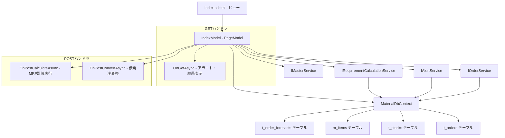
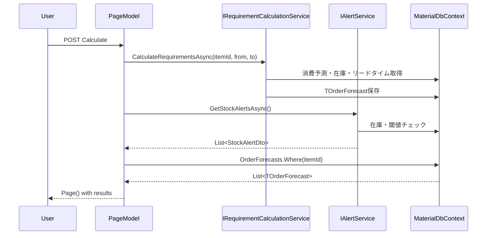
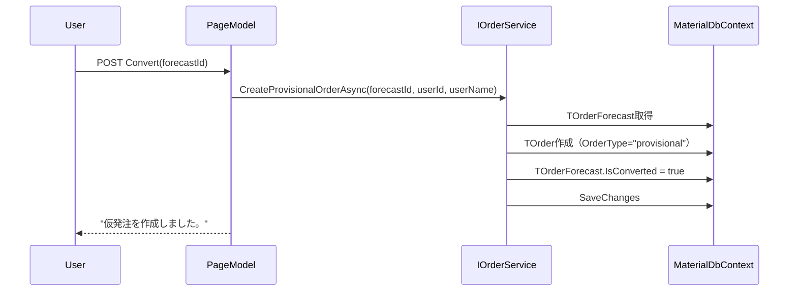

# 設計書: MRP計算ページ

## 概要

MRP計算ページ（Mrp/Index）の技術設計。在庫アラート表示、MRP計算実行（単一品目/全品目）、計算結果表示、仮発注変換を行うRazor Pages画面。

対象ファイル:
- `MaterialModule/Areas/Material/Pages/Mrp/Index.cshtml` — ビュー（アラート・計算フォーム・結果テーブル）
- `MaterialModule/Areas/Material/Pages/Mrp/Index.cshtml.cs` — PageModel（GET/POSTハンドラ、MrpForecastViewModel）
- `MaterialModule/Services/IRequirementCalculationService.cs` — MRP計算サービスインターフェース
- `MaterialModule/Services/IAlertService.cs` — アラートサービスインターフェース
- `MaterialModule/Services/IOrderService.cs` — 発注サービスインターフェース
- `MaterialModule/Services/IMasterService.cs` — マスタサービスインターフェース
- `MaterialModule/Data/Entities/TOrderForecast.cs` — 発注予測エンティティ

設計方針:
- Razor Pages PageModelパターンに準拠（GET/POSTハンドラ分離）
- 複数サービスの協調（計算→アラート更新→結果表示）
- TOrderForecastエンティティからMrpForecastViewModelへの変換
- MaterialDbContextへの直接アクセス（結果取得のみ）

## アーキテクチャ



### レイヤー構成

| レイヤー | 責務 |
|---------|------|
| ビュー (Index.cshtml) | アラートテーブル、計算フォーム、結果テーブル、仮発注ボタン |
| PageModel (IndexModel) | リクエスト処理、ViewModel変換、サービス呼び出し |
| サービス (IRequirementCalculationService) | MRP計算ロジック |
| サービス (IAlertService) | 在庫アラート算出 |
| サービス (IOrderService) | 仮発注作成 |
| サービス (IMasterService) | 品目マスタ取得 |
| DbContext (MaterialDbContext) | TOrderForecast直接クエリ |

## コンポーネントとインターフェース

### 1. IndexModel（PageModel）

#### コンストラクタ依存性注入

```csharp
public class IndexModel(
    IRequirementCalculationService requirementCalculationService,
    IAlertService alertService,
    IOrderService orderService,
    IMasterService masterService,
    MaterialDbContext context
) : PageModel
```

#### プロパティ

| プロパティ | 型 | 用途 |
|-----------|---|------|
| Alerts | `List<StockAlertDto>` | 在庫アラート一覧 |
| MrpResults | `List<MrpForecastViewModel>` | MRP計算結果一覧 |
| Items | `List<SelectListItem>` | 品目ドロップダウン選択肢 |
| ItemId | `int?` | 選択中の品目ID（BindProperty, SupportsGet） |
| FromDate | `DateOnly` | 計算開始日（BindProperty、デフォルト=今日） |
| ToDate | `DateOnly` | 計算終了日（BindProperty、デフォルト=今日+3ヶ月） |
| SuccessMessage | `string?` | 成功メッセージ |

#### GETハンドラ

##### OnGetAsync()

```csharp
public async Task OnGetAsync()
```

処理フロー:
1. `LoadItemsAsync()` で品目ドロップダウン構築
2. `alertService.GetStockAlertsAsync()` でアラート取得
3. ItemIdが有効値（> 0）の場合、`LoadMrpResultsAsync(ItemId.Value)` で既存結果表示

#### POSTハンドラ

##### OnPostCalculateAsync()

```csharp
public async Task<IActionResult> OnPostCalculateAsync()
```

処理フロー:
1. `LoadItemsAsync()` で品目ドロップダウン構築
2. `alertService.GetStockAlertsAsync()` でアラート取得
3. ItemIdが有効値の場合:
   - `requirementCalculationService.CalculateRequirementsAsync(ItemId.Value, FromDate, ToDate)`
4. ItemIdが未選択の場合:
   - `requirementCalculationService.CalculateAllItemRequirementsAsync(FromDate, ToDate)`
5. アラート再取得（計算後の状態反映）
6. ItemIdが有効値の場合、`LoadMrpResultsAsync(ItemId.Value)` で結果表示
7. `SuccessMessage = "MRP計算が完了しました。"`
8. `Page()` 返却

##### OnPostConvertAsync(forecastId)

```csharp
public async Task<IActionResult> OnPostConvertAsync(int forecastId)
```

処理フロー:
1. `User.Identity.Name` からuserId/userName取得
2. `orderService.CreateProvisionalOrderAsync(forecastId, userId, userName)` で仮発注作成
3. `LoadItemsAsync()` で品目ドロップダウン構築
4. `alertService.GetStockAlertsAsync()` でアラート取得
5. ItemIdが有効値の場合、`LoadMrpResultsAsync(ItemId.Value)` で結果再表示
6. `SuccessMessage = "仮発注を作成しました。"`
7. `Page()` 返却

#### プライベートメソッド

##### LoadItemsAsync()

```csharp
private async Task LoadItemsAsync()
```

- `masterService.GetActiveItemsAsync()` で全有効品目取得
- `"{ItemCode} - {ItemName}"` 形式でSelectListItem構築

##### LoadMrpResultsAsync(itemId)

```csharp
private async Task LoadMrpResultsAsync(int itemId)
```

処理フロー:
1. `context.OrderForecasts.Include(f => f.Item)` でItem含めて取得
2. `.Where(f => f.ItemId == itemId)` でフィルタ
3. `.OrderBy(f => f.ForecastDate)` でソート
4. TOrderForecast → MrpForecastViewModel に変換

### 2. MrpForecastViewModel

```csharp
public class MrpForecastViewModel
{
    public int ForecastId { get; set; }
    public int ItemId { get; set; }
    public string ItemCode { get; set; } = "";
    public string ItemName { get; set; } = "";
    public DateOnly ForecastDate { get; set; }
    public DateOnly ForecastOrderDate { get; set; }
    public decimal GrossRequirementQty { get; set; }
    public decimal NetRequirementQty { get; set; }
    public decimal ForecastOrderQty { get; set; }
    public DateOnly ForecastDeliveryDate { get; set; }
    public decimal? ForecastStockQty { get; set; }
    public string? LotSizeType { get; set; }
    public bool IsConverted { get; set; }
}
```

### 3. IRequirementCalculationService インターフェース

```csharp
public interface IRequirementCalculationService
{
    Task CalculateRequirementsAsync(int itemId, DateOnly fromDate, DateOnly toDate);
    Task CalculateAllItemRequirementsAsync(DateOnly fromDate, DateOnly toDate);
}
```

| メソッド | 責務 |
|---------|------|
| CalculateRequirementsAsync | 単一品目のMRP計算 |
| CalculateAllItemRequirementsAsync | 全品目のMRP計算 |

### 4. IAlertService インターフェース

```csharp
public interface IAlertService
{
    Task<List<StockAlertDto>> GetStockAlertsAsync();
    Task<StockAlertDto?> GetStockAlertForItemAsync(int itemId);
}
```

### 5. IOrderService.CreateProvisionalOrderAsync

```csharp
Task CreateProvisionalOrderAsync(int forecastId, string userId, string? userName);
```

- TOrderForecastのデータを基に仮発注（TOrder）を作成
- 変換後にTOrderForecast.IsConverted = true に更新

### 6. ビュー構成 (Index.cshtml)

#### レイアウト構造

```
container
├── h2 "MRP実行"
├── alert (success, dismissible)
│
├── card (在庫アラート)
│   ├── card-header (icon + "在庫アラート")
│   └── card-body
│       └── table (レベル, 品目コード, 品目名, 現在庫, 最低在庫, 安全在庫, 発注予定日, リードタイム, アクション)
│
├── card (MRP計算)
│   └── form (method="post", handler="Calculate")
│       ├── select ItemId (全品目 + 品目リスト)
│       ├── input[date] FromDate
│       ├── input[date] ToDate
│       └── button "MRP実行"
│
└── [MrpResults.Any()の場合のみ]
    └── card (MRP計算結果)
        └── table (品目コード, 品目名, 予測日, 発注予定日, 総所要量, 正味所要量, 発注予定数量, 納期予定日, 予測在庫, ロット方式, 状態, 仮発注作成ボタン)
```

#### アラートレベル表示マッピング

| AlertLevel | バッジクラス | テキスト | 行クラス |
|-----------|------------|---------|---------|
| Red | bg-danger | 即時対応 | table-danger |
| Orange | bg-warning text-dark | 納期超過 | table-warning |
| Yellow | bg-info text-dark | 3日以内 | table-info |
| Green | bg-success | 正常 | table-success |

#### ロット方式表示マッピング

| LotSizeType | 表示テキスト |
|-------------|------------|
| "fixed_qty" | 固定数量 |
| その他 | ロットフォーロット |

## データモデル

### TOrderForecast エンティティ

| フィールド | 型 | 説明 |
|-----------|---|------|
| Id | int | 主キー |
| ItemId | int | 品目ID（外部キー） |
| ForecastDate | DateOnly | 予測日（需要発生日） |
| ForecastOrderDate | DateOnly | 発注予定日 |
| GrossRequirementQty | decimal | 総所要量 |
| NetRequirementQty | decimal | 正味所要量 |
| ForecastOrderQty | decimal | 発注予定数量 |
| ForecastDeliveryDate | DateOnly | 納期予定日 |
| ForecastStockQty | decimal? | 予測在庫数量 |
| LotSizeType | string? | ロットサイズ方式 |
| IsConverted | bool | 仮発注変換済みフラグ |
| Item | MItem (nav) | 品目ナビゲーションプロパティ |

### StockAlertDto

| フィールド | 型 | 説明 |
|-----------|---|------|
| ItemId | int | 品目ID |
| ItemCode | string | 品目コード |
| ItemName | string | 品目名 |
| CurrentStockQty | decimal | 現在庫数量 |
| StockMinimumQty | decimal? | 最低在庫数量 |
| SafetyStockQty | decimal? | 安全在庫数量 |
| ShortageDate | DateOnly? | 在庫切れ予測日 |
| ForecastOrderDate | DateOnly? | 発注予定日 |
| LeadTimeDays | int | リードタイム（日数） |
| AlertLevel | string | アラートレベル（Red/Orange/Yellow/Green） |

### MRP計算フロー



### 仮発注変換フロー



## エラーハンドリング

### MRP計算

| 条件 | 処理 |
|------|------|
| 計算正常完了 | SuccessMessage = "MRP計算が完了しました。" |
| アラートなし | "アラートはありません。" を表示 |
| MRP結果なし | MRP計算結果セクションを非表示 |

### 仮発注変換

| 条件 | 処理 |
|------|------|
| 変換正常完了 | SuccessMessage = "仮発注を作成しました。" |
| IsConverted=true | 仮発注作成ボタンをdisabled |

### データ表示

| 条件 | 処理 |
|------|------|
| ForecastStockQtyがnull | "-" を表示 |
| StockMinimumQtyがnull | "-" を表示 |
| SafetyStockQtyがnull | "-" を表示 |
| ForecastOrderDateがnull | "-" を表示 |

### 認可エラー

| 条件 | 処理 |
|------|------|
| 未認証ユーザー | ログインページへリダイレクト |
| 権限不足 | アクセス拒否（403） |

## テスト戦略

### 単体テスト

| テスト対象 | テスト内容 |
|-----------|-----------|
| OnGetAsync - 品目未選択 | Alerts取得、MrpResults空 |
| OnGetAsync - 品目選択 | Alerts取得、MrpResults取得 |
| OnPostCalculateAsync - 単一品目 | CalculateRequirementsAsync呼び出し |
| OnPostCalculateAsync - 全品目 | CalculateAllItemRequirementsAsync呼び出し |
| OnPostCalculateAsync - 成功メッセージ | "MRP計算が完了しました。" |
| OnPostConvertAsync - 正常系 | CreateProvisionalOrderAsync呼び出し |
| OnPostConvertAsync - 成功メッセージ | "仮発注を作成しました。" |
| LoadMrpResultsAsync - ViewModel変換 | TOrderForecast→MrpForecastViewModelが正しい |
| LoadMrpResultsAsync - ソート | ForecastDate昇順 |

### 結合テスト

| テスト対象 | テスト内容 |
|-----------|-----------|
| CalculateRequirementsAsync | 計算結果がTOrderForecastに保存される |
| CalculateAllItemRequirementsAsync | 全品目の計算結果が保存される |
| CreateProvisionalOrderAsync | TOrderが作成されIsConvertedがtrueになる |
| GetStockAlertsAsync | アラートレベルが正しく算出される |

### 手動テスト（UI確認）

| 確認項目 |
|---------|
| アラートテーブルが色分けされて表示される |
| 手動発注リンクがOrders/Createに正しく遷移する |
| MRP計算が品目選択/全品目で正しく動作する |
| 計算結果テーブルが正しく表示される |
| 仮発注作成ボタンが変換済みの場合にdisabledになる |
| 成功メッセージが正しく表示・消去される |
