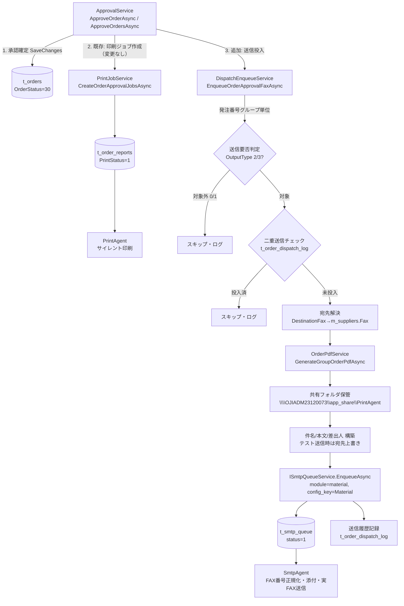

# Design Document

order-approval-fax-mail（発注承認時の発注書 FAX送信）

## Overview

本機能は、資材調達システム(MaterialModule)で発注承認（個別 `ApproveOrderAsync` / 一括 `ApproveOrdersAsync`）が確定した発注について、発注書PDFを生成・共有フォルダへ保管し、共通SMTP送信基盤の投入ヘルパー `ISmtpQueueService.EnqueueAsync` を通じて共通送信キュー `t_smtp_queue`(`db_common_dev`) へFAX送信ジョブを投入する。実際のSMTP/FAX送信（番号正規化・ゲートウェイドメイン付与・添付）は常駐Worker `SmtpAgent` が担う。

設計の中心は新規サービス **送信投入サービス(`IDispatchEnqueueService` / `DispatchEnqueueService`)** であり、以下の責務を持つ。

- 送信要否判定（出力区分 `OutputType` に基づく）
- 発注番号グループ単位の束ね（既存 `PrintJobService` と同一ロジック）
- 宛先(FAX番号)解決（`TOrder.DestinationFax` 優先 → `m_suppliers.Fax` フォールバック）
- 発注書PDFの生成（`OrderPdfService.GenerateGroupOrderPdfAsync`）・共有フォルダ保管
- 差出人 / 件名 / 本文の構築
- テスト送信時の宛先上書き
- 二重送信防止（新規送信履歴テーブル `t_order_dispatch_log`）
- 送信ジョブのキュー投入（`ISmtpQueueService.EnqueueAsync`）

本機能は **FAXのみ** を対象とし、印刷経路(`PrintJobService`→`t_order_reports`→PrintAgent)は変更せず並行維持する。FAXは常に `t_smtp_queue` 経由に一本化し、`t_order_reports.fax_status` 経由のFAXは行わない（二重FAX回避）。

### 既存資産との対応

| 既存資産 | 本機能での用途 |
| --- | --- |
| `ApprovalService.ApproveOrderAsync/ApproveOrdersAsync` | 承認確定後に `DispatchEnqueueService` を呼び出す統合点 |
| `PrintJobService.CreateOrderApprovalJobsAsync` | 変更しない。印刷経路を従来通り維持 |
| `OrderPdfService.GenerateGroupOrderPdfAsync(orderNoGroup)` | 発注番号グループ単位のPDF(byte[])生成（流用） |
| `ISmtpQueueService.EnqueueAsync` | 共通送信キューへの唯一の投入経路 |
| `IMasterService.GetCompanyInfoAsync(userId)` | 差出人(会社情報)構築 |
| `MSupplier`(`m_suppliers`) / `TOrder.DestinationFax` | 宛先FAX番号の解決元 |

## Architecture

### 全体フロー（疎結合）



### レイヤと責務境界

- **MaterialModule（送信側 / Producer）**: PDF生成・保管、送信要否判定、宛先解決、差出人/件名/本文構築、二重送信防止、キュー投入。`t_smtp_queue` の列に直接触れず `ISmtpQueueService` 経由でのみ投入する（Req1.3）。
- **CommonModule（共通基盤）**: `ISmtpQueueService.EnqueueAsync` による投入の一元化。`t_smtp_queue` への INSERT・必須項目バリデーション・`config_key` 実在チェックを内部で行う。
- **SmtpAgent（Worker / スコープ外）**: ポーリング・FAX番号正規化（数字抽出・先頭0→81・`@faxmail.com` 付与）・PDF添付・実送信・死活監視・手動再送。

### プロジェクト参照とDI（Req1）

- `MaterialModule.csproj` に `CommonModule.csproj` への `ProjectReference` を追加する（相対パス `..\CommonModule\CommonModule.csproj`）。
- `MaterialModuleExtensions.AddMaterialModule` に `services.AddScoped<IDispatchEnqueueService, DispatchEnqueueService>();` を追加する。
- `ISmtpQueueService` は `AddCommonModule`（プラットフォーム/SMTP監視モジュールが MainWeb の `ModuleRegistration` で登録。**本機能の spec では MainWeb を変更しない**）で Scoped 登録済みのため、`DispatchEnqueueService` はコンストラクタ注入で取得する。新規にDI登録は不要。
- テスト送信等の設定は `IOptions<FaxDispatchOptions>` として取得する。**設定は `FaxDispatchOptions` のコード既定値で完結させ、MainWeb の `appsettings` は変更しない**（steering「モジュール改変の原則」準拠）。`AddMaterialModule` で `Configure<FaxDispatchOptions>(configuration.GetSection("FaxDispatch"))` を呼ぶため、`FaxDispatch` セクションが存在すれば上書きされ、無ければコード既定値が有効になる。

### 統合点（Req2 / Req12.3）

`ApprovalService` の個別承認・一括承認の双方で、承認による発注状態更新を `SaveChangesAsync` で確定した**後**に、既存の `_printJobService.CreateOrderApprovalJobsAsync(orders)` 呼び出しの近傍（直後）で `_dispatchEnqueueService.EnqueueOrderApprovalFaxAsync(orders)` を呼び出す。既存の印刷ジョブ作成呼び出しは削除・変更しない（Req2.4 / Req11.3）。

> 設計判断: 承認状態の更新と送信投入を同一トランザクションにまとめず、承認確定（コミット済み）後に送信投入を行う。これは「送信投入失敗でも承認は成功」（Req10.1）を満たすため。送信投入は承認結果に依存する後続処理として局所的に try/catch で保護する。

## Components and Interfaces

### IDispatchEnqueueService（新規）

```csharp
namespace MaterialModule.Services;

/// <summary>
/// 発注承認送信機能の中核サービス。承認済み発注を発注番号グループ単位に束ね、
/// 送信要否判定・宛先解決・PDF生成保管・件名/本文/差出人構築・二重送信防止を行い、
/// 共通送信キュー(ISmtpQueueService)へFAX送信ジョブを投入する。
/// 送信投入の失敗は呼び出し元(承認)に伝播させない（承認は常に成功させる）。
/// </summary>
public interface IDispatchEnqueueService
{
    /// <summary>
    /// 承認済み発注リストを受け取り、発注番号グループ単位でFAX送信ジョブを投入する。
    /// グループごとに独立して処理し、1グループの失敗が他グループへ波及しない。
    /// </summary>
    /// <param name="orders">承認確定済みの発注リスト。</param>
    /// <param name="ct">キャンセルトークン。</param>
    /// <returns>投入したFAX送信ジョブ件数（スキップ・失敗を除く）。</returns>
    Task<int> EnqueueOrderApprovalFaxAsync(List<TOrder> orders, CancellationToken ct = default);
}
```

### DispatchEnqueueService（新規・internal 実装）

コンストラクタ注入:

- `MaterialDbContext context`（`t_orders` / `m_suppliers` / `t_order_dispatch_log` 読み書き）
- `IOrderPdfService pdfService`（PDF生成）
- `IMasterService masterService`（会社情報→差出人）
- `ISmtpQueueService smtpQueueService`（キュー投入）
- `IOptions<FaxDispatchOptions> options`（テスト送信・共有フォルダ・差出人設定）
- `ILogger<DispatchEnqueueService> logger`（スキップ/失敗のログ記録）

主要な内部処理（純粋ロジックは静的メソッドとして切り出し、単体/プロパティテスト可能にする）:

| メソッド | 責務 | テスト種別 |
| --- | --- | --- |
| `ExtractGroupKey(orderNo)` | 発注番号→先頭3セグメント（`PrintJobService` と同一規則） | PROPERTY |
| `ShouldDispatchFax(IEnumerable<TOrder> group)` | グループ内に `OutputType` 2/3 が1件以上あれば true | PROPERTY |
| `ResolveFaxRecipient(TOrder head, MSupplier? supplier)` | `DestinationFax` 優先→`m_suppliers.Fax` フォールバック→空白なら null | PROPERTY |
| `BuildSubject(groupKey, companyName)` | 件名定型文生成 | PROPERTY |
| `BuildBody()` | 本文定型文生成 | EXAMPLE |
| `ResolveRecipientForSend(realFax, options)` | テスト送信時はダミー番号へ上書き、無効時は実FAX番号 | PROPERTY |

処理アルゴリズム（グループ単位ループ）:

1. `orders` のうち `OrderNo` が採番済みのものだけを対象にする（Req2.3）。
2. `ExtractGroupKey` でグルーピングし、グループごとに以下を**独立した try/catch**で処理する（Req10.2）。
3. `ShouldDispatchFax` が false（全件 0/1）ならスキップ（Req4.2）。
4. `t_order_dispatch_log` を `reference_code = groupKey AND dispatch_type = 'fax'` で照会し、投入済みならスキップしログ記録（Req9.2）。
5. 代表発注 `head`（グループ内 `OrderNo` 昇順先頭）で宛先解決。`DestinationFax` が空なら `head.SupplierCode` で `m_suppliers` を引き `Fax` をフォールバック。解決不能（空白/null）ならスキップしログ記録（Req4.5 / Req5.4）。
6. 差出人: `masterService.GetCompanyInfoAsync(head.UserId)` から `from_address` / `from_name` を構築。構築不能ならスキップしログ記録（Req7.5）。
7. PDF生成: `pdfService.GenerateGroupOrderPdfAsync(groupKey)` → byte[]。共有フォルダへ一意名で保存（失敗時スキップ・ログ、Req6.6）。
8. 件名・本文・テスト送信宛先上書きを構築。
9. `smtpQueueService.EnqueueAsync(module:"material", configKey:"Material", fromAddress, fromName, recipient, subject, body, cc:null, bcc:null, pdfPath, ct)` を呼ぶ（Req1.3 / Req7.4 / Req8.1）。
10. 投入成功後、`t_order_dispatch_log` に投入実績を記録（Req9.1）。同一承認操作内の同一グループは手順4のチェックとグルーピングにより1件のみ投入（Req9.3）。

### FaxDispatchOptions（新規・設定バインド）

```csharp
namespace MaterialModule.Configuration;

/// <summary>FAX送信投入に関する MaterialModule 側設定（appsettings: "FaxDispatch" セクション）。</summary>
public class FaxDispatchOptions
{
    /// <summary>テスト送信が有効か。true の場合 recipient をダミー番号へ上書きする。</summary>
    public bool TestSendEnabled { get; set; } = true;

    /// <summary>テスト送信時に使用するダミーFAX番号（正常系: 06-6487-1033 / エラー系: 無効番号）。</summary>
    public string TestFaxNumber { get; set; } = "06-6487-1033";

    /// <summary>発注書PDFを保管する共有フォルダのルート。</summary>
    public string PdfShareRoot { get; set; } = @"\\OJIADM23120073\app_share\PrintAgent";

    /// <summary>差出人アドレス（会社情報から構築できない場合のフォールバック）。</summary>
    public string? FromAddress { get; set; }

    /// <summary>config_key（FAX経路）。常に Material。</summary>
    public string ConfigKey { get; set; } = "Material";
}
```

設定値は上記 `FaxDispatchOptions` の**コード既定値で完結**させる（MainWeb の `appsettings` は変更しない）。下記は将来どうしても外部上書きが必要になった場合の**任意のオーバーライド例**であり、通常は不要（既定値と同一）。なお恒久的な運用切替は将来の `smtp-agent-test-mode`（Agent側 `m_smtp_config` のDBマスタ）で行う方針。

任意オーバーライド例（`FaxDispatch` セクション。設定すればコード既定を上書き）:

```json
"FaxDispatch": {
  "TestSendEnabled": true,
  "TestFaxNumber": "06-6487-1033",
  "PdfShareRoot": "\\\\OJIADM23120073\\app_share\\PrintAgent",
  "FromAddress": "material-noreply@example.co.jp",
  "ConfigKey": "Material"
}
```

### 共有フォルダのPDFファイル名（Req6.3）

発注番号グループを含む一意名とする。衝突回避のためタイムスタンプを付与する。

```
{PdfShareRoot}\order_{groupKey}_{yyyyMMddHHmmssfff}.pdf
例: \\OJIADM23120073\app_share\PrintAgent\order_G201-260514-001_20260514091532123.pdf
```

### 件名・本文の最終文面（Req7.2 / Req7.3 確定）

**件名**:

```
発注書 {発注番号グループ}（{会社名}）
例: 発注書 G201-260514-001（王子マテリア株式会社）
```

会社名は `GetCompanyInfoAsync` の `CompanyName1`。会社名が取得できない場合は末尾の「（{会社名}）」を省略し `発注書 {発注番号グループ}` とする。

**本文**（定型文）:

```
平素より格別のお引き立てを賜り誠にありがとうございます。
発注書（発注番号グループ: {発注番号グループ}）を送付いたします。
添付の発注書をご確認くださいますようお願い申し上げます。

本FAXは発注承認に伴い自動送信されています。
ご不明な点がございましたら、発注書記載の担当部署までお問い合わせください。
```

## Data Models

### 新規テーブル: t_order_dispatch_log（送信履歴 / DispatchHistory）

二重送信防止のため、発注番号グループ＋送信種別単位の送信投入実績を記録する専用テーブルを新規作成する（未確定論点2の確定: 既存 `t_order_reports` への列追加ではなく新規テーブル）。`row_version`(`[Timestamp]`) を持ち、`(reference_code, dispatch_type)` で一意制約を設けることで、競合下でも同一グループの二重投入をDB制約で防ぐ。

```csharp
using System.ComponentModel.DataAnnotations;
using System.ComponentModel.DataAnnotations.Schema;

namespace MaterialModule.Data.Entities;

/// <summary>
/// 送信投入履歴（二重送信防止）。発注番号グループ＋送信種別で一意。
/// 承認を契機とした共通送信キューへの投入実績を1グループ1行で記録する。
/// </summary>
[Table("t_order_dispatch_log")]
public class TOrderDispatchLog
{
    [Key]
    [Column("id")]
    [DatabaseGenerated(DatabaseGeneratedOption.Identity)]
    public int Id { get; set; }

    /// <summary>発注番号グループ（OrderNo 先頭3セグメント）。</summary>
    [Required]
    [Column("reference_code")]
    [MaxLength(50)]
    public string ReferenceCode { get; set; } = string.Empty;

    /// <summary>送信種別。本機能では "fax"。</summary>
    [Required]
    [Column("dispatch_type")]
    [MaxLength(20)]
    public string DispatchType { get; set; } = "fax";

    /// <summary>投入した共通送信キューのジョブID（t_smtp_queue.id）。</summary>
    [Column("queue_job_id")]
    public int? QueueJobId { get; set; }

    /// <summary>投入時に設定した宛先（テスト送信時はダミー番号）。</summary>
    [Column("recipient")]
    [MaxLength(255)]
    public string? Recipient { get; set; }

    /// <summary>使用した接続プロファイルキー（常に Material）。</summary>
    [Column("config_key")]
    [MaxLength(50)]
    public string? ConfigKey { get; set; }

    /// <summary>テスト送信として投入したか。</summary>
    [Required]
    [Column("is_test_send")]
    public bool IsTestSend { get; set; }

    [Required]
    [Column("created_at")]
    public DateTime CreatedAt { get; set; }

    [Required]
    [Column("updated_at")]
    public DateTime UpdatedAt { get; set; }

    [Timestamp]
    [Column("row_version")]
    public byte[] RowVersion { get; set; } = [];
}
```

#### スキーマ一覧

| 列名 | 日本語名 | 型 | 制約・備考 |
| --- | --- | --- | --- |
| `id` | ID | int (identity) | 主キー |
| `reference_code` | 発注番号グループ | nvarchar(50) | NOT NULL。一意制約(複合) |
| `dispatch_type` | 送信種別 | nvarchar(20) | NOT NULL。"fax"。一意制約(複合) |
| `queue_job_id` | 送信キュージョブID | int NULL | `t_smtp_queue.id`（参照のみ、FK制約なし） |
| `recipient` | 宛先 | nvarchar(255) NULL | 投入時宛先（テスト時ダミー） |
| `config_key` | 接続プロファイルキー | nvarchar(50) NULL | 常に Material |
| `is_test_send` | テスト送信フラグ | bit | NOT NULL |
| `created_at` | 作成日時 | datetime2 | NOT NULL |
| `updated_at` | 更新日時 | datetime2 | NOT NULL |
| `row_version` | 行バージョン | rowversion(timestamp) | 楽観的ロック |

#### 一意制約 / DbContext 登録

`MaterialDbContext` に `DbSet<TOrderDispatchLog> OrderDispatchLogs` を追加し、`OnModelCreating` で複合一意インデックスを定義する。

```csharp
public DbSet<TOrderDispatchLog> OrderDispatchLogs => Set<TOrderDispatchLog>();

// OnModelCreating 内
modelBuilder.Entity<TOrderDispatchLog>()
    .HasIndex(d => new { d.ReferenceCode, d.DispatchType })
    .IsUnique()
    .HasDatabaseName("uq_t_order_dispatch_log_01");
```

> DBスキーマ変更ルール（project-rules.md）に従い、本テーブルのDDLはユーザーが実行する。タスクで以下を実施する: (1) DDLスクリプト作成（ユーザー実行）、(2) `MaterialModule/Doc/テーブル定義書.md` 更新、(3) `MaterialModule/Doc/ER図.md` 更新。

### 既存モデルの参照（変更なし）

- `TOrder`: `OrderNo`・`OutputType`・`SupplierCode`・`DestinationFax`・`UserId` を読み取り。
- `MSupplier`(`m_suppliers`): `SupplierCode` で照会し `Fax` を取得。
- `MCompanyInfo`: `GetCompanyInfoAsync` 経由で会社名・差出人情報を取得。
- `t_order_reports`(`TOrderReport`): 本機能は変更しない（印刷経路維持）。


## Correctness Properties

*A property is a characteristic or behavior that should hold true across all valid executions of a system—essentially, a formal statement about what the system should do. Properties serve as the bridge between human-readable specifications and machine-verifiable correctness guarantees.*

本機能の中核（送信要否判定・グルーピング・宛先解決・件名/差出人構築・テスト送信上書き・二重送信防止・エラー局所化）は純粋ロジックとして切り出せるため、プロパティベーステスト(PBT, FsCheck想定)が有効である。以下は受け入れ基準のプレワーク分析に基づき、冗長性を排除して統合した普遍性質である。

### Property 1: 採番済み発注のみが送信対象

*For any* 発注リスト（`OrderNo` が採番済みのものと未採番のものが混在しうる）について、送信投入処理が対象とする発注は `OrderNo` が採番済み（非null・非空）のものに限られ、未採番の発注はいかなる送信ジョブにも含まれない。

**Validates: Requirements 2.3**

### Property 2: 送信要否はグループ内 OutputType に対する同値

*For any* 発注番号グループについて、そのグループがFAX送信対象と判定されることは、グループ内に `OutputType` が 2 または 3 の発注が1件以上存在することと同値である（全件が 0 または 1 なら必ず対象外）。

**Validates: Requirements 4.1, 4.2, 4.3**

### Property 3: 対象グループごとに1ジョブ・1PDF生成

*For any* 送信対象の発注リストについて、束ね後の一意な対象発注番号グループの数と、投入される送信ジョブ数および `GenerateGroupOrderPdfAsync` の呼び出し回数は一致する（1グループにつき正確に1ジョブ・1PDF）。グルーピングは `OrderNo` の先頭3セグメントで行われる。

**Validates: Requirements 3.1, 3.2, 3.3, 6.1**

### Property 4: 宛先解決の優先順位と無加工受け渡し

*For any* 発注（送付先FAX `DestinationFax` の有無）と仕入先マスタ（`Fax` の有無）の組合せについて、解決される宛先は `DestinationFax` が非空ならその値、空なら `m_suppliers.Fax` の値であり、解決された値は正規化（数字抽出・先頭0→81・ドメイン付与）を一切施さずそのまま `recipient` に設定される。

**Validates: Requirements 5.1, 5.2, 5.3**

### Property 5: 宛先解決不能なグループは投入されない

*For any* 発注番号グループについて、`DestinationFax` と `m_suppliers.Fax` がともに空文字・空白のみ・null で有効なFAX番号を解決できない場合、当該グループの送信ジョブは投入されず、その旨がログに記録される。

**Validates: Requirements 4.5, 5.4**

### Property 6: 差出人と件名の構築

*For any* 会社情報および発注番号グループについて、差出人(`from_address`/`from_name`)は会社情報・担当者情報から構築され（会社情報が得られない場合は設定のフォールバック差出人を用いる）、件名は発注番号グループを必ず含み、会社名が得られる場合は会社名も含む（`発注書 {グループ}（{会社名}）`、会社名なしは `発注書 {グループ}`）。

**Validates: Requirements 7.1, 7.2**

### Property 7: 二重送信防止の冪等性

*For any* 発注番号グループについて、同一グループに対する送信投入を複数回（別々の承認操作・または同一承認操作内の同一グループ複数発注を含む）処理しても、`t_order_dispatch_log` の `(reference_code, dispatch_type)` 一意制約により送信ジョブは高々1件しか投入されず、2回目以降はスキップしてログに記録される。

**Validates: Requirements 9.1, 9.2, 9.3**

### Property 8: テスト送信時の宛先上書き

*For any* 解決済み実FAX番号について、テスト送信が有効なときは `recipient` は実FAX番号に依らず設定されたダミーFAX番号に上書きされ、テスト送信が無効なときは `recipient` は実際の解決FAX番号となる。

**Validates: Requirements 8.2, 8.3, 8.4, 8.5**

### Property 9: 接続プロファイルキーは常に Material

*For any* 送信ジョブ投入について、テスト送信の有効/無効に関わらず `config_key` は常に `Material`（実FAX経路）であり、`module` は常に `material` である。

**Validates: Requirements 8.1, 8.5, 7.4**

### Property 10: 送信投入は承認に伝播せず、グループ失敗は局所化される

*For any* 発注リストおよび任意の内部失敗（PDF生成失敗・差出人構築失敗・キュー投入例外など）について、`EnqueueOrderApprovalFaxAsync` は呼び出し元（承認処理）へ例外を伝播させず正常に完了し、1つの発注番号グループの処理失敗・スキップは他の発注番号グループの送信投入を妨げない。

**Validates: Requirements 4.6, 6.6, 7.5, 10.1, 10.2**

### Property 11: 保管PDFファイル名はグループを含み一意である

*For any* 発注番号グループについて、共有フォルダへ保管するPDFのフルパスは設定された共有フォルダ(`PdfShareRoot`)配下にあり、ファイル名は発注番号グループを含み、生成時刻の違いにより異なるパスとなる（衝突しない）。投入時の `pdfPath` 引数はこの保管パスと一致する。

**Validates: Requirements 6.2, 6.3, 6.4**

## Error Handling

送信投入は承認業務を止めないことが最優先（Req10）。以下の方針で局所的に保護する。

- **承認との分離**: `ApprovalService` は承認状態の `SaveChangesAsync` 確定後に `EnqueueOrderApprovalFaxAsync` を呼ぶ（Req12.3）。送信投入全体を try/catch で囲み、例外を握り潰してログ記録のみ行い、承認は成功として返す（Req10.1）。送信投入は承認のトランザクションに含めない。
- **グループ単位の局所化**: グループごとのループ内で個別 try/catch を設け、1グループの失敗（PDF生成/保管失敗・差出人構築失敗・宛先解決失敗・キュー投入例外）が他グループへ波及しないようにする（Req10.2）。
- **スキップ条件のログ記録**: 以下はいずれも例外ではなく「スキップ＋ログ(Warning/Information)」として扱う。
  - 送信対象外（全件 0/1）（Req4.2）
  - 投入済みグループ（二重送信防止）（Req9.2）
  - 宛先解決不能（空白/null FAX番号）（Req4.5 / Req5.4）
  - 差出人構築不能（Req7.5）
  - PDF生成/保管失敗（Req6.6）
- **二重送信防止の競合**: 多人数同時操作で同一グループが同時に投入されうる場合、`t_order_dispatch_log` の `(reference_code, dispatch_type)` 一意制約により2件目の INSERT が `DbUpdateException`（一意制約違反）となる。これを捕捉し「既投入」として安全にスキップする（Req9 / Req12.1）。
- **再送は行わない**: 共通送信キューへ投入後の実FAX送信失敗の再送は本機能では行わず、共通基盤の監視画面の手動再送に委ねる（Req10.3）。
- **ログ内容**: スキップ/失敗時は発注番号グループ・理由・（該当時）宛先キー・例外情報を構造化ログに残し、運用で追跡可能にする。

## Testing Strategy

### 基本方針（二層）

- **単体テスト**: 具体例・統合点・エッジケース・エラー条件を検証する。
- **プロパティテスト**: 上記 Correctness Properties を普遍的に検証する。FsCheck を用い、各プロパティテストは**最低100回**の反復を行う。各テストには対応する設計プロパティをコメントでタグ付けする。
  - タグ形式: `// Feature: order-approval-fax-mail, Property {番号}: {プロパティ本文}`

> 純粋ロジック（`ShouldDispatchFax` / `ExtractGroupKey` / `ResolveFaxRecipient` / `BuildSubject` / `ResolveRecipientForSend` / PDFファイル名構築）を静的メソッドとして切り出し、外部依存（DB・PDF生成・キュー投入）はモック/インメモリに差し替えることで、PBTを低コストで100回以上回せるようにする。

### プロパティテスト（PBT / FsCheck）

| Property | テスト対象 | 生成する入力 |
| --- | --- | --- |
| Property 1 | 採番済みのみ対象 | `OrderNo` 有無混在の発注リスト |
| Property 2 | 送信要否＝OutputType同値 | 任意の `OutputType` 集合のグループ |
| Property 3 | 1グループ1ジョブ・1PDF | 多様な `OrderNo`（セグメント数差含む）の発注リスト |
| Property 4 | 宛先解決優先順位・無加工 | `DestinationFax`／`SupplierFax` の有無組合せ |
| Property 5 | 解決不能で非投入 | 両FAX空白/null のグループ |
| Property 6 | 差出人・件名構築 | 多様な会社情報・グループキー |
| Property 7 | 二重送信防止の冪等性 | 同一グループの複数回/重複発注 |
| Property 8 | テスト送信宛先上書き | テスト有効/無効 × 任意実FAX番号 |
| Property 9 | config_key/module 固定 | テスト有効/無効 |
| Property 10 | 承認非伝播・局所化 | 一部グループで内部失敗を注入 |
| Property 11 | PDFファイル名一意・グループ含む | 任意グループキー・複数時刻 |

### 単体テスト（具体例・エッジ・統合点）

- **統合点（モック）**: `ApproveOrderAsync` / `ApproveOrdersAsync` 実行後に、`CreateOrderApprovalJobsAsync`（既存・印刷）と `EnqueueOrderApprovalFaxAsync`（新規・FAX）の双方が、承認確定（`SaveChanges`）後の順序で呼ばれること（Req2.1/2.2/2.4/11.1/11.3/12.3）。
- **投入経路（モック）**: 送信ジョブ投入が `ISmtpQueueService.EnqueueAsync` 経由のみで行われ、`t_smtp_queue` を直接操作しないこと。本サービスが `t_order_reports.fax_status` を書き換えないこと（Req1.3/4.4/11.2）。
- **エッジ/エラー（EDGE_CASE）**: PDF生成例外（Req6.6）、差出人構築不能（Req7.5）、宛先空白（Req4.5/5.4）で当該グループが投入されずログ記録され、処理が継続すること。
- **設定バインド（SMOKE）**: `FaxDispatchOptions` が `appsettings` の `FaxDispatch` セクションからバインドされること（Req8.6）。`TestFaxNumber=06-6487-1033` / 無効番号設定が `recipient` に反映されること（Req8.3/8.4）。
- **本文（EXAMPLE）**: 本文が定型文でありグループキーを含むこと（Req7.3）。
- **DI解決（SMOKE）**: `IDispatchEnqueueService` と依存する `ISmtpQueueService` がDIコンテナで解決できること（Req1.1/1.2）。
- **エンティティ構造（SMOKE）**: `TOrderDispatchLog` に `[Timestamp] row_version` と `(reference_code, dispatch_type)` 一意制約が存在すること（Req12.1/12.2）。

### 統合テスト（少数例・実FAX経路はユーザー側）

承認→キュー投入→`SmtpAgent` 実FAX送信のエンドツーエンドは、実FAX経路（`config_key=Material`）で次の代表例のみ実施する。

- 正常系: ダミーFAX番号 `06-6487-1033` で送信されFAX到達を確認。
- エラー系: 無効FAX番号でエラーステータス(9)になることを確認。

> ビルド・DBスキーマ適用（`t_order_dispatch_log` のDDL）・実FAX送信はユーザー側で実施する（project-rules.md準拠）。Kiroからはビルド・実送信を行わない。

### プロジェクト規約への適合

- **排他制御・楽観的ロック**: 新規エンティティ `TOrderDispatchLog` に `row_version`(`[Timestamp]`) を付与し、二重投入は一意制約＋`DbUpdateException` 捕捉で防止（Req12.1/12.2）。
- **UI規約（フォントサイズ等）**: 本機能はバックエンド処理（承認契機の送信投入）であり新規UIを持たないため、フォントサイズ統一ルール等のUI規約は対象外。
- **Spec 2箇所配置**: 本設計は正本 `.kiro/specs/order-approval-fax-mail/design.md` とコピー `MaterialModule/Doc/specs/order-approval-fax-mail/design.md` の両方に配置する。
- **DBスキーマ変更時の必須作業**: `t_order_dispatch_log` 追加に伴い `MaterialModule/Doc/テーブル定義書.md` と `MaterialModule/Doc/ER図.md` を更新する（タスクで実施）。
