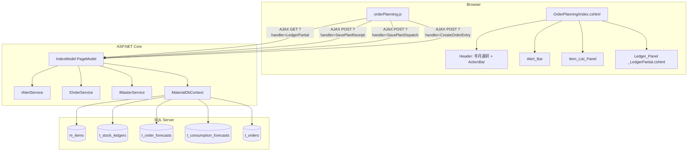
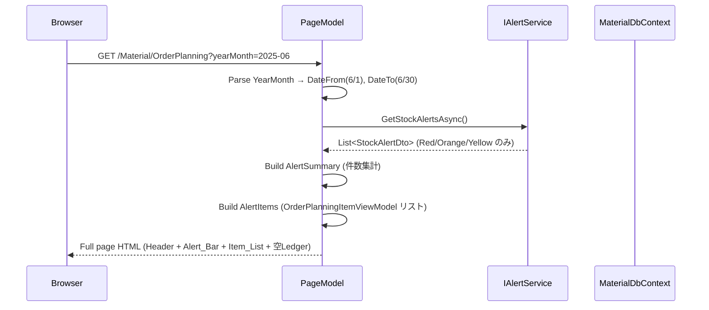
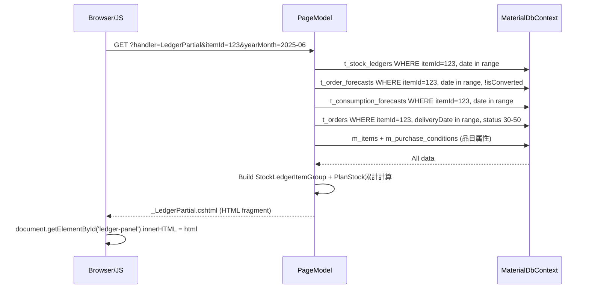
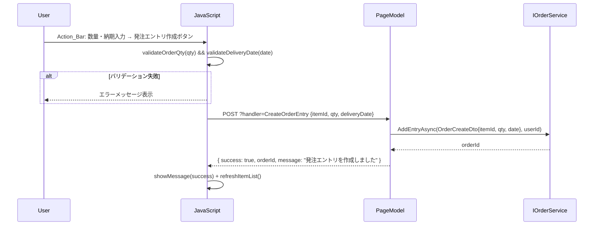
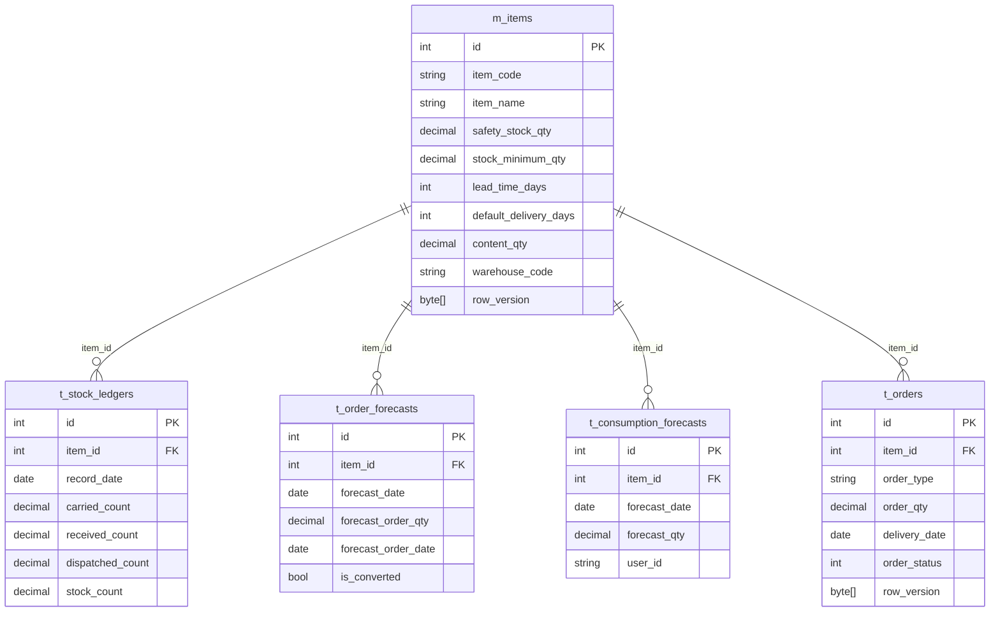

# Design Document: Order Planning Dashboard（発注計画ダッシュボード）

## Overview

発注計画ダッシュボードは、既存の StockLedger（受払台帳）、MRP（発注予測）、OrderRecommendation（発注推奨）の3ページの機能を1画面に統合する新規 Razor Page である。発注担当者が在庫不足品目の確認から発注エントリ作成までをシームレスに完結できる。

### 設計方針

- **既存サービス再利用**: IAlertService, IOrderService, IMasterService をインターフェース変更なしで利用
- **既存ロジック再利用**: SavePlanReceipt / SavePlanDispatch のハンドラロジックを新ページ内に複製（同一パターン）
- **AJAX Partial Update**: 品目選択時に Ledger_Panel のみ部分更新（Razor Partial View 返却）
- **プロジェクト規約準拠**: primary constructor DI、DbPermissionCheck認可、Bootstrap 5 + vanilla JS、font-size 0.8rem/0.75rem

### URL

`/Material/OrderPlanning`

---

## Architecture

### 全体構成

```
┌─────────────────────────────────────────────────────────────┐
│ Browser (Bootstrap 5 + vanilla JS)                          │
│  ┌──────────────────────────────────────────────────────┐   │
│  │ OrderPlanning/Index.cshtml                           │   │
│  │  ├─ Header (年月選択 + Action_Bar)                   │   │
│  │  ├─ Alert_Bar                                        │   │
│  │  └─ Main Content                                     │   │
│  │      ├─ Item_List_Panel (左 col-3)                   │   │
│  │      └─ Ledger_Panel (右 col-9, partial view)        │   │
│  └──────────────────────────────────────────────────────┘   │
└─────────────────────────────────────────────────────────────┘
         │ AJAX (fetch API)
         ▼
┌─────────────────────────────────────────────────────────────┐
│ ASP.NET Core Razor Pages                                    │
│  OrderPlanning/Index.cshtml.cs (PageModel)                  │
│   ├─ OnGetAsync()              → 初期ページロード           │
│   ├─ OnGetLedgerPartialAsync() → 品目選択時の部分更新       │
│   ├─ OnPostSavePlanReceiptAsync()  → 計画入庫保存           │
│   ├─ OnPostSavePlanDispatchAsync() → 計画出庫保存           │
│   └─ OnPostCreateOrderEntryAsync() → 発注エントリ作成       │
└─────────────────────────────────────────────────────────────┘
         │ DI (Scoped)
         ▼
┌─────────────────────────────────────────────────────────────┐
│ Services (既存・変更なし)                                    │
│  ├─ IAlertService          → アラート取得                   │
│  ├─ IOrderService          → 発注エントリ作成              │
│  ├─ IMasterService         → 品目マスタ取得                │
│  └─ MaterialDbContext      → 直接クエリ（台帳構築）         │
└─────────────────────────────────────────────────────────────┘
         │
         ▼
┌─────────────────────────────────────────────────────────────┐
│ SQL Server (db_material_dev)                                │
│  ├─ m_items                                                 │
│  ├─ t_stock_ledgers                                         │
│  ├─ t_order_forecasts                                       │
│  ├─ t_consumption_forecasts                                 │
│  └─ t_orders                                                │
└─────────────────────────────────────────────────────────────┘
```

### コンポーネント図（Mermaid）



### シーケンス図: 初期ページロード



### シーケンス図: 品目選択（AJAX Partial Update）



### シーケンス図: 計画セル編集

```mermaid
sequenceDiagram
    participant U as User
    participant JS as JavaScript
    participant PM as PageModel
    participant DB as MaterialDbContext

    U->>JS: Plan_Cell をダブルクリック
    JS->>JS: cell → <input> に変換
    U->>JS: 値入力 + Enter (or blur)
    JS->>PM: POST ?handler=SavePlanReceipt {itemId, date, qty}
    PM->>DB: BeginTransactionAsync()
    PM->>DB: Upsert TOrderForecast
    PM->>DB: SaveChangesAsync() + CommitAsync()
    PM-->>JS: { success: true }
    JS->>JS: recalculateRunningTotal() → 後続行のPlanStock更新
    JS->>JS: highlightCell(cell) → 保存完了フィードバック
```



### シーケンス図: 発注エントリ作成



---

## Components and Interfaces

### ファイル構成

```
MaterialModule/Areas/Material/Pages/OrderPlanning/
├── Index.cshtml              # メインページ（レイアウト全体）
├── Index.cshtml.cs           # PageModel（全ハンドラ）
└── _LedgerPartial.cshtml     # 受払台帳パーシャルビュー

MaterialModule/wwwroot/js/
└── orderPlanning.js          # クライアントサイドロジック
```

### PageModel: IndexModel

```csharp
[IgnoreAntiforgeryToken]
[Authorize(Policy = "DbPermissionCheck")]
public class IndexModel(
    IAlertService alertService,
    IOrderService orderService,
    IMasterService masterService,
    MaterialDbContext context) : PageModel
{
    // --- Bound Properties ---
    [BindProperty(SupportsGet = true)]
    public string? YearMonth { get; set; }

    // --- View Data ---
    public DateOnly DateFrom { get; set; }
    public DateOnly DateTo { get; set; }
    public List<OrderPlanningItemViewModel> AlertItems { get; set; } = [];
    public AlertSummaryViewModel AlertSummary { get; set; } = new();

    // --- Handlers ---
    public async Task OnGetAsync() { /* 初期ロード */ }
    public async Task<IActionResult> OnGetLedgerPartialAsync(int itemId) { /* Partial返却 */ }
    public async Task<IActionResult> OnPostSavePlanReceiptAsync([FromBody] PlanCellSaveRequest request) { /* 計画入庫保存 */ }
    public async Task<IActionResult> OnPostSavePlanDispatchAsync([FromBody] PlanCellSaveRequest request) { /* 計画出庫保存 */ }
    public async Task<IActionResult> OnPostCreateOrderEntryAsync([FromBody] OrderEntryCreateRequest request) { /* 発注作成 */ }
}
```

### ハンドラ一覧

| Handler | HTTP Method | URL パラメータ | Request Body | Response |
|---------|-------------|---------------|-------------|----------|
| `OnGetAsync` | GET | `?yearMonth=2025-06` | - | Full page HTML |
| `OnGetLedgerPartialAsync` | GET | `?handler=LedgerPartial&itemId=123` | - | Partial HTML |
| `OnPostSavePlanReceiptAsync` | POST | `?handler=SavePlanReceipt` | `PlanCellSaveRequest` | `{ success, message? }` |
| `OnPostSavePlanDispatchAsync` | POST | `?handler=SavePlanDispatch` | `PlanCellSaveRequest` | `{ success, message? }` |
| `OnPostCreateOrderEntryAsync` | POST | `?handler=CreateOrderEntry` | `OrderEntryCreateRequest` | `{ success, orderId?, message? }` |

### JavaScript API

```javascript
// orderPlanning.js - 主要関数
const OrderPlanning = {
    selectedItemId: null,

    // 品目選択 → AJAX partial update
    async selectItem(itemId) { /* fetch GET → replace #ledger-panel */ },

    // インライン編集
    enableCellEdit(cell) { /* double-click → input変換 */ },
    async saveCellEdit(cell, type) { /* POST SavePlanReceipt/Dispatch */ },
    cancelCellEdit(cell) { /* Escape → 元の値に復元 */ },

    // 累計再計算（クライアント側）
    recalculateRunningTotal() { /* carried + Σ(received) - Σ(dispatched) */ },

    // 発注エントリ作成
    async createOrderEntry() { /* validate → POST CreateOrderEntry */ },

    // Tab ナビゲーション
    handleTabNavigation(e) { /* Tab → 次の編集可能セル */ },

    // バリデーション
    validateOrderQty(qty) { return qty > 0; },
    validateDeliveryDate(date) { return date != null && date !== ''; },

    // UI フィードバック
    showMessage(text, type) { /* toast表示 */ },
    highlightCell(cell) { /* 一時的なハイライト */ },
};
```

---

## Data Models

### 新規 ViewModel

```csharp
namespace MaterialModule.Models.ViewModels;

/// <summary>発注計画ダッシュボード: アラートサマリ</summary>
public class AlertSummaryViewModel
{
    public int RedCount { get; set; }      // 🔴 マイナス在庫・即時対応
    public int OrangeCount { get; set; }   // 🟠 安全在庫割れ・要発注
    public int YellowCount { get; set; }   // 🟡 発注期限間近・注意
    public int TotalCount => RedCount + OrangeCount + YellowCount;
}

/// <summary>発注計画ダッシュボード: 品目リスト項目</summary>
public class OrderPlanningItemViewModel
{
    public int ItemId { get; set; }
    public string ItemCode { get; set; } = "";
    public string ItemName { get; set; } = "";
    public string AlertLevel { get; set; } = "";       // "Red", "Orange", "Yellow"
    public decimal CurrentStockCount { get; set; }      // 現在庫（個数）
    public decimal SafetyStockQty { get; set; }         // 安全在庫数量
    public decimal RecommendedOrderQty { get; set; }    // 推奨発注数量 = SafetyStockQty - CurrentStockCount
    public DateOnly? ForecastOrderDate { get; set; }    // 発注予定日
    public int LeadTimeDays { get; set; }               // リードタイム（日）
}

/// <summary>発注エントリ作成リクエスト</summary>
public class OrderEntryCreateRequest
{
    public int ItemId { get; set; }
    public decimal Qty { get; set; }
    public string? DeliveryDate { get; set; }  // "yyyy-MM-dd" 形式
}
```

### 既存モデル再利用

| モデル | 名前空間 | 用途 |
|--------|---------|------|
| `StockLedgerItemGroup` | Models.ViewModels | Ledger_Panel の品目グループ表示 |
| `StockLedgerRow` | Models.ViewModels | 日別行データ |
| `PlanCellSaveRequest` | Pages.StockLedger | 計画セル保存リクエスト（同一クラスを共有） |
| `StockAlertDto` | Models.Dtos | アラートデータソース |
| `OrderCreateDto` | Models.Dtos | IOrderService.AddEntryAsync に渡す |

### エンティティ関連図



### PlanStock 累計計算ロジック

既存 StockLedger ページと同一のアルゴリズム:

```
PlanStockCount[i] = CarriedCount + Σ(PlanReceivedCount[0..i]) - Σ(PlanDispatchedCount[0..i])
PlanStockQty[i]   = CarriedQty   + Σ(PlanReceivedQty[0..i])   - Σ(PlanDispatchedQty[0..i])
```

ここで:
- `PlanReceivedCount = ForecastOrderQty（未変換予測）+ OrderQty（確定発注 status 30-50）`
- `PlanDispatchedCount = ConsumptionForecast.ForecastQty`

---

## Correctness Properties

*A property is a characteristic or behavior that should hold true across all valid executions of a system—essentially, a formal statement about what the system should do. Properties serve as the bridge between human-readable specifications and machine-verifiable correctness guarantees.*

### Property 1: 年月→日付範囲変換の正確性

*For any* valid year-month string in "yyyy-MM" format, parsing it SHALL produce DateFrom as the 1st day of that month and DateTo as the last day of that month (28/29/30/31 depending on month and leap year).

**Validates: Requirements 2.3**

### Property 2: アラート件数集計の整合性

*For any* list of StockAlertDto items (where Green items are already excluded), the AlertSummaryViewModel SHALL have RedCount equal to the count of items with AlertLevel="Red", OrangeCount equal to items with AlertLevel="Orange", and YellowCount equal to items with AlertLevel="Yellow", and TotalCount SHALL equal the list length.

**Validates: Requirements 3.1**

### Property 3: 品目フィルタリングと推奨発注数量

*For any* item with SafetyStockQty and CurrentStockCount values, the item SHALL appear in the filtered item list if and only if CurrentStockCount <= SafetyStockQty, and its RecommendedOrderQty SHALL equal (SafetyStockQty - CurrentStockCount).

**Validates: Requirements 4.1, 4.4**

### Property 4: 品目リストのソート順序

*For any* list of OrderPlanningItemViewModel items with mixed AlertLevel values, after sorting, all Red items SHALL appear before all Orange items, all Orange items SHALL appear before all Yellow items, and within each AlertLevel group, items SHALL be ordered by ItemCode in ascending lexicographic order.

**Validates: Requirements 4.3**

### Property 5: PlanStock 累計計算の不変条件

*For any* sequence of StockLedgerRow entries with CarriedCount as the initial value, the PlanStockCount for row i SHALL equal CarriedCount + Σ(PlanReceivedCount[0..i]) - Σ(PlanDispatchedCount[0..i]). This invariant SHALL hold after any single cell edit and recalculation.

**Validates: Requirements 6.3**

### Property 6: 確定発注セルの編集不可制約

*For any* Plan_Cell, if it is associated with an order having OrderStatus in the range [30, 50], the cell SHALL be marked as read-only. If it has no associated confirmed order, the cell SHALL be editable.

**Validates: Requirements 6.5**

### Property 7: 発注エントリ作成の不変条件

*For any* valid order entry creation request (qty > 0 and deliveryDate is a valid non-empty date string), the resulting TOrder record SHALL always have OrderStatus = 10 and OrderType = "manual".

**Validates: Requirements 7.5**

### Property 8: 数量バリデーション（非正値の拒否）

*For any* decimal value that is zero or negative, the order entry creation request SHALL be rejected with a validation error, and no TOrder record SHALL be created.

**Validates: Requirements 7.7**

---

## Error Handling

### エラーハンドリング方針

| シナリオ | サーバー側処理 | クライアント側表示 |
|----------|--------------|-------------------|
| AJAX 台帳取得失敗 | 500 Internal Server Error | 「データの読み込みに失敗しました。再度お試しください。」 |
| 計画セル保存失敗 | Transaction rollback → JSON error | セル値を元に戻し + エラーメッセージ |
| 楽観的ロック競合 | DbUpdateConcurrencyException → rollback | 「他のユーザーが先に更新しました。画面を再読み込みしてください。」 |
| 発注エントリ作成失敗 | Transaction rollback → JSON error | エラーメッセージ toast 表示 |
| バリデーション: 数量 ≤ 0 | サーバー側検証 + クライアント側検証 | 「数量は1以上を入力してください。」 |
| バリデーション: 納期未入力 | サーバー側検証 + クライアント側検証 | 「納期を入力してください。」 |
| 品目データなし | 空リスト返却 | 「在庫不足の品目はありません。」 |
| ネットワークエラー | - | 「通信エラーが発生しました。ネットワーク接続を確認してください。」 |

### トランザクション管理パターン

```csharp
// 計画セル保存（既存 StockLedger/Index.cshtml.cs と同一パターン）
using var transaction = await context.Database.BeginTransactionAsync();
try
{
    // Upsert: TOrderForecast or TConsumptionForecast
    await context.SaveChangesAsync();
    await transaction.CommitAsync();
    return new JsonResult(new { success = true });
}
catch (DbUpdateConcurrencyException)
{
    await transaction.RollbackAsync();
    return new JsonResult(new { success = false, message = "他のユーザーが先に更新しました。画面を再読み込みしてください。" });
}
catch (Exception ex)
{
    await transaction.RollbackAsync();
    return new JsonResult(new { success = false, message = ex.Message });
}
```

### クライアント側エラーハンドリング

```javascript
// 共通 AJAX ヘルパー
async function ajaxPost(handler, body) {
    try {
        const url = `?handler=${handler}`;
        const response = await fetch(url, {
            method: 'POST',
            headers: { 'Content-Type': 'application/json' },
            body: JSON.stringify(body)
        });
        if (!response.ok) throw new Error(`HTTP ${response.status}`);
        const result = await response.json();
        if (!result.success) {
            showMessage(result.message || '処理に失敗しました。', 'error');
        }
        return result;
    } catch (error) {
        showMessage('通信エラーが発生しました。ネットワーク接続を確認してください。', 'error');
        return { success: false };
    }
}
```

---

## Testing Strategy

### テスト方針

本機能は純粋な計算ロジック（フィルタリング、ソート、集計、累計計算、バリデーション）を含むため、**Property-Based Testing (PBT)** と **Example-Based Unit Tests** の二層テスト戦略を採用する。

### Property-Based Tests

**ライブラリ**: FsCheck.Xunit（既存プロジェクトで使用済み）
**最低イテレーション数**: 100回/プロパティ
**タグ形式**: `// Feature: order-planning-dashboard, Property {N}: {property_text}`

| Property | テスト対象ロジック | 入力生成 |
|----------|-------------------|---------|
| Property 1 | YearMonth パース → DateFrom/DateTo | ランダムな有効年月 (1-12月, 1900-2100年) |
| Property 2 | AlertSummary 集計 | ランダムな StockAlertDto リスト |
| Property 3 | Item フィルタリング + 推奨数量 | ランダムな stock/safety 値ペア |
| Property 4 | Item リストソート | ランダムな AlertLevel + ItemCode リスト |
| Property 5 | PlanStock 累計計算 | ランダムな CarriedCount + 行シーケンス |
| Property 6 | セル編集可否判定 | ランダムな OrderStatus 値 |
| Property 7 | 発注エントリ作成結果 | ランダムな正の数量 + 有効日付 |
| Property 8 | 数量バリデーション | ランダムな非正の decimal 値 |

### Example-Based Unit Tests (xUnit)

| テスト名 | 対象 | 検証内容 |
|---------|------|---------|
| `DefaultYearMonth_WhenNull_ReturnsCurrentMonth` | OnGetAsync | YearMonth 未指定時に当月デフォルト |
| `EmptyAlertList_ShowsNoAlertMessage` | Alert_Bar | アラートゼロ件時のメッセージ |
| `NoItemsBelowSafety_ShowsSufficientMessage` | Item_List | 全品目充足時のメッセージ |
| `ConcurrencyConflict_ReturnsErrorMessage` | SavePlanReceipt | 楽観的ロック競合時のエラー |
| `EmptyDeliveryDate_ReturnsValidationError` | CreateOrderEntry | 納期未入力バリデーション |
| `NullItemId_ReturnsError` | LedgerPartial | 不正な品目ID |

### Integration Tests

| テスト名 | 対象 | 検証内容 |
|---------|------|---------|
| `UnauthorizedAccess_RedirectsToLogin` | 認可 | 未認証ユーザーのリダイレクト |
| `LedgerPartial_ReturnsHtmlForValidItem` | AJAX GET | 有効品目IDでPartial HTML返却 |
| `SavePlanReceipt_UpsertsForecast` | AJAX POST | TOrderForecast の Upsert 動作 |
| `CreateOrderEntry_InsertsOrderRecord` | AJAX POST | t_orders レコード作成確認 |
| `ConcurrentSave_DetectsConflict` | 排他制御 | 同時更新時の競合検出 |

### テストプロジェクト配置

```
MaterialModule.Tests/
  OrderPlanning/
    OrderPlanningPropertyTests.cs    ← PBT (FsCheck.Xunit, 100+ iterations)
    OrderPlanningUnitTests.cs        ← Example-based unit tests (xUnit + Moq)
    OrderPlanningIntegrationTests.cs ← Integration tests (TestServer)
```

---

## UI レイアウト詳細

### ページ構成（HTML概要）

```html
<partial name="_MaterialStyles" />
<div class="container-fluid mt-3 px-4 material-page" style="font-size: 0.8rem;">
    <!-- Header: sticky-top -->
    <div class="sticky-top bg-white pb-2 border-bottom" id="page-header">
        <div class="d-flex align-items-center gap-3">
            <h5 class="mb-0">発注計画</h5>
            <input type="month" asp-for="YearMonth" class="form-control form-control-sm" style="width:160px;" />
            <button class="btn btn-sm btn-primary" id="btn-display">表示</button>
            <!-- Action_Bar: 品目選択時に d-none を除去 -->
            <div id="action-bar" class="d-none ms-auto d-flex align-items-center gap-2">
                <span id="action-item-name" class="fw-bold text-truncate" style="max-width:200px;"></span>
                <label class="mb-0 text-nowrap">数量:</label>
                <input type="number" id="action-qty" class="form-control form-control-sm" style="width:80px;" min="1" />
                <label class="mb-0 text-nowrap">納期:</label>
                <input type="date" id="action-date" class="form-control form-control-sm" style="width:140px;" />
                <button class="btn btn-sm btn-success text-nowrap" id="btn-create-order">発注エントリ作成</button>
            </div>
        </div>
    </div>

    <!-- Alert_Bar -->
    <div id="alert-bar" class="d-flex gap-3 my-2 p-2 bg-light rounded">
        <span class="badge bg-danger">🔴 即時対応 @Model.AlertSummary.RedCount 件</span>
        <span class="badge bg-warning text-dark">🟠 要発注 @Model.AlertSummary.OrangeCount 件</span>
        <span class="badge bg-info text-dark">🟡 注意 @Model.AlertSummary.YellowCount 件</span>
    </div>

    <!-- Main Content: 2カラムレイアウト -->
    <div class="row g-2" style="height: calc(100vh - 160px);">
        <!-- Item_List_Panel (左: 25%) -->
        <div class="col-3">
            <div id="item-list-panel" class="overflow-auto border rounded p-1" style="max-height: 100%;">
                <!-- 品目リスト（クリックで選択） -->
            </div>
        </div>
        <!-- Ledger_Panel (右: 75%) -->
        <div class="col-9">
            <div id="ledger-panel" class="overflow-auto border rounded p-2" style="max-height: 100%; font-size: 0.75rem;">
                <p class="text-muted text-center mt-5">品目を選択してください</p>
            </div>
        </div>
    </div>
</div>
```

### 品目リスト項目テンプレート

```html
<!-- 各品目行 -->
<div class="item-row d-flex align-items-center p-1 border-bottom cursor-pointer"
     data-item-id="@item.ItemId" onclick="OrderPlanning.selectItem(@item.ItemId)">
    <span class="badge me-1" style="background-color: @alertColor;">●</span>
    <div class="flex-grow-1 text-truncate">
        <small class="fw-bold">@item.ItemCode</small>
        <small class="d-block text-muted">@item.ItemName</small>
    </div>
    <div class="text-end">
        <small>現: @item.CurrentStockCount</small>
        <small class="d-block text-primary">推奨: @item.RecommendedOrderQty</small>
    </div>
</div>
```
