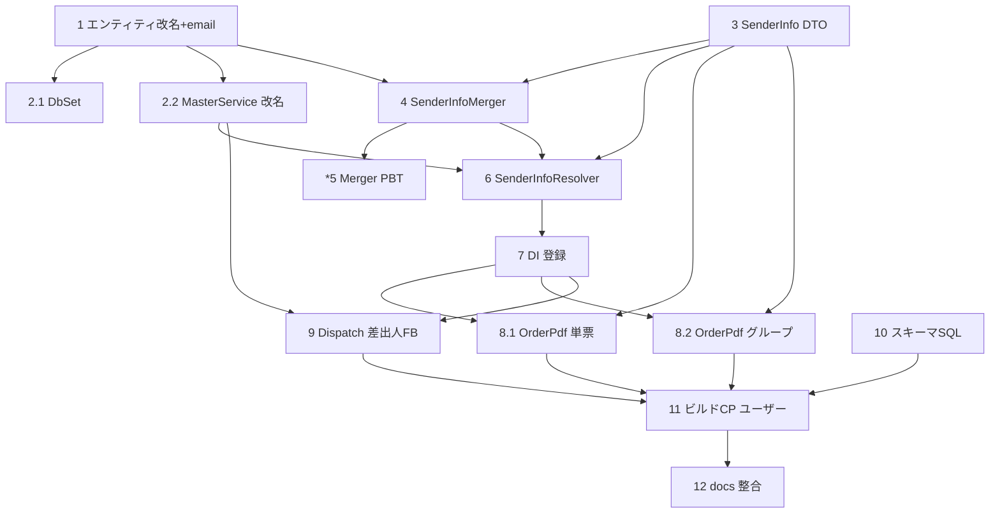

# 実装計画

- [x] 1. エンティティ改名＋メール列追加
  - `Data/Entities/MCompanyInfo.cs` を `MGeneralPersonalInfo`（クラス名・ファイル名）へ改名し `[Table("m_general_personal_info")]` を指定
  - `Email` プロパティ（`[Column("email")]`・`[MaxLength(256)]`・nullable）を追加
  - 既存列（user_code/simple_name/company_name_1/department_name_1/company_name_2/department_name_2/zip_code/address_1/address_2/tel/fax/is_active/created_at/updated_at）は維持
  - _要件: 4.1, 4.2, 4.3, 4.4_

- [x] 2. DbContext・MasterService の追随
  - [x] 2.1 `Data/MaterialDbContext.cs` の `DbSet<MCompanyInfo> CompanyInfos` を `DbSet<MGeneralPersonalInfo> GeneralPersonalInfos` に変更
    - _要件: 4.5_
  - [x] 2.2 `Services/IMasterService.cs`・`MasterService.cs` の `GetCompanyInfoAsync` を `GetGeneralPersonalInfoAsync`（戻り値 `MGeneralPersonalInfo`）へ改名し、`user_code` 一致→`DEFAULT` フォールバックの実装を維持
    - _要件: 4.5, 6.1, 6.2_

- [x] 3. SenderInfo DTO の追加
  - `Models/Dtos/SenderInfo.cs` を新規作成（CompanyName/FactoryName/DepartmentSub/ZipCode/Address/Tel/Fax/Contact/ReceivingFactory の record）
  - _要件: 1.3, 1.4, 1.5, 1.6, 1.7, 1.8, 1.9, 3.1_

- [x] 4. SenderInfoMerger（純粋ロジック）の追加
  - `Logic/SenderInfoMerger.cs` を新規作成（`Coalesce` ＝最初の非空白採用、`Merge(user, section, master, snapshotLastName, snapshotUserName)`）
  - user/section が null でも安全動作（全マスタ＋担当スナップショットへ）
  - _要件: 2.1, 2.2, 2.3, 2.4, 2.5, 2.6, 2.7, 2.8, 2.9_

- [x]* 5. SenderInfoMerger のプロパティテスト
  - `MaterialModule.Tests` に `SenderInfoMergerPropertyTests` を追加
  - Property 1（各項目独立のフィールド単位フォールバック）／Property 2（user=section=null で全マスタ化・担当はスナップショット）／Property 3（Coalesce 健全性：順序保存・空白非採用・全空で null）
  - _要件: 2.7, 2.8, 2.9_

- [x] 6. ISenderInfoResolver / SenderInfoResolver の追加
  - `Services/ISenderInfoResolver.cs`（`ResolveAsync`／`ResolveSenderEmailAsync`）・`Services/SenderInfoResolver.cs` を新規作成
  - `UserManager<ApplicationUser>`・`IUserRepository`・`IMasterService` を注入。`FindByNameAsync`→`GetMainUserSectionAsync(user.Id)`→`GetGeneralPersonalInfoAsync` の順に取得し `SenderInfoMerger.Merge` を呼ぶ
  - SharedCore 取得例外は Warning ログ＋当該ソース null 継続（PDF 生成を止めない）
  - _要件: 1.1, 1.2, 7.2, 7.3_

- [x] 7. DI 登録
  - `Extensions/MaterialModuleExtensions.cs` に `ISenderInfoResolver`→`SenderInfoResolver`（Scoped）を登録
  - _要件: 1.1_

- [x] 8. OrderPdfService の差し替え
  - [x] 8.1 単票 `GenerateOrderPdfAsync` を `ISenderInfoResolver.ResolveAsync(order.UserId, order.UserLastName, order.UserName)` 由来の `SenderInfo` で右上ブロック・担当・受入工場を構築
    - _要件: 1.3, 1.4, 1.5, 1.6, 1.7, 1.8, 1.9, 1.10, 3.1_
  - [x] 8.2 グループ `GenerateGroupOrderPdfAsync` を代表発注 `first` の `SenderInfo` で同様に構築（会社/工場/郵便/住所/TEL/FAX/担当/受入工場）
    - _要件: 1.10, 2.1-2.9, 3.1_

- [x] 9. DispatchEnqueueService の差出人フォールバック追加
  - `GetCompanyInfoAsync` 呼び出しを `GetGeneralPersonalInfoAsync` に追随（件名/fromName の会社名はマスタ由来を維持）
  - 差出人アドレス解決を `sendConfig?.FromAddress` → `ISenderInfoResolver.ResolveSenderEmailAsync(head.UserId)` → `_options.FromAddress` の順に変更（最終値で未設定スキップ判定）
  - `ISenderInfoResolver` を注入
  - _要件: 5.2, 5.3, 5.4, 5.5_

- [x] 10. スキーマ変更SQLの用意（適用はユーザー）
  - `MaterialModule/docs/sql/rename_m_company_info_to_general_personal_info.sql` を新規作成
    - `EXEC sp_rename 'm_company_info', 'm_general_personal_info';`
    - `ALTER TABLE m_general_personal_info ADD email nvarchar(256) NULL;`
  - _要件: 4.6_

- [ ] 11. ビルド確認（チェックポイント・ユーザー）
  - slnCoCore ビルドで改名・差し替え後も成功し、既存の発注書PDF・発注承認送信に影響が無いことを確認
  - _要件: 7.1_

- [x] 12. ドキュメント整合
  - `.kiro/docs/db/テーブル定義書.md` に `m_general_personal_info`（改名・`email` 列）を反映
  - `.kiro/docs/db/ER図.md` を必要に応じて更新（テーブル名変更・列追加）
  - _要件: 8.1, 8.2_

## タスク依存グラフ

- 実装順の目安: 1 → 2.1/2.2 → 3 → 4 →（*5）→ 6 → 7 → 8.1/8.2・9 →（10 並行可）→ 11（ユーザー）→ 12
- 破壊的変更（テーブル改名・列追加）はコードと分離し、SQL 適用はユーザーが実施（task 10 で用意・task 11 前後で適用）。
