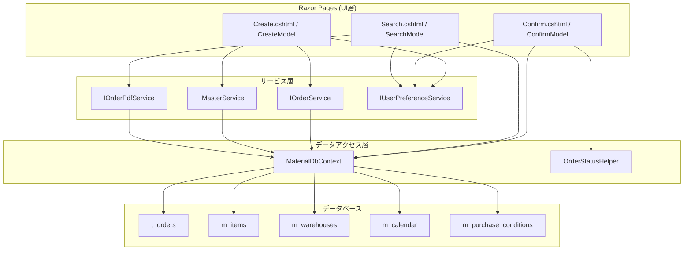
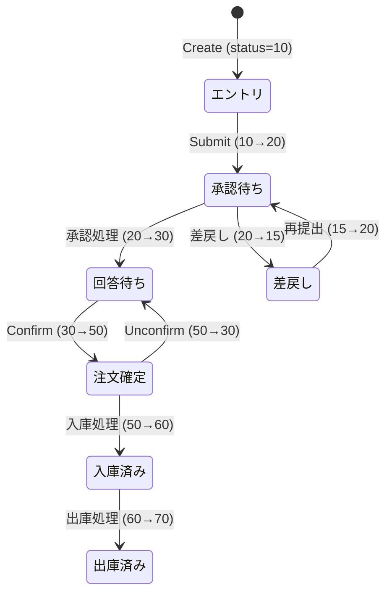

# 設計書: 発注管理ページ

## 概要

発注管理モジュール（Orders）の3画面に関する技術設計。ASP.NET Core Razor Pagesアーキテクチャ上で、品目検索・エントリ作成・発注確認・発注検索の機能を提供する。

対象ファイル:
- `MaterialModule/Areas/Material/Pages/Orders/Create.cshtml` / `.cshtml.cs` — 発注エントリ画面
- `MaterialModule/Areas/Material/Pages/Orders/Confirm.cshtml` / `.cshtml.cs` — 発注確認画面
- `MaterialModule/Areas/Material/Pages/Orders/Search.cshtml` / `.cshtml.cs` — 発注検索画面
- `MaterialModule/Services/IOrderService.cs` / `OrderService.cs` — 発注ビジネスロジック
- `MaterialModule/Services/IMasterService.cs` / `MasterService.cs` — マスタデータ取得
- `MaterialModule/Services/IOrderPdfService.cs` / `OrderPdfService.cs` — PDF生成
- `MaterialModule/Models/Dtos/OrderCreateDto.cs` — エントリ作成DTO
- `MaterialModule/Models/Dtos/OrderListDto.cs` — 一覧表示DTO
- `MaterialModule/Models/Dtos/ItemSelectDto.cs` — 品目検索DTO
- `MaterialModule/Models/Dtos/PurchaseConditionDto.cs` — 購買条件DTO
- `MaterialModule/Extensions/OrderQueryExtensions.cs` — クエリ拡張メソッド

設計方針:
- Razor Pages PageModelパターンに従い、各画面に対応するPageModelクラスを配置
- サービス層（IOrderService, IMasterService）を介してビジネスロジックを分離
- Entity Framework Core によるデータアクセス（MaterialDbContext）
- ClosedXML によるExcel出力
- 楽観的排他制御（OrderStatusHelper）によるステータス遷移の整合性保証

## アーキテクチャ



### ステータス遷移図



## コンポーネントとインターフェース

### 1. CreateModel（発注エントリ PageModel）

#### 依存サービス

| サービス | 用途 |
|---------|------|
| IOrderService | エントリ追加・削除・一括登録 |
| IMasterService | 品目検索・品目詳細・購買条件・倉庫一覧・営業日計算・デフォルト数量更新 |
| IUserPreferenceService | ページサイズ保持 |

#### プロパティ

```csharp
[BindProperty]
public OrderCreateDto Order { get; set; }          // エントリ入力データ

[BindProperty]
public List<int> SelectedEntryIds { get; set; }    // 一括登録対象

public List<SelectListItem> Warehouses { get; set; } // 倉庫ドロップダウン
public List<TOrder> Entries { get; set; }           // エントリ一覧
public int TotalEntryCount { get; set; }
public int PageSize { get; set; }                   // デフォルト10
public int CurrentPage { get; set; }
public string SortBy { get; set; }                  // created, delivery, qty, itemname
public bool SortDesc { get; set; }
```

#### ハンドラメソッド

| メソッド | HTTP | 機能 |
|---------|------|------|
| `OnGetAsync` | GET | 一覧表示（ソート・ページネーション） |
| `OnPostAddAsync` | POST | エントリ追加（バリデーション・デフォルト数量自動保存） |
| `OnPostRemoveAsync` | POST | エントリ削除 |
| `OnPostSubmitAsync` | POST | 一括発注登録（status 10→20） |
| `OnGetSearchSuggestAsync` | GET (AJAX) | 品目オートコンプリート検索 |
| `OnGetItemDetailAsync` | GET (AJAX) | 品目詳細・購買条件・営業日計算取得 |

#### AJAX エンドポイント

**品目検索サジェスト:**
```
GET /Material/Orders/Create?handler=SearchSuggest&keyword={keyword}
Response: ItemSelectDto[] (最大20件)
```

**品目詳細取得:**
```
GET /Material/Orders/Create?handler=ItemDetail&itemId={itemId}
Response: { item: ItemSelectDto, purchaseCondition: PurchaseConditionDto, defaultDeliveryDate: string? }
```

### 2. ConfirmModel（発注確認 PageModel）

#### 依存サービス

| サービス | 用途 |
|---------|------|
| MaterialDbContext | 直接クエリ（発注一覧・ステータス更新） |
| IUserPreferenceService | ページサイズ保持 |
| OrderStatusHelper | 排他制御付きステータス更新 |

#### プロパティ

```csharp
[BindProperty(SupportsGet = true)]
public string StatusView { get; set; } = "before"; // before=30, after=50

[BindProperty(SupportsGet = true)]
public string? SearchOrderNo { get; set; }
public string? SearchItemCode { get; set; }
public string? SearchItemName { get; set; }
public DateOnly? DateFrom { get; set; }
public DateOnly? DateTo { get; set; }
public string? SearchDestination { get; set; }
public string? SearchUserId { get; set; }           // デフォルト=ログインユーザー

[BindProperty]
public List<int> SelectedOrderIds { get; set; }     // 一括確定対象

public List<SelectListItem> UserList { get; set; }  // 発注者ドロップダウン
public string SortBy { get; set; }                  // orderno, itemcode, itemname, qty, date, delivery, dest
public bool SortDesc { get; set; }
```

#### ハンドラメソッド

| メソッド | HTTP | 機能 |
|---------|------|------|
| `OnGetAsync` | GET | 一覧表示（ビュー切替・フィルタ・ソート・ページネーション） |
| `OnPostConfirmAsync` | POST | 個別確定（30→50） |
| `OnPostBulkConfirmAsync` | POST | 一括確定（30→50） |
| `OnPostUnconfirmAsync` | POST | 確定取消（50→30） |
| `OnPostEditAsync` | POST | インライン編集（数量・納期更新） |

#### 排他制御

ステータス更新は `OrderStatusHelper.UpdateWithLockAsync` / `BulkUpdateWithLockAsync` を使用:
- 更新前に現在のステータスを検証
- 期待するステータスと一致しない場合は例外をスロー
- 同時更新による不整合を防止

### 3. SearchModel（発注検索 PageModel）

#### 依存サービス

| サービス | 用途 |
|---------|------|
| MaterialDbContext | 直接クエリ（全ステータス横断検索） |
| IOrderPdfService | PDF生成 |
| IUserPreferenceService | ページサイズ保持 |

#### プロパティ

```csharp
[BindProperty(SupportsGet = true)]
public string? SearchOrderNo { get; set; }
public string? SearchItemCode { get; set; }
public string? SearchItemName { get; set; }
public int? SearchStatus { get; set; }
public DateOnly? OrderDateFrom { get; set; }
public DateOnly? OrderDateTo { get; set; }
public DateOnly? DeliveryDateFrom { get; set; }
public DateOnly? DeliveryDateTo { get; set; }
public string? SearchUser { get; set; }
public string? SearchDestination { get; set; }
public string? SearchSupplier { get; set; }
public string? SearchWarehouse { get; set; }

public List<SelectListItem> Statuses { get; set; }  // ステータスドロップダウン
public bool HasSearched { get; set; }               // 検索実行済みフラグ
```

#### ハンドラメソッド

| メソッド | HTTP | 機能 |
|---------|------|------|
| `OnGetAsync` | GET | 検索・一覧表示 |
| `OnGetDownloadPdfAsync` | GET | 個別PDF出力 |
| `OnGetExportExcelAsync` | GET | Excel一括出力 |

#### BuildQuery（検索クエリ構築）

全フィルタ条件をAND結合でIQueryableを構築:
```csharp
private IQueryable<OrderListDto> BuildQuery()
{
    // SearchOrderNo → Contains検索
    // SearchItemCode → Contains検索
    // SearchItemName → Contains検索
    // SearchStatus → 完全一致
    // OrderDateFrom/To → 範囲検索
    // DeliveryDateFrom/To → 範囲検索
    // SearchUser → UserLastName Contains検索
    // SearchDestination → DestinationName Contains検索
    // SearchSupplier → SupplierName Contains検索
    // SearchWarehouse → WarehouseName Contains検索
    // ソート: OrderDate DESC, Id DESC
}
```

### 4. IOrderService インターフェース

```csharp
public interface IOrderService
{
    Task AddEntryAsync(OrderCreateDto order, string userId);
    Task RemoveEntryAsync(int entryId, string userId);
    Task<List<TOrder>> GetEntriesAsync(string userId);
    Task<List<int>> SubmitEntriesAsync(string userId, List<int>? entryIds);
}
```

### 5. IMasterService インターフェース（発注関連メソッド）

```csharp
public interface IMasterService
{
    Task<List<ItemSelectDto>> SearchItemsAsync(string keyword, int maxResults);
    Task<ItemSelectDto?> GetItemDetailAsync(int itemId);
    Task<PurchaseConditionDto?> GetPurchaseConditionForItemAsync(int itemId);
    Task<DateOnly> GetBusinessDayAfterAsync(DateOnly fromDate, int days);
    Task UpdateDefaultOrderQtyAsync(int itemId, decimal qty);
    Task<List<MWarehouse>> GetActiveWarehousesAsync();
}
```

### 6. IOrderPdfService インターフェース

```csharp
public interface IOrderPdfService
{
    Task<byte[]> GenerateOrderPdfAsync(int orderId);
}
```

## データモデル

### TOrder エンティティ（t_orders テーブル）

```
t_orders
├── id (PK, int, auto-increment)
├── order_no (string?, max 50) — 発注番号（Submit時に採番）
├── order_status (int, required) — ステータス (10/15/20/30/40/50/60/70)
├── order_status_text (string?, max 50) — ステータス表示名
├── order_type (string?, max 20) — 種別 (manual/provisional)
├── item_id (int, FK → m_items.id)
├── item_code (string, required, max 50)
├── item_name (string?, max 200)
├── order_qty (decimal, required) — 発注数量
├── unit_content_qty (decimal?) — 入数
├── total_qty (decimal?) — 総数量 (order_qty × unit_content_qty)
├── unit_price (decimal?) — 単価
├── amount (decimal?) — 金額 (unit_price × total_qty)
├── order_date (DateOnly?) — 発注日
├── delivery_date (DateOnly?) — 納期日
├── warehouse_code (string?, max 50)
├── warehouse_name (string?, max 100)
├── destination_name (string?, max 200) — 送付先
├── supplier_name (string?, max 200) — 仕入先
├── user_id (string, required) — 発注者ID
├── user_last_name (string?, max 50) — 発注者姓
├── approved_at (DateTime?) — 承認日時
├── approved_by_last_name (string?, max 50) — 承認者姓
├── remarks (string?, max 500) — 備考
├── created_at (DateTime, required)
└── updated_at (DateTime, required)
```

### OrderCreateDto

```csharp
public class OrderCreateDto
{
    public int ItemId { get; set; }
    public decimal OrderQty { get; set; }
    public DateOnly? DeliveryDate { get; set; }
    public string? WarehouseCode { get; set; }
    public string? OutputType { get; set; }
    public string? Remarks { get; set; }
}
```

### OrderListDto

```csharp
public class OrderListDto
{
    public int Id { get; set; }
    public string? OrderNo { get; set; }
    public int OrderStatus { get; set; }
    public string? OrderStatusText { get; set; }
    public string? OrderType { get; set; }
    public string ItemCode { get; set; }
    public string? ItemName { get; set; }
    public decimal OrderQty { get; set; }
    public decimal? UnitContentQty { get; set; }
    public decimal? TotalQty { get; set; }
    public decimal? UnitPrice { get; set; }
    public decimal? Amount { get; set; }
    public DateOnly? OrderDate { get; set; }
    public DateOnly? DeliveryDate { get; set; }
    public string? DestinationName { get; set; }
    public string? WarehouseName { get; set; }
    public string? SupplierName { get; set; }
    public string? UserLastName { get; set; }
    public DateTime? ApprovedAt { get; set; }
    public string? ApprovedByLastName { get; set; }
}
```

### ItemSelectDto

```csharp
public class ItemSelectDto
{
    public int Id { get; set; }
    public string ItemCode { get; set; }
    public string ItemName { get; set; }
    public decimal? DefaultOrderQty { get; set; }
    public int DefaultDeliveryDays { get; set; }
    // その他品目情報
}
```

### PurchaseConditionDto

```csharp
public class PurchaseConditionDto
{
    public string? DestinationName { get; set; }
    // その他購買条件情報
}
```

## エラーハンドリング

### Orders/Create

| 操作 | 条件 | 処理 |
|------|------|------|
| エントリ追加 | ItemId <= 0 | Message = "品目を選択してください。" |
| エントリ追加 | OrderQty <= 0 | Message = "数量は0より大きい値を指定してください。" |
| エントリ追加 | ModelState無効 | バリデーションエラー表示、ページ再表示 |
| 一括登録 | 選択なし | Message = "発注確定するエントリを選択してください。" |
| 一括登録 | InvalidOperationException | Message = ex.Message |
| 品目検索 | keyword空 | 空配列を返却 |

### Orders/Confirm

| 操作 | 条件 | 処理 |
|------|------|------|
| 個別確定 | 対象なし or status≠30 | ErrorMessage（ArgumentException/InvalidOperationException） |
| 一括確定 | 選択なし | ErrorMessage = "注文確定する発注を選択してください。" |
| 一括確定 | InvalidOperationException | ErrorMessage = ex.Message |
| 確定取消 | 対象なし or status≠50 | ErrorMessage（ArgumentException/InvalidOperationException） |
| インライン編集 | 対象なし or status≠30 | ErrorMessage = "対象の発注が見つからないか、編集できない状態です。" |
| インライン編集 | DB例外 | ErrorMessage = ex.Message |

### Orders/Search

| 操作 | 条件 | 処理 |
|------|------|------|
| PDF出力 | orderId無効 | サービス層で例外 |
| Excel出力 | 検索結果0件 | 空のExcelファイルを生成（ヘッダーのみ） |

## 共通パターン

### ページネーション

全3画面で共通のページネーションパターンを使用:
- `PageSize`: ユーザー設定値（IUserPreferenceService経由で永続化）
- `CurrentPage`: 1始まり
- `TotalPages`: `Math.Ceiling(TotalCount / PageSize)`
- ページ範囲外の場合は自動補正（1未満→1、TotalPages超過→TotalPages）
- 許容ページサイズ: 10, 20, 30, 50

### ソート

- クエリパラメータ `sort` / `desc` で制御
- 各画面で対応するソートキーが異なる
- デフォルトソートは画面ごとに設定

### 認可

全画面に `[Authorize(Policy = "DbPermissionCheck")]` を適用:
- 認証済みユーザーのみアクセス可能
- DBベースの権限チェックポリシーで画面単位のアクセス制御

### ユーザー識別

`User.Identity?.Name ?? "unknown"` でログインユーザーIDを取得し、データのフィルタリングおよび作成者記録に使用。

## テスト戦略

### 単体テスト

| テスト対象 | テスト内容 |
|-----------|-----------|
| CreateModel.OnPostAddAsync | バリデーション（ItemId, OrderQty）、エントリ追加、デフォルト数量自動保存 |
| CreateModel.OnPostSubmitAsync | 選択なしエラー、正常登録（status 10→20） |
| CreateModel.OnPostRemoveAsync | エントリ削除 |
| CreateModel.OnGetSearchSuggestAsync | keyword空→空配列、keyword有→結果返却 |
| CreateModel.OnGetItemDetailAsync | 品目詳細・購買条件・営業日計算の返却 |
| ConfirmModel.OnPostConfirmAsync | 正常確定（30→50）、異常系（status≠30） |
| ConfirmModel.OnPostBulkConfirmAsync | 正常一括確定、選択なしエラー |
| ConfirmModel.OnPostUnconfirmAsync | 正常取消（50→30）、異常系（status≠50） |
| ConfirmModel.OnPostEditAsync | 正常更新（数量・金額再計算）、異常系 |
| SearchModel.BuildQuery | 各フィルタ条件の適用確認 |
| SearchModel.OnGetExportExcelAsync | Excel出力内容・フォーマット確認 |

### 結合テスト

| テスト対象 | テスト内容 |
|-----------|-----------|
| ステータス遷移 | Create→Submit→Confirm→Unconfirm の一連フロー |
| 排他制御 | 同時更新時のOrderStatusHelper動作確認 |
| ページサイズ永続化 | 設定→再アクセス時の復元 |
| Excel出力 | 大量データでのメモリ使用・出力内容 |

### 手動テスト（UI確認）

| 確認項目 |
|---------|
| 品目検索オートコンプリートの応答速度・表示 |
| デフォルト数量・納期日の自動入力 |
| エントリ一覧のソート・ページネーション動作 |
| 一括登録のチェックボックス選択・実行 |
| 確認画面のビュー切替（before/after） |
| インライン編集の入力・保存 |
| PDF/Excelダウンロードの内容確認 |
| 各画面の認可制御（未認証・権限なしユーザー） |

---

## UI改修: 発注登録（Orders/Create）モーダル化

発注明細入力をモーダル方式に変更し、一覧エリアを広く取る。

### レイアウト方針
- 常設の「発注明細入力」カードを撤去し、一覧ヘッダの「発注明細入力」ボタン（`#btnOpenEntryModal`）から `#entryModal`（`modal-lg`, `font-size:0.75rem`）を開く。
- 送信方式は従来どおりフォーム submit（`asp-page-handler="Add"`）を維持。バリデーションエラー時はモーダルを自動再表示する。
- 品目サジェスト・送付先/納期自動取得・デフォルト数量・整数制限などの JS はモーダル内で動作するよう移植。hidden は `modalUpdateDefault` / `modalDefaultOrderQty`。

### モーダル内フィールド並び順
- 1段目: 品目 / 入目 / 個数
- 2段目: **倉庫 → 納期** → 出力 → 送付先（2026/06/10 に「納期 → 倉庫」から入替）
- 3段目: 備考

### 一覧
- スクロール枠 + ヘッダ固定: `<div class="table-responsive material-list-scroll">` + `<thead class="table-light sticky-top">`（共通UIルール参照）。
- 一覧高さは全ページ共通の `max-height: calc(100vh - 225px)`（Dispatches と統一）。
- デフォルトソートは「入力順（created 昇順）」（`SortDesc` 既定 false）。
