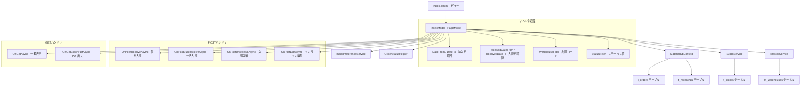
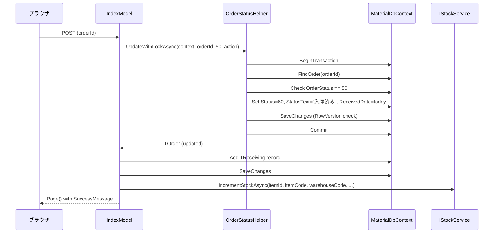
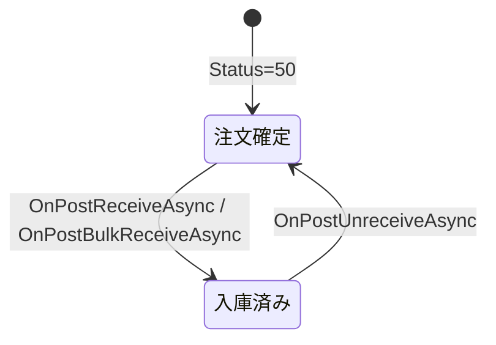

# 設計書: 入庫管理ページ

## 概要

入庫管理ページ（Receivings/Index）の技術設計。注文確定（ステータス50）と入庫済み（ステータス60）の発注データを一覧表示し、入庫処理・一括入庫・入庫取消・インライン編集・PDF出力機能を提供する。

対象ファイル:
- `MaterialModule/Areas/Material/Pages/Receivings/Index.cshtml` — ビュー（一覧表示・フィルタ・操作UI）
- `MaterialModule/Areas/Material/Pages/Receivings/Index.cshtml.cs` — PageModel（ビジネスロジック）

依存サービス:
- `IReceivingService` — 入庫レコードCRUD
- `IStockService` — 在庫増減処理
- `IMasterService` — 倉庫マスタ取得
- `IUserPreferenceService` — ページサイズ設定永続化
- `MaterialDbContext` — データアクセス
- `OrderStatusHelper` — 楽観的ロック付きステータス変更

## アーキテクチャ



## コンポーネントとインターフェース

### 1. IndexModel（PageModel）

#### コンストラクタ依存性注入

```csharp
public class IndexModel(
    IReceivingService receivingService,
    MaterialDbContext context,
    IMasterService masterService,
    IUserPreferenceService prefService,
    IStockService stockService) : PageModel
```

#### プロパティ

| プロパティ | 型 | 用途 |
|-----------|---|------|
| Orders | List\<OrderListDto\> | 表示用発注リスト |
| TotalCount | int | フィルタ後の総件数 |
| PageSize | int | 1ページあたりの表示件数（デフォルト10） |
| CurrentPage | int | 現在のページ番号 |
| TotalPages | int | 総ページ数（計算プロパティ） |
| SortBy | string | ソート列名（デフォルト "delivery"） |
| SortDesc | bool | 降順フラグ |
| DateFrom | DateOnly? | 納入日フィルタ開始（デフォルト: 今日） |
| DateTo | DateOnly? | 納入日フィルタ終了（デフォルト: 今日） |
| ReceivedDateFrom | DateOnly? | 入庫日フィルタ開始 |
| ReceivedDateTo | DateOnly? | 入庫日フィルタ終了 |
| WarehouseFilter | string? | 倉庫コードフィルタ |
| StatusFilter | string? | ステータスフィルタ（"50", "60", or null=両方） |
| Warehouses | List\<SelectListItem\> | 倉庫ドロップダウン選択肢 |
| SelectedOrderIds | List\<int\> | 一括入庫用選択ID |
| SuccessMessage | string? | 成功メッセージ |
| ErrorMessage | string? | エラーメッセージ |

#### ハンドラメソッド

| メソッド | HTTP | 機能 |
|---------|------|------|
| OnGetAsync | GET | 一覧表示（フィルタ・ソート・ページネーション） |
| OnPostReceiveAsync(int orderId) | POST | 個別入庫処理 |
| OnPostBulkReceiveAsync() | POST | 一括入庫処理 |
| OnPostUnreceiveAsync(int orderId) | POST | 入庫取消処理 |
| OnPostEditAsync(int orderId, decimal orderQty, string? lotNo, string? remarks, DateOnly? receivedDate) | POST | インライン編集 |
| OnGetExportPdfAsync() | GET | PDF出力 |

#### プライベートメソッド

| メソッド | 機能 |
|---------|------|
| LoadOrdersAsync() | フィルタ・ソート・ページネーション適用してOrders取得 |
| LoadWarehousesAsync() | IMasterServiceから倉庫リスト取得 |
| ReloadAsync() | ページサイズ再取得 + LoadWarehouses + LoadOrders |

### 2. OnPostReceiveAsync — 個別入庫処理フロー



### 3. OnPostBulkReceiveAsync — 一括入庫処理フロー

```csharp
// 処理フロー:
// 1. SelectedOrderIds空チェック → ErrorMessage
// 2. OrderStatusHelper.BulkUpdateWithLockAsync(context, ids, 50, action)
//    - 各orderのStatus=60, StatusText="入庫済み", ReceivedDate=today
// 3. 各orderに対してTReceiving作成 + IncrementStockAsync
// 4. SaveChanges
// 5. SuccessMessage = "{count} 件を入庫しました。"
```

### 4. OnPostUnreceiveAsync — 入庫取消処理フロー

```csharp
// 処理フロー:
// 1. OrderStatusHelper.UpdateWithLockAsync(context, orderId, 60, action)
//    - Status=50, StatusText="注文確定", ReceivedDate=null
// 2. t_receivingsから該当OrderIdのレコードを全削除
// 3. SaveChanges
// 4. SuccessMessage = "未入庫に戻しました。"
// ※ 注意: 現在の実装では在庫のデクリメントは行わない
```

### 5. OnPostEditAsync — インライン編集処理

```csharp
// 処理フロー:
// 1. context.Orders.FindAsync(orderId)
// 2. Status 50 or 60 チェック
// 3. 個数変更検知 → 備考に "個数変更: {旧}→{新}" 追記
// 4. フィールド更新:
//    - OrderQty = orderQty
//    - TotalQty = UnitContentQty.HasValue ? orderQty * UnitContentQty : null
//    - Amount = UnitPrice * TotalQty (四捨五入)
//    - LotNo = lotNo
//    - Remarks = updatedRemarks
//    - ReceivedDate = receivedDate
//    - UpdatedAt = DateTime.UtcNow
// 5. SaveChanges
// 6. SuccessMessage = "{OrderNo} を更新しました。"
```

### 6. OnGetExportPdfAsync — PDF出力

```csharp
// 処理フロー:
// 1. StatusFilterに応じてbaseQuery構築（50 or 60 or 両方）
// 2. DateFrom/DateTo/WarehouseFilterでフィルタ
// 3. DeliveryDate → WarehouseCode → ItemName でソート
// 4. DeliveryDate + WarehouseCode でグループ化
// 5. QuestPDFでドキュメント生成（グループごとに1ページ）
// 6. ファイル名: "入庫伝票_{DateFrom}_{DateTo}.pdf"
```

## データモデル

### TOrder エンティティ（t_orders）

入庫管理に関連するフィールド:

```
t_orders
├── id (PK, int, auto-increment)
├── order_no (nvarchar(20)) — 発注番号
├── order_date (DateOnly?) — 発注日
├── item_id (int, required) — 品目ID
├── item_code (nvarchar(50), required) — 品番
├── item_name (nvarchar(256)) — 品目名
├── order_qty (decimal, required) — 発注個数
├── unit_content_qty (decimal?) — 入目
├── total_qty (decimal?) — 数量 (= order_qty × unit_content_qty)
├── unit_price (decimal?) — 単価
├── amount (decimal?) — 金額 (= unit_price × total_qty)
├── unit (nvarchar(10)) — 単位
├── destination_name (nvarchar(128)) — 納入先名
├── delivery_date (DateOnly?) — 納入日
├── warehouse_code (nvarchar(50)) — 倉庫コード
├── warehouse_name (nvarchar(50)) — 倉庫名
├── order_status (int, required) — ステータス (50=注文確定, 60=入庫済み)
├── order_status_text (nvarchar(50)) — ステータス表示テキスト
├── remarks (nvarchar(256)) — 備考
├── lot_no (nvarchar(50)) — ロットNo
├── received_date (DateOnly?) — 入庫日
├── user_id (nvarchar(40), required) — 発注者ID
├── user_last_name (nvarchar(40)) — 発注者姓
├── created_at (DateTime, required)
├── updated_at (DateTime, required)
└── row_version (timestamp) — 楽観的ロック用
```

### TReceiving エンティティ（t_receivings）

```
t_receivings
├── id (PK, int, auto-increment)
├── order_id (int, required, FK → t_orders.id)
├── received_date (DateOnly, required) — 入庫日
├── received_qty (decimal, required) — 入庫数量
├── warehouse_code (nvarchar(50)) — 倉庫コード
├── warehouse_name (nvarchar(50)) — 倉庫名
├── remarks (nvarchar(256)) — 備考
├── user_id (nvarchar(40), required) — 処理者ID
├── created_at (DateTime, required)
└── updated_at (DateTime, required)
```

### OrderListDto（表示用DTO）

```csharp
public record OrderListDto(
    int Id, string? OrderNo, string? OrderLineNo, DateOnly? OrderDate,
    string OrderType, string ItemCode, string ItemName, decimal OrderQty,
    decimal? UnitContentQty, decimal? TotalQty, decimal? UnitPrice, decimal? Amount,
    string? SupplierName, string? DestinationName, DateOnly? DeliveryDate,
    int OrderStatus, string? OrderStatusText, string? WarehouseName,
    int? OutputType, string? Remarks, string? UserName, string? UserLastName,
    DateTime? ApprovedAt, string? ApprovedBy, string? ApprovedByLastName,
    string? LotNo, DateOnly? ReceivedDate);
```

### ステータス遷移



- **注文確定→入庫済み**: Status 50→60、OrderStatusText="入庫済み"、ReceivedDate=今日、TReceiving作成、在庫増加
- **入庫済み→注文確定**: Status 60→50、OrderStatusText="注文確定"、ReceivedDate=null、TReceiving削除

## 在庫連携（Stock Integration）

### 入庫時（IncrementStockAsync）

入庫処理時にIStockService.IncrementStockAsyncを呼び出し、在庫を増加させる。

```csharp
await stockService.IncrementStockAsync(
    order.ItemId,           // 品目ID
    order.ItemCode,         // 品番
    order.WarehouseCode ?? "9999",  // 倉庫コード（未設定時はデフォルト "9999"）
    order.WarehouseName,    // 倉庫名
    order.UnitContentQty ?? 1,      // 入目（未設定時は1）
    order.Unit,             // 単位
    order.OrderQty,         // 入庫個数
    order.UnitPrice);       // 単価（移動平均単価計算用）
```

パラメータ説明:
- `warehouseCode`: 倉庫コードが未設定の場合、デフォルト値 "9999" を使用
- `unitContentQty`: 入目が未設定の場合、1を使用
- `count`: OrderQty（個数単位）を渡す。実際の数量はサービス内でunitContentQtyを乗算

### 入庫取消時

現在の実装では、入庫取消時にIStockService.DecrementStockAsyncは呼び出されない。TReceivingレコードの削除とTOrderのステータス戻しのみ実行される。

## PDF生成（QuestPDF）

### ドキュメント構成

```
入庫伝票
├── グループ1（日付A + 倉庫X）→ 1ページ
│   ├── ヘッダー: 納入日テーブル + 印枠（確認 / 依頼担当）
│   └── 明細テーブル: No., 品番, 品目, 入目, 個数, 数量, 発注者, ロットNo., 確認, 備考
├── グループ2（日付A + 倉庫Y）→ 1ページ
│   └── ...
└── グループN → 1ページ
```

### ページレイアウト

| 項目 | 設定値 |
|------|--------|
| 用紙サイズ | A4 |
| 上マージン | 25pt |
| 下マージン | 20pt |
| 左マージン | 30pt |
| 右マージン | 25pt |
| フォント | Yu Gothic, 11pt |

### 明細テーブル列定義

| 列 | 幅 | 内容 |
|----|-----|------|
| No. | 25pt (固定) | 連番 |
| 品番 | 80pt (固定) | ItemCode |
| 品目 | 相対3 | ItemName |
| 入目 | 55pt (固定) | UnitContentQty (N1形式) |
| 個数 | 40pt (固定) | OrderQty (N0形式) |
| 数量 | 55pt (固定) | TotalQty (N0形式) |
| 発注者 | 50pt (固定) | UserLastName |
| ロットNo. | 60pt (固定) | LotNo |
| 確認 | 40pt (固定) | 空欄（手書き用） |
| 備考 | 相対2 | Remarks |

### グループ化ロジック

```csharp
var groups = orders
    .GroupBy(o => new { Date = o.DeliveryDate, Warehouse = o.WarehouseCode ?? "", WarehouseName = o.WarehouseName ?? "" })
    .OrderBy(g => g.Key.Date)
    .ThenBy(g => g.Key.Warehouse)
    .ToList();
```

### ライセンス設定

```csharp
QuestPDF.Settings.License = LicenseType.Community;
```

## エラーハンドリング

### OnPostReceiveAsync

| 条件 | 処理 |
|------|------|
| OrderIdが存在しない | ArgumentException → ErrorMessage = ex.Message |
| OrderStatusが50でない（楽観的ロック失敗） | InvalidOperationException → ErrorMessage = ex.Message |
| DbUpdateConcurrencyException | InvalidOperationException（OrderStatusHelper内で変換）→ ErrorMessage |
| 正常完了 | SuccessMessage = "{OrderNo} を入庫しました。" |

### OnPostBulkReceiveAsync

| 条件 | 処理 |
|------|------|
| SelectedOrderIdsが空 | ErrorMessage = "入庫する発注を選択してください。" |
| 楽観的ロック失敗 | InvalidOperationException → ErrorMessage = ex.Message |
| 正常完了 | SuccessMessage = "{count} 件を入庫しました。" |

### OnPostUnreceiveAsync

| 条件 | 処理 |
|------|------|
| OrderIdが存在しない | ArgumentException → ErrorMessage = ex.Message |
| OrderStatusが60でない | InvalidOperationException → ErrorMessage = ex.Message |
| 正常完了 | SuccessMessage = "未入庫に戻しました。" |

### OnPostEditAsync

| 条件 | 処理 |
|------|------|
| OrderIdが存在しない | ErrorMessage = "対象の発注が見つからないか、編集できない状態です。" |
| OrderStatusが50でも60でもない | ErrorMessage = "対象の発注が見つからないか、編集できない状態です。" |
| その他の例外 | ErrorMessage = ex.Message |
| 正常完了 | SuccessMessage = "{OrderNo} を更新しました。" |

### 楽観的ロック（OrderStatusHelper）

OrderStatusHelperはトランザクション内で以下を保証する:
1. レコード存在チェック（ArgumentException）
2. 期待ステータスチェック（InvalidOperationException）
3. RowVersionによる同時更新検知（DbUpdateConcurrencyException → InvalidOperationException変換）

失敗時のメッセージ例:
- "発注ID {id} が見つかりません。削除された可能性があります。"
- "この発注は既に他のユーザーによって変更されています。期待: 注文確定、現在: 入庫済み。画面を再読み込みしてください。"
- "この発注は他のユーザーによって同時に変更されました。画面を再読み込みしてください。"

## テスト戦略

### 単体テスト

| テスト対象 | テスト内容 |
|-----------|-----------|
| OnPostReceiveAsync - 正常系 | Status=50のorderに対してReceive実行→Status=60、TReceiving作成、Stock増加 |
| OnPostReceiveAsync - 異常系 | Status≠50のorderでReceive→ErrorMessage設定 |
| OnPostBulkReceiveAsync - 正常系 | 複数order選択→全件Status=60、TReceiving作成 |
| OnPostBulkReceiveAsync - 未選択 | 空リストで実行→"入庫する発注を選択してください。" |
| OnPostUnreceiveAsync - 正常系 | Status=60のorderでUnreceive→Status=50、TReceiving削除 |
| OnPostUnreceiveAsync - 異常系 | Status≠60のorderでUnreceive→ErrorMessage設定 |
| OnPostEditAsync - 個数変更 | OrderQty変更→TotalQty/Amount再計算、備考に変更履歴追記 |
| OnPostEditAsync - 存在しないorder | 存在しないID→ErrorMessage設定 |
| LoadOrdersAsync - フィルタ | 各フィルタ条件の組み合わせで正しく絞り込み |
| LoadOrdersAsync - ソート | 各ソート列で正しく並べ替え |
| LoadOrdersAsync - ページネーション | PageSize/CurrentPageに応じた正しいスライス |

### 結合テスト

| テスト対象 | テスト内容 |
|-----------|-----------|
| 入庫→在庫連携 | Receive実行後にTStockが正しく増加 |
| 一括入庫→在庫連携 | BulkReceive実行後に各品目のTStockが正しく増加 |
| 入庫取消→TReceiving削除 | Unreceive実行後にTReceivingが削除される |
| フィルタ組み合わせ | 日付+倉庫+ステータスの複合フィルタ |
| PDF出力 | フィルタ適用後のデータが正しくグループ化されてPDF生成 |

### 手動テスト（UI確認）

| 確認項目 |
|---------|
| 一覧にStatus 50/60の発注が表示される |
| 納入日フィルタがデフォルトで今日に設定される |
| 倉庫ドロップダウンにマスタデータが表示される |
| Status=50のレコードに「入庫」ボタンが表示される |
| Status=60のレコードに「戻す」ボタンが表示される |
| チェックボックス選択→一括入庫が正常動作する |
| インライン編集で個数変更時に備考が自動追記される |
| Status=50のレコードでは入庫日フィールドが非表示 |
| PDF出力で日付+倉庫ごとにページ分割される |
| ソート・ページネーション時にフィルタが保持される |
