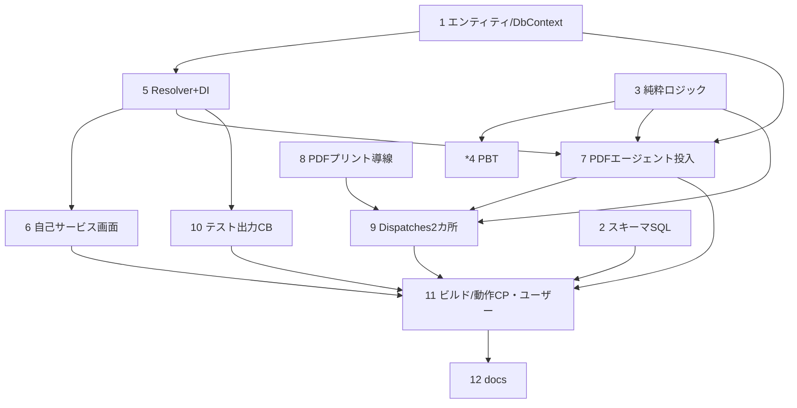

# 実装計画

- [ ] 1. エンティティ＋DbContext（印刷設定2マスタ）
  - [ ] 1.1 `Data/Entities/MUserPrintSetting.cs`（`m_user_print_setting`：user_code/report_type/printer_name/監査/row_version）
    - _要件: 5.1, 5.6_
  - [ ] 1.2 `Data/Entities/MPrintSystemSetting.cs`（`m_print_system_setting`：report_type/external_output_enabled/printer_name/監査/row_version）
    - _要件: 6.1_
  - [ ] 1.3 `MaterialDbContext` に DbSet 2件＋一意インデックス（user_code×report_type／report_type）を追加
    - _要件: 5.6, 6.1_

- [ ] 2. スキーマ変更SQL（適用はユーザー）
  - `docs/sql/create_m_user_print_setting.sql`・`docs/sql/create_m_print_system_setting.sql`（CREATE＋一意インデックス・冪等）
  - _要件: 10.4_

- [ ] 3. 純粋ロジック（方式判定・外部出力ゲート）
  - `Logic/PrintRoutingRules.cs`：`ResolveOutputKinds(int? outputType)`（0=なし/1=PDFエージェント/2=SMTPエージェント/3=両方）／`ShouldExternalOutput(MPrintSystemSetting?)`（enabled かつ printer_name 非空）
  - _要件: 7.1, 8.2, 6.2, 6.3_

- [ ]* 4. 純粋ロジックのプロパティテスト
  - `MaterialModule.Tests` に `PrintRoutingRulesPropertyTests`（P1 方式判定 全域／P2 外部出力ゲート）
  - _要件: 7.1, 6.2_

- [ ] 5. IPrintOutputResolver / PrintOutputResolver ＋ DI
  - `Services/IPrintOutputResolver.cs`・`Services/PrintOutputResolver.cs`：`ResolveUserPrinterAsync(userCode, reportType)`／`ResolveSystemSettingAsync(reportType)`／`ResolveSelfEmailAsync(loginName)`（既存 `ISenderInfoResolver.ResolveSenderEmailAsync` 再利用可）
  - `MaterialModuleExtensions` に Scoped 登録
  - _要件: 3.2, 6.2, 9.4_

- [ ] 6. ユーザー印刷設定 自己サービス画面
  - `Areas/Material/Pages/PrintSettings/Index.cshtml(.cs)`：ログインユーザーの `m_user_print_setting` を帳票種別ごとに表示・編集。プリンタ選択肢＝`IPrinterQueryService.GetAvailablePrintersAsync`。`row_version` 楽観ロック。`[Authorize(Policy="DbPermissionCheck")]`。`_MaterialStyles`/フォント規約準拠
  - _要件: 5.2, 5.3, 5.4, 5.5_

- [ ] 7. PDFエージェント投入の printer_name 解決反映
  - [ ] 7.1 Orders/Create 承認時（`PrintJobService.CreateOrderApprovalJobsAsync` 経路）：発注者(user_id)×`order_approval` の割当を解決して `EnqueueAsync(printerName 指定)`。未割当は警告（承認は継続・ログ）
    - _要件: 3.1, 3.2, 3.3, 3.5, 7.1_
  - [ ] 7.2 Dispatches(ii)：`m_print_system_setting`(dispatch_request) を解決し、外部出力ON かつ printer_name 非空のとき PDFエージェント投入
    - _要件: 6.2, 6.3, 6.4, 8.2_

- [ ] 8. PDFプリント導線（HTTP配信）
  - [ ] 8.1 Orders/Create：PDFプリント用ハンドラ（生成PDFを `File(bytes,"application/pdf")` で配信）＋ボタン
    - _要件: 2.1, 2.2, 2.3_
  - [ ] 8.2 Dispatches(i)：「請求」押下時に PDFプリント（HTTP配信）
    - _要件: 2.1, 2.3, 8.1_
  - [ ] 8.3 Receivings：既存 `OnGetExportPdfAsync`（PDF配信）を PDFプリント導線として整合（既存踏襲・必要なら導線名整理）
    - _要件: 2.1, 2.3, 9(該当なし)_

- [ ] 9. Dispatches 2カ所出力の統合
  - 「請求」押下で (i) PDFプリント＋(ii) PDFエージェント（外部出力ON時）を同一生成PDFで実施（二重生成回避）
  - _要件: 8.1, 8.2, 8.3_

- [ ] 10. テスト出力チェックボックス（エージェント時のみ）
  - [ ] 10.1 Orders/Create：テスト出力CB＝承認を経由せず、PDFエージェント（自分の割当・未割当エラー）／SMTPエージェント（自分宛＝`ResolveSelfEmailAsync`）へ即時投入
    - _要件: 9.1, 9.2, 9.3, 9.4, 9.5_
  - [ ] 10.2 Dispatches(ii)：テスト出力CB＝請求を経由せず PDFエージェント（自分の割当）へ即時投入
    - _要件: 9.1, 9.2, 9.3, 9.5_

- [ ] 11. ビルド確認（チェックポイント・ユーザー）
  - slnCoCore ビルド＋（適用済みなら）画面動作確認。DBは task2 SQL 適用が前提
  - _要件: 10.1, 10.3_

- [ ] 12. ドキュメント整合
  - `.kiro/docs/db/テーブル定義書.md`・`ER図.md`(.mmd) に `m_user_print_setting`・`m_print_system_setting` を反映
  - _要件: 11.1_

## タスク依存グラフ

- 実装順の目安：1 → 2 → 3 →（*4）→ 5 → 6 → 7 → 8 → 9 → 10 → 11（ユーザー）→ 12
- スキーマ追加（2マスタ）はコードと分離し SQL 適用はユーザー。破壊系なし（新規テーブル追加）。
