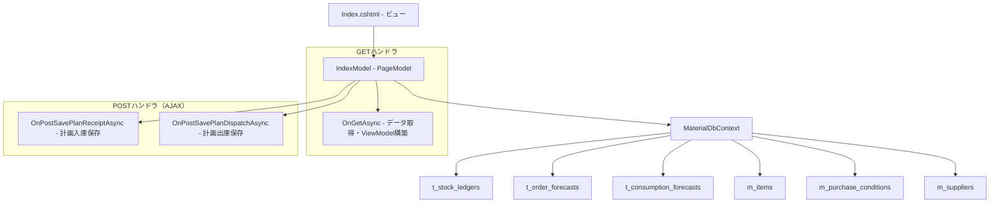

# 設計書: 受払台帳ページ（品目別入出庫残高一覧）

## 概要

受払台帳ページ（StockLedger/Index）の技術設計。指定期間内の品目別入出庫残高を一覧表示するRazor Pages画面。左側に品目属性情報（罫線なし）、右側に日別の計画・実績データテーブル（罫線あり）を d-flex 横並びレイアウトで表示する。計画データのAJAX保存機能を備える。

対象ファイル:
- `MaterialModule/Areas/Material/Pages/StockLedger/Index.cshtml` — ビュー（左右分離レイアウト、2段表示）
- `MaterialModule/Areas/Material/Pages/StockLedger/Index.cshtml.cs` — PageModel（OnGetAsync + AJAXハンドラ2本）
- `MaterialModule/Models/ViewModels/StockLedgerViewModel.cs` — ViewModel（StockLedgerListViewModel, StockLedgerItemGroup, StockLedgerRow）
- `MaterialModule/Data/Entities/MItem.cs` — 品目エンティティ（Concentration, SpecificGravity, PackageTypeName）
- `MaterialModule/Data/Entities/TOrderForecast.cs` — 発注予測エンティティ
- `MaterialModule/Data/Entities/TConsumptionForecast.cs` — 消費予測エンティティ

設計方針:
- Razor Pages PageModelパターン（OnGetAsync + AJAX POSTハンドラ）
- DbContext直接利用（サービス層を介さずPageModelからクエリ）
- d-flex による左右分離レイアウト（Bootstrap table-bordered の罫線問題を回避）
- 2段表示（数量 N3 + 個数 N0）で情報密度を確保
- colgroup による固定列幅で表示の安定性を確保

## アーキテクチャ



### データフロー

```
OnGetAsync:
  1. t_stock_ledgers (期間フィルタ) → ledgers
  2. t_order_forecasts (期間フィルタ) → orderForecasts
  3. t_consumption_forecasts (期間フィルタ) → consumptionForecasts
  4. ledgers を ItemId/ItemCode でグループ化
  5. 各グループに forecast データをマージ → StockLedgerRow 生成
  6. PlanStockQty/PlanStockCount を累積計算（running total）
  7. m_items, m_purchase_conditions, m_suppliers から属性情報を付加
  8. DisplayMode フィルタ適用（"minus" → FinalStockCount < 0 or FinalStockQty < 0）
  9. StockLedgerListViewModel を構築
```

### レイヤー構成

| レイヤー | 責務 |
|---------|------|
| ビュー (Index.cshtml) | 期間フィルタUI、左右分離レイアウト、2段データ表示、合計行 |
| PageModel (IndexModel) | リクエスト処理、DbContextクエリ、ViewModel構築、AJAXハンドラ |
| ViewModel | StockLedgerListViewModel → StockLedgerItemGroup → StockLedgerRow |
| DbContext | EF Core によるデータアクセス |

## コンポーネントとインターフェース

### 1. IndexModel（PageModel）

#### コンストラクタ依存性注入

```csharp
[Authorize(Policy = "DbPermissionCheck")]
public class IndexModel(IMasterService masterService, MaterialDbContext context) : PageModel
```

#### プロパティ

| プロパティ | 型 | バインディング | 用途 |
|-----------|---|--------------|------|
| DateFrom | `DateOnly?` | BindProperty(SupportsGet=true) | 期間開始日 |
| DateTo | `DateOnly?` | BindProperty(SupportsGet=true) | 期間終了日 |
| DisplayMode | `string` | BindProperty(SupportsGet=true) | 表示モード（"minus" / "all"） |
| ViewModel | `StockLedgerListViewModel?` | — | 表示用ViewModel |

#### GETハンドラ: OnGetAsync()

処理フロー:
1. DateFrom/DateTo のデフォルト値設定（当月1日〜末日）
2. t_stock_ledgers から期間内レコード取得（OrderBy ItemCode, RecordDate）
3. t_order_forecasts から期間内レコード取得
4. t_consumption_forecasts から期間内レコード取得
5. ledgers が空の場合 → 空の ViewModel を返却
6. forecast データを ItemId × Date の Dictionary に変換
7. ledgers を ItemId/ItemCode でグループ化し StockLedgerItemGroup を構築:
   - 各日の StockLedgerRow を生成（実績 + 計画データをマージ）
   - 期間初日・最終日が存在しない場合は補完行を挿入
   - PlanStockQty/PlanStockCount を累積計算
   - 合計値（Total*）を算出
8. m_items, m_purchase_conditions, m_suppliers から属性情報を付加
9. DisplayMode フィルタ適用
10. StockLedgerListViewModel を構築

#### POSTハンドラ: OnPostSavePlanReceiptAsync

```csharp
public async Task<IActionResult> OnPostSavePlanReceiptAsync([FromBody] PlanCellSaveRequest request)
```

処理フロー:
1. t_order_forecasts から ItemId + ForecastDate で既存レコード検索
2. 既存あり → ForecastOrderQty を更新、UpdatedAt を設定
3. 既存なし → 新規 TOrderForecast レコード作成（GrossRequirementQty, NetRequirementQty, ForecastOrderQty に request.Qty を設定、LotSizeType="manual"）
4. SaveChangesAsync → JSON { success: true } を返却
5. 例外発生時 → JSON { success: false, message: ex.Message } を返却

#### POSTハンドラ: OnPostSavePlanDispatchAsync

```csharp
public async Task<IActionResult> OnPostSavePlanDispatchAsync([FromBody] PlanCellSaveRequest request)
```

処理フロー:
1. t_consumption_forecasts から ItemId + ForecastDate で既存レコード検索
2. 既存あり → ForecastQty を更新、UpdatedAt を設定
3. 既存なし → 新規 TConsumptionForecast レコード作成（SourceId=1, UserId=User.Identity.Name）
4. SaveChangesAsync → JSON { success: true } を返却
5. 例外発生時 → JSON { success: false, message: ex.Message } を返却

### 2. PlanCellSaveRequest DTO

```csharp
public class PlanCellSaveRequest
{
    public int ItemId { get; set; }
    public DateOnly Date { get; set; }
    public decimal Qty { get; set; }
}
```

### 3. ViewModel 構造

#### StockLedgerListViewModel

```csharp
public class StockLedgerListViewModel
{
    public string PlantName { get; set; } = "";        // "神崎工場"
    public DateOnly DateFrom { get; set; }
    public DateOnly DateTo { get; set; }
    public List<StockLedgerItemGroup> ItemGroups { get; set; } = [];
}
```

#### StockLedgerItemGroup

```csharp
public class StockLedgerItemGroup
{
    // 識別
    public string ItemCode { get; set; } = "";
    public string ItemName { get; set; } = "";
    public string? Unit { get; set; }
    public decimal UnitContentQty { get; set; }

    // 品目属性情報（Left_Attribute_Area 用）
    public string? DestinationName { get; set; }       // 仕入先
    public string? MakerName { get; set; }              // メーカー
    public decimal? Concentration { get; set; }         // 濃度
    public decimal? SpecificGravity { get; set; }       // 比重
    public string? GrType { get; set; }                 // 購買（現調品・GR品）
    public string? PurchaseTypeDisplay { get; set; }    // 在庫（在庫・預託）
    public string? PackageTypeName { get; set; }        // 荷姿
    public string? ContentDisplay { get; set; }         // 入目
    public string? WarehouseName { get; set; }          // 倉庫
    public string? DeliveryDaysDisplay { get; set; }    // 納期

    // 日別データ
    public List<StockLedgerRow> Rows { get; set; } = [];

    // 合計行（計）
    public decimal CarriedQty { get; set; }
    public decimal CarriedCount { get; set; }
    public decimal TotalReceivedQty { get; set; }
    public decimal TotalReceivedCount { get; set; }
    public decimal TotalDispatchedQty { get; set; }
    public decimal TotalDispatchedCount { get; set; }
    public decimal TotalPlanReceivedQty { get; set; }
    public decimal TotalPlanReceivedCount { get; set; }
    public decimal TotalPlanDispatchedQty { get; set; }
    public decimal TotalPlanDispatchedCount { get; set; }
    public decimal FinalStockQty { get; set; }
    public decimal FinalStockCount { get; set; }
    public decimal FinalPlanStockQty { get; set; }
    public decimal FinalPlanStockCount { get; set; }
}
```

#### StockLedgerRow

```csharp
public class StockLedgerRow
{
    public DateOnly RecordDate { get; set; }

    // 繰越
    public decimal CarriedQty { get; set; }
    public decimal CarriedCount { get; set; }

    // 計画
    public decimal PlanReceivedQty { get; set; }
    public decimal PlanReceivedCount { get; set; }
    public decimal PlanDispatchedQty { get; set; }
    public decimal PlanDispatchedCount { get; set; }
    public decimal PlanStockQty { get; set; }
    public decimal PlanStockCount { get; set; }

    // 実績
    public decimal ReceivedQty { get; set; }
    public decimal ReceivedCount { get; set; }
    public decimal DispatchedQty { get; set; }
    public decimal DispatchedCount { get; set; }
    public decimal StockQty { get; set; }
    public decimal StockCount { get; set; }

    public string? Unit { get; set; }
    public decimal UnitContentQty { get; set; }
}
```

### 4. ビュー構成 (Index.cshtml)

#### レイアウト構造

```
container-fluid.mt-3.px-4
├── h5 "品目別入出庫残高一覧"
├── card (期間フィルタ)
│   └── form (method="get", d-flex align-items-end gap-3)
│       ├── input[date] DateFrom
│       ├── input[date] DateTo
│       ├── select DisplayMode ("在庫マイナスのみ" / "全件")
│       └── button "表示"
│
└── card (データ表示)
    ├── card-header (タイトル + プラント名 + 期間)
    └── card-body.p-0
        └── @foreach (var group in ItemGroups)
            └── div.d-flex.border-bottom (font-size: 0.7rem)
                ├── div.flex-shrink-0 (width: 220px) — Left_Attribute_Area
                │   └── table.table.table-sm.mb-0 (border-0)
                │       └── @foreach attr in 12 attributes
                │           └── tr (height: 18px)
                │               ├── td.fw-bold.border-0 (label)
                │               └── td.border-0 (value)
                │
                └── div.flex-grow-1 — Right_Data_Table
                    └── div.table-responsive
                        └── table.table.table-bordered.table-sm.mb-0 (table-layout: fixed)
                            ├── colgroup (62px + 6×(70px+30px) + 6×(70px+30px) = 13 cols)
                            ├── thead.table-light (3-tier header)
                            │   ├── tr: 年月日(rowspan=3) | 計画(colspan=6, #f5f0d0) | 実績(colspan=6)
                            │   ├── tr: 入庫(2) | 出庫(2) | 在庫(2) × 2
                            │   └── tr: 数量個数 | 単位 × 6
                            ├── tbody
                            │   └── @foreach row in dataRows
                            │       ├── tr (row 1: 数量 N3)
                            │       │   ├── td rowspan=2 (yy/MM/dd)
                            │       │   ├── td×6 (Plan: #fdfbf0 bg)
                            │       │   └── td×6 (Actual: no bg)
                            │       └── tr (row 2: 個数 N0, 単位="個")
                            │           ├── td×6 (Plan: #fdfbf0 bg)
                            │           └── td×6 (Actual: no bg)
                            └── Summary_Row (計, table-warning, fw-bold, rowspan=2)
```

#### 列幅定義（colgroup）

| 列 | 幅 | 内容 |
|----|-----|------|
| col 1 | 62px | 年月日 |
| col 2 | 70px | 計画入庫 数値 |
| col 3 | 30px | 計画入庫 単位 |
| col 4 | 70px | 計画出庫 数値 |
| col 5 | 30px | 計画出庫 単位 |
| col 6 | 70px | 計画在庫 数値 |
| col 7 | 30px | 計画在庫 単位 |
| col 8 | 70px | 実績入庫 数値 |
| col 9 | 30px | 実績入庫 単位 |
| col 10 | 70px | 実績出庫 数値 |
| col 11 | 30px | 実績出庫 単位 |
| col 12 | 70px | 実績在庫 数値 |
| col 13 | 30px | 実績在庫 単位 |

#### スタイル定義

| 要素 | スタイル |
|------|---------|
| 計画列ヘッダー | background: #f5f0d0 |
| 計画列データ | background: #fdfbf0 |
| 実績列ヘッダー | table-light (デフォルト) |
| 実績列データ | なし (デフォルト) |
| 合計行 | table-warning + fw-bold |
| 行高さ | height: 18px, line-height: 18px |
| 数値セル | text-end, py-0, px-1 |
| 単位セル | text-center, py-0, px-1 |

## データモデル

### 計画在庫の累積計算ロジック

```
carriedCount = first ledger record's CarriedCount
carriedQty = first ledger record's CarriedQty

for each row in chronological order:
    cumulativePlanReceived += row.PlanReceivedCount
    cumulativePlanDispatched += row.PlanDispatchedCount
    row.PlanStockCount = carriedCount + cumulativePlanReceived - cumulativePlanDispatched

    cumulativePlanReceivedQty += row.PlanReceivedQty
    cumulativePlanDispatchedQty += row.PlanDispatchedQty
    row.PlanStockQty = carriedQty + cumulativePlanReceivedQty - cumulativePlanDispatchedQty
```

### 計画数量の変換

```
PlanReceivedCount = TOrderForecast.ForecastOrderQty
PlanReceivedQty = ForecastOrderQty × UnitContentQty

PlanDispatchedCount = Sum(TConsumptionForecast.ForecastQty) per date
PlanDispatchedQty = Sum(ForecastQty) × UnitContentQty
```

### 期間補完ロジック

- 期間初日（DateFrom）にレコードがない場合 → 繰越値で補完行を挿入
- 期間最終日（DateTo）にレコードがない場合 → 最終既存行の在庫値で補完行を挿入

## エラーハンドリング

### AJAX保存

| 条件 | レスポンス |
|------|----------|
| 保存成功 | `{ success: true }` |
| 例外発生 | `{ success: false, message: "エラーメッセージ" }` |

### データ表示

| 条件 | 処理 |
|------|------|
| 期間内にデータなし | "該当するデータはありません。" を表示 |
| 属性値がnull | "-" を表示 |
| forecast レコードなし | 計画値 = 0 として処理 |

### 認可エラー

| 条件 | 処理 |
|------|------|
| 未認証ユーザー | ログインページへリダイレクト |
| 権限不足 | アクセス拒否（403） |

## テスト戦略

### 単体テスト

| テスト対象 | テスト内容 |
|-----------|-----------|
| OnGetAsync - デフォルト期間 | DateFrom/DateTo が当月1日〜末日に設定される |
| OnGetAsync - データなし | 空の ViewModel が返却される |
| OnGetAsync - DisplayMode "minus" | FinalStockCount < 0 or FinalStockQty < 0 のグループのみ |
| OnGetAsync - DisplayMode "all" | 全グループが返却される |
| OnGetAsync - PlanStock計算 | 累積計算が正しい |
| OnPostSavePlanReceiptAsync - 新規 | TOrderForecast が作成される |
| OnPostSavePlanReceiptAsync - 更新 | 既存レコードの ForecastOrderQty が更新される |
| OnPostSavePlanDispatchAsync - 新規 | TConsumptionForecast が作成される |
| OnPostSavePlanDispatchAsync - 更新 | 既存レコードの ForecastQty が更新される |

### 手動テスト（UI確認）

| 確認項目 |
|---------|
| 期間フィルタが正しく動作する |
| 表示モード切替が正しくフィルタリングする |
| 左右分離レイアウトが正しく表示される |
| 3段ヘッダーが正しく構成される |
| 計画列のクリーム色背景が適用される |
| 2段表示（数量N3 + 個数N0）が正しい |
| 合計行の値が正しい |
| colgroup による列幅固定が機能する |
