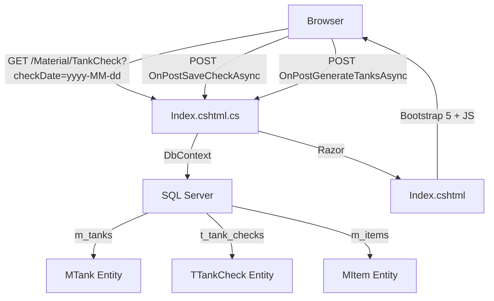
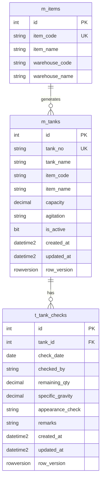

# 設計書: タンク残量チェック (tank-check)

## Overview

タンク残量チェック機能は、MaterialModule内のRazor Pagesアプリケーションとして実装する。品目マスタ（m_items）からタンクマスタ（m_tanks）を自動生成し、日次のタンク残量チェック記録（残数量、比重、外観チェック、備考）をAJAXで行単位保存する画面を提供する。

主要な技術的決定:
- **単一ページ構成**: Index.cshtml + Index.cshtml.cs で全機能を実装
- **AJAX行単位保存**: ページ全体のPOSTではなく、fetch APIによる行単位の非同期保存
- **Upsert パターン**: TankId + CheckDate の組み合わせで既存レコードの有無を判定し、INSERT/UPDATEを切り替え
- **楽観的ロック**: RowVersion による排他制御で同時編集の競合を検出

## Architecture



### レイヤー構成

| レイヤー | 責務 |
|---------|------|
| Razor Page (View) | UI表示、JavaScript による AJAX 通信 |
| PageModel (Controller) | リクエスト処理、ビジネスロジック、DB操作 |
| Entity (Model) | データ構造定義、EF Core マッピング |
| DbContext | DB接続、クエリ実行 |

サービス層は設けず、PageModel に直接 DbContext を注入する（プロジェクト規約に準拠）。

## Components and Interfaces

### 1. エンティティ

#### MTank (MaterialModule/Data/Entities/MTank.cs)

```csharp
[Table("m_tanks")]
public class MTank
{
    [Key]
    [Column("id")]
    public int Id { get; set; }

    [Required]
    [Column("tank_no")]
    [MaxLength(20)]
    public string TankNo { get; set; } = string.Empty;

    [Required]
    [Column("tank_name")]
    [MaxLength(100)]
    public string TankName { get; set; } = string.Empty;

    [Column("item_code")]
    [MaxLength(20)]
    public string? ItemCode { get; set; }

    [Column("item_name")]
    [MaxLength(256)]
    public string? ItemName { get; set; }

    [Column("capacity")]
    public decimal? Capacity { get; set; }

    [Column("agitation")]
    [MaxLength(10)]
    public string? Agitation { get; set; }

    [Required]
    [Column("is_active")]
    public bool IsActive { get; set; } = true;

    [Required]
    [Column("created_at")]
    public DateTime CreatedAt { get; set; }

    [Required]
    [Column("updated_at")]
    public DateTime UpdatedAt { get; set; }

    [Timestamp]
    [Column("row_version")]
    public byte[] RowVersion { get; set; } = [];
}
```

#### TTankCheck (MaterialModule/Data/Entities/TTankCheck.cs)

```csharp
[Table("t_tank_checks")]
public class TTankCheck
{
    [Key]
    [Column("id")]
    public int Id { get; set; }

    [Required]
    [Column("tank_id")]
    public int TankId { get; set; }

    [Required]
    [Column("check_date")]
    public DateOnly CheckDate { get; set; }

    [Required]
    [Column("checked_by")]
    [MaxLength(50)]
    public string CheckedBy { get; set; } = string.Empty;

    [Column("remaining_qty")]
    public decimal? RemainingQty { get; set; }

    [Column("specific_gravity")]
    public decimal? SpecificGravity { get; set; }

    [Column("appearance_check")]
    [MaxLength(10)]
    public string? AppearanceCheck { get; set; }

    [Column("remarks")]
    [MaxLength(50)]
    public string? Remarks { get; set; }

    [Required]
    [Column("created_at")]
    public DateTime CreatedAt { get; set; }

    [Required]
    [Column("updated_at")]
    public DateTime UpdatedAt { get; set; }

    [Timestamp]
    [Column("row_version")]
    public byte[] RowVersion { get; set; } = [];

    // Navigation property
    public MTank? Tank { get; set; }
}
```

### 2. DbContext 拡張

MaterialDbContext に以下を追加:

```csharp
public DbSet<MTank> Tanks => Set<MTank>();
public DbSet<TTankCheck> TankChecks => Set<TTankCheck>();
```

OnModelCreating に以下を追加:

```csharp
modelBuilder.Entity<MTank>()
    .HasIndex(t => t.TankNo)
    .IsUnique()
    .HasDatabaseName("uq_m_tanks_01");

modelBuilder.Entity<TTankCheck>()
    .HasIndex(tc => new { tc.TankId, tc.CheckDate })
    .IsUnique()
    .HasDatabaseName("uq_t_tank_checks_01");

modelBuilder.Entity<TTankCheck>()
    .HasOne(tc => tc.Tank)
    .WithMany()
    .HasForeignKey(tc => tc.TankId);
```

### 3. PageModel ハンドラー

#### Index.cshtml.cs

```csharp
[IgnoreAntiforgeryToken]
[Authorize(Policy = "DbPermissionCheck")]
public class IndexModel(MaterialDbContext context) : PageModel
{
    [BindProperty(SupportsGet = true)]
    public DateOnly? CheckDate { get; set; }

    public List<TankCheckRowViewModel> TankRows { get; set; } = [];

    // GET: ページ読み込み
    public async Task OnGetAsync() { ... }

    // POST: チェックデータ保存（AJAX）
    public async Task<IActionResult> OnPostSaveCheckAsync([FromBody] TankCheckSaveRequest request) { ... }

    // POST: タンクマスタ自動生成（管理者操作）
    public async Task<IActionResult> OnPostGenerateTanksAsync() { ... }
}
```

### 4. リクエスト/レスポンスモデル

```csharp
public class TankCheckSaveRequest
{
    public int TankId { get; set; }
    public string CheckDate { get; set; } = "";
    public decimal? RemainingQty { get; set; }
    public decimal? SpecificGravity { get; set; }
    public string? AppearanceCheck { get; set; }
    public string? Remarks { get; set; }
    public byte[]? RowVersion { get; set; }
}

public class TankCheckRowViewModel
{
    public int TankId { get; set; }
    public string TankNo { get; set; } = "";
    public string TankName { get; set; } = "";
    public string? ItemCode { get; set; }
    public string? ItemName { get; set; }
    public decimal? Capacity { get; set; }
    public string? Agitation { get; set; }
    // チェックデータ
    public decimal? RemainingQty { get; set; }
    public decimal? SpecificGravity { get; set; }
    public string? AppearanceCheck { get; set; }
    public string? Remarks { get; set; }
    public string? CheckedBy { get; set; }
    public byte[]? RowVersion { get; set; }
}
```

### 5. JavaScript インターフェース

```javascript
// 行単位保存
async function saveRow(tankId) { ... }

// 日付変更時のリロード
function onDateChange(dateValue) {
    window.location.href = `?checkDate=${dateValue}`;
}
```

## Data Models

### ER図



### データフロー

1. **タンクマスタ生成**: m_items (warehouse_code LIKE '15%') → GroupBy(WarehouseCode, WarehouseName) → m_tanks
2. **日次チェック読み込み**: m_tanks (IsActive=true) LEFT JOIN t_tank_checks (CheckDate=選択日) → TankCheckRowViewModel
3. **チェックデータ保存**: TankCheckSaveRequest → Upsert t_tank_checks (TankId + CheckDate で一意判定)

### ユニーク制約

| テーブル | 制約名 | カラム |
|---------|--------|--------|
| m_tanks | uq_m_tanks_01 | tank_no |
| t_tank_checks | uq_t_tank_checks_01 | tank_id, check_date |


## Correctness Properties

*プロパティとは、システムのすべての有効な実行において真であるべき特性や振る舞いのことです。要件を機械的に検証可能な正当性保証に橋渡しする形式的な記述です。*

### Property 1: タンク生成のグルーピングとフィールドマッピング

*For any* set of MItem records where WarehouseCode starts with "15", the tank generation logic SHALL produce exactly one MTank record per unique (WarehouseCode, WarehouseName) pair, with TankNo = WarehouseCode, TankName = WarehouseName, and ItemCode/ItemName correctly mapped from the source item.

**Validates: Requirements 1.2, 1.3, 1.5**

### Property 2: タンク生成の冪等性

*For any* set of existing MTank records and MItem records, running the tank generation process SHALL NOT create duplicate MTank records — the count of MTank records with a given TankNo SHALL remain exactly 1 regardless of how many times generation is executed.

**Validates: Requirements 1.4**

### Property 3: アクティブタンクフィルタ

*For any* set of MTank records with varying IsActive values, the OnGetAsync query SHALL return only those records where IsActive is true, and the count of returned records SHALL equal the count of active records in the database.

**Validates: Requirements 3.1**

### Property 4: チェックデータ表示の整合性

*For any* active tank and selected date, the displayed check data SHALL exactly match the stored TTankCheck record for that (TankId, CheckDate) pair. If no record exists, all check fields SHALL be null/empty.

**Validates: Requirements 3.4, 3.5**

### Property 5: Upsert の正当性

*For any* valid TankCheckSaveRequest, after the save handler executes successfully, there SHALL exist exactly one TTankCheck record for the specified (TankId, CheckDate) combination, and its field values SHALL match the request data.

**Validates: Requirements 5.3, 5.4**

### Property 6: CheckedBy の自動設定

*For any* authenticated user performing a save operation, the resulting TTankCheck record's CheckedBy field SHALL equal the current user's identity name.

**Validates: Requirements 4.5**

### Property 7: 楽観的ロックによる競合検出

*For any* TTankCheck record, if a save request contains a RowVersion that does not match the current database RowVersion, the handler SHALL detect the conflict and return a failure response without modifying the record.

**Validates: Requirements 6.2**

## Error Handling

### エラー分類と対応

| エラー種別 | 発生条件 | 対応 |
|-----------|---------|------|
| 楽観的ロック競合 | DbUpdateConcurrencyException | `{ success: false, message: "他のユーザーが先に更新しました。画面を再読み込みしてください。" }` |
| 予期しないDB例外 | その他の Exception | `{ success: false, message: ex.Message }` + トランザクションロールバック |
| 認可エラー | 未認証/権限不足 | ASP.NET Core 認可フレームワークによる自動リダイレクト |

### トランザクション管理

```csharp
using var transaction = await context.Database.BeginTransactionAsync();
try
{
    // Upsert 処理
    await context.SaveChangesAsync();
    await transaction.CommitAsync();
    return new JsonResult(new { success = true, rowVersion = Convert.ToBase64String(entity.RowVersion) });
}
catch (DbUpdateConcurrencyException)
{
    await transaction.RollbackAsync();
    return new JsonResult(new { success = false, message = "他のユーザーが先に更新しました。画面を再読み込みしてください。" });
}
catch (Exception ex)
{
    await transaction.RollbackAsync();
    return new JsonResult(new { success = false, message = ex.Message });
}
```

### クライアント側エラー表示

- 保存成功: 行に一時的な緑色ハイライト（2秒後に消去）
- 保存失敗: alert() でエラーメッセージを表示
- 競合検出: メッセージ表示後、ユーザーにページ再読み込みを促す

## Testing Strategy

### テストアプローチ

本機能は以下の2種類のテストで網羅する:

1. **プロパティベーステスト (PBT)**: ビジネスロジックの普遍的な性質を検証
2. **ユニットテスト**: 具体的なシナリオ、エッジケース、UI動作を検証

### プロパティベーステスト

**ライブラリ**: FsCheck.Xunit（C# / .NET 用）

**設定**:
- 各プロパティテストは最低100回のイテレーション
- 各テストにはデザインドキュメントのプロパティ番号をタグ付け
- タグ形式: `Feature: tank-check, Property {number}: {property_text}`

**対象プロパティ**:

| Property | テスト内容 | 検証対象 |
|----------|-----------|---------|
| 1 | タンク生成のグルーピングとマッピング | OnPostGenerateTanksAsync のロジック |
| 2 | タンク生成の冪等性 | 重複防止ロジック |
| 3 | アクティブタンクフィルタ | OnGetAsync のクエリフィルタ |
| 4 | チェックデータ表示の整合性 | データ読み込みロジック |
| 5 | Upsert の正当性 | OnPostSaveCheckAsync の INSERT/UPDATE 判定 |
| 6 | CheckedBy の自動設定 | ユーザー名の自動割り当て |
| 7 | 楽観的ロックによる競合検出 | RowVersion 検証ロジック |

### ユニットテスト

**対象シナリオ**:

- 日付未指定時のデフォルト値（当日）
- 空のタンクリスト時のメッセージ表示
- AppearanceCheck の選択肢（"", "OK", "NG"）
- Remarks の maxlength=50 制約
- 保存成功時のレスポンス形式
- 競合検出時のエラーメッセージ
- タンク生成時に warehouse_code が "15" 以外の品目が除外されること

### インテグレーションテスト

- ページの認可属性が正しく設定されていること
- 日付パラメータによるページリロード
- AJAX POST リクエストの送受信
